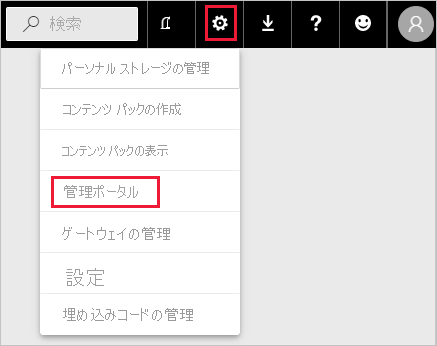
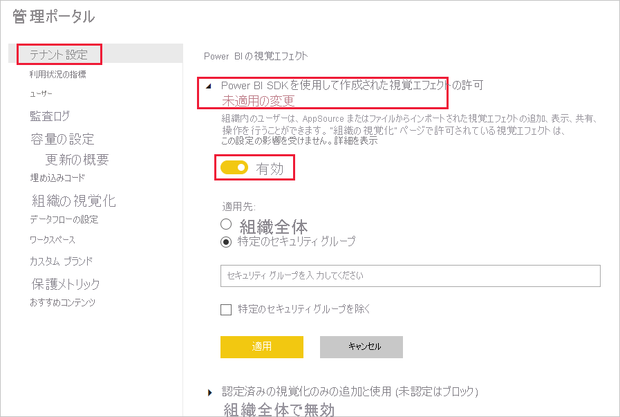
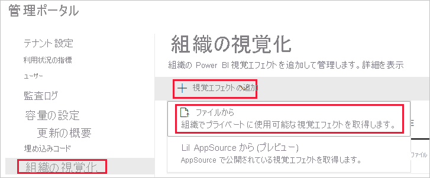
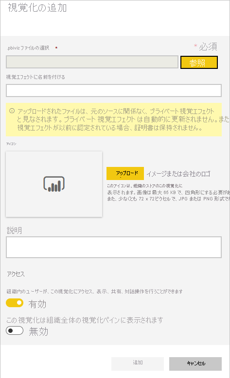
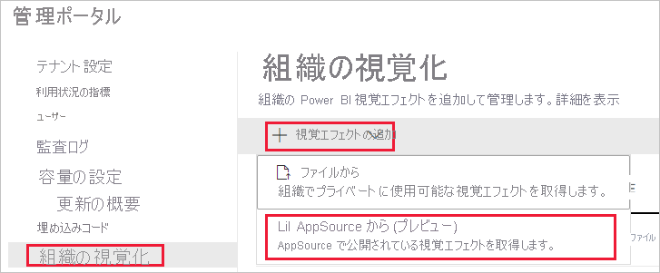

# Power BI ビジュアルの管理設定を管理する

組織の Power BI 管理者は、組織全体にわたってユーザーがどのような種類の Power BI ビジュアルにアクセスできるかを制御できます。

Power BI ビジュアルを管理するには、ご自分が Office 365 のグローバル管理者であるか、またはご自分に Power BI サービス管理者の役割が割り当てられている必要があります。 Power BI サービス管理者の役割の詳細については、「[Power BI 管理者の役割について](service-admin-role.md)」を参照してください。

## 管理ポータルにアクセスする

この記事で説明されている設定を有効にするには、管理ポータルにアクセスする必要があります。

1. Power BI サービスで、 **[設定]** を選択します。

2. [設定] ドロップダウン メニューから、 **[管理ポータル]** を選択します。

    

## Power BI ビジュアルのテナント設定

組織の Power BI 管理者は、組織全体にわたってユーザーがどのような種類の Power BI ビジュアルにアクセスできるかを制御できます。

UI テナント設定の影響を受けるのは Power BI サービスのみです。 これらの設定を Power BI Desktop 内で有効にしたい場合は、グループ ポリシーを使用します。 各セクションの最後に示す表で、Power BI Desktop 内で設定を有効にする方法について詳しく説明します。

>[!NOTE]
>テナント設定に変更を加えても、[[組織の視覚化]](#organizational-visuals) タブに一覧表示されている Power BI ビジュアルに影響が及ぶことはありません。

### AppSource またはファイルからのビジュアル

次の種類の Power BI ビジュアルに対する組織のアクセスを管理します。

* 開発者によって作成され、.pbiviz ファイルとして保存されるビジュアル。

* AppSource から入手可能なビジュアル。

組織内のユーザーが .pbiviz ファイルをアップロードし、AppSource からのビジュアルを彼らのレポートおよびダッシュボードに追加できるようにするには、次の手順に従ってください。

1. **[Power BI SDK を使用して作成された視覚エフェクトの許可]** 設定を展開します。

2. **[Enabled]\(有効\)** をクリックします。

3. .pbiviz および AppSource ビジュアルをアップロードできるようにするユーザーを選択します。

    * 組織内のすべてのユーザーが .pbiviz ファイルをアップロードし、AppSource からのビジュアルを追加できるようにするには、 **[組織全体]** オプションを選択します。

     * .pbiviz ファイルのアップロードを管理し、セキュリティ グループを使用して AppSource からのビジュアルを追加するには、 **[特定のセキュリティ グループ]** オプションを選択します。 管理するセキュリティ グループを、 *[セキュリティ グループを入力してください]* テキスト バーに追加します。 既定では、指定したセキュリティ グループは除外されます。 これらのセキュリティ グループを含め、組織内の他のユーザーをすべて除外する場合は、 **[特定のセキュリティ グループを除く]** オプションを選択します。

4. **[適用]** をクリックします。

テナント設定に加えた UI の変更は、Power BI サービスにのみ適用されます。 組織内のユーザーが .pbiviz ファイルをアップロードし、AppSource からのビジュアルを Power BI Desktop 内の彼らの [視覚化] ペインに追加できるようにするには、[Azure AD グループ ポリシー](/azure/active-directory-domain-services/manage-group-policy)を使用します。

|キー  |値の名前  |値  |
|---------|---------|---------|
|Software\Policies\Microsoft\Power BI Desktop\    |EnableCustomVisuals    |0 - 無効にする  1 - 有効にする (既定)         |
|

### 認定済み Power BI ビジュアル

この設定を有効にした場合、組織のレポートおよびダッシュボードにレンダリングされるのは、[認定済み Power BI ビジュアル](../developer/visuals/power-bi-custom-visuals-certified.md)のみとなります。 AppSource またはファイルからの Power BI ビジュアルが認定済みでない場合は、エラー メッセージが返されます。

1. 管理ポータルで、 **[Add and use certified visuals only]\(認定済みのビジュアルのみの追加と使用\)** を選択します。

2. **[Enabled]\(有効\)** をクリックします。

3. **[適用]** をクリックします。

テナント設定に加えた UI の変更は、Power BI サービスにのみ適用されます。 Power BI Desktop で認定済みビジュアルのテナント設定を管理するには、[Azure AD グループ ポリシー](/azure/active-directory-domain-services/manage-group-policy)を使用します。

|キー  |値の名前  |値  |
|---------|---------|---------|
|Software\Policies\Microsoft\Power BI Desktop\    |EnableUncertifiedVisuals    |0 - 無効にする  1 - 有効にする (既定)         |
|

## 組織のビジュアル

Power BI 管理者は、ご自分の組織の[組織のストア](../developer/visuals/power-bi-custom-visuals.md#organizational-store)で利用できる Power BI ビジュアルのリストを管理できます。 *管理ポータル*の **[組織の視覚化]** タブでは、ビジュアルを追加および削除したり、組織のユーザーの [視覚化] ペインに自動的に表示されるようにするビジュアルを決定したりできます。 組織の[テナントの設定](#power-bi-visuals-tenant-settings)と矛盾していたとしても、認定されていないビジュアルや .pbiviz ビジュアルなど、任意の種類のビジュアルをリストに追加することができます。

組織のビジュアル設定は、Power BI Desktop に自動的に展開されます。

>[!NOTE]
>組織のビジュアルは、Power BI Report Server ではサポートされていません。

### ファイルからビジュアルを追加する

この手法を使用すれば、.pbiviz ファイルから新しい Power BI ビジュアルを追加できます。

> [!WARNING]
> ファイルからアップロードされた Power BI ビジュアルには、セキュリティまたはプライバシー上のリスクを伴うコードが含まれている可能性があります。組織のリポジトリに展開する前に、ビジュアルの作成者とソースが信頼できることを確認してください。

1. **[ビジュアルの追加]**  >  **[ファイルから]** の順に選択します。

    

2. 以下のフィールドを設定します。

    * **.pbiviz ファイルの選択** - アップロードするビジュアル ファイルを選択します。

    * **視覚エフェクトに名前を付ける** - ビジュアルに短いタイトルを付けて、レポート作成者がその処理内容を簡単に理解できるようにします。

    * **アイコン** - [視覚化] ペインに表示されるアイコン ファイルをアップロードします。

    * **説明** - ユーザーにより多くのコンテキストを提供するために、ビジュアルに関する簡単な説明を入力します。

    * **アクセス** - このセクションには、次の 2 つのオプションがあります。
    
        * 組織内のユーザーがこのビジュアルにアクセスできるかどうかを選択します。 既定では、この設定は有効になっています。

        * 組織内のユーザーの [視覚化] ペインにこのビジュアルを表示するかどうかを選択します。 既定では、この設定は無効になっています。 詳細については、「[[視覚化] ペインにビジュアルを追加する](#add-a-visual-to-the-visualization-pane)」を参照してください。

    

3. アップロード要求を開始するには、 **[追加]** を選択します。 アップロードが完了すると、ビジュアルが組織のビジュアルのリストに表示されます。

### AppSource からのビジュアルを追加する (プレビュー)

この手法を使用すると、AppSource からの新しい Power BI ビジュアルが追加されます。

AppSource の Power BI ビジュアルは自動的に更新されます。 組織内のユーザーのビジュアルは常に最新バージョンに維持されることになります。

1. **[ビジュアルの追加]**  >  **[AppSource から]** の順に選択します。

    

2. **[Power BI ビジュアル]** ウィンドウで、追加する AppSource ビジュアルを見つけて、 **[追加]** をクリックします。 アップロードが完了すると、ビジュアルが組織のビジュアルのリストに表示されます。

### [視覚化] ペインに視覚エフェクトを追加する

[組織の視覚化] ページからビジュアルを選択すると、組織内のすべてのユーザーの [視覚化] ペインに自動的に表示されるようになります。

1. 追加するビジュアルの行で、 **[設定]** をクリックします。

    organizational-pane

2. [視覚化] ペインの設定を有効にし、 **[更新]** をクリックします。

    

### ファイルからアップロードされたビジュアルを削除する

ビジュアルを完全削除するには、リポジトリでビジュアルのごみ箱アイコンを選択します。

> [!IMPORTANT]
> 削除は元に戻すことができません。 削除の直後から、既存のレポートでそのビジュアルのレンダリングが停止します。 同じビジュアルをもう一度アップロードしても、それと、削除されたビジュアルが置き換わることはありません。 ただし、ユーザーは、新しいビジュアルを再度インポートして、レポート内に作成したインスタンスを置き換えることはできます。

### .pbiviz ビジュアルを無効にする

.pbiviz ビジュアルは、組織のビジュアルのリストに保持したまま、[組織のストア](../developer/visuals/power-bi-custom-visuals.md#organizational-store)を通して使用できないようにすることができます。

1. 無効にする .pbiviz ビジュアルの行で、 **[設定]** をクリックします。

2. **[アクセス]** セクションで、次の設定を無効にします: *[組織内のユーザーは、このビジュアルを対象にしたアクセス、表示、共有、やりとりを行うことができます]* 。

.pbiviz ビジュアルを無効にすると、そのビジュアルは既存のレポートにレンダリングされなくなり、次のエラー メッセージが表示されます。

*This custom visual is no longer available.Please contact your administrator for details. (このカスタム ビジュアルは使用できなくなりました。詳細については管理者に問い合わせてください。)*

>[!NOTE]
>ブックマークが設定されている .pbiviz ビジュアルは、無効になった後でも機能します。

### ビジュアルを更新する

AppSource ビジュアルは自動的に更新されます。 AppSource から新しいバージョンが利用できるようになると、組織のビジュアル リストを介して展開されたより古いバージョンが、それに置き換えられます。

.pbiviz ビジュアルを更新するには、次の手順に従ってビジュアルを置き換えます。

1. 追加するビジュアルの行で、 **[設定]** をクリックします。

2. **[参照]** をクリックして、現在のビジュアルを置き換える .pbiviz を選択します。

3. **[Update]** をクリックします。

## 次の手順

> [!div class="nextstepaction"]
>[管理ポータルでの Power BI の管理](service-admin-portal.md)

> [!div class="nextstepaction"]
>[Power BI のビジュアル](../developer/visuals/power-bi-custom-visuals.md)

> [!div class="nextstepaction"]
>[Power BI の組織のビジュアル](../developer/visuals/power-bi-custom-visuals-organization.md)