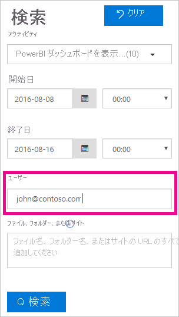

# <a name="track-user-activities-in-power-bi"></a>Power BI でユーザー アクティビティを追跡する

Power BI テナント内で、だれがどの項目にどのようなアクションを実行しているかを把握することは、組織が法令順守やレコード管理などの要件を満たすうえで非常に重要です。 Power BI では、ユーザー アクティビティを追跡する 2 つのオプションがあります。[Power BI アクティビティ ログ](#use-the-activity-log)と [Office 365 統合監査ログ](#use-the-audit-log)です。 どちらのログにも、[Power BI 監査データ](#operations-available-in-the-audit-and-activity-logs)の完全なコピーが含まれていますが、次の表に示すように、いくつかの重要な違いがあります。

| **Office 365 統合監査ログ** | **Power BI アクティビティ ログ** |
| --- | --- |
| Power BI 監査イベントに加えて、SharePoint Online、Exchange Online、Dynamics 365、およびその他のサービスからのイベントが含まれます。 | Power BI 監査イベントのみが含まれます。 |
| View-Only Audit Logs (表示専用監査ログ) または監査ログのアクセス許可を持つユーザー (グローバル管理者や監査人など) のみがアクセス権を持ちます。 | グローバル管理者と Power BI サービス管理者がアクセス権を持ちます。 |
| グローバル管理者と監査者は、Office 365 セキュリティ/コンプライアンス センター、Microsoft 365 Security Center、および Microsoft 365 コンプライアンス センターを使用して、統合された監査ログを検索できます。 | アクティビティ ログを検索するためのユーザー インターフェイスはまだありません。 |
| グローバル管理者と監査者は、Office 365 Management API とコマンドレットを使用して、監査ログ エントリをダウンロードできます。 | グローバル管理者と Power BI サービス管理者は、Power BI REST API および管理コマンドレットを使用して、アクティビティ ログ エントリをダウンロードできます。 |
| 監査データは 90 日間保持されます。 | アクティビティ データは 30 日間保持されます (パブリック プレビュー)。 |
| テナントが別の Azure リージョンに移動された場合でも、監査データは保持されます。 | テナントが別の Azure リージョンに移動された場合、アクティビティ データは保持されません。 |


## <a name="use-the-activity-log"></a>アクティビティ ログの使用

Power BI サービス管理者は、Power BI アクティビティ ログに基づくカスタム レポートを使用して、テナント レベルですべての Power BI リソースの使用状況を分析できます。 アクティビティをダウンロードするには、REST API または PowerShell コマンドレットを使用します。 アクティビティ データは、日付の範囲、ユーザー、およびアクティビティの種類でフィルター処理することもできます。

### <a name="activity-log-requirements"></a>アクティビティ ログの要件

Power BI アクティビティ ログにアクセスするには、次の要件を満たしている必要があります。

- グローバル管理者または Power BI サービス管理者のいずれかであること。
- [Power BI 管理コマンドレット](https://www.powershellgallery.com/packages/MicrosoftPowerBIMgmt)をローカルにインストールしているか、Azure Cloud Shell で Power BI 管理コマンドレットを使用していること。

### <a name="activityevents-rest-api"></a>ActivityEvents REST API

Power BI REST API に基づく管理アプリケーションを使用すると、アクティビティ イベントを BLOB ストアや SQL データベースにエクスポートすることができます。 その後、エクスポートされたデータの上にカスタムの使用状況レポートを作成できます。 **ActivityEvents** REST API の呼び出しでは、開始日と終了日を指定する必要があります。必要に応じて、アクティビティの種類やユーザー ID でアクティビティを選択するフィルターを指定します。 アクティビティ ログには大量のデータが含まれている可能性があるため、**ActivityEvents** API で現時点でサポートされているのは、要求あたり最大 1 日分のデータのダウンロードのみです。 つまり、次の例のように、開始日と終了日に同じ日付を指定する必要があります。 DateTime 値は UTC 形式で指定してください。

```
https://api.powerbi.com/v1.0/myorg/admin/activityevents?startDateTime='2019-08-31T00:00:00'&endDateTime='2019-08-31T23:59:59'
```

エントリの数が多いと、**ActivityEvents** API では、約 5,000 ‐ 10,000 のエントリと継続トークンのみが返されます。 継続トークンを使用して **ActivityEvents** API を再度呼び出してエントリの次のバッチを取得し、すべてのエントリを取得して継続トークンを受け取らなくなるまでこれを続けます。 次の例は、継続トークンの使用方法を示しています。

```
https://api.powerbi.com/v1.0/myorg/admin/activityevents?continuationToken='%2BRID%3ARthsAIwfWGcVAAAAAAAAAA%3D%3D%23RT%3A4%23TRC%3A20%23FPC%3AARUAAAAAAAAAFwAAAAAAAAA%3D'
```

返されたエントリの数に関係なく、結果に継続トークンが含まれている場合は、継続トークンが返されなくなるまで、そのトークンを使用してもう一度 API を呼び出して残りのデータを取得するようにしてください。 呼び出しでは、イベント エントリなしで継続トークンが返されることもあります。 次の例は、応答で返された継続トークンを使用してループする方法を示しています。

```
while(response.ContinuationToken != null)
{
   // Store the activity event results in a list for example
    completeListOfActivityEvents.AddRange(response.ActivityEventEntities);

    // Make another call to the API with continuation token
    response = GetPowerBIActivityEvents(response.ContinuationToken)
}
completeListOfActivityEvents.AddRange(response.ActivityEventEntities);
```
> [!NOTE]
> すべてのイベントが表示されるまでに最大 24 時間かかる場合がありますが、通常は、完全なデータをはるかに早く使用できるようになります。
>
>
### <a name="get-powerbiactivityevent-cmdlet"></a>Get-PowerBIActivityEvent コマンドレット

PowerShell の Power BI 管理コマンドレットを使用して、アクティビティ イベントをダウンロードします。 **Get-PowerBIActivityEvent** コマンドレットを使用すると、継続トークンが自動的に処理されます。 **Get-PowerBIActivityEvent** コマンドレットでは、**ActivityEvents** REST API と同じ制限がある StartDateTime と EndDateTime パラメーターを受け取ります。 つまり、一度に取得できるアクティビティ データは 1 日分だけなので、開始日と終了日で同じ日付値を参照する必要があります。

次のスクリプトでは、すべての Power BI アクティビティをダウンロードする方法を示しています。 このコマンドでは、個々のアクティビティのプロパティに簡単にアクセスできるように、JSON の結果が .NET オブジェクトに変換されます。 これらの例は、イベントを見逃さないようにするための、1 日で可能な最小および最大のタイムスタンプを示しています。

```powershell
Login-PowerBI

$activities = Get-PowerBIActivityEvent -StartDateTime '2019-08-31T00:00:00' -EndDateTime '2019-08-31T23:59:59' | ConvertFrom-Json

$activities.Count
$activities[0]

```

### <a name="filter-activity-data"></a>アクティビティ データのフィルター処理

アクティビティの種類とユーザー ID でアクティビティ イベントをフィルター処理できます。 次のスクリプトでは、**ViewDashboard** アクティビティのイベント データのみをダウンロードする方法を示しています。 サポートされているパラメーターの追加情報については、コマンド `Get-Help Get-PowerBIActivityEvent` を使用します。

```powershell
Login-PowerBI

$activities = Get-PowerBIActivityEvent -StartDateTime '2019-08-31T00:00:00' -EndDateTime '2019-08-31T23:59:59' -ActivityType 'ViewDashboard' | ConvertFrom-Json

$activities.Count
$activities[0]

```

## <a name="use-the-audit-log"></a>監査ログの使用

タスクで Power BI と Office 365 をまたぐユーザー アクティビティを追跡する場合は、Office 365 セキュリティ/コンプライアンス センターで監査を使用するか、PowerShell を使用します。 監査は Exchange Online の機能に依存しています。これは Power BI をサポートするために自動的にプロビジョニングされます。

監査データは、日付範囲、ユーザー、ダッシュボード、レポート、データセット、アクティビティの種類によってフィルター処理できます。 アクティビティを csv (コンマ区切り値) ファイルとしてダウンロードし、オフラインで分析することもできます。

### <a name="audit-log-requirements"></a>監査ログの要件

監査ログにアクセスするには、次の要件を満たしている必要があります。

- 監査ログにアクセスするには、グローバル管理者であるか、Exchange Online で Audit Logs (監査ログ) または View-Only Audit Logs (表示専用監査ログ) ロールが割り当てられている必要があります。 既定では、これらのロールは、Exchange 管理センター内の **[アクセス許可]** ページで Compliance Management (コンプライアンス管理) および Organization Management (組織管理) ロール グループに割り当てられています。

    管理者以外のアカウントに監査ログへのアクセス許可を与えるには、これらのロール グループのいずれかのメンバーとしてそのユーザーを追加します。 別の方法でそれを行いたい場合は、Exchange 管理センターでカスタム ロール グループを作成し、Audit Logs (監査ログ) または View-Only Audit Logs (表示専用監査ログ) ロールをこのグループに割り当ててから、管理者以外のアカウントをこの新しいロール グループに追加することができます。 詳細については、「[Manage role groups in Exchange Online (Exchange Online でロール グループを管理する)](/Exchange/permissions-exo/role-groups)」をご覧ください。

    Microsoft 365 管理センターから Exchange 管理センターにアクセスできない場合は、 https://outlook.office365.com/ecp に移動し、ご自分の資格情報を使ってサインインします。

- 監査ログへのアクセス権はあっても、グローバル管理者または Power BI サービスの管理者ではない場合は、Power BI 管理ポータルにアクセスできません。 この場合、[Office 365 セキュリティ/コンプライアンス センター](https://sip.protection.office.com/#/unifiedauditlog)への直接リンクを使用します。

### <a name="access-your-audit-logs"></a>監査ログにアクセスする

ログにアクセスするには、まず Power BI でログ記録が有効になっていることを確認します。 詳細については、管理ポータルに関するドキュメント内の「[監査ログ](service-admin-portal.md#audit-logs)」をご覧ください。 監査を有効にしてから監査データを表示できるようになるまで、最大で 48 時間の遅延が発生する場合があります。 データがすぐに表示されない場合は、後で、監査ログを確認してください。 監査ログの表示アクセス許可を取得してからログにアクセスできるようになるまでにも、同様の遅延が発生する場合があります。

Power BI 監査ログは、[Office 365 セキュリティ/コンプアライアンス センター](https://sip.protection.office.com/#/unifiedauditlog)を通して直接利用できます。 また、Power BI 管理ポータルからのリンクもあります。

1. Power BI で、右上隅にある**歯車アイコン**を選択してから、 **[管理ポータル]** を選択します。

   ![[管理ポータル] オプションが強調して示されている歯車ドロップダウン メニューのスクリーンショット。](media/service-admin-auditing/powerbi-admin.png)

1. **[監査ログ]** を選びます。

1. **[O365 管理センターに移動]** を選択します。

   ![[監査ログ] オプションと [O365 管理センターに移動] オプションが強調して示されている管理ポータルのスクリーンショット。](media/service-admin-auditing/audit-log-o365-admin-center.png)

### <a name="search-only-power-bi-activities"></a>Power BI のアクティビティのみを検索する

次の手順に従って、検索結果を Power BI のアクティビティのみに制限します。 アクティビティの一覧については、この記事の後半にある「[Power BI の監査対象アクティビティ](#operations-available-in-the-audit-and-activity-logs)」の一覧をご覧ください。

1. **[監査ログの検索]** ページで、 **[検索]** の下にある **[アクティビティ]** のドロップダウンを選択します。

2. **[Power BI アクティビティ]** を選択します。

   ![[Power BI アクティビティ] が強調して示されている [監査ログの検索] のスクリーンショット。](media/service-admin-auditing/audit-log-search-filter-by-powerbi.png)

3. 選択ボックスの外側の任意の場所を選択して、ボックスを閉じます。

検索では Power BI のアクティビティのみが返されます。

### <a name="search-the-audit-logs-by-date"></a>監査ログを日付で検索する

**[開始日]** フィールドと **[終了日]** フィールドを使用して、指定した日付範囲のログを検索することができます。 既定の選択は過去 7 日間です。 日付と時刻は世界協定時刻 (UTC) 形式で表示されます。 指定できる日付範囲は最大 90 日です。 

選択した日付範囲が 90 日間よりも大きい場合は、エラーが表示されます。 最大の日付範囲である 90 日を使用する場合は、 **[開始日]** として現在の時刻を選択してください。 そうしないと、開始日が終了日より前であるというエラーが表示されます。 過去 90 日間に監査を有効にしている場合、監査を有効にした日付より前から日付範囲を開始することはできません。

![[開始日] および [終了日] オプションが強調して示されている [監査ログの検索] のスクリーンショット。](media/service-admin-auditing/search-audit-log-by-date.png)

### <a name="search-the-audit-logs-by-users"></a>監査ログをユーザーで検索する

特定のユーザーが実行したアクティビティの監査ログ エントリを検索できます。 **[ユーザー]** フィールドに 1 つまたは複数のユーザー名を入力します。 ユーザー名はメール アドレスのような形式です。 それは、ユーザーが Power BI へのログインに使用するアカウントです。 このボックスを空白のままにすると、組織のすべてのユーザー (およびサービス アカウント) のエントリが返されます。



### <a name="view-search-results"></a>検索結果を表示する

**[検索]** を選択すると、検索結果が読み込まれます。 しばらくすると、 **[結果]** に表示されます。 検索の完了後、見つかった結果の数が示されます。 **[監査ログの検索]** には、最大で 1000 件のイベントが表示されます。 1000 件を超えるイベントが検索条件を満たしている場合、アプリでは最新の 1000 件のイベントが表示されます。

#### <a name="view-the-main-results"></a>主要な結果を表示する

**[結果]** 領域には、検索によって返されたイベントごとに次の情報が含まれます。 検索結果を並べ替えるには、 **[結果]** の下の列ヘッダーを選択します。

| **列** | **定義** |
| --- | --- |
| Date |イベント発生時の日付と時刻 (UTC 形式)。 |
| IP アドレス |ログに記録されたアクティビティに使用されたデバイスの IP アドレス。 アプリでは、IPv4 または IPv6 のアドレス形式で IP アドレスが表示されます。 |
| ユーザー |イベント発生のトリガーとなったアクションを実行したユーザー (またはサービス アカウント)。 |
| アクティビティ |ユーザーが実行したアクティビティ。 この値は、 **[アクティビティ]** ドロップ ダウン リストから選択したアクティビティに対応します。 Exchange 管理の監査ログに記録されるイベントの場合、この列の値は Exchange コマンドレットです。 |
| 項目 |対応するアクティビティのために作成または変更されたオブジェクト。 たとえば、表示または変更されたファイルや、更新されたユーザー アカウントなどです。 すべてのアクティビティにこの列の値があるとは限りません。 |
| 詳細 |アクティビティに関する追加の詳細。 この列の値も、すべてのアクティビティにあるとは限りません。 |

#### <a name="view-the-details-for-an-event"></a>イベントの詳細を表示する

イベントの詳細を表示するには、検索結果の一覧でイベント レコードを選択します。 イベント レコードの詳しいプロパティを示す **[詳細]** ページが表示されます。 **[詳細]** ページに表示されるプロパティは、イベントが発生した Office 365 サービスによって異なります。

これらの詳細を表示するには、 **[詳細情報]** を選択します。 Power BI エントリの RecordType プロパティの値は、すべて 20 です。 その他のプロパティについて詳しくは、[監査ログのプロパティの詳細](/office365/securitycompliance/detailed-properties-in-the-office-365-audit-log/)に関する記事をご覧ください。

   ![[詳細情報] オプションが強調して示されている監査の詳細ダイアログのスクリーンショット。](media/service-admin-auditing/audit-details.png)

### <a name="export-search-results"></a>検索結果をエクスポートする

Power BI 監査ログを CSV ファイルにエクスポートするには、次の手順のようにします。

1. **[結果のエクスポート]** を選択します。

1. **[Save loaded results]** (読み込み済み結果を保存) または **[Download all results]** (すべての結果をダウンロード) のいずれかを選択します。

    ![[結果のエクスポート] オプションのスクリーンショット。](media/service-admin-auditing/export-auditing-results.png)

### <a name="use-powershell-to-search-audit-logs"></a>PowerShell を使用して監査ログを検索する

PowerShell を使用し、自分のログインに基づいて監査ログにアクセスすることもできます。 次の例は、Exchange Online PowerShell に接続してから [Search-UnifiedAuditLog](/powershell/module/exchange/policy-and-compliance-audit/search-unifiedauditlog?view=exchange-ps/) コマンドを使用して Power BI 監査ログのエントリを取得する方法を示しています。 スクリプトを実行するには、「[監査ログの要件](#audit-log-requirements)」セクションで説明されているように、管理者に適切なアクセス許可が割り当てられている必要があります。

```powershell
Set-ExecutionPolicy RemoteSigned

$UserCredential = Get-Credential

$Session = New-PSSession -ConfigurationName Microsoft.Exchange -ConnectionUri https://outlook.office365.com/powershell-liveid/ -Credential $UserCredential -Authentication Basic -AllowRedirection

Import-PSSession $Session
Search-UnifiedAuditLog -StartDate 9/11/2018 -EndDate 9/15/2018 -RecordType PowerBI -ResultSize 1000 | Format-Table | More
```

### <a name="use-powershell-to-export-audit-logs"></a>PowerShell を使用して監査ログをエクスポートする

PowerShell を使用し、監査ログ検索の結果をエクスポートすることもできます。 次の例では、[Search-UnifiedAuditLog](/powershell/module/exchange/policy-and-compliance-audit/search-unifiedauditlog?view=exchange-ps/) コマンドから送信し、[Export-Csv](/powershell/module/microsoft.powershell.utility/export-csv) コマンドレットを使用して結果をエクスポートする方法を確認できます。 スクリプトを実行するには、「[監査ログの要件](#audit-log-requirements)」セクションで説明されているように、管理者に適切なアクセス許可が割り当てられている必要があります。

```powershell
$UserCredential = Get-Credential

$Session = New-PSSession -ConfigurationName Microsoft.Exchange -ConnectionUri https://outlook.office365.com/powershell-liveid/ -Credential $UserCredential -Authentication Basic -AllowRedirection

Import-PSSession $Session
Search-UnifiedAuditLog -StartDate 9/11/2019 -EndDate 9/15/2019 -RecordType PowerBI -ResultSize 5000 |
Export-Csv -Path "c:\temp\PowerBIAuditLog.csv" -NoTypeInformation

Remove-PSSession $Session
```

Exchange Online に接続する方法の詳細については、「[リモート PowerShell による Exchange への接続](/powershell/exchange/exchange-online/connect-to-exchange-online-powershell/connect-to-exchange-online-powershell/)」を参照してください。 監査ログと共に PowerShell を使用する別の例としては、「[Using Power BI audit log and PowerShell to assign Power BI Pro licenses](https://powerbi.microsoft.com/blog/using-power-bi-audit-log-and-powershell-to-assign-power-bi-pro-licenses/)」(Power BI 監査ログと PowerShell を使って Power BI Pro のライセンスを割り当てる) をご覧ください。

## <a name="operations-available-in-the-audit-and-activity-logs"></a>監査ログとアクティビティ ログで使用可能な操作

次の操作は、監査ログとアクティビティ ログの両方で実行できます。

| フレンドリ名                                     | 操作名                              | ノート                                  |
|---------------------------------------------------|---------------------------------------------|------------------------------------------|
| Power BI Gateway にデータ ソースを追加しました             | AddDatasourceToGateway                      |                                          |
| Power BI フォルダーへのアクセスを追加しました                      | AddFolderAccess                             | 現在使用されていません                       |
| Power BI グループ メンバーを追加しました                      | AddGroupMembers                             |                                          |
| 管理者がテナントにデータフローのストレージ アカウントをアタッチしました | AdminAttachedDataflowStorageAccountToTenant | 現在使用されていません                       |
| Power BI データセットの分析                         | AnalyzedByExternalApplication               |                                          |
| Power BI レポートを分析しました                          | AnalyzeInExcel                              | ユーザーがサービスを操作するときに生成されます。 `*.odc` ファイルをダウンロードしても監査イベントは作成されません                                         |
| データフロー ストレージ アカウントの関連付け                 | AttachedDataflowStorageAccount              |                                          |
| ゲートウェイに対するバインドされた Power BI データセット                | BindToGateway                               |                                          |
| データフローの更新をキャンセルしました                        | CancelDataflowRefresh                       |                                          |
| 容量の状態を変更しました                            | ChangeCapacityState                         |                                          |
| 容量のユーザー割り当てを変更しました                  | UpdateCapacityUsersAssignment               |                                          |
| Power BI データセットの接続を変更しました              | SetAllConnections                           |                                          |
| 変更された Power BI Gateway の管理者                   | ChangeGatewayAdministrators                 |                                          |
| 変更された Power BI ゲートウェイ データ ソースのユーザー        | ChangeGatewayDatasourceUsers                |                                          |
| 組織の Power BI コンテンツ パックを作成しました      | CreateOrgApp                                |                                          |
| Power BI アプリを作成しました                              | CreateApp                                   |                                          |
| Power BI ダッシュボードを作成しました                        | CreateDashboard                             |                                          |
| Power BI データフローを作成しました                         | CreateDataflow                              |                                          |
| Power BI データセットを作成しました                          | CreateDataset                               |                                          |
| Power BI メール サブスクリプションを作成しました               | CreateEmailSubscription                     |                                          |
| Power BI フォルダーを作成しました                           | CreateFolder                                |                                          |
| Power BI Gateway の作成                          | CreateGateway                               |                                          |
| Power BI グループを作成しました                            | CreateGroup                                 |                                          |
| Power BI レポートを作成しました                           | CreateReport <sup>1</sup>                                |                                          |
| 外部ストレージ アカウントにデータフローを移行しました     | DataflowMigratedToExternalStorageAccount    | 現在使用されていません                       |
| データフローのアクセス許可を追加しました                        | DataflowPermissionsAdded                    | 現在使用されていません                       |
| データフローのアクセス許可を削除しました                      | DataflowPermissionsRemoved                  | 現在使用されていません                       |
| 組織の Power BI コンテンツ パックを削除しました      | DeleteOrgApp                                |                                          |
| Power BI コメントを削除しました                          | DeleteComment                               |                                          |
| Power BI ダッシュボードを削除しました                        | DeleteDashboard                             | 現在使用されていません                       |
| Power BI データフローを削除しました                         | DeleteDataflow                              | 現在使用されていません                       |
| Power BI データセットを削除しました                          | DeleteDataset                               |                                          |
| Power BI メール サブスクリプションを削除しました               | DeleteEmailSubscription                     |                                          |
| Power BI フォルダーを削除しました                           | DeleteFolder                                |                                          |
| Power BI フォルダーへのアクセスを削除しました                    | DeleteFolderAccess                          | 現在使用されていません                       |
| Power BI Gateway の削除                          | DeleteGateway                               |                                          |
| Power BI グループを削除しました                            | DeleteGroup                                 |                                          |
| Power BI レポートを削除しました                           | DeleteReport                                |                                          |
| Power BI データセットのデータ ソースを検出しました          | GetDatasources                              |                                          |
| Power BI レポートのダウンロード                        | DownloadReport                              |                                          |
| データフローのプロパティを編集しました                        | EditDataflowProperties                      |                                          |
| Power BI の証明書に対する権限を編集しました          | EditCertificationPermission                 | 現在使用されていません                       |
| Power BI ダッシュボードを編集しました                         | EditDashboard                               | 現在使用されていません                       |
| Power BI データセットを編集しました                           | EditDataset                                 |                                          |
| Power BI データセット プロパティを編集しました                | EditDatasetProperties                       | 現在使用されていません                       |
| Power BI レポートを編集しました                            | EditReport                                  |                                          |
| Power BI データフローをエクスポートしました                        | ExportDataflow                              |                                          |
| Power BI レポートのビジュアル データをエクスポートしました              | ExportReport                                |                                          |
| Power BI タイル データをエクスポートしました                       | ExportTile                                  |                                          |
| データフローのアクセス許可の追加に失敗しました                | FailedToAddDataflowPermissions              | 現在使用されていません                       |
| データフローへのアクセス許可の削除に失敗しました             | FailedToRemoveDataflowPermissions           | 現在使用されていません                       |
| Power BI のデータ フローの SAS トークンを生成しました             | GenerateDataflowSasToken                    |                                          |
| Power BI の埋め込みトークンを生成しました                    | GenerateEmbedToken                          |                                          |
| Power BI にファイルをインポートしました                         | インポート                                      |                                          |
| Power BI アプリをインストールしました                            | InstallApp                                  |                                          |
| 容量にワークスペースを移行しました                  | MigrateWorkspaceIntoCapacity                |                                          |
| Power BI コメントを投稿しました                           | PostComment                                 |                                          |
| Power BI ダッシュボードを出力しました                        | PrintDashboard                              |                                          |
| Power BI レポート ページを出力しました                      | PrintReport                                 |                                          |
| Power BI レポートを Web に発行しました                  | PublishToWebReport <sup>2</sup>                         |                                          |
| Key Vault からの Power BI データフロー シークレットを受信しました  | ReceiveDataflowSecretFromKeyVault           |                                          |
| Power BI Gateway からのデータ ソースの削除         | RemoveDatasourceFromGateway                 |                                          |
| Power BI グループ メンバーを削除しました                    | DeleteGroupMembers                          |                                          |
| 容量からのワークスペースを削除しました                 | RemoveWorkspacesFromCapacity                |                                          |
| Power BI ダッシュボードを名前変更しました                        | RenameDashboard                             |                                          |
| Power BI データフローの更新を要求しました               | RequestDataflowRefresh                      | 現在使用されていません                       |
| Power BI データセットの更新を要求しました                | RefreshDataset                              |                                          |
| Power BI ワークスペースを取得しました                     | GetWorkspaces                               |                                          |
| ワークスペースに使用されるデータフロー ストレージの場所を選択しました     | SetDataflowStorageLocationForWorkspace      |                                          |
| Power BI のデータフローへのスケジュールされた更新を設定しました        | SetScheduledRefreshOnDataflow               |                                          |
| Power BI のデータセットへのスケジュールされた更新を設定しました         | SetScheduledRefresh                         |                                          |
| Power BI ダッシュボードを共有しました                         | ShareDashboard                              |                                          |
| Power BI レポートを共有しました                            | ShareReport                                 |                                          |
| Power BI の延長した評価期間の開始                   | OptInForExtendedProTrial                    | 現在使用されていません                       |
| Power BI の試用版を開始しました                            | OptInForProTrial                            |                                          |
| Power BI データソースを引継ぎました                   | TakeOverDatasource                          |                                          |
| Power BI データセットを引き継ぎました                        | TakeOverDataset                             |                                          |
| Power BI データフローを引継ぎました                     | TookOverDataflow                             |                                          |
| 未発行の Power BI アプリ                          | UnpublishApp                                |                                          |
| 容量リソース管理設定の更新      | UpdateCapacityResourceGovernanceSettings    | 現在 Microsoft 365 管理センターに存在していません |
| 容量管理者を更新しました                            | UpdateCapacityAdmins                        |                                          |
| 容量表示名を更新しました                     | UpdateCapacityDisplayName                   |                                          |
| データフロー ストレージの割り当てのアクセス許可の更新   | UpdatedDataflowStorageAssignmentPermissions |                                          |
| 組織の Power BI 設定を更新しました          | UpdatedAdminFeatureSwitch                   |                                          |
| Power BI アプリを更新しました                              | UpdateApp                                   |                                          |
| Power BI データフローを更新しました                         | UpdateDataflow                              |                                          |
| Power BI データセット データ ソースを更新しました             | UpdateDatasources                           |                                          |
| Power BI データセット パラメーターを更新しました               | UpdateDatasetParameters                     |                                          |
| Power BI メール サブスクリプションを更新しました               | UpdateEmailSubscription                     |                                          |
| Power BI フォルダーを更新しました                           | UpdateFolder                                |                                          |
| Power BI フォルダーへのアクセスを更新しました                    | UpdateFolderAccess                          |                                          |
| Power BI ゲートウェイ データ ソースの資格情報を更新しました  | UpdateDatasourceCredentials                 |                                          |
| Power BI ダッシュボードを参照しました                         | ViewDashboard                               |                                          |
| Power BI データフローを参照しました                          | ViewDataflow                                |                                          |
| Power BI レポートを参照しました                            | ViewReport                                  |                                          |
| Power BI タイルを参照しました                              | ViewTile                                    |                                          |
| Power BI の使用状況メトリックを参照しました                     | ViewUsageMetrics                            |                                          |
|                                                   |                                             |                                          |

<sup>1</sup> Power BI Desktop からサービスへの発行は、サービスの CreateReport イベントです。

<sup>2</sup> PublishtoWebReport は、[Web に公開](../collaborate-share/service-publish-to-web.md)機能を参照します。

## <a name="next-steps"></a>次の手順

[Power BI 管理とは](service-admin-administering-power-bi-in-your-organization.md)  

[Power BI 管理ポータル](service-admin-portal.md)  

他にわからないことがある場合は、 [Power BI コミュニティで質問してみてください](https://community.powerbi.com/)。
