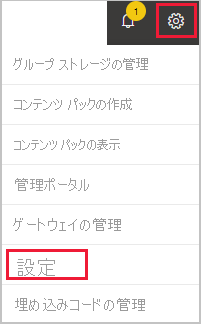

# Power BI アカウントを閉じることができるようになりました

Power BI を使用しなくなった場合は、Power BI アカウントを削除することができます。  アカウントを削除した後は、Power BI にサインインできません。 また、[Power BI サービス契約](https://azure.microsoft.com/support/legal/subscription-agreement/)のデータ保持ポリシーに記載されているように、アップロードまたは作成したすべての顧客データは、Power BI によって削除されます。

## 個々の Power BI ユーザー

個人として Power BI にサインアップしている場合は、 **[設定]** 画面からアカウントを削除できます。

1. Power BI で、右上にある歯車を選択してから、 **[設定]** を選択します。

    

1. **[全般]** タブで **[アカウントの削除]** を選択します。

    ![[アカウントの削除] オプションが強調して示されている設定ページの左上隅のスクリーンショット。](media/service-admin-closing-your-account/close-account-settings-2.png)

1. アカウントを削除する理由を選択します (1)。 詳細情報も提供できます (2)。 それから、 **[アカウントの使用の停止]** を選択します。

    ![アカウントを削除するための詳細情報を提供するフィールドが表示されている [アカウントの削除] ダイアログのスクリーンショット。](media/service-admin-closing-your-account/close-account-settings-3.png)

1. アカウントの使用を停止することを確認します。

    ![[はい] オプションが強調して示されている [アカウントの削除] 確認ダイアログのスクリーンショット。](media/service-admin-closing-your-account/close-account-settings-4.png)

    Power BI によってアカウントが削除されたことの確認が表示されます。 必要な場合は、ここからアカウントを再度開くことができます。

    ![[アカウントは削除されました] 確認ダイアログのスクリーンショット。](media/service-admin-closing-your-account/close-account-settings-5.png)

## 管理対象のユーザー

組織によって Power BI にサインアップされている場合は、管理者に問い合わせてください。アカウントからのライセンスの割り当て解除を依頼します。

他にわからないことがある場合は、 [Power BI コミュニティで質問してみてください](https://community.powerbi.com/)。