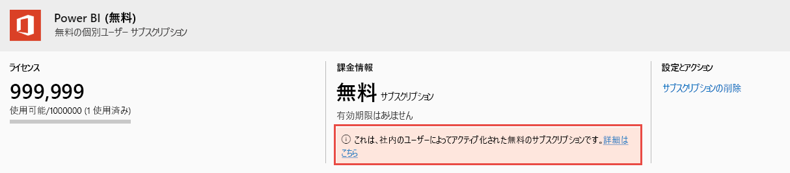

# Power BI ユーザー ライセンスの表示と管理

この記事では、管理者が Microsoft 365 管理センターまたは Azure portal を使用して、Power BI サービスのユーザー ライセンスを表示および管理する方法について説明しています。

> [!NOTE]
>
>ユーザーには、Power BI Free と Power BI Pro ライセンスの両方を割り当てることができます。 これは、ユーザーが無料ライセンスにサインアップした後で Power BI Pro ライセンスが割り当てられた場合に起こる場合があります。 ここでは、最上位のライセンス レベルを有効にします。
>

## サブスクリプションを表示する

組織が持っている Power BI サブスクリプションを確認するには、次の手順に従います。

1. [Microsoft 365 管理センター](https://admin.microsoft.com)にサインインします。
2. ナビゲーション メニューで、 **[課金]**  >  **[製品とサービス]** を選択します。

アクティブな Power BI サブスクリプションが、ご利用中のその他のサブスクリプションと共に一覧表示されます。 次に示すように、想定されていない Power BI Free のサブスクリプションが表示される場合があります。

  

この種類のサブスクリプションは、ユーザーがセルフサービス サインアップを利用するときに自動的に作成されます。 詳細については、「[組織内の Power BI](https://docs.microsoft.com/microsoft-365/admin/misc/power-bi-in-your-organization?view=o365-worldwide)」を参照してください。

## Microsoft 365 でライセンスを管理する

Microsoft 365 管理センターを使用してユーザー ライセンスを管理するには、「[ビジネス サブスクリプションと課金ドキュメント](https://docs.microsoft.com/microsoft-365/commerce/?view=o365-worldwide)」を参照してください。

## Azure portal でライセンスを管理する

次の手順に従い、Azure portal を使用して、Power BI ライセンスの表示と割り当てを行います。

1. [Azure portal](https://portal.azure.com) にサインインします。

2. **Azure Active Directory** を検索して選択します。

3. Azure Active Directory リソース メニューの **[管理]** の下にある **[ライセンス]** を選択します。

4. リソース メニューから **[すべての製品]** を選択します。次に、Power BI ライセンスの種類を選択して、ライセンス ユーザーの一覧を表示します。

5. ライセンスを割り当てるには、コマンド バーで、 **[+ 割り当て]** を選択します。 **[ライセンスの割り当て]** ページでユーザーを選択します。次に、 **[割り当てオプション]** を選択して、選択したユーザー アカウントの Power BI ライセンスを有効にします。

6. ライセンスを削除するには、ユーザー名の横のチェックボックスを選択した後、 **[ライセンスを削除する]** を選択します。

## 次の手順

- [Power BI Pro を購入する](service-admin-purchasing-power-bi-pro.md)
- [組織向けのライセンス](service-admin-licensing-organization.md)
