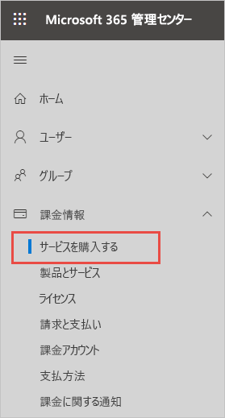
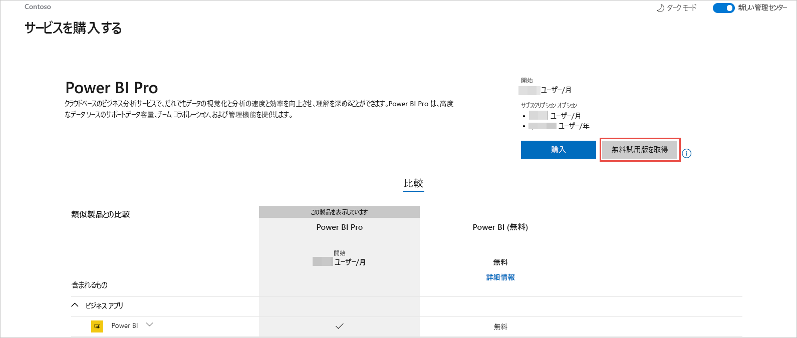
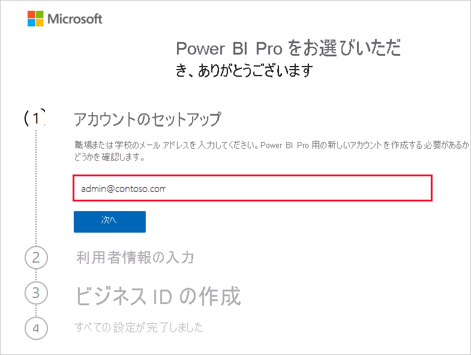
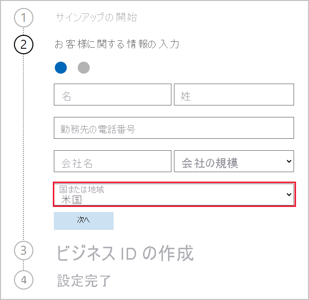
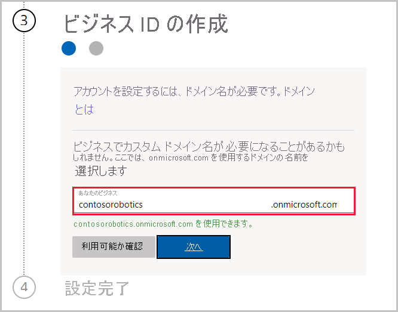

# 組織に合った Power BI サービス サブスクリプションを利用する

管理者は、Microsoft 365 管理センターの **[サービスを購入する]** ページから Power BI サービスにサインアップすることができます。 管理者が Power BI にサインアップした場合は、アクセスする必要があるユーザーにライセンスを割り当てることができます。

組織内のユーザーは、Power BI Web サイトから Power BI にサインアップできます。 組織内のユーザーが Power BI にサインアップすると、自動的に Power BI ライセンスが割り当てられます。 セルフサービス機能を無効にする場合は、「[セルフサービスでのサインアップと購入を有効または無効にする](service-admin-disable-self-service.md)」の手順に従ってください。

## Microsoft 365 でサインアップする

グローバル管理者または課金管理者である場合は、組織に向けて Power BI サブスクリプションを取得できます。 詳細については、「[ライセンスの購入と割り当てが可能なユーザー](service-admin-licensing-organization.md#who-can-purchase-and-assign-licenses)」を参照してください。

> [!NOTE]
>
> Microsoft 365 E5 サブスクリプションには、Power BI Pro ライセンスが既に含まれています。 ライセンスを管理する方法については、「[ユーザー ライセンスの表示と管理](service-admin-manage-licenses.md)」を参照してください。
>
>

Microsoft 365 管理センターで Power BI Pro ライセンスを購入するには、次の手順に従います。

1. [Microsoft 365 管理センター](https://admin.microsoft.com)にサインインします。

2. ナビゲーション メニューで、 **[課金]**  >  **[サービスの購入]** を選択します。
  
   

3. 検索またはスクロールして、購入するサブスクリプションを見つけます。 **Power BI** は、ページの下部の近くにある **[Other categories that might interest you]\(興味深いその他のカテゴリ\)** に表示されます。 リンクを選択すると、組織で利用可能な Power BI サブスクリプションが表示されます。

4. Power BI Pro などのプランを選択します。

5. **[サービスの購入]** ページで、 **[購入]** を選択します。 まだ使用していない場合は、Power BI Pro 無料試用版サブスクリプションを開始できます。 25 ライセンスが含まれており、有効期限は 1 か月です。

   

6. 支払い方法に応じて、 **[月払い]** または **[1 年分支払う]** を選択します。

7. **[ユーザーはいくつ必要ですか?]** に購入するライセンスの数を入力してから、 **[今すぐ支払う]** を選択してトランザクションを完了します。

8. 購入を確認するには、 **[課金]**  >  **[製品とサービス]** を参照し、 **[Power BI Pro]** を探します。

組織で Power BI サービスを制御および取得する方法の詳細については、「[組織内の Power BI](https://docs.microsoft.com/microsoft-365/admin/misc/power-bi-in-your-organization?view=o365-worldwide)」を参照してください。

## 組織向けの Power BI を取得するためのその他の方法

まだ Microsoft 365 のサブスクライバーでない場合は、以下の手順を使用して、組織向けの Power BI Pro 試用版を取得します。 または、[新しい Microsoft 365 試用版にサインアップ](service-admin-signing-up-for-power-bi-with-a-new-office-365-trial.md)してから、前のセクションの手順に従って Power BI を追加することもできます。

Power BI サブスクリプションにサインアップするには、職場または学校のアカウントが必要です。 コンシューマー電子メール サービスまたは通信プロバイダーが提供するメール アドレスはサポートされません。 職場または学校のアカウントをお持ちでない場合は、サインアップ中に作成できます。

サインアップするには、次の手順に従います。

1. [Power BI Pro のサインアップ](https://signup.microsoft.com/create-account/signup?OfferId=d59682f3-3e3b-4686-9c00-7c7c1c736085&ali=1&products=d59682f3-3e3b-4686-9c00-7c7c1c736085)にアクセスします。 

2. 職場または学校のメール アドレスを入力し、 **[次へ]** を選択します。 職場または学校のメール アドレスと見なされていないメール アドレスを入力してもかまいません。 ビジネス ID を作成すると、新しいアカウントが自動で設定されます。

   

3. 新しいアカウントを作成する必要があるかどうかを確認するために、簡単なチェックが行われます。 サインアップ プロセスを続行するには、 **[アカウントの設定]** を選択します。

   > [!NOTE]
   >指定したメール アドレスが別の Microsoft サービスで既に使用されている場合は、 **[サインイン]** するか **[代わりに新しいアカウントを作成]** することができます。 新しいアカウントの作成を選択する場合は、以下の手順に従って設定を続行してください。
>
>
 
4. フォームに入力して、お客様に関する情報を送信してください。 正しい国または地域を選択するようにしてください。 「[Power BI テナントの場所を確認する方法](service-admin-where-is-my-tenant-located.md#how-to-determine-where-your-power-bi-tenant-is-located)」で説明されているように、選択した国によってデータの格納場所が決まります。

   

5. **[次へ]** を選択します。 Microsoft では、お客様の本人確認のために確認コードを送信する必要があります。 Microsoft からテキストを送信したり、電話をかけたりすることが可能な電話番号を指定してください。 次に、 **[確認コードの送信]** を選択します。

6. 確認コードを入力し、 **[仕事用の ID の作成]** を続行します。

   

    ビジネス用の短い名前を入力してください。Microsoft によってそれが利用可能かどうかが確認されます。 この短い名前を使用して、onmicrosoft.com のサブドメインとしてデータセンターに組織名が作成されます。 お客様は、後で独自のビジネス ドメインを追加することができます。 目的の短い名前が使用されていても、心配はいりません。 似たようなビジネス名を持つユーザーが同じ短い名前を選択した可能性があります。別のバリエーションを試してみてください。 **[次へ]** を選択します。
    
7. ユーザー ID とパスワードを作成して、ご自分のアカウントにサインインします。 **[サインアップ]** を選択すると、すべての設定が完了します。

これで、作成したアカウントは新しい Power BI Pro 試用版テナントのグローバル管理者になりました。 [Microsoft 365 管理センター](https://admin.microsoft.com)にサインインして、さらにユーザーを追加したり、カスタム ドメインを設定したり、さらにサービスを購入したり、Power BI サブスクリプションを管理したりできます。

## 次の手順

- [ユーザー ライセンスの表示と管理](service-admin-manage-licenses.md)
- [セルフサービスでのサインアップと購入を有効または無効にする](service-admin-disable-self-service.md)
- [ビジネス サブスクリプションと課金ドキュメント](https://docs.microsoft.com/microsoft-365/commerce/?view=o365-worldwide)
