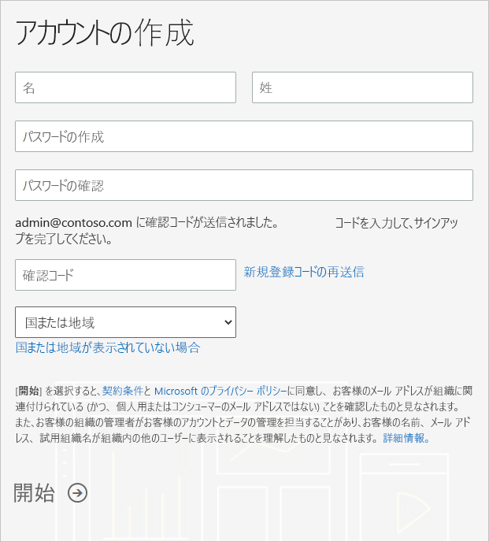

# 組織に合った Power BI サブスクリプションを利用する

Power BI には、管理者として [Power BI Web サイト](https://powerbi.microsoft.com)からサインアップすることができます。 Microsoft 365 管理センターの [サービスを購入する] ページからサインアップすることもできます。 管理者が Power BI にサインアップした場合は、アクセスする必要があるユーザーにライセンスを割り当てることができます。

さらに、組織内の個々のユーザーは、Power BI Web サイトから Power BI にサインアップすることができます。 組織内のユーザーが Power BI にサインアップすると、そのユーザーに Power BI ライセンスが自動的に割り当てられます。 この機能を無効にする場合は、「[セルフサービスでのサインアップと購入を有効または無効にする](service-admin-disable-self-service.md)」の手順に従ってください。

## Power BI でサインアップする

Power BI サブスクリプションにサインアップするには、職場または学校のアカウントが必要です。 コンシューマー電子メール サービスまたは通信プロバイダーが提供するメール アドレスはサポートされません。

サインアップするには、次の手順に従います。

1. [Power BI の Web サイト](https://powerbi.microsoft.com)に移動します。 **[無料試用版]** を選択します。
2. 仕事用メール アドレスを入力して、 **[サインアップ]** を選択します。

   

3. 本人確認をします。 使用する確認コードを電話または SMS メッセージで送信します。
4. **[はい]** を選択して、会社で取得した電子メール アドレスを使用していることを確認します。
5. アカウントを作成します。 サインアップを完了させるために、電子メール アドレスに確認コードを送信します。

   

## Microsoft 365 でサインアップする

Microsoft 365 のグローバル管理者または課金管理者の場合は、組織に向けて Power BI サブスクリプションを取得できます。 詳細については、「[ライセンスの購入と割り当てが可能なユーザー](../service-admin-licensing-organization.md#who-can-purchase-and-assign-licenses)」を参照してください。

> [!NOTE]
>
> Microsoft 365 E5 サブスクリプションには、Power BI Pro ライセンスが既に含まれています。 ライセンスを管理する方法については、「[ユーザー ライセンスの表示と管理](service-admin-manage-licenses.md)」を参照してください。
>
>

Microsoft 365 管理センターで Power BI Pro ライセンスを購入するには、次の手順に従います。

1. [Microsoft 365 管理センター](https://admin.microsoft.com)にサインインします。

2. ナビゲーション メニューで、 **[課金]**  >  **[サービスの購入]** を選択します。
  
   

3. 検索またはスクロールして、購入するサブスクリプションを見つけます。 **Power BI** は、ページの下部の近くにある **[Other categories that might interest you]\(興味深いその他のカテゴリ\)** に表示されます。 リンクを選択すると、組織で利用可能な Power BI サブスクリプションが表示されます。

4. Power BI Pro などのプランを選択します。

5. **[サービスの購入]** ページで、 **[購入]** を選択します。 まだ使用していない場合は、Power BI Pro 無料試用版サブスクリプションを開始できます。 25 ライセンスが含まれており、有効期限は 1 か月です。

   

6. 支払い方法に応じて、 **[月払い]** または **[1 年分支払う]** を選択します。

7. **[ユーザーはいくつ必要ですか?]** に購入するライセンスの数を入力してから、 **[今すぐ支払う]** を選択してトランザクションを完了します。

8. 購入を確認するには、 **[課金]**  >  **[製品とサービス]** を参照し、 **[Power BI Pro]** を探します。

組織で Power BI サービスを取得する方法に関する詳細については、「[組織内の Power BI](https://docs.microsoft.com/microsoft-365/admin/misc/power-bi-in-your-organization?view=o365-worldwide)」を参照してください。

## 次の手順

- [ユーザー ライセンスの表示と管理](service-admin-manage-licenses.md)
- [セルフサービスでのサインアップと購入を有効または無効にする](service-admin-disable-self-service.md)
- [ビジネス サブスクリプションと課金ドキュメント](https://docs.microsoft.com/microsoft-365/commerce/?view=o365-worldwide)
