# 管理ポータルでの Power BI の管理

管理ポータルを使用すると、組織の Power BI 設定を管理できます。 ポータルには、使用状況メトリック、Microsoft 365 管理センターへのアクセス、テナント設定などの項目が含まれています。

完全な管理ポータルには、グローバル管理者と、Power BI サービス管理者ロールを持つユーザーがアクセスできます。 これらの役割のいずれも割り当てられていない場合、表示できるのはポータルの **[容量の設定]** のみです。 Power BI サービス管理者の役割の詳細については、「[Power BI 管理者の役割について](service-admin-role.md)」を参照してください。

## 管理ポータルにアクセスする方法

Power BI 管理ポータルにアクセスするには、全体管理者または Power BI サービス管理者である必要があります。 Power BI サービス管理者の役割の詳細については、「[Power BI 管理者の役割について](service-admin-role.md)」を参照してください。 Power BI 管理ポータルにアクセスするには、次の手順に従います。

1. 管理者アカウントの資格情報を使用して [Power BI](https://app.powerbi.com) にサインインします。

1. ページ ヘッダーで、 **[設定]**  >  **[管理ポータル]** を選択します。

    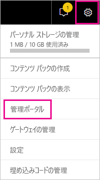

管理ポータルにはいくつかのセクションがあります。 この記事の残りの部分では、これらの各セクションについて説明します。

* [利用状況の指標](#usage-metrics)
* [ユーザー](#users)
* [監査ログ](#audit-logs)
* [テナント設定](#tenant-settings)
* [容量の設定](#capacity-settings)
* [埋め込みコード](#embed-codes)
* [組織のビジュアル](organizational-visuals.md#organizational-visuals)
* [Azure 接続 (プレビュー)](#azure-connections-preview)
* [ワークスペース](#workspaces)
* [カスタム ブランド](#custom-branding)
* [保護メトリック](#protection-metrics)
* [おすすめコンテンツ](#featured-content)

## 使用状況メトリック

**[使用状況メトリック]** を使用すると、組織の Power BI の使用状況を監視することができます。 また、Power BI で最もアクティブな組織内のユーザーとグループも示されます。

> [!NOTE]
> ダッシュボードに初めてアクセスした場合、またはダッシュボードを長期間表示しなかった後でもう一度アクセスした場合は、ダッシュボードを読み込んでいる間、読み込み中画面が表示される可能性があります。

ダッシュボードが読み込まれると、タイルのセクションが 2 つ表示されます。 最初のセクションには個々のユーザーの利用状況データが、2 番目のセクションにはグループについての同様の情報が含まれます。

各タイルに表示される内容の詳細は次のとおりです。

* ユーザー ワークスペース内のすべてのダッシュ ボード、レポート、およびデータセットの重複しない数。
  
    

* アクセス可能ユーザー数別の最も使用されたダッシュボード。 例:3 人のユーザーと共有しているダッシュボードがあるとします。 また、2 人の異なるユーザーが接続しているコンテンツ パックにダッシュボードを追加しました。 ダッシュボードの数は 6 (1 + 3 + 2) になります。
  
    

* ユーザーが最も接続しているコンテンツ。 このコンテンツは、SaaS コンテンツ パック、組織のコンテンツ パック、ファイル、データベースなど、データ取得処理によってユーザーがアクセスできるあらゆる項目です。

  
    

* 所有しているダッシュボードの数 (自分で作成したダッシュボードと共有しているダッシュ ボードの両方) に基づく上位ユーザー ビュー。
  
    

* 所有しているレポートの数に基づく上位ユーザー ビュー。
  
    

2 番目のセクションでは、同じ種類の情報が表示されますが、そのデータは (ユーザーではなく) グループに基づいています。 このセクションにより、組織のどのグループが最もアクティブであり、どのようなコンテンツを使用しているかを確認できます。

この情報を使用すると、組織全体で Power BI がどのように使用されているかについて実際の分析情報を得ることができます。

## 利用状況の指標の制御

使用状況メトリック レポートは、Power BI または全体管理者が、オンまたはオフにすることができる機能です。 管理者は、どのユーザーが利用状況の指標にアクセスできるかを細く制御できます。 これらは、組織内のすべてのユーザーに対して既定で**オン**になります。

管理者は、コンテンツ作成者が利用状況の指標内のユーザーごとのデータを参照できるかどうかも決定できます。 

レポート自体の詳細については、「[Power BI のダッシュボードとレポートの利用状況の指標を監視する](../collaborate-share/service-usage-metrics.md)」を参照してください。

### コンテンツ作成者用の使用状況メトリック

1. 管理ポータルで、 **[テナント設定]**  >  **[監査と使用状況の設定]**  >  **[コンテンツ作成者用の使用状況メトリック]** を選択します。

    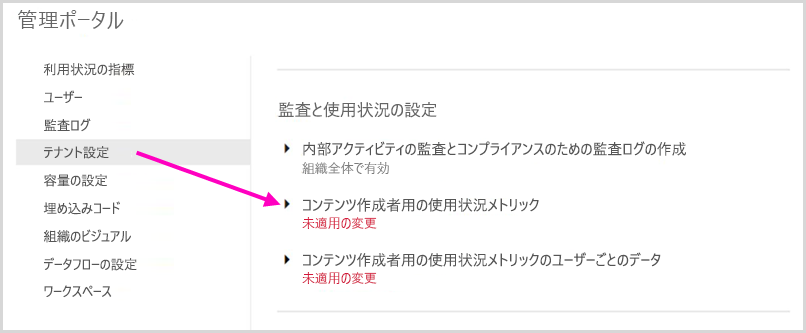

1. 利用状況の指標を有効 (または無効) にして、 **[適用]** を選択します。

    

### コンテンツ作成者用の使用状況メトリックのユーザーごとのデータ

既定では、ユーザーごとのデータは使用状況メトリックに対して有効であり、アカウント情報はメトリック レポートに含まれます。 一部またはすべてのユーザーに対してこのアカウント情報を含めない場合は、指定したセキュリティ グループまたは組織全体に対してこの機能を無効にします。 アカウント情報は、 *[名前なし]* としてレポートに表示されます。

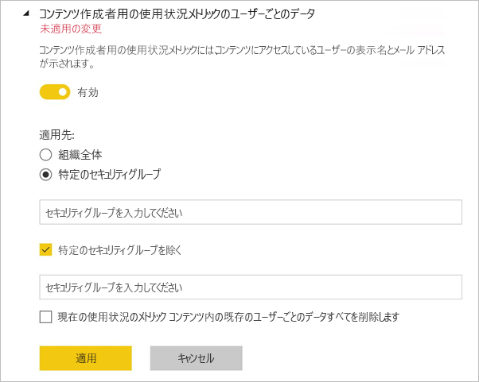

### 既存のすべての利用状況の指標コンテンツを削除する

組織全体に対して利用状況の指標を無効にする場合、管理者は次の一方または両方のオプションを選択できます。

- **[既存のすべての使用状況メトリック コンテンツを削除します]** では、利用状況の指標のレポートとデータセットを利用して構築された既存のレポートとダッシュボード タイルがすべて削除されます。 このオプションで、組織の全ユーザーを対象に、既に利用している場合でも、使用状況指標データの全アクセスが削除されます。
- **[現在の使用状況のメトリック コンテンツ内の既存のユーザーごとのデータすべてを削除します]** を選択すると、組織内の全ユーザーを対象に、既に利用している場合でも、ユーザーごとのデータへのアクセス権がすべて削除されます。

削除した既存の利用状況の指標コンテンツとユーザーごとの指標コンテンツは元に戻せないので注意が必要です。

## ユーザー

Microsoft 365 管理センターで Power BI のユーザー、グループ、管理者を管理します。 **[ユーザー]** タブには、管理センターへのリンクが含まれています。

## 監査ログ

Office 365 セキュリティ/コンプアライアンス センターで Power BI 監査ログを管理します。 **[監査ログ]** タブには、セキュリティ/コンプアライアンス センターへのリンクが含まれています。 詳細については、「[Power BI でユーザー アクティビティを追跡する](service-admin-auditing.md)」を参照してください。

監査ログを使用するには、設定 [ **[内部アクティビティの監査とコンプライアンスのための監査ログの作成]** ](#create-audit-logs-for-internal-activity-auditing-and-compliance) を有効にします。

## テナント設定

**[テナント設定]** では、組織で利用できる機能をきめ細かく制御できます。 機密データに関して懸念がある場合、一部の機能がお客様の組織に適していない場合や、特定の機能を特定のグループのみが使用できるようにする必要がある場合があります。

> [!NOTE]
> Power BI ユーザー インターフェイスの機能の可用性を制御するテナント設定は、ガバナンス ポリシーを確立するのに役立ちますが、セキュリティ対策ではありません。 たとえば、 **[データのエクスポート]** 設定では、データセットに対する Power BI ユーザーの権限は制限されません。 データセットに対して読み取りアクセス権を持つユーザーは、このデータセットに対してクエリを実行する権限を持っていて、Power BI ユーザー インターフェイスの **[データのエクスポート]** 機能を使用せずに結果を永続化できる場合があります。

次の図には、 **[テナント設定]** タブのいくつかの設定が示されています。

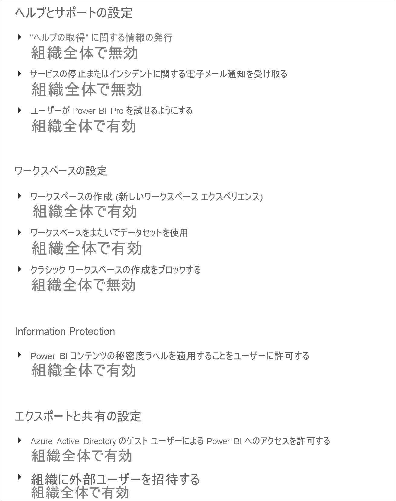

> [!NOTE]
> 組織のすべてのユーザーに対して設定の変更が有効になるには、最大で 15 分かかることがあります。

設定は、次の 3 つの状態のいずれかにできます。

* **組織全体に対して無効にする**:組織内の誰もこの機能を使用できません。

    

* **組織全体に対して有効にする**:組織内の誰でもこの機能を使用できます。

    

* **組織のサブセットに対して有効にする**:組織内の特定のセキュリティ グループに、この機能の使用を許可します。

    また、**特定のセキュリティ グループを除外**して、組織全体に対して機能を有効にすることもできます。

    

    設定を組み合わせて、特定のユーザーのグループのみに対して機能を有効にすることも、ユーザーのグループに対して機能を無効にすることもできます。 この方法を使用すると、特定のユーザーが許可されているグループに属している場合でも、その機能へのアクセス権を持たないようにすることができます。 ユーザーにとって最も制限の厳しい設定が適用されます。

    

次のいくつかのセクションでは、さまざまな種類のテナント設定の概要を示します。

## ヘルプとサポートの設定

### [ヘルプを表示] の情報を公開する

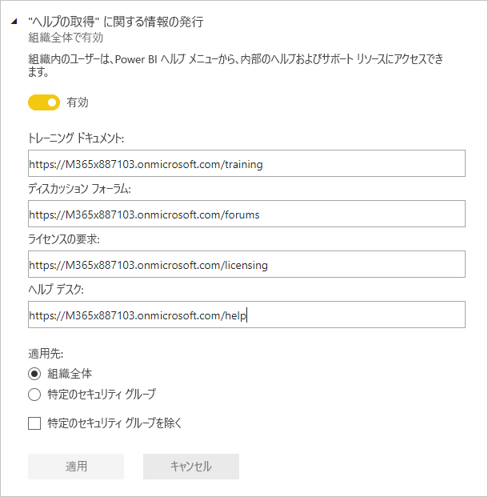

管理者は、内部 URL を指定して、Power BI ヘルプ メニューおよびライセンス アップグレードのリンク先をオーバーライドできます。 カスタム URL が設定されている場合、組織内のユーザーは、既定のリンク先ではなく内部ヘルプおよびサポート リソースに移動します。 次のリソースのリンク先をカスタマイズできます。

* **Learn**。 既定では、このヘルプ メニュー リンクは、[すべての Power BI ラーニング パスおよびモジュールの一覧](/learn/browse/?products=power-bi)を対象としています。 このリンクを内部トレーニング リソースに直接転送するには、**トレーニング ドキュメント**のカスタム URL を設定します。

* **コミュニティ**。 ヘルプ メニューから、[Power BI コミュニティ](https://community.powerbi.com/)ではなく、内部フォーラムにユーザーを移動させるには、**ディスカッション フォーラム**のカスタム URL を設定します。

* **ライセンス アップグレード**。 Power BI Free ライセンスを持つユーザーには、サービスを使用している間にアカウントを Power BI Pro にアップグレードする機会が示される場合があります。 **ライセンスの要求**の内部 URL を指定した場合、ユーザーは内部要求および購買フローにリダイレクトされ、セルフサービス購入が防止されます。 ユーザーがライセンスを購入できないようにするが、Power BI Pro の試用版を開始できるようにする場合は、「[ユーザーが Power BI Pro を試せるようにする](#allow-users-to-try-power-bi-pro)」を参照して、購入体験と試用体験を分けます。

* **ヘルプの表示**。 ヘルプ メニューから、[Power BI サポート](https://powerbi.microsoft.com/support/)ではなく、内部ヘルプ デスクにユーザーを移動させるには、**ヘルプ デスク**のカスタム URL を設定します。

### サービスの停止またはインシデントに関するメール通知を受け取る

このテナントがサービスの停止またはインシデントの影響を受けた場合、メールが有効なセキュリティ グループはメール通知を受け取ります。 詳細については、「[サービス中断の通知](service-interruption-notifications.md)」を参照してください。

### ユーザーが Power BI Pro を試せるようにする

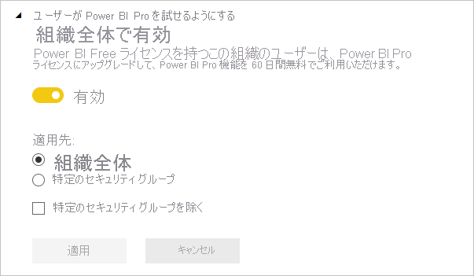

**[Allow users to try Power BI Pro]\(ユーザーが Power BI Pro を試せるようにする\)** 設定は既定で有効になっています。 この設定を使用すると、ユーザーが Power BI Pro ライセンスを取得する方法をより細かく制御できます。 セルフサービス購入がブロックされているシナリオでは、この設定により、ユーザーは Power BI Pro の評価を開始できます。 エンドユーザー エクスペリエンスは、ライセンス設定の組み合わせ方によって異なります。 次の表は、Power BI Free から Power BI Pro へのアップグレード エクスペリエンスが、さまざまな設定の組み合わせによってどのような影響を受けるかを示しています。

| セルフサービスでの購入の設定 | ユーザーが Power BI Pro の設定を試せるようにする | エンド ユーザー エクスペリエンス |
| ------ | ------ | ----- |
| Enabled | 無効 | ユーザーは Pro ライセンスを購入できますが、試用版を開始することはできません |
| Enabled | Enabled | ユーザーは、Pro の無料試用版を開始し、有料ライセンスにアップグレードすることができます |
| 無効 | 無効 | ユーザーに、IT 管理者に連絡してライセンスを要求するように求めるメッセージが表示されます |
| 無効 | Enabled | ユーザーは Pro 試用版を開始できますが、有料ライセンスを取得するには IT 管理者に問い合わせる必要があります |

> [!NOTE]
> ライセンス要求の内部 URL を追加するには、[ヘルプとサポートの設定](#help-and-support-settings)を使用します。 この URL を設定すると、既定のセルフサービス購入エクスペリエンスがオーバーライドされます。 Power BI Pro ライセンス試用版のサインアップはリダイレクトされません。 上の表で説明したシナリオでライセンスを購入できるユーザーは、内部 URL にリダイレクトされます。

詳細については、「[セルフサービスでのサインアップと購入を有効または無効にする](service-admin-disable-self-service.md)」を参照してください。

## ワークスペースの設定

**[テナント設定]** では、管理ポータルでのワークスペースの管理に関する次の 3 つのセクションがあります。

- [新しいワークスペース エクスペリエンスを作成](#create-the-new-workspaces)。
- [ワークスペースをまたいでデータセットを使用](#use-datasets-across-workspaces)。
- [クラシック ワークスペースの作成をブロック](#block-classic-workspace-creation)。

### 新しいワークスペースを作成する

ワークスペースは、ユーザーがダッシュボード、レポート、およびその他のコンテンツで共同作業を行う場所です。 管理者は、 **[ワークスペースの作成 (新しいワークスペース エクスペリエンス)]** 設定を使用して、ワークスペースを作成できる組織内のユーザーを指定します。 管理者は、組織内の全員が新しいワークスペース エクスペリエンスのワークスペースを作成することを許可することも、誰も作成できないようにすることもできます。 特定のセキュリティ グループのメンバーに作成を限定することもできます。 [ワークスペース](../collaborate-share/service-new-workspaces.md)の詳細を参照してください。

:::image type="content" source="media/service-admin-portal/power-bi-admin-workspace-settings.png" alt-text="新しいワークスペース エクスペリエンスを作成する":::

Microsoft 365 グループに基づく従来のワークスペースについては、引き続き管理ポータルおよび Azure Active Directory で管理されます。

> [!NOTE]
> **[ワークスペースの作成 (新しいワークスペース エクスペリエンス)]** の既定の設定では、Microsoft 365 グループを作成できるユーザーのみが、新しい Power BI ワークスペースを作成できます。 適切なユーザーが作成できるように、Power BI 管理ポータルで値を設定してください。

**ワークスペースの一覧**

管理ポータルには、テナント内のワークスペースに関する設定の別のセクションがあります。 そのセクションでは、ワークスペースの一覧を並べ替えたり、フィルターを適用したり、ワークスペースごとの詳細を表示したりできます。 詳細については、この記事の「[ワークスペース](#workspaces)」を参照してください。

**コンテンツ パックとアプリを発行する**

また、管理ポータルでは、組織にアプリを配布する権限を持つユーザーを制御することもできます。 詳細については、この記事の「[コンテンツ パックとアプリを組織全体に発行する](#publish-content-packs-and-apps-to-the-entire-organization)」を参照してください。

### ワークスペースをまたいでデータセットを使用

管理者は、ワークスペース間でデータセットを使用できる組織内のユーザーを制御できます。 この設定を有効にした場合でも、ユーザーは特定のデータセットで求められるビルド アクセス許可が必要になります。

:::image type="content" source="media/service-admin-portal/power-bi-admin-datasets-workspaces.png" alt-text="新しいワークスペース エクスペリエンスを作成する":::

詳細については、[ワークスペースをまたいだデータセットの概要](../connect-data/service-datasets-across-workspaces.md)に関する記事を参照してください。

### クラシック ワークスペースの作成をブロックする

管理者は、組織がクラシック ワークスペースを作成できるかどうかを制御できます。 この設定を有効にすると、ワークスペースを作成するユーザーは、新しいワークスペース エクスペリエンスのワークスペースのみを作成できます。 

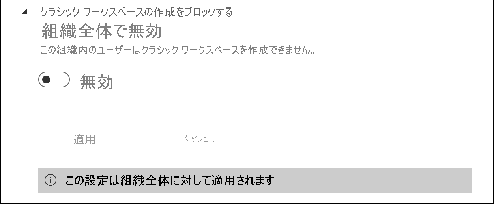

有効にすると、新しく作成された Office 365 グループは Power BI のワークスペースの一覧に表示されません。 既存のクラシック ワークスペースは引き続き一覧に表示されます。 この設定を無効にすると、ユーザーがメンバーになっているすべての Office 365 グループがワークスペースの一覧に表示されます。 新しいワークスペース エクスペリエンスのワークスペースの詳細については、[こちら](../collaborate-share/service-new-workspaces.md)を参照してください。

## エクスポートと共有の設定

### Azure Active Directory のゲスト ユーザーによる Power BI へのアクセスを許可する

この設定を有効にすると Azure Active Directory Business-to-Business (Azure AD B2B) のゲスト ユーザーが Power BI にアクセスできるようになります。 この設定を無効にすると、Power BI にアクセスしようとしたときに、ゲスト ユーザーにエラーが表示されます。 組織全体に対してこの設定を無効にすると、ユーザーが組織にゲストを招待するのを防ぐこともできます。 Power BI にアクセスできるゲスト ユーザーを制御するには、特定のセキュリティ グループのオプションを使用します。

### 組織に外部ユーザーを招待する 

**[Invite external users to your organization]\(組織に外部ユーザーを招待する\)** 設定により、組織が Power BI 共有とアクセス許可のエクスペリエンスを通じて、新しい外部ユーザーを組織に招待できるかどうかを選択できるようになります。 無効にした場合、まだ組織のゲスト ユーザーでない外部ユーザーは、Power BI を使用して組織に追加することができません。

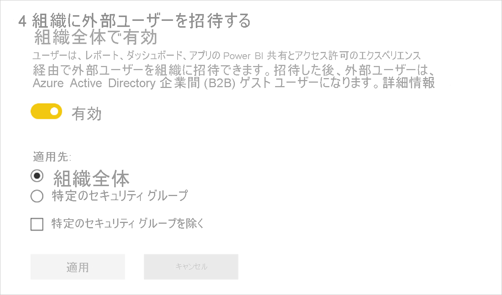

> [!IMPORTANT]
> この設定は、以前は "外部ユーザーとコンテンツを共有する" と呼ばれていました。 変更後の名前は、設定の内容をより正確に反映しています。

組織に外部ユーザーを招待するには、Azure Active Directory のゲスト招待元ロールも必要です。 この設定では、Power BI を通じて招待する機能のみが制御されます。 

### Web に公開

Power BI 管理者には、ユーザーが埋め込みコードを作成してレポートを Web に公開するためのオプションが、 **[Web に公開]** 設定により提供されます。 この機能により、レポートとそのデータを、Web 上のすべてのユーザーが利用できるようになります。 Web への公開の詳細については、[こちら](../collaborate-share/service-publish-to-web.md)を参照してください。

> [!NOTE]
> Web に公開する埋め込みコードの新規作成を許可できるのは、Power BI 管理者のみです。 組織には、既存の埋め込みコードが存在する場合があります。 現在、公開されているレポートを確認するには、管理ポータルの [[埋め込みコード]](service-admin-portal.md#embed-codes) セクションを参照してください。

**[Web に公開]** 設定を有効にした場合のレポートの **[その他のオプション] (...)** メニューを次の図に示します。

![[その他のオプション] メニューの [Web に公開]](media/service-admin-portal/power-bi-more-options-publish-web.png)

管理ポータルの **[Web に公開]** 設定には、ユーザーが埋め込みコードを作成できるオプションが用意されています。

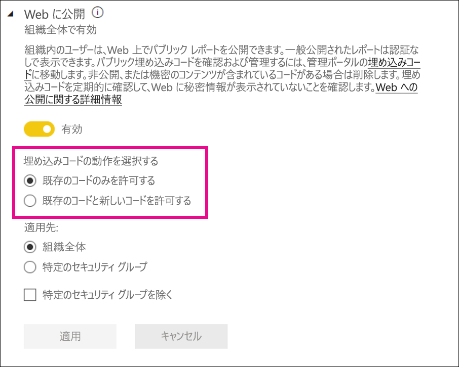

管理者は、 **[Web に公開]** を **[有効]** に設定し、 **[埋め込みコードの動作を選択する]** を **[Allow only existing embed codes]\(既存の埋め込みコードのみを許可\)** に設定できます。 その場合、ユーザーは埋め込みコードを作成できますが、そのためには Power BI 管理者に連絡してそれを許可してもらう必要があります。

![[Web に公開] のプロンプト](../collaborate-share/media/service-publish-to-web/publish_to_web_admin_prompt.png)

**[Web に公開]** の設定に基づき、UI にさまざまなオプションが表示されます。

|特徴 |組織全体に対して有効にする |組織全体に対して無効にする |特定のセキュリティ グループ   |
|---------|---------|---------|---------|
|レポートの **[その他のオプション] (...)** メニューの **[Web に公開]**|すべてのユーザーに対して有効|すべてのユーザーに対して非表示|承認されたユーザーまたはグループに対してのみ表示されます。|
|**[設定]** の下の **[埋め込みコードの管理]**|すべてのユーザーに対して有効|すべてのユーザーに対して有効|すべてのユーザーに対して有効  *  **[削除]** オプションは、承認されたユーザーまたはグループの場合にのみ使用可能です。 *  **[コードを取得]** は、すべてのユーザーに対して有効になります。|
|管理ポータル内の **[埋め込みコード]**|状態には次のいずれかが反映されます。 * アクティブ * サポートされていません * ブロック|状態は **[無効]** と表示|状態には次のいずれかが反映されます。 * アクティブ * サポートされていません * ブロック  ユーザーがテナント設定に基づいて承認されていない場合、状態は **[侵害]** と表示されます。|
|既存の公開済みレポート|すべて有効|すべて無効|すべてのユーザーに対して、レポートの表示が続行されます。|

### データのエクスポート

組織内のユーザーは、タイルまたはビジュアル化からデータをエクスポートできます。 この設定を使用して、Excel での分析、.csv へのエクスポート、データセットのダウンロード (.pbix)、Power BI サービスのライブ接続機能を制御します。 タイルまたはビジュアルからデータをエクスポートする方法については[こちら](../visuals/power-bi-visualization-export-data.md)をご覧ください。

>[!NOTE]
> [Excel にエクスポート] 設定が導入される前は、この設定により、Excel ファイルへのデータのエクスポートも制御されていました。 詳細については、[「Excel にエクスポート」の注](#export-to-excel)を参照してください。

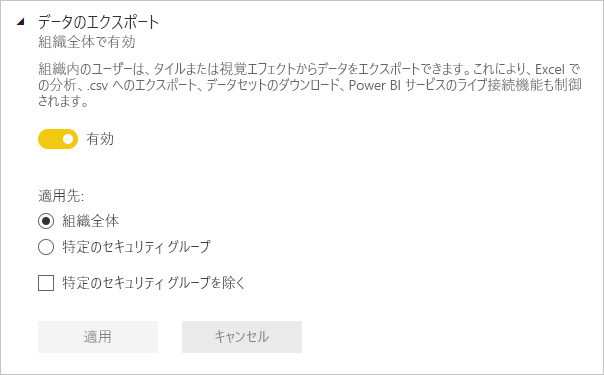

タイルからデータをエクスポートするためのオプションを次の図に示します。

> [!NOTE]
> また、 **[データのエクスポート]** を無効にして、ユーザーが [[Excel で分析]](../collaborate-share/service-analyze-in-excel.md) 機能と、Power BI サービスのライブ接続を使用できないように設定することもできます。

### Excel にエクスポート

組織内のユーザーは、視覚エフェクトのデータを Excel ファイルにエクスポートできます。

![[Excel にエクスポート] 設定](media/service-admin-portal/powerbi-admin-portal-export-to-excel-setting.png)

>[!IMPORTANT]
> [Excel にエクスポート] 設定が導入される前は、Excel ファイルへのデータのエクスポートはデータ設定のエクスポートで制御されていました。 このため、[Excel にエクスポート] 設定の導入前に存在していたテナントでは、Power BI 管理者が [Excel にエクスポート] 設定を確認すると、 *[未適用の変更]* があることがわかります。 新しい設定を有効にするには、これらの変更を適用する必要があります。 それ以外の場合、Excel ファイルへのエクスポートは、[データ設定のエクスポート] によって引き続き制御されます。

### PowerPoint プレゼンテーションまたは PDF ドキュメントとしてレポートをエクスポート

組織内のユーザーは、Power BI レポートを PowerPoint ファイルまたは PDF ドキュメントとしてエクスポートできます。 [詳細情報](../consumer/end-user-powerpoint.md)

**[PowerPoint プレゼンテーションまたは PDF ドキュメントとしてレポートをエクスポート]** 設定を有効にした場合のレポートの **[ファイル]** メニューを次の図に示します。

### ダッシュボードとレポートの印刷

組織内のユーザーは、ダッシュボードとレポートを印刷できます。 [詳細情報](../consumer/end-user-print.md)

ダッシュボードを印刷するためのオプションを次の図に示します。

設定 **[ダッシュボードとレポートを印刷する]** を有効にした場合のレポートの **[ファイル]** メニューを次の図に示します。

### 外部のゲスト ユーザーによる組織内のコンテンツの編集および管理を許可する

Azure AD B2B ゲスト ユーザーは、組織内のコンテンツを編集および管理できます。 [詳細情報](service-admin-azure-ad-b2b.md)

次の図は、[外部のゲスト ユーザーによる組織内のコンテンツの編集および管理を許可する] オプションを示しています。

また、管理ポータルでは、組織に外部ユーザーを招待する権限を持つユーザーを制御することもできます。 詳細については、この記事の「[外部ユーザーとコンテンツを共有する](#export-and-sharing-settings)」を参照してください。

### 電子メール サブスクリプション
組織内のユーザーは電子メール サブスクリプションを作成できます。 サブスクリプションの詳細は[こちら](../collaborate-share/service-publish-to-web.md)をご覧ください。

### おすすめコンテンツ

組織内の一部またはすべてのレポート作成者が、Power BI ホームのおすすめセクションに自分のコンテンツを表示できます。 新しいユーザーに対しては、おすすめのコンテンツが Power BI ホーム ページの先頭に表示されます。 ユーザーが **[お気に入り]** 、 **[頻繁に使用]** 、 **[最近使用]** を追加すると、おすすめコンテンツはホーム ページの下に移動します。 

最初は少数の推奨者から始めることをお勧めします。 組織全体がホームでコンテンツをお勧めできるようにすると、推奨されたすべてのコンテンツを追跡することが困難になる場合があります。 

おすすめコンテンツを有効にした後は、管理ポータルでそれを管理することもできます。 ドメインのおすすめコンテンツの制御については、この記事の「[おすすめコンテンツを管理する](#manage-featured-content)」を参照してください。

## コンテンツ パックとアプリの設定

### コンテンツ パックとアプリを組織全体に発行する

管理者はこの設定を使用して、特定のグループではなく、組織全体にコンテンツ パックとアプリを発行できるユーザーを決定します。 アプリの発行の詳細は[こちら](../collaborate-share/service-create-distribute-apps.md)をご覧ください。

コンテンツ パックを作成するときの **[組織全体]** オプションを次の図に示します。

### テンプレート アプリと組織のコンテンツ パックを作成する

組織内のユーザーは、Power BI Desktop 内の 1 つのデータ ソース上に構築されたデータセットを使用する、テンプレート アプリと組織のコンテンツ パックを作成できます。 テンプレート アプリの詳細は[こちら](../connect-data/service-template-apps-create.md)をご覧ください。

### アプリをエンド ユーザーにプッシュする

レポートの作成者は、[AppSource](https://appsource.microsoft.com) からのインストールを要求することなく、エンド ユーザーとアプリを直接共有できます。 詳細については、「[エンド ユーザーにアプリを自動的にインストールする](../collaborate-share/service-create-distribute-apps.md#automatically-install-apps-for-end-users)」を参照してください。

## 統合の設定

### オンプレミスのデータセットで [Excel で分析] を使用する

組織内のユーザーは、Excel を使用して、オンプレミスの Power BI データセットの表示および操作を行うことができます。 [詳細情報](../collaborate-share/service-analyze-in-excel.md)

> [!NOTE]
> また、 **[データのエクスポート]** を無効にして、ユーザーが **[Excel で分析]** 機能を使用することを防ぐこともできます。

### ArcGIS Maps for Power BI を使用する

組織内のユーザーは、Esri が提供する ArcGIS Maps for Power BI の視覚化を使用できます。 [詳細情報](../visuals/power-bi-visualizations-arcgis.md)

### Power BI でグローバル検索を使用する (プレビュー)

組織のユーザーには、Azure Search に依存する外部の検索機能を使用できます。

## おすすめのテーブルの設定

**[テナント設定]** の **[Allow connections to featured tables]\(おすすめのテーブルへの接続を許可\)** 設定を使用すると、組織内のどのユーザーが Excel データ型ギャラリーのおすすめのテーブルを使用できるかを Power BI 管理者が制御できるようになります。 

:::image type="content" source="media/service-admin-portal/admin-allow-connections-featured-tables.png" alt-text="新しいワークスペース エクスペリエンスを作成する":::

**[データのエクスポート]** 設定が **[無効]** に設定されている場合は、おすすめのテーブルへの接続も無効になります。

[Excel での Power BI のおすすめのテーブル](../collaborate-share/service-excel-featured-tables.md)について、詳細をご確認ください。

## [Teams で共有] テナント設定

**[Teams で共有]** 設定は、Power BI 管理ポータルの **[テナント設定]** セクションにあります。 その設定を使用すると、組織は Power BI サービスに **[Teams で共有]** ボタンが表示されないようにすることができます。 無効に設定すると、ユーザーが Power BI サービスでレポートやダッシュボードを表示したとき、アクション バーまたはショート カットメニューの **[Teams で共有]** ボタンは表示されません。

![Power BI 管理ポータルにある [Teams で共有] テナント設定のスクリーンショット。](media/service-admin-portal/service-teams-share-to-teams-tenant-setting.png)

Teams での Power BI コンテンツの共有の詳細については、[こちら](../collaborate-share/service-share-report-teams.md)を参照してください。

## R ビジュアルの設定

### R ビジュアルとの対話と共有

組織内のユーザーは、R スクリプトで作成したビジュアルと対話して共有することができます。 [詳細情報](../visuals/service-r-visuals.md)

> [!NOTE]
> この設定は、組織全体に適用され、特定のグループに限定することはできません。

## 監査と使用状況の設定

### 内部アクティビティの監査とコンプライアンスのための監査ログの作成

組織内のユーザーは監査を使用して、組織内の他のユーザーによって実行された Power BI のアクションを監視することができます。 [詳細情報](service-admin-auditing.md)

監査ログのエントリを記録するには、この設定を有効にする必要があります。 監査を有効にしてから監査データを表示できるようになるまで、最大で 48 時間の遅延が発生する場合があります。 データがすぐに表示されない場合は、後で、監査ログを確認してください。 監査ログの表示アクセス許可を取得してからログにアクセスできるようになるまでにも、同様の遅延が発生する場合があります。

> [!NOTE]
> この設定は、組織全体に適用され、特定のグループに限定することはできません。

### コンテンツ作成者用の使用状況メトリック

組織内のユーザーは、自分が作成したダッシュボードとレポートの使用状況メトリックを確認できます。 [詳細情報](../collaborate-share/service-usage-metrics.md)

### コンテンツ作成者用の使用状況メトリックのユーザーごとのデータ

コンテンツ作成者用の使用状況メトリックには、コンテンツにアクセスしているユーザーの表示名とメール アドレスが示されます。 [詳細情報](../collaborate-share/service-usage-metrics.md)

ユーザーごとのデータは利用状況メトリックに対して既定で有効になり、コンテンツ作成者のアカウント情報はメトリック レポートに含まれます。 この情報の収集対象をすべてのユーザーとはしたくない場合は、指定したセキュリティ グループまたは組織全体に対してこの機能を無効にすることができます。 そうすると、除外されたユーザーのアカウント情報は、レポート内で *[名前なし]* として表示されます。

## ダッシュボードの設定

### ダッシュボードのデータ分類

組織内のユーザーは、ダッシュボードのセキュリティ レベルを示す分類を使って、ダッシュボードにタグを付けることができます。 [詳細情報](../create-reports/service-data-classification.md)

> [!NOTE]
> この設定は、組織全体に適用され、特定のグループに限定することはできません。

## 開発者の設定

### アプリにコンテンツを埋め込む

組織内のユーザーが、Power BI のダッシュボードとレポートを、サービスとしてのソフトウェア (SaaS) アプリケーションに埋め込むことができます。 この設定を無効にすると、ユーザーが REST API を使用して、Power BI コンテンツをアプリケーションに埋め込むことができなくなります。 [詳細情報](../developer/embedded/embedding.md)

### Power BI API の使用をサービス プリンシパルに許可

Azure Active Directory (Azure AD) に登録されている Web アプリは、サインインしているユーザーなしで Power BI API にアクセスするために、割り当て済みのサービス プリンシパルを使用します。 アプリによるサービス プリンシパル認証の使用を許可するには、許可されているセキュリティ グループにそのサービス プリンシパルを含める必要があります。 [詳細情報](../developer/embedded/embed-service-principal.md)

> [!NOTE]
> サービス プリンシパルは、対象セキュリティ グループの Power BI テナントのすべての設定のアクセス許可を継承します。 アクセス許可を制限するには、サービス プリンシパル専用のセキュリティ グループを作成し、関連する有効な Power BI 設定の [特定のセキュリティ グループを除く] リストに追加します。

## データフローの設定

### データフローの作成と使用

組織内のユーザーはデータフローを作成して使用できます。 データフローの概要については、「[Power BI でのセルフサービスのデータ準備](../transform-model/service-dataflows-overview.md)」をご覧ください。 Premium 容量でのデータフローを有効にするには、「[ワークロードを構成する](service-admin-premium-workloads.md)」を参照してください。

> [!NOTE]
> この設定は、組織全体に適用され、特定のグループに限定することはできません。

## テンプレート アプリの設定

3 つの設定により、テンプレート アプリを発行またはインストールするテンプレート アプリの機能を制御します。

### テンプレート アプリを発行する

組織内のユーザーはテンプレート アプリのワークスペースを作成できます。 [AppSource](https://appsource.microsoft.com) またはその他の配布方法を利用して、組織外のクライアントにテンプレート アプリを発行または配布できるユーザーを制御します。

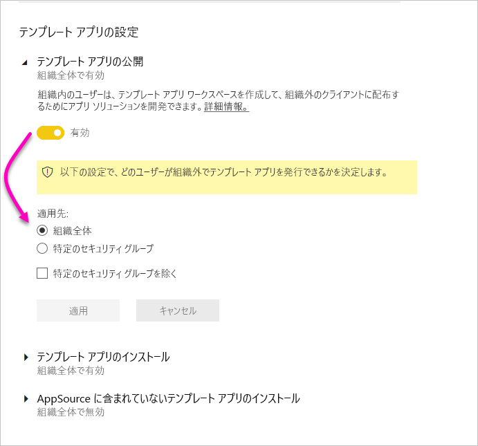

### AppSource にリストされているテンプレート アプリをインストールする

組織内のユーザーは、[AppSource](https://appsource.microsoft.com)から**のみ**、テンプレートをダウンロードしてインストールできます。 AppSource からテンプレート アプリをインストールできる特定のユーザーまたはセキュリティ グループを制御します。

### AppSource にリストされていないテンプレート アプリをインストールする

**[AppSource](https://appsource.microsoft.com)にリストされていない**テンプレート アプリをダウンロードしてインストールできる組織内のユーザーを制御します。

## 容量の設定

### Power BI Premium

**[Power BI Premium]** タブでは、組織用に購入されたすべての Power BI Premium 容量 (EM または P SKU) を管理できます。 組織内のすべてのユーザーに **[Power BI Premium]** タブが表示されますが、そのタブにコンテンツが表示されるのは、ユーザーが、"*容量管理者*"、または割り当てのアクセス許可を持つユーザーとして割り当てられている場合のみです。 アクセス許可が何も割り当てられていないユーザーには、次のメッセージが表示されます。

### Power BI Embedded

**[Power BI Embedded]** タブを使用すると、顧客用に購入した Power BI Embedded (A SKU) の容量を表示できます。 Azure からは A SKU の購入のみ可能であるため、**Azure portal** から [Azure の埋め込み容量を管理](../developer/embedded/azure-pbie-create-capacity.md)します。

Power BI Embedded (A SKU) の設定を管理する方法について詳しくは、「[Azure の Power BI Embedded とは何か](../developer/embedded/azure-pbie-what-is-power-bi-embedded.md)」をご覧ください。

## 埋め込みコード

管理者は、テナントに対して生成されている埋め込みコードを表示して、レポートをパブリックに共有することができます。 コードを取り消したり削除したりすることもできます。 [詳細情報](../collaborate-share/service-publish-to-web.md)

## 組織のビジュアル

Power BI ビジュアルのテナント設定を含む Power BI ビジュアルのすべての管理設定については、「[Power BI ビジュアルの管理設定を管理する](organizational-visuals.md)」を参照してください。

## Azure 接続 (プレビュー)

### テナントレベルのストレージ (プレビュー)

既定では、Power BI で使用されるデータは、Power BI で利用可能な内部ストレージに保存されます。 データフローと Azure Data Lake Storage Gen2 (ADLS Gen2) を統合すると、組織の Azure Data Lake Storage Gen2 アカウントにデータフローを保存できます。 詳細については、「[データフローと Azure Data Lake の統合 (プレビュー)](../transform-model/service-dataflows-azure-data-lake-integration.md)」を参照してください。

### ワークスペースレベルのストレージのアクセス許可 (プレビュー)

既定では、ワークスペース管理者は自分のストレージ アカウントに接続できません。 このプレビュー機能を使用すると、ワークスペース管理者が自分のストレージ アカウントに接続するための設定を有効にすることができます。

## Workspaces

管理者は、 **[ワークスペース]** タブで自分のテナントに存在するワークスペースを表示できます。このタブで、次の操作を実行できます。

- ワークスペースとその詳細の一覧を更新します。
- ワークスペースに関するデータを .csv ファイルにエクスポートします。 
- ワークスペース (その ID、そのユーザーとそのロール、そのダッシュボード、レポート、データセット) に関する詳細を表示します。
- アクセス権を持つユーザーの一覧を編集します。 つまり、ワークスペースを削除することができます。 自分自身を管理者としてワークスペースに追加し、ワークスペースを開いて削除することができます。
- [名前] フィールドと [説明] フィールドを編集します。

また、管理者はユーザーが、新しいワークスペース エクスペリエンスのワークスペースと従来のワークスペースを作成する機能を制御できます。 詳細については、この記事の「[ワークスペースの設定](#workspace-settings)」を参照してください。 

**[ワークスペース]** タブのテーブルの列は、ワークスペースの [Power BI 管理者 Rest API](/rest/api/power-bi/admin) によって返されるプロパティに対応しています。 個人ワークスペースの種類は **PersonalGroup**、従来のワークスペースの種類は **Group**、新しいワークスペース エクスペリエンスのワークスペースの種類は **Workspace** です。 詳細については、[新しいワークスペースで作業を整理する](../collaborate-share/service-new-workspaces.md)方法に関する記事を参照してください。

**[ワークスペース]** タブに、ワークスペース別の*状態*が表示されます。 次の表は、各状態の意味に関する説明をまとめたものです。

|州  |説明  |
|---------|---------|
| **アクティブ** | 通常のワークスペース。 使用状況や内部の状況について示すものではなく、単にワークスペース自体が "通常" であることを示します。 |
| **無所属** | 管理者ユーザーのないワークスペース。 |
| **削除済み** | 削除されたワークスペース。 Microsoft では、最大 90 日間、必要に応じてワークスペースを復元するために十分なメタデータが保持されます。 |
| **削除中** | 削除中であるが、まだ完全に削除されていないワークスペース。 ユーザーは自分のワークスペースを削除できますが、そのとき、ワークスペースはまず "削除中" になり、最終的に "削除済み" になります。 |

また、管理者は、管理ポータルまたは PowerShell コマンドレットのいずれかを使用して、ワークスペースの管理と回復を行うこともできます。 

## カスタム ブランド

管理者は、組織全体に対する Power BI の外観をカスタマイズできます。 現時点では、3 つの主なオプションがあります。

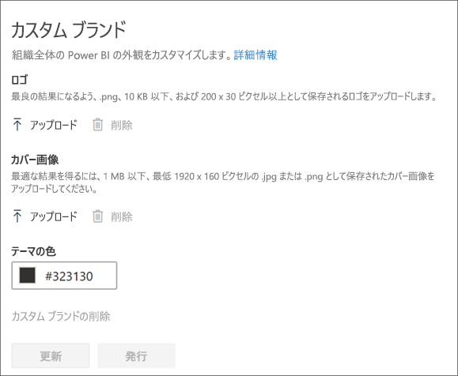

* **ロゴのアップロード**: 最良の結果になるよう、.png、10 KB 以下、および 200 x 30 ピクセル以上として保存されるロゴをアップロードします。

* **カバー画像のアップロード**: 最良の結果になるよう、.jpg または .png、1 MB 以下、および 1920 x 160 ピクセル以上として保存されるカバー画像をアップロードします。

* **テーマの色の選択**: 16 進数の番号、RGB、値で、または提供されたパレットから、テーマを選択できます。

詳細については、[組織向けのカスタム ブランド](https://aka.ms/orgBranding)に関する記事をご覧ください。

## 保護メトリック

Power BI の情報保護を有効にすると、管理ポータルにデータ保護メトリックが表示されます。 このレポートには、秘密度ラベルがコンテンツの保護にどのように役立っているかが示されます。

## おすすめコンテンツを管理する

Power BI 管理者は、おすすめセクションに昇格されているすべてのレポート、ダッシュボード、アプリを、組織全体で Power BI ホームで管理できます。

- 管理ポータルで **[おすすめコンテンツ]** を選択します。

ここには、コンテンツを勧めたユーザーの概要、いつ勧めたか、すべての関連メタデータが表示されます。 問題があると思われる場合、またはおすすめセクションをクリーンアップしたい場合は、必要に応じて推奨されているコンテンツを削除できます。

おすすめコンテンツを有効にする方法については、この記事の「[おすすめコンテンツ](#featured-content)」を参照してください。

## 次の手順

[組織内の Power BI を管理する](service-admin-administering-power-bi-in-your-organization.md)  
[Power BI 管理者の役割について](service-admin-role.md)  
[組織内の Power BI を監査する](service-admin-auditing.md)  

他にわからないことがある場合は、 [Power BI コミュニティで質問してみてください](https://community.powerbi.com/)。