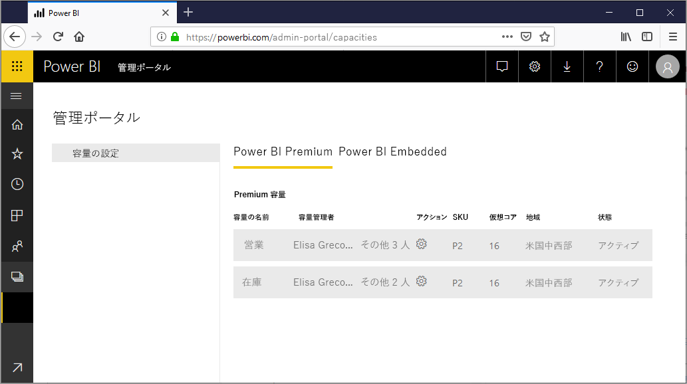

# Power BI Premium で容量を構成および管理する

Power BI Premium の管理には、Premium 容量の作成、管理、監視が含まれます。 この記事では、詳細な手順について説明します。容量の概要については、「[Premium 容量を管理する](service-premium-capacity-manage.md)」を参照してください。

Power BI Premium および Power BI Embedded の容量を管理する方法について説明します。これにより、ご利用のコンテンツに専用のリソースが提供されます。

*容量*は Power BI Premium および Power BI Embedded サービスの中核となるものです。 これは、組織専用に予約されたリソースのセットです。 専用の容量を持つことで、組織全体のユーザー用にユーザーごとのライセンスを購入しなくても、これらのユーザーに対してダッシュボード、レポート、データセットを公開できます。 また、それによって、容量内でホストされているコンテンツに対して信頼性の高い、一貫性のあるパフォーマンスも提供されます。 詳しくは、「[Power BI Premium - what is it?](service-premium-what-is.md)」 (Power BI Premium とは) を参照してください。

## 容量の管理

Microsoft 365 で容量ノードを購入したら、Power BI 管理ポータルで容量を設定します。 ポータルの **[容量の設定]** セクションで、Power BI Premium 容量を管理します。

容量を管理するには、容量の名前を選びます。 これにより容量管理の画面に移動します。

容量にワークスペースが割り当てられていない場合は、[容量へのワークスペースの割り当て](#assign-a-workspace-to-a-capacity)に関するメッセージが表示されます。

### 新しい容量の設定 (Power BI Premium)

管理ポータルには、*仮想コア*について、既に使用されている数と、まだ利用可能な数が表示されます。 仮想コアの合計数は、購入した Premium SKU に基づいています。 たとえば、P3 および P2 を購入すると、48 個のコア (P3 から 32 個、P2 から 16 個) を利用できます。

利用可能な仮想コアがある場合は、次の手順に従って使用する新しい容量を設定します。

1. **[新しい容量をセットアップする]** を選択します。

1. 使用する容量に名前を付けます。

1. この容量に管理者を定義します。

1. 容量のサイズを選びます。 指定できるオプションは、利用可能な仮想コアの数によって異なります。 利用可能な数より多いオプションは選ぶことができません。

    

1. **[セットアップ]** を選択します。

    

容量管理者、および Power BI 管理者とグローバル管理者は、管理ポータル内に一覧表示される容量を確認できます。

### 容量の設定

1. Premium 容量管理の画面で、 **[アクション]** の下にある**歯車アイコン**を選択して設定を確認および更新します。 

    

1. サービス管理者、容量の SKU/サイズ、容量があるリージョンを表示できます。

    

1. 容量の名前の変更または容量の削除を行うこともできます。

    

> [!NOTE]
> Power BI Embedded の容量の設定は、Microsoft Azure portal で管理します。

### 容量サイズの変更

Power BI 管理者とグローバル管理者は、Power BI Premium の容量を変更できます。 Power BI 管理者またはグローバル管理者ではない容量管理者がこれを行うことはできません。

1. **[容量サイズを変更します]** を選択します。

    

1. **[容量サイズを変更します]** 画面で、必要に応じて、ご利用の容量をアップグレードまたはダウングレードします。

    

    管理者は、必要な数の仮想コアがある限り、ノードの作成、サイズ変更、削除を自由に行うことができます。

    P SKU を EM SKU にダウングレードすることはできません。 無効なオプションをポイントすると説明が表示されます。

> [!IMPORTANT]
> Power BI Premium 容量のリソース使用率が高いために、パフォーマンスや信頼性の問題が発生している場合は、通知メールを受信して問題を特定し、解決することができます。 詳細については、「[容量と信頼性に関する通知](service-interruption-notifications.md#capacity-and-reliability-notifications)」を参照してください。

### ユーザーのアクセス許可を管理する

追加で容量管理者を割り当てることも、*容量の割り当て*のアクセス許可を持つユーザーを割り当てることもできます。 割り当てのアクセス許可を持つユーザーは、ワークスペースの管理者である場合、容量にそのワークスペースを割り当てることができます。 また、個人の*マイ ワークスペース*を容量に割り当てることもできます。 割り当てのアクセス許可を持つユーザーには、管理ポータルへのアクセス権はありません。

> [!NOTE]
> Power BI Embedded の場合、容量管理者は Microsoft Azure portal 内で定義されます。

**[ユーザーのアクセス許可]** の下にある **[割り当てのアクセス許可を持つユーザー]** を展開してから、必要に応じてユーザーまたはグループを追加します。

## 容量にワークスペースを割り当てる

ワークスペースを容量に割り当てるには、管理者ポータル内で行う方法とワークスペースから行う方法の 2 とおりがあります。

### 管理ポータルで割り当てる

容量管理者と、Power BI 管理者およびグローバル管理者は、管理ポータルの Premium 容量管理セクション内でワークスペースを一括で割り当てることができます。 容量を管理するときに、 **[ワークスペース]** セクションが表示され、ここでワークスペースを割り当てることができます。

1. **[ワークスペースの割り当て]** を選択します。 このオプションは、複数の場所で使用できます。

1. **[適用対象]** を選択します。

    

   | 選択 | Description |
   | --- | --- |
   | **ユーザー別のワークスペース** | ユーザーまたはグループごとのワークスペースを割り当てると、これらのユーザーが所有するすべてのワークスペース (ユーザーの個人用ワークスペースを含む) が Premium 容量に割り当てられます。 これらのユーザーには、ワークスペースの割り当てアクセス許可が自動的に与えられます。 これには、別の容量に既に割り当てられているワークスペースが含まれます。 |
   | **特定ワークスペース** | 選択されている容量に割り当てる特定のワークスペースの名前を入力します。 |
   | **組織全体のワークスペース** | 組織全体のワークスペースを Premium 容量に割り当てると、組織内のすべてのワークスペースとマイ ワークスペースがこの Premium 容量に割り当てられます。 さらに、現在および将来のすべてのユーザーに、この容量に再割り当てされた個々のワークスペースに対するアクセス許可が与えられます。 |
   | | |

1. **[適用]** を選びます。

### ワークスペースの設定から割り当てる

ワークスペースをそのワークスペースの設定から Premium 容量に割り当てることもできます。 ワークスペースを容量に移動するには、そのワークスペースに対する管理者権限と、その容量に対する容量の割り当てアクセス許可が必要です。 ワークスペース管理者は、Premium 容量からワークスペースをいつでも削除できることに注意してください。

1. ワークスペースを編集するには、省略記号 **(. . .)** 、 **[ワークスペースの編集]** の順に選択します。

    

1. **[ワークスペースの編集]** で、 **[詳細]** を展開します。

1. このワークスペースを割り当てる容量を選択します。

    

1. **[保存]** を選択します。

保存すると、ワークスペースと、そのすべてのコンテンツとが Premium 容量に移動されます。エンド ユーザーのエクスペリエンスが中断されることはありません。

## Power BI Report Server のプロダクト キー

Power BI 管理者ポータルの **[容量の設定]** タブでは、Power BI Report Server のプロダクト キーにアクセスできます。 これが可能なのは、グローバル管理者、または Power BI サービス管理者ロールが割り当てられているユーザーのみで、Power BI Premium SKU を購入している場合だけです。

![[容量の設定] の Power BI Report Server キー](media/service-admin-premium-manage/pbirs-product-key.png)

**[Power BI Report Server キー]** を選択すると、プロダクト キーを含むダイアログが表示されます。 これをコピーして、インストールで使用することができます。

詳細については、「[Power BI Report Server のインストール](../report-server/install-report-server.md)」を参照してください。

## 次の手順

[Premium 容量を管理する](service-premium-capacity-manage.md)

他にわからないことがある場合は、 [Power BI コミュニティで質問してみてください](https://community.powerbi.com/)。
