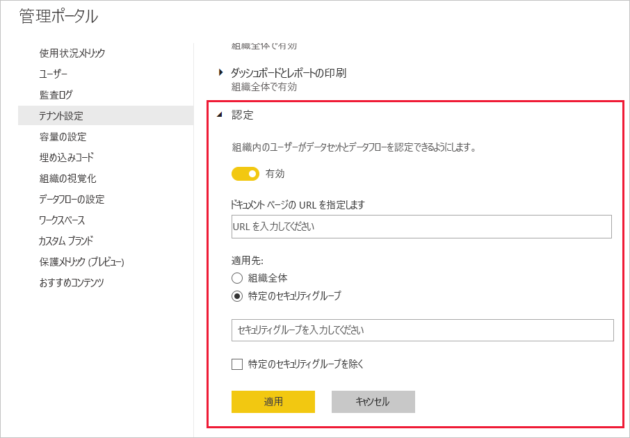

# データセットとデータフローの認定を設定する (プレビュー)

重要な情報の信頼できるソースであるデータセットとデータフローを、組織で認定することができます。

Power BI テナント管理者は、自分が所属する組織の認定プロセスを設定する責任があります。 そのため、次のようになります。
* ご利用のテナントで認定を有効にする。
* データセットとデータフローを認定する権限を持つグループとユーザーのリストを定義する。
* データセットの場合は、組織のデータセット認定ポリシーの URL を指定する (存在する場合)。

データセットとデータフローの認定は、データセットとデータフローの "*承認*" の一部となっています。 詳細については、[データセットの承認](../service-datasets-promote.md)および[データフローの承認](../transform-model/service-dataflows-promote-certify.md)に関するページを参照してください。

## 認定を設定する

1. 管理ポータルで、[テナント設定] に進みます。
1. [エクスポートと共有の設定] セクションで、[認定] セクションを展開します。

   

1. トグルを **[有効]** に設定します。
1. データセットの認定については、組織に発行済みの認定ポリシーがある場合は、ここでその URL を指定できます。 これは、[データフロー承認設定のダイアログ](../service-datasets-promote.md#request-dataset-certification)の認定セクションでは **[詳細情報]** リンクとなります。 
1. データセットとデータフローを認定する権限が与えられているユーザーまたはグループを指定します。 このような承認された認定者は、[データセット](../service-datasets-promote.md#request-dataset-certification)または[データフロー](../transform-model/service-dataflows-promote-certify.md#certify-a-dataflow)承認設定ダイアログの認定セクションにある [認定] ボタンを使用できるようになります。
1. **[適用]** をクリックします。

## 次の手順
* [データセットを推奨する](../service-datasets-promote.md)
* [データセットを認定する](../service-datasets-certify.md)
* [データフローを昇格させる](../transform-model/service-dataflows-promote-certify.md#promote-a-dataflow)
* [データフローを認定する](../transform-model/service-dataflows-promote-certify.md#certify-a-dataflow)
* わからないことがある場合は、 [Power BI コミュニティで質問してみてください](https://community.powerbi.com/)。
