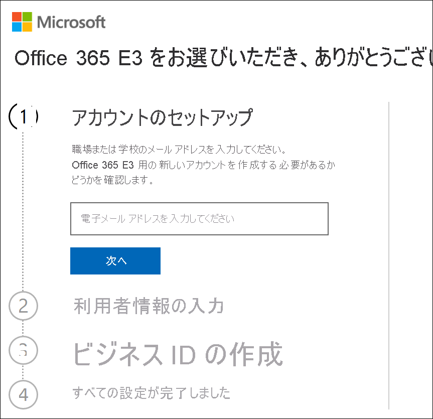
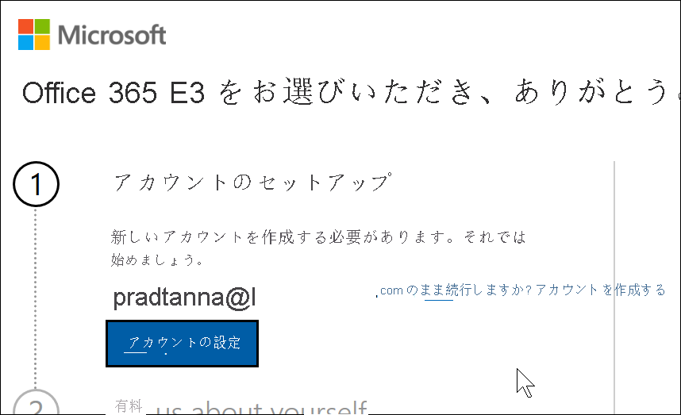
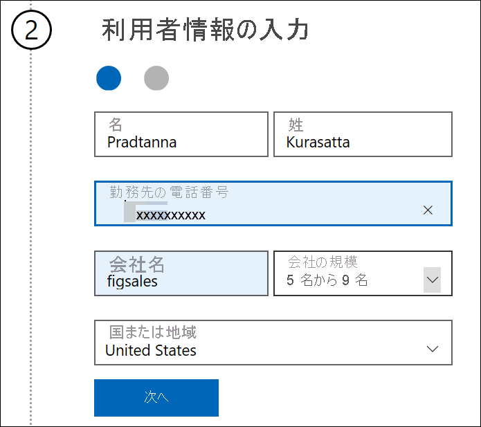
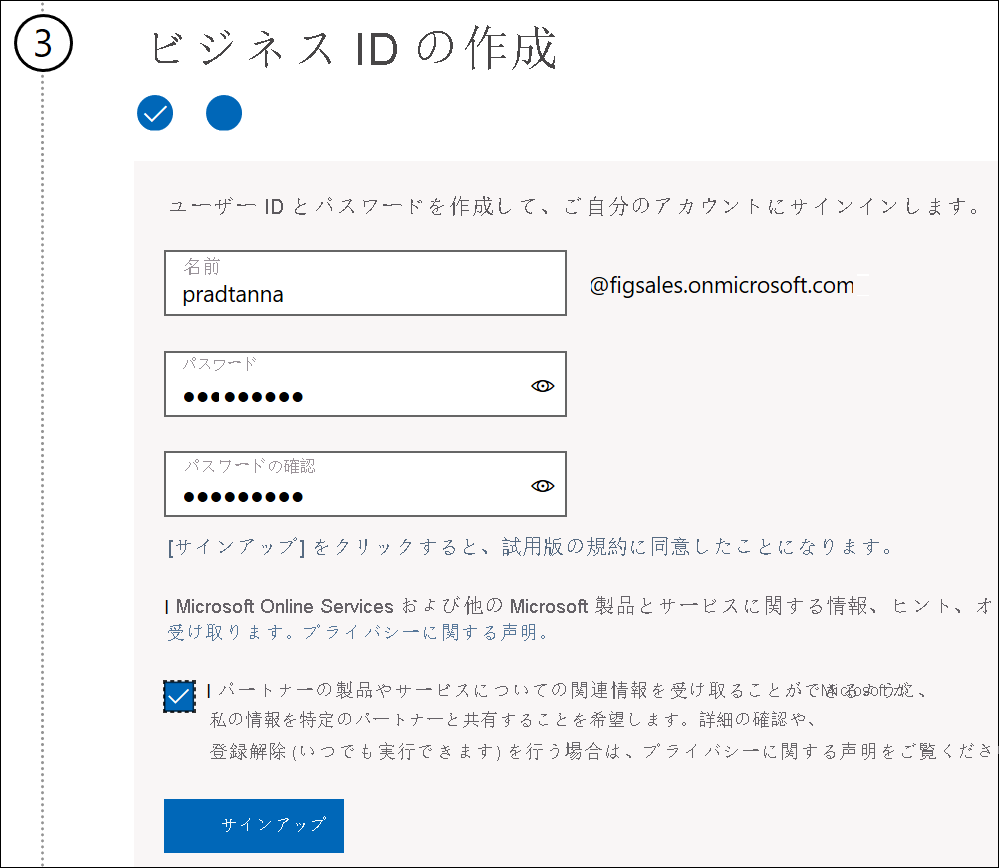
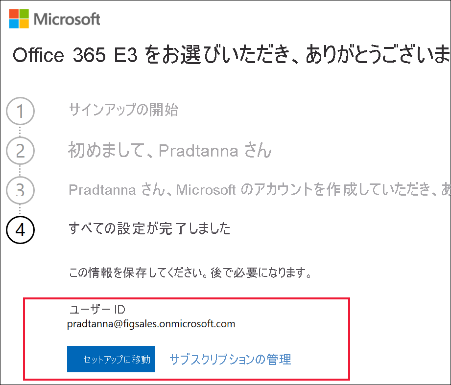

# 新しい Microsoft 365 試用版で Power BI にサインアップする

この記事では、職場または学校のメール アカウントをまだお持ちでない場合に、Power BI サービスにサインアップする別の方法について説明します。

メール アドレスで Power BI にサインアップしようとすると問題が発生する場合は、最初に、それが [Power BI で使用できるメール アドレス](../fundamentals/service-self-service-signup-for-power-bi.md#supported-email-addresses)であることを確認します。 それでうまくいかない場合は、Microsoft 365 試用版にサインアップして、職場アカウントを作成します。 次に、その新しい職場アカウントを使用して、Power BI サービスにサインアップします。 Microsoft 365 試用版の有効期限が切れた後でも Power BI を使用することができます。

## Office の Microsoft 365 試用版にサインアップする

[Microsoft 365 の Web サイト](https://www.microsoft.com/microsoft-365/business/compare-more-office-365-for-business-plans)で Microsoft 365 試用版にサインアップします。 まだアカウントをお持ちでない場合は、Microsoft によってアカウントを作成する手順が提示されます。 Microsoft 365 では商用の電子メール アカウント (Hotmail や Gmail など) を利用できないため、利用できる新しいアカウントを作成します。  その電子メール アカウントは、*zalan\@onmicrosoft.com* のようなものです。

![[無料で試す] を選択する](media/service-admin-signing-up-for-power-bi-with-a-new-office-365-trial/power-bi-try-free.png)

**Office 365 E5** を選択する場合は、試用版に Power BI Pro が含まれます。 Power BI Pro 試用版は Office 365 E5 試用版と同時に有効期限が切れます。現時点では 30 日間です。 代わりに **Office 365 E3** を選択する場合は、"*無料*" ユーザーとして Power BI にサインアップし、60 日間の試用版を試すために **Pro** にアップグレードできます。 

1. 電子メール アドレスを入力します。 そのメール アドレスを Microsoft 365 で利用できるか、または新しいメール アドレスを作成する必要があるかどうかが Microsoft によって示されます。  

    新しいメール アドレスが必要な場合は、Microsoft によってその手順が示されます。 最初の手順は、新しいアカウントを作成することです。 **[アカウントの設定]** を選択します。

    

2. 新しいアカウントに関する詳細情報を入力します。

    

3. 新しいメール アドレスとパスワードを作成します。 you@yourcompany.onmicrosoft.com のような、新しいサインイン名を作成します。 これが、新しい職場または学校アカウントと Power BI で使用するサインインになります。

    

4. これだけです。  以上で、Power BI へのサインアップに使用できるメール アドレスが作成されました。 「[個人として Power BI にサインアップする](../service-self-service-signup-for-power-bi.md)」に進んでください。

     

    新しいテナントが作成されるまでしばらくかかる場合があります。

## 重要な考慮事項

新しいアカウントでのサインインに問題がある場合は、プライベート ブラウザー セッションを使ってみてください。

このサインアップ方法を使うことは新しい組織のテナントを作っていることになり、そのテナントの管理者になることを意味します。 詳しくは、「[Power BI 管理とは](service-admin-administering-power-bi-in-your-organization.md)」をご覧ください。 [Microsoft 365 管理ドキュメント](https://support.office.com/article/Add-users-individually-to-Office-365---Admin-Help-1970f7d6-03b5-442f-b385-5880b9c256ec)で説明されているように、新しいユーザーを自分のテナントに追加してから、それらのユーザーと共有できます。

## 次の手順

[Power BI 管理とは](service-admin-administering-power-bi-in-your-organization.md)  
[組織での Power BI のライセンス](service-admin-licensing-organization.md)  
[個人として Power BI にサインアップする](../fundamentals/service-self-service-signup-for-power-bi.md)

他にわからないことがある場合は、 [Power BI コミュニティで質問してみてください](https://community.powerbi.com/)。
