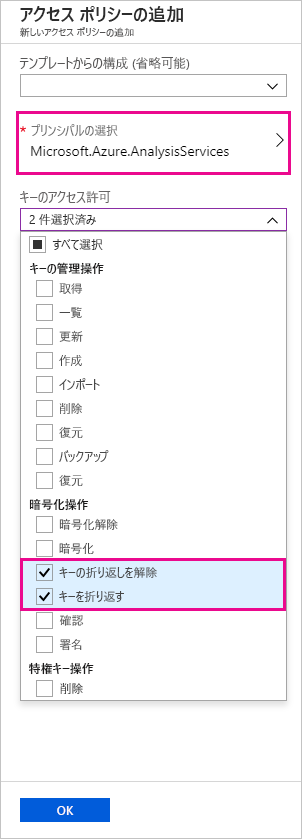
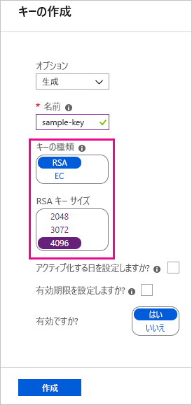
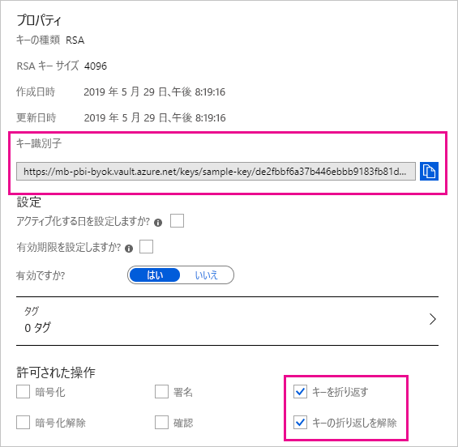

# <a name="bring-your-own-encryption-keys-for-power-bi"></a>Power BI で独自の暗号化キーを使用する

Power BI では、"_保存_" データと "_処理中_" のデータが暗号化されます。 既定では、Power BI で Microsoft マネージド キーを使用してデータを暗号化します。 Power BI Premium では、データセットにインポートされる、保存データに対して独自のキーを使用することもできます (詳細については、「[データ ソースとストレージに関する考慮事項](#data-source-and-storage-considerations)」を参照)。 このアプローチは多くの場合、_Bring Your Own Key_ (BYOK) と説明されます。

## <a name="why-use-byok"></a>BYOK を使用する理由

BYOK によって、クラウド サービス プロバイダー (この場合、Microsoft) でキー配置を指定するコンプライアンス要件を満たすことがより簡単になります。 BYOK では、アプリケーション レベルで Power BI の保存データ用の暗号化キーを提供し、制御します。 その結果、組織のキーを制御でき、サービスを終了することにした場合は、それを取り消すことができます。 キーを取り消すと、データは 30 分以内にサービスで読み取れなくなります。

## <a name="data-source-and-storage-considerations"></a>データ ソースとストレージに関する考慮事項

BYOK を使用するには、Power BI Desktop (PBIX) ファイルから Power BI サービスにデータをアップロードする必要があります。 次のシナリオでは、BYOK を使用することはできません。

- Analysis Services ライブ接続
- Excel ブック (データが最初に Power BI Desktop にインポートされる場合を除く)
- [プッシュ データセット](/rest/api/power-bi/pushdatasets)
- [ストリーミング データセット](../connect-data/service-real-time-streaming.md#set-up-your-real-time-streaming-dataset-in-power-bi)
- [大規模なモデル](service-premium-large-models.md)

BYOK はデータセットのみに該当します。 ユーザーがサービスにアップロードできる、プッシュ データセット、Excel ファイルおよび CSV ファイルはご自分のキーでは暗号化できません。 ご自分のワークスペースにどの成果物が格納されているかを識別するには、次の PowerShell コマンドを使用します。

```PS C:\> Get-PowerBIWorkspace -Scope Organization -Include All```

> [!NOTE]
> このコマンドレットでは、Power BI 管理モジュール v1.0.840 が必要です。 Get-InstalledModule -Name MicrosoftPowerBIMgmt を実行すると、どのバージョンを所持しているかを確認することができます。 最新バージョンをインストールするには、Install-Module -Name MicrosoftPowerBIMgmt を実行します。 Power BI のコマンドレットおよびそのパラメーターの詳細については、[Power BI PowerShell コマンドレット モジュール](https://docs.microsoft.com/powershell/power-bi/overview)に関するページを参照してください。

## <a name="configure-azure-key-vault"></a>Azure Key Vault を構成する

Azure Key Vault は、暗号化キーなどのシークレットを安全に格納し、そのシークレットにアクセスするためのツールです。このセクションではこのツールを構成するための方法を説明します。 既存のキー コンテナーを使って暗号化キーを格納することも、Power BI 専用の新しいものを作成することもできます。

このセクションの手順では、Azure Key Vault の基本的な知識があることを想定しています。 詳細については、「[Azure Key Vault とは](/azure/key-vault/key-vault-whatis)」を参照してください。 次のように、キー コンテナーを構成します。

1. 折り返しおよび折り返し解除のアクセス許可を使用して、キー コンテナーのサービス プリンシパルとして Power BI サービスを追加します。

1. 折り返しおよび折り返し解除のアクセス許可を使用して、長さが 4096 ビットの RSA キーを作成します (またはこの種の既存のキーを使用します)。

    > [!IMPORTANT]
    > Power BI BYOK では、4,096 ビット長の RSA キーのみがサポートされます。

1. 推奨:キー コンテナーで "_論理的な削除_" オプションが有効になっていることを確認します。

### <a name="add-the-service-principal"></a>サービス プリンシパルを追加する

1. Azure portal のお使いのキー コンテナーで、 **[アクセス ポリシー]** の **[新規追加]** を選択します。

1. **[プリンシパルの選択]** で、Microsoft.Azure.AnalysisServices を検索して選択します。

    > [!NOTE]
    > "Microsoft.Azure.AnalysisServices" が見つからない場合は、お使いの Azure Key Vault に関連付けられている Azure サブスクリプションにこれまで Power BI リソースが関連付けられていない可能性があります。 代わりに、次の文字列を検索してください: 00000009-0000-0000-c000-000000000000。

1. **[キーのアクセス許可]** で、 **[キーの折り返しを解除]** および **[キーを折り返す]** を選択します。

    

1. **[OK]** を選択し、 **[保存]** を選択します。

> [!NOTE]
> 将来、Power BI によるデータへのアクセスを取り消す場合、Azure Key Vault からこのサービス プリンシパルへのアクセス権限を削除します。

### <a name="create-an-rsa-key"></a>RSA キーを作成する

1. お使いのキー コンテナーの **[キー]** で、 **[生成/インポート]** を選択します。

1. **[キーの種類]** では RSA を、 **[RSA キー サイズ]** では 4096 を選択します。

    

1. **[作成]** を選択します。

1. **[キー]** で、作成したキーを選択します。

1. キーの **[現在のバージョン]** では、GUID を選択します。

1. **[キーを折り返す]** と **[キーの折り返しを解除]** の両方が選択されていることを確認します。 Power BI で BYOK を有効にしたときに使用する **[キー識別子]** をコピーします。

    

### <a name="soft-delete-option"></a>論理的な削除のオプション

誤ってキー (またはキー コンテナー) を削除した場合にデータの損失から保護するために、キー コンテナーで[論理的な削除](/azure/key-vault/key-vault-ovw-soft-delete)を有効にすることをお勧めします。 Azure portal からはまだこのオプションを使用できないため、キー コンテナーでは [PowerShell を使って "soft-delete" プロパティを有効にする](/azure/key-vault/key-vault-soft-delete-powershell)必要があります。

Azure Key Vault が正しく構成されたら、テナントで BYOK を有効にすることができます。

## <a name="enable-byok-on-your-tenant"></a>テナントで BYOK を有効にする

[PowerShell](https://www.powershellgallery.com/packages/MicrosoftPowerBIMgmt.Admin) を使用してテナント レベルで BYOK を有効にします。その場合、まず、Power BI テナントに、Azure Key Vault で作成して格納した暗号化キーを導入します。 その後、容量のコンテンツを暗号化するために、Premium 容量ごとにこれらの暗号化キーを割り当てます。

### <a name="important-considerations"></a>重要な考慮事項

BYOK を有効にする前に、次の考慮事項に注意してください。

- この時点では、BYOK を有効にした後で無効にすることはできません。 `Add-PowerBIEncryptionKey` のパラメーターを指定する方法に応じて、1 つまたは複数の容量に対して BYOK を使用する方法を制御できます。 しかし、テナントに対するキーの導入を元に戻すことはできません。 詳細については、「[BYOK を有効にする](#enable-byok)」を参照してください。

- 共有されている容量に、Power BI Premium の専用容量から BYOK を使用するワークスペースを "_直接_" 移動することはできません。 まず、BYOK が有効になっていない専用容量にワークスペースを移動する必要があります。

- Power BI Premium の専用容量から BYOK を使用するワークスペースを共有に移動した場合、キーで暗号化されているため、レポートとデータセットにはアクセスできなくなります。 この状況を回避するには、まず BYOK が有効になっていない専用容量にワークスペースを移動する必要があります。

### <a name="enable-byok"></a>BYOK を有効にする

BYOK を有効にするには、`Connect-PowerBIServiceAccount` コマンドレットを使用してサインインした、Power BI サービスのテナント管理者である必要があります。 その後、以下の例に示すように、[`Add-PowerBIEncryptionKey`](/powershell/module/microsoftpowerbimgmt.admin/Add-PowerBIEncryptionKey) を使用して BYOK を有効にします。

```powershell
Add-PowerBIEncryptionKey -Name'Contoso Sales' -KeyVaultKeyUri'https://contoso-vault2.vault.azure.net/keys/ContosoKeyVault/b2ab4ba1c7b341eea5ecaaa2wb54c4d2'
```

複数のキーを追加するには、`-Name` と `-KeyVaultKeyUri` に別の値を指定して `Add-PowerBIEncryptionKey` を実行します。 

コマンドレットでは、現在および今後の容量の暗号化に影響する、2 つのスイッチ パラメーターが受け入れられます。 既定では、どちらのスイッチも設定されていません。

- `-Activate`:このキーがまだ暗号化されていないテナント内の既存のすべての容量に対して使用されることを示します。

- `-Default`:このキーが現在、テナント全体の既定値であることを示します。 新しい容量を作成するときに、容量ではこのキーが継承されます。

> [!IMPORTANT]
> `-Default` を指定した場合、この時点からテナントで作成されたすべての容量が、指定するキー (または更新された既定のキー) を使用して暗号化されます。 既定の操作を元に戻すことはできません。したがって、BYOK が使用されない Premium 容量はテナントで作成できなくなります。

テナントで BYOK を有効にした後は、1 つまたは複数の Power BI 容量に対する暗号化キーを設定します。

1. 次のステップで必要な容量 ID を取得するには、[`Get-PowerBICapacity`](/powershell/module/microsoftpowerbimgmt.capacities/get-powerbicapacity) を使用します。

    ```powershell
    Get-PowerBICapacity -Scope Individual
    ```

    そのコマンドレットでは、次のような出力が返されます。

    ```
    Id              : xxxxxxxx-xxxx-xxxx-xxxx-xxxxxxxxxxxx
    DisplayName     : Test Capacity
    Admins          : adam@sometestdomain.com
    Sku             : P1
    State           : Active
    UserAccessRight : Admin
    Region          : North Central US
    ```

1. [`Set-PowerBICapacityEncryptionKey`](/powershell/module/microsoftpowerbimgmt.admin/set-powerbicapacityencryptionkey) を使用して、暗号化キーを設定します。

    ```powershell
    Set-PowerBICapacityEncryptionKey -CapacityId xxxxxxxx-xxxx-xxxx-xxxx-xxxxxxxxxxxx -KeyName 'Contoso Sales'
    ```

テナント全体で BYOK を使用する方法を制御することができます。 たとえば、単一の容量を暗号化するには、`-Activate` または `-Default` なしで `Add-PowerBIEncryptionKey` を呼び出します。 その後、BYOK を有効にする容量に対して、`Set-PowerBICapacityEncryptionKey` を呼び出します。

## <a name="manage-byok"></a>BYOK を管理する

Power BI では、テナントでの BYOK の管理に役立つ追加のコマンドレットが提供されます。

- 容量で現在使用されているキーを取得するには、[`Get-PowerBICapacity`](/powershell/module/microsoftpowerbimgmt.capacities/get-powerbicapacity) を次のように使用します。

    ```powershell
    Get-PowerBICapacity -Scope Organization -ShowEncryptionKey
    ```

- テナントで現在使用されているキーを取得するには、[`Get-PowerBIEncryptionKey`](/powershell/module/microsoftpowerbimgmt.admin/get-powerbiencryptionkey) を次のように使用します。

    ```powershell
    Get-PowerBIEncryptionKey
    ```

- ワークスペースのデータセットが暗号化されているかどうかと、その暗号化状態がワークスペースと同期されているかどうかを確認するには、[`Get-PowerBIWorkspaceEncryptionStatus`](/powershell/module/microsoftpowerbimgmt.admin/get-powerbiworkspaceencryptionstatus) を次のように使用します。

    ```powershell
    Get-PowerBIWorkspaceEncryptionStatus -Name'Contoso Sales'
    ```

    暗号化は容量レベルで有効になっていますが、暗号化状態は指定されたワークスペースのデータセット レベルで取得することに注意してくだささい。

- 暗号化に使用されているキーのバージョンを切り替える (または_回転_する) には、[`Switch-PowerBIEncryptionKey`](/powershell/module/microsoftpowerbimgmt.admin/switch-powerbiencryptionkey) を次のように使用します。 コマンドレットでは単にキー `-Name` の `-KeyVaultKeyUri` を更新します。

    ```powershell
    Switch-PowerBIEncryptionKey -Name'Contoso Sales' -KeyVaultKeyUri'https://contoso-vault2.vault.azure.net/keys/ContosoKeyVault/b2ab4ba1c7b341eea5ecaaa2wb54c4d2'
    ```


## <a name="next-steps"></a>次の手順

* [Power BI PowerShell コマンドレット モジュール](https://docs.microsoft.com/powershell/power-bi/overview) 

* [Power BI で作業を共有する方法](../collaborate-share/service-how-to-collaborate-distribute-dashboards-reports.md)

* [URL のクエリ文字列パラメーターを使用してレポートをフィルター処理する](../collaborate-share/service-url-filters.md)

* [SharePoint Online にレポート Web パーツを埋め込む](../collaborate-share/service-embed-report-spo.md)

* [Power BI から Web への公開](../collaborate-share/service-publish-to-web.md)

