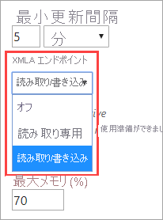
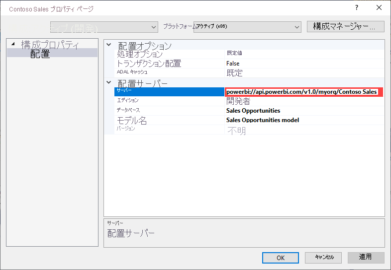
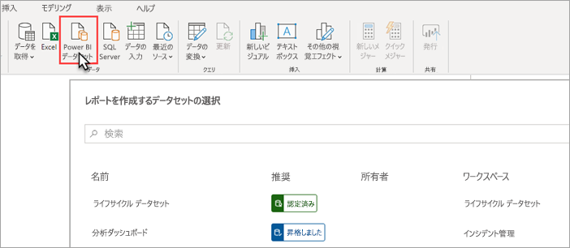

# XMLA エンドポイントを使用したデータセット接続 (プレビュー)

1,500 以上の互換性レベルの Power BI Premium ワークスペースとデータセットでは、"*XMLA エンドポイント*" を使用すると、Microsoft とサードパーティのクライアント アプリケーションおよびツールからのオープン プラットフォーム接続がサポートされます。

> [!NOTE]
> この機能は**プレビュー**の段階です。 プレビューの機能は、運用環境では使用できません。 特定の機能、サポート、ドキュメントは制限されています。  詳細については、[Microsoft オンライン サービス条件 (OST)](https://www.microsoft.com/licensing/product-licensing/products?rtc=1) を参照してください。

## XMLA エンドポイントとは

Power BI Premium では、クライアント アプリケーションと、ワークスペースおよびデータセットを管理するエンジンとの間の通信に、[XML for Analysis](https://docs.microsoft.com/analysis-services/xmla/xml-for-analysis-xmla-reference?view=power-bi-premium-current) (XMLA) プロトコルが使用されます。 これらの接続は、一般的に XMLA エンドポイントとして参照されるものを介しています。 XMLA は、内部にある Microsoft Analysis Services エンジンによって使用されるのと同じ通信プロトコルであり、Power BI のセマンティック モデル、ガバナンス、ライフサイクル、データ管理を実行します。

既定では、エンドポイントを使用した "*読み取り専用*" の接続が、容量のうち**データセット ワークロード**に対して有効になります。 読み取り専用のデータ可視化アプリケーションとツールでは、データセット モデルのデータ、メタデータ、イベント、スキーマに対してクエリを実行できます。 エンドポイントを使用した "*読み取り/書き込み*" 操作を有効にすると、追加のデータセット管理、ガバナンス、高度なセマンティック モデリング、デバッグ、監視を実現できます。 読み取り/書き込みを有効にすると、Power BI Premium データセットでは、Azure Analysis Services と SQL Server Analysis Services のエンタープライズ レベルの表形式モデリング ツールおよびプロセスとのパリティが向上します。

## データ モデリングと管理のツール

次に示すのは、Azure Analysis Services と SQL Server Analysis Services で使用される最も一般的なツールの一部です。これらが Power BI Premium データセットでサポートされるようになりました。

**Visual Studio と Analysis Services プロジェクト** – SQL Server Data Tools、または単に **SSDT** とも呼ばれる、Analysis Services 表形式モデル用のエンタープライズ レベル モデル作成ツールです。 Analysis Services プロジェクトの拡張機能は、Visual Studio 2017 以降のすべてのエディション (無料の Community Edition を含む) でサポートされています。 表形式モデルを Premium ワークスペースに配置するには、拡張機能バージョン 2.9.6 以降が必要です。 Premium ワークスペースに配置する場合、モデルは 1500 以上の互換性レベルである必要があります。 データセット ワークロードには、XMLA 読み取り/書き込みが必要です。 詳細については、「[Analysis Services 用のツール](https://docs.microsoft.com/analysis-services/tools-and-applications-used-in-analysis-services?view=power-bi-premium-current)」を参照してください。

**SQL Server Management Studio (SSMS)**  - DAX、MDX、XMLA のクエリがサポートされます。 [表形式モデルのスクリプト言語](https://docs.microsoft.com/analysis-services/tmsl/tabular-model-scripting-language-tmsl-reference) (TMSL) を使用して、データセット メタデータに対する粒度の細かい更新操作とスクリプト作成を実行します。 クエリ操作には読み取り専用が必要です。 メタデータをスクリプト化するには、読み取り/書き込みが必要です。 SSMS バージョン 18.4 以降が必要です。  [こちら](https://docs.microsoft.com/sql/ssms/download-sql-server-management-studio-ssms)からダウンロードすることができます。

**SQL Server Profiler** – SSMS と共にインストールされます。このツールによりサーバー イベントのトレースとデバッグが提供されます。 Profiler は、SQL Server では公式に非推奨になりましたが、引き続き SSMS に含まれており、Analysis Services と Power BI Premium で引き続きサポートされます。 XMLA 読み取り専用が必要です。 詳細については、 [Analysis Services 用の SQL Server Profiler](https://docs.microsoft.com/analysis-services/instances/use-sql-server-profiler-to-monitor-analysis-services?view=power-bi-premium-current) に関するページを参照してください。

**Analysis Services 配置ウィザード** – SSMS と共にインストールされます。このツールを使用すると、Visual Studio で作成した表形式モデル プロジェクトを Analysis Services および Power BI Premium のワークスペースに配置できます。 対話形式で実行することも、自動化するためにコマンド ラインから実行することもできます。 XMLA 読み取り/書き込みが必要です。 詳細については、[Analysis Services 配置ウィザード](https://docs.microsoft.com/analysis-services/deployment/deploy-model-solutions-using-the-deployment-wizard?view=power-bi-premium-current)に関するページを参照してください。

**PowerShell コマンドレット** – Analysis Services コマンドレットを使用して、更新操作などのデータセット管理タスクを自動化できます。 XMLA 読み取り/書き込みが必要です。 [SqlServer PowerShell モジュール](https://www.powershellgallery.com/packages/SqlServer/)のバージョン **21.1.18221** 以降が必要です。 Az.AnalysisServices モジュールの Azure Analysis Services コマンドレットは、Power BI Premium 用にはサポートされていません。 詳細については、「[Analysis Services PowerShell リファレンス](https://docs.microsoft.com/analysis-services/powershell/analysis-services-powershell-reference?view=power-bi-premium-current)」を参照してください。

**Power BI Report Builder** - ページ分割されたレポートを作成するためのツールです。 取得するデータ、それを取得する場所、表示方法を指定したレポート定義を作成します。 Report Builder でレポートをプレビューしてから、Power BI サービスにレポート発行することができます。 XMLA 読み取り専用が必要です。 詳細については、「 [Power BI レポート ビルダー](https://docs.microsoft.com/power-bi/report-builder-power-bi)」を参照してください。

**表形式エディター** - 直感的で軽量なエディターを使用して表形式モデルを作成、維持、管理するためのオープンソース ツールです。 階層ビューでは、表形式モデル内のすべてのオブジェクトが表示されます。 オブジェクトは、複数選択のプロパティ編集と DAX 構文の強調表示をサポートする表示フォルダーによって整理されます。 クエリ操作には XMLA 読み取り専用が必要です。 メタデータ操作には、読み取り/書き込みが必要です。 詳細については、[Tabular Editor](https://tabulareditor.github.io/) に関するページを参照してください。

**DAX Studio** – DAX の作成、診断、パフォーマンス チューニング、分析のためのオープンソース ツールです。 機能には、オブジェクトの参照、統合されたトレース、詳細な統計情報を含むクエリ実行の分析結果、DAX 構文の強調表示、書式設定などがあります。 クエリ操作には XMLA 読み取り専用が必要です。 詳細については、 [daxstudio.org](https://daxstudio.org/) に関するページを参照してください。

**ALM Toolkit** - アプリケーション ライフサイクル管理 (ALM) のシナリオで最もよく使用される、Power BI データセット用のオープンソースのスキーマ比較ツールです。 複数の環境全体で配置を実行し、増分更新の履歴データを保持します。 メタデータ ファイル、ブランチ、リポジトリを比較してマージします。 データセット間で共通の定義を再利用します。 クエリ操作には読み取り専用が必要です。 メタデータ操作には、読み取り/書き込みが必要です。 詳細については [ALM Toolkit](http://alm-toolkit.com/) に関するページを参照してください。

**Microsoft Excel** – Excel ピボットテーブルは、Power BI データセットの集計データを集計、分析、探索、表示するために使用される最も一般的なツールの 1 つです。 クエリ操作には読み取り専用が必要です。 クイック実行バージョンの Office 16.0.11326.10000 以降が必要です。

**サード パーティ** - Power BI Premium のデータセットに接続してクエリを実行し、データセットを使用できる、クライアント データ視覚化アプリケーションとツールが含まれます。 ほとんどのツールで最新バージョンの MSOLAP クライアント ライブラリが必要ですが、一部のツールでは ADOMD が使用される可能性があります。 読み取り専用 XMLA エンドポイントか読み取り/書き込み XMLA エンドポイントかは、操作によって異なります。

### クライアント ライブラリ

クライアント アプリケーションと XMLA エンドポイントとの間で直接通信は行われません。 代わりに、抽象化レイヤーとして "*クライアント ライブラリ*" が使用されます。 これは、アプリケーションから Azure Analysis Services と SQL Server Analysis Services への接続に使用されるのと同じクライアント ライブラリです。 Excel、SQL Server Management Studio (SSMS)、Visual Studio 向けの Analysis Services プロジェクト拡張機能などの Microsoft アプリケーションでは、3 つのクライアント ライブラリをすべてインストールし、それらを通常のアプリケーションおよび拡張機能の更新と共に更新します。 開発者は、クライアント ライブラリを使用してカスタム アプリケーションを構築することもできます。 場合によっては (特にサード パーティのアプリケーションでは)、アプリケーションと共にインストールされない場合は、より新しいバージョンのクライアント ライブラリをインストールすることが必要になる可能性があります。 クライアント ライブラリは、毎月更新されます。 詳細については、「 [Analysis Services に接続するためのクライアント ライブラリ](https://docs.microsoft.com/azure/analysis-services/analysis-services-data-providers)」を参照してください。

## サポートされる書き込み操作

データセット メタデータは、カスタム アプリケーションを構築する開発者向けに、表形式オブジェクト モデル (TOM) に基づくクライアント ライブラリを通じて公開されます。 これにより、Visual Studio と、表形式エディターなどのオープンソース コミュニティ ツールでは、Analysis Services エンジンでサポートされているが Power BI Desktop ではまだサポートされていない、追加のデータ モデリングおよび配置の機能を提供できるようになります。 追加のデータ モデリング機能は次のとおりです。

- 複雑なモデルの計算の再利用性と簡略化された使用のための、[計算グループ](https://docs.microsoft.com/analysis-services/tabular-models/calculation-groups?view=power-bi-premium-current)。

- 複数言語のレポートとデータセットをサポートするための、[メタデータの翻訳](https://docs.microsoft.com/analysis-services/tabular-models/translations-in-tabular-models-analysis-services?view=power-bi-premium-current)。

- データセット メタデータの的を絞ったビジネス ドメイン固有ビューを定義するための、[パースペクティブ](https://docs.microsoft.com/analysis-services/tabular-models/perspectives-ssas-tabular?view=power-bi-premium-current)。

オブジェクト レベルのセキュリティ (OLS) は、Power BI Premium データセットではまだサポートされていません。

## 書き込み操作用にデータセットを最適化する

書き込み操作でデータセット管理に XMLA エンドポイントを使用する場合は、大規模なモデルに対してデータセットを有効にすることをお勧めします。 これにより、書き込み操作のオーバーヘッドが軽減されるため、処理速度が大幅に向上します。 サイズ (圧縮後) が 1 GB を超えるデータセットの場合、違いは大きくなる可能性があります。 詳細については、「[Power BI Premium の大規模なモデル (プレビュー)](service-premium-large-models.md)」を参照してください。

## XMLA 読み取り/書き込みを有効にする

既定では、Premium 容量では、読み取り専用の XMLA エンドポイント プロパティ設定が有効になっています。 これは、アプリケーションでデータセットに対するクエリのみを実行できることを意味します。 アプリケーションで書き込み操作を実行するには、XMLA エンドポイントのプロパティで読み取り/書き込みが有効になっている必要があります。 容量の XMLA エンドポイント プロパティの設定は、**データセット ワークロード**で構成されます。 XMLA エンドポイントの設定は、容量に割り当てられた "*すべてのワークスペースとデータセット*" に適用されます。

### 容量の読み取り/書き込みを有効にするには

1. 管理ポータルで、 **[容量の設定]**  >  **[Power BI Premium]** > 容量の名前をクリックします。
2. **[ワークロード]** を展開します。 **[XMLA エンドポイント]** の設定で、 **[読み取り/書き込み]** を選択します。

    

## Premium ワークスペースに接続する

専用容量に割り当てられたワークスペースには、`powerbi://api.powerbi.com/v1.0/[tenant name]/[workspace name]` のような URL 形式の接続文字列があります。

ワークスペースに接続するアプリケーションでは、その URL を Analysis Services サーバー名と同様に使用します。 例: `powerbi://api.powerbi.com/v1.0/contoso.com/Sales Workspace`

(B2B ではなく) 同じテナント内に UPN を持つユーザーは、テナント名を `myorg` に置き換えることができます。 例:  `powerbi://api.powerbi.com/v1.0/myorg/Sales Workspace`。

### ワークスペースの接続 URL を取得するには

ワークスペースの **[設定]**  >  **[Premium]**  >  **[ワークスペース接続]** で、 **[コピー]** をクリックします。

## 接続の要件

### 初期カタログ

SQL Server Profiler などの一部のツールでは、"*初期カタログ*" を指定することが必要な場合があります。 自分のワークスペースでデータセット (データベース) を指定します。 **[サーバーに接続]** ダイアログの **[オプション]**  >  **[接続プロパティ]**  >  **[データベースへの接続]** で、データセット名を入力します。

### 重複するワークスペース名

Power BI の[新しいワークスペース](../collaborate-share/service-new-workspaces.md) (新しいワークスペース エクスペリエンスを使用して作成) では、名前が重複するワークスペースの作成または名前変更を禁止するために、検証が課されます。 移行されていないワークスペースでは、重複する名前が生成される可能性があります。 別のワークスペースと同じ名前でワークスペースに接続している場合、次のエラーが表示されることがあります:

**powerbi://api.powerbi.com/v1.0/[テナント名]/[ワークスペース名] に接続できません。**

このエラーを回避するには、ワークスペース名に加えて、ObjectIDGuid を指定します。これは URL のワークスペースの objectID からコピーできます。 objectID を接続 URL に追加します。 たとえば、  
'powerbi://api.powerbi.com/v1.0/myorg/Contoso Sales - 9d83d204-82a9-4b36-98f2-a40099093830' とします。

### 重複するデータセット名

同じワークスペース内の別のデータセットと同じ名前でデータセットに接続している場合、データセット GUID をデータセット名に追加します。 SSMS のワークスペースに接続されている場合、データセット名および GUID の両方を取得できます。

### データセットの表示の遅延

ワークスペースに接続している場合、新しいデータセット、削除されたデータセット、名前を変更したデータセットからの変更は、表示されるまで数分ほどかかることがあります。

### サポートされていないデータセット

次のデータセットは、XMLA エンドポイントからアクセスすることはできません。 次のデータセットは、SSMS のワークスペースやその他のツールには表示されません。

- Azure Analysis Services または SQL Server Analysis Services モデルへのライブ接続に基づくデータセット。 
- 別のワークスペース内の Power BI データセットへのライブ接続に基づくデータセット。 詳細については、「[ワークスペース全体のデータセットの概要](../connect-data/service-datasets-across-workspaces.md)」を参照してください。
- REST API を使用したプッシュ データでのデータセット
- Excel ブックのデータセット

## セキュリティ

容量管理者によって XMLA エンドポイント プロパティの読み取り/書き込みが有効になっていることに加えて、Power BI 管理ポータルでテナントレベルの **[データのエクスポート]** 設定が有効になっている必要があります。この設定も [Excel で分析] に必要です。

XMLA エンドポイントを使用してアクセスすると、ワークスペースまたはアプリのレベルで設定されたセキュリティ グループ メンバーシップが優先されます。

ワークスペースの共同作成者以上である場合は、データセットへの書き込みアクセス権を持っているため、Analysis Services データベース管理者と同等です。 これらのユーザーは、Visual Studio から新しいデータセットを配置し、SSMS で TMSL スクリプトを実行することができます。

サーバーレベルのトレースや、[EffectiveUserName](https://docs.microsoft.com/analysis-services/instances/connection-string-properties-analysis-services?view=power-bi-premium-current#bkmk_auth) 接続文字列プロパティを使用したユーザーの偽装などの、Analysis Services サーバー管理者としてのアクセス許可を必要とする操作は、現時点で Power BI Premium ではサポートされていません。

データセットに対して[ビルド](../connect-data/service-datasets-build-permissions.md) アクセス許可を持つ他のユーザーは、Analysis Services データベース閲覧者と同等です。 これらのユーザーは、データの使用と視覚化のためにデータセットに接続し、データセットを参照できます。 行レベル セキュリティ (RLS) 規則が適用され、内部データセットのメタデータを参照することはできません。

### モデル ロール

XMLA エンドポイントを介したデータセット メタデータでは、行レベル セキュリティ (RLS) フィルターの設定など、データセットからのモデル ロールの作成、変更、削除を行うことができます。 Power BI のモデル ロールは、RLS 用にのみ使用されます。 Power BI セキュリティ モデルを使用して、RLS 以外のアクセス許可を制御します。

XMLA エンドポイントを介してデータセット ロールを使用する場合は、次の制限事項が適用されます。

- **パブリック プレビューの間は、XMLA エンドポイントを使用してデータセットのロール メンバーシップを指定することはできません**。 代わりに、Power BI サービスの行レベル セキュリティのページでデータセットに対してロール メンバーを指定します。
- Power BI データセットに対して設定できるロールの唯一のアクセス許可は、読み取りアクセス許可です。 データセット ロールが存在するかどうかに関係なく、XMLA エンドポイントを介した読み取りアクセスには、データセットに対するビルド アクセス許可が必要です。 Power BI セキュリティ モデルを使用して、RLS 以外のアクセス許可を制御します。
- Power BI では、オブジェクトレベルのセキュリティ (OLS) 規則は現在サポートされていません。

### データ ソース資格情報を設定する

XMLA エンドポイントで指定されたメタデータを使用してデータ ソースへの接続を作成できますが、データ ソースの資格情報を設定することはできません。 代わりに、Power BI サービスのデータセットの設定ページで資格情報を設定できます。

### サービス プリンシパル

パブリック プレビュー中は、自動化のシナリオ用に[サービス プリンシパル](https://docs.microsoft.com/azure/active-directory/develop/app-objects-and-service-principals)を使用した XMLA エンドポイントとの接続は、まだサポートされていません。

## Visual Studio からモデル プロジェクトを配置する (SSDT)

Visual Studio での表形式モデル プロジェクトの Power BI Premium ワークスペースへの配置は、Azure または SQL Server Analysis Services サーバーへの配置とほとんど同じです。 唯一の違いは、プロジェクトに対して指定されている配置サーバーのプロパティと、データ ソースの資格情報を指定して、処理操作でデータ ソースからワークスペース上の新しいデータセットにデータをインポートできるようにする方法です。

> [!IMPORTANT]
> パブリック プレビューの間は、XMLA エンドポイントを使用するツールでロールのメンバーシップを指定することはできません。 モデル プロジェクトを配置できない場合は、どのロールにもユーザーが指定されていないことを確認してください。 モデルが正常に配置されたら、Power BI サービスでデータセット ロールにユーザーを指定します。 詳細については、この記事で前述した「[モデル ロール](#model-roles)」を参照してください。

Visual Studio で作成された表形式モデル プロジェクトを配置するには、まず、プロジェクトの **[配置サーバー]** プロパティでワークスペースの接続 URL を設定する必要があります。 Visual Studio の**ソリューション エクスプローラー**で、プロジェクトを右クリックして **[プロパティ]** を選択します。 **[サーバー]** プロパティにワークスペースの接続 URL を貼り付けます。

配置サーバーのプロパティが指定されたら、プロジェクトを配置することができます。

**初めて配置する場合**、model.bim 内のメタデータを使用してデータセットがワークスペース内に作成されます。 配置操作の一部として、ワークスペースにモデル メタデータからデータセットが作成された後、データ ソースからデータセットにデータを読み込む処理は失敗します。

処理が失敗する理由は、Azure または SQL Server 分析サーバー インスタンスに配置する場合 (データ ソースの資格情報が配置操作の一部として要求される) とは異なり、Premium ワークスペースに配置する場合は、データ ソースの資格情報を配置操作の一部として指定できないためです。 代わりに、メタデータの配置が正常に完了し、データセットが作成された後、データ ソースの資格情報が Power BI サービスのデータセットの設定で指定されます。 ワークスペースで、 **[データセット]**  >  **[設定]**  >  **[データ ソースの資格情報]**  >  **[資格情報の編集]** をクリックします。

データ ソースの資格情報を指定すると、Power BI サービス内でデータセットを更新したり、スケジュール更新を構成したり、データセットにデータを読み込むように SQL Server Management Studio から処理 (更新) したりすることができます。

Visual Studio でプロジェクトに指定されている配置の **[処理オプション]** プロパティが適用されます。 ただし、データ ソースに Power BI サービスで資格情報がまだ指定されていない場合、メタデータの配置が成功しても、処理は失敗します。 このプロパティを **[処理しない]** に設定し、配置の一部として処理しないようにすることができますが、このプロパティを**既定**の設定に戻すこともできます。新しいデータセットのデータ ソースの設定でデータ ソースの資格情報を指定すると、後続の配置操作の一部としての処理が成功するからです。

## SSMS との接続

SSMS を使用したワークスペースへの接続は、Azure または SQL Server Analysis Services サーバーへの接続と同じです。 唯一の違いは、[サーバー名] にワークスペースの URL を指定し、 **[Active Directory - MFA で汎用]** の認証を使用する必要があることです。

### SSMS を使用してワークスペースに接続する

1. SQL Server Management Studio で、 **[接続]**  >  **[サーバーに接続]** をクリックします。

2. **[サーバーの種類]** で **[Analysis Services]** を選択します。 **[サーバー名]** にワークスペースの URL を入力します。 **[認証]** で **[Active Directory - MFA で汎用]** を選択し、 **[ユーザー名]** に組織のユーザー ID を入力します。

    

接続されると、ワークスペースは Analysis Services サーバーとして表示され、ワークスペースのデータセットはデータベースとして表示されます。  

SSMS を使用してメタデータをスクリプト化する方法の詳細については、[Analysis Services スクリプトの作成](https://docs.microsoft.com/analysis-services/instances/create-analysis-services-scripts-in-management-studio?view=power-bi-premium-current)に関するページと、[表形式モデルのスクリプト言語 (TMSL)](https://docs.microsoft.com/analysis-services/tmsl/tabular-model-scripting-language-tmsl-reference?view=power-bi-premium-current) のページを参照してください。

## データセットの更新

XMLA エンドポイントにより、SSMS、PowerShell による自動化、[Azure Automation](https://docs.microsoft.com/azure/automation/automation-intro)、TOM を使用する [Azure Functions](https://docs.microsoft.com/azure/azure-functions/functions-overview) を使用した、きめ細かい更新機能を実現するための広範なシナリオが可能になります。 たとえば、すべての履歴データを再読み込みしなくても、特定の[増分更新](service-premium-incremental-refresh.md)履歴パーティションを更新できます。

Power BI サービスで更新を構成するのと異なり、XMLA エンドポイントを介した更新操作は、1 日 48 回の更新に制限されず、[スケジュールされた更新のタイムアウト](../connect-data/refresh-troubleshooting-refresh-scenarios.md#scheduled-refresh-timeout)も課されません。

## 動的管理ビュー (DMV)

Analysis Services の [DMV](https://docs.microsoft.com/analysis-services/instances/use-dynamic-management-views-dmvs-to-monitor-analysis-services) によって、データセットのメタデータ、系列、リソースの使用状況を把握できます。 XMLA エンドポイントを介して Power BI でクエリを実行するために使用できる DMV は、必要な最大限のアクセス許可がデータベース管理者のアクセス許可であるものに限定されます。 たとえば一部の DMV は、Analysis Services サーバー管理者のアクセス許可が必要とされるため、アクセスできません。

## Power BI Desktop で作成されたデータセット

### 拡張メタデータ

Power BI Desktop で作成され、Premium ワークスペースに発行されたデータセットに対する XMLA 書き込み操作のためには、拡張メタデータを有効にする必要があります。 詳細については、[拡張データセット メタデータ](../connect-data/desktop-enhanced-dataset-metadata.md)に関するページを参照してください。

> [!CAUTION]
> 現時点では、Power BI Desktop で作成されたデータセットに対する書き込み操作によって、データセットを PBIX ファイルとしてダウンロードし直すことはできません。 必ず元の PBIX ファイルを残しておいてください。

### データ ソース宣言

データ ソースに接続してデータのクエリを実行する場合、Power BI Desktop では、Power Query M 式がインライン データ ソース宣言として使用されます。 Power Query M インライン データ ソース宣言は、Power BI Premium ワークスペースでサポートされていますが、Azure Analysis Services または SQL Server Analysis Services ではサポートされていません。 代わりに、Visual Studio のような Analysis Services データ モデリング ツールで、"*構造化*" データ ソース宣言または "*プロバイダー*" データ ソース宣言 (あるいはその両方) を使用してメタデータを作成します。 XMLA エンドポイントを使用することで、Power BI Premium で構造化データ ソースとプロバイダー データ ソースもサポートされますが、Power BI Desktop モデルの Power Query M インライン データ ソース宣言の一部としてはサポートされません。 詳細については、「[プロバイダーについて](https://docs.microsoft.com/azure/analysis-services/analysis-services-datasource#understanding-providers)」を参照してください。

### ライブ接続モードの Power BI Desktop

Power BI Desktop は、ライブ接続を使用して Power BI Premium データセットに接続できます。 ライブ接続を使用する場合、データをローカルにレプリケートする必要がないため、セマンティック モデルをユーザーが簡単に使用できるようになります。 ユーザーは、次の 2 つの方法で接続できます。

**[Power BI データセット]** を選択し、レポートを作成するデータセットを選択します。 これは、ユーザーがデータセットにライブ接続するために**推奨される**方法 です。 この方法では、データセットの推奨レベルを示す検出エクスペリエンスが向上します。 ユーザーはワークスペースの URL を検索して追跡する必要がありません。 データセットを検索するには、ユーザーはデータセットの名前を入力するか、探しているデータセットを見つけるためにスクロールするだけで済みます。

ユーザーが接続できるもう 1 つの方法としては **[データの取得]**  >  **[Analysis Services]** を使用し、URL として Power BI Premium ワークスペース名を指定してから、 **[ライブ接続]** を選択し、ナビゲーターでデータセットを選択する方法があります。 この場合、Power BI Desktop は XMLA エンドポイントを使用して、Analysis Services データ モデルと同じようにデータセットにライブ接続します。 

Power BI Premium データセットへの移行が必要な Analysis Services データ モデルにライブ接続されている既存のレポートを持っている組織は、 **[データの変換]**  >  **[データ ソース設定]** でサーバー名の URL を変更するだけで済みます。

> [!NOTE]
> XMLA の読み取り/書き込みパブリック プレビューでは、Power BI Desktop を使用して、 **[データの取得]**  >  **[Analysis Services]** を使用し、 **[ライブ接続]** オプションを使用して Power BI Premium データ セットに接続した場合、Power BI サービスへのレポートのパブリッシュはまだサポートされていません。

## 監査ログ

アプリケーションからワークスペースに接続する場合、XMLA エンドポイントからのアクセスは、以下の操作について Power BI 監査ログに記録されます。

|操作のフレンドリ名   |操作名   |
|---------|---------|
|外部アプリケーションから Power BI データセットに接続しました      |  ConnectFromExternalApplication        |
|外部アプリケーションから Power BI データセットの更新を要求しました      | RefreshDatasetFromExternalApplication        |
|外部アプリケーションから Power BI データセットを作成しました      |  CreateDatasetFromExternalApplication        |
|外部アプリケーションから Power BI データセットを編集しました     |  EditDatasetFromExternalApplication        |
|外部アプリケーションから Power BI データセットを削除しました      |  DeleteDatasetFromExternalApplication        |

詳細については [Power BI の監査](service-admin-auditing.md)に関するページを参照してください。

## 関連項目

他にわからないことがある場合は、 [Power BI コミュニティで質問してみてください](https://community.powerbi.com/)。

