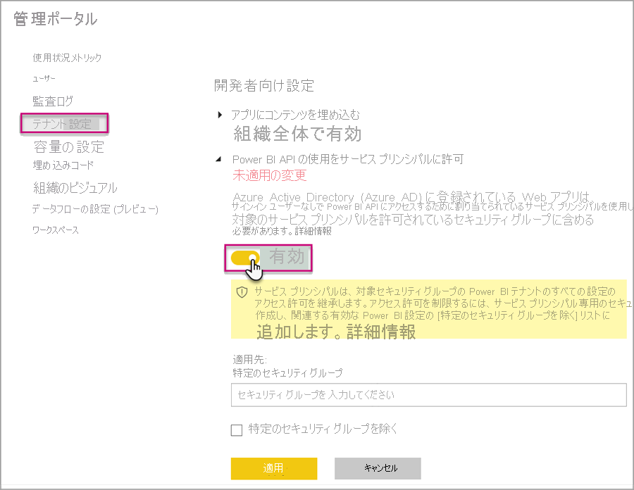
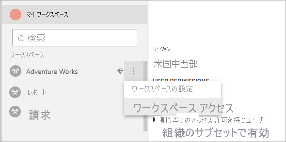

# <a name="automate-premium-workspace-and-dataset-tasks-with-service-principals"></a>サービス プリンシパルを使用して Premium ワークスペースとデータセットのタスクを自動化する

サービス プリンシパルは、リソースおよびサービス レベルの操作を自動で実行するためにテナント内に作成する Azure Active Directory の "*アプリの登録*" です。 これは一意の種類のユーザー ID で、アプリ名、アプリケーション ID、テナント ID、およびパスワード用の "*クライアント シークレット*" または証明書を含みます。

Power BI Premium では、Power BI Embedded と同じサービス プリンシパル機能が使用されています。 詳細については、[サービス プリンシパルを使用した Power BI コンテンツの埋め込み](../developer/embedded/embed-service-principal.md)に関する記事をご覧ください。

**Power BI Premium** では、サービス プリンシパルを [XMLA エンドポイント](service-premium-connect-tools.md)と共に使用して、以下でワークスペースのプロビジョニング、モデルのデプロイ、データセットの更新などのデータセット管理タスクを自動化することもできます。

- PowerShell
- Azure Automation
- Azure Logic Apps
- カスタム クライアント アプリケーション

サービス プリンシパルは、XMLA エンドポイントで[新しいワークスペース](../collaborate-share/service-new-workspaces.md)に対してのみ使用できます。 従来のワークスペースはサポートされていません。 サービス プリンシパルには、割り当てられたワークスペースのタスクを実行するために必要なアクセス許可のみが与えられます。 アクセス許可は、通常の UPN アカウントと同様に、ワークスペース アクセスを通じて割り当てられます。

書き込み操作を実行するには、容量の**データセット ワークロード**で[読み取りと書き込みに対して XMLA エンドポイントが有効になっている](service-premium-connect-tools.md#enable-xmla-read-write)必要があります。 Power BI Desktop から発行されたデータセットでは、[拡張メタデータ形式](../connect-data/desktop-enhanced-dataset-metadata.md)機能が有効になっている必要があります。

> [!NOTE]
> Power BI Premium の XMLA エンドポイント機能は**プレビュー段階**です。 プレビュー段階の機能は、運用環境では使用しないでください。 特定の機能、サポート、ドキュメントは制限されています。  詳細については、[Microsoft オンライン サービス条件 (OST)](https://www.microsoft.com/licensing/product-licensing/products?rtc=1) を参照してください。

## <a name="create-a-service-principal"></a>サービス プリンシパルの作成

サービス プリンシパルは Azure portal でアプリの登録として作成するか、PowerShell を使用して作成します。 サービス プリンシパルを作成するときは、アプリ名、アプリケーション (クライアント) ID、ディレクトリ (テナント) ID、およびクライアント シークレットを別々にコピーして保存してください。 サービス プリンシパルを作成する手順については、以下を参照してください。

[サービス プリンシパルを作成する - Azure Portal](https://docs.microsoft.com/azure/active-directory/develop/howto-create-service-principal-portal)   
[サービス プリンシパルを作成する - PowerShell](https://docs.microsoft.com/azure/active-directory/develop/howto-authenticate-service-principal-powershell)

## <a name="create-an-azure-ad-security-group"></a>Azure AD セキュリティ グループを作成する

既定では、サービス プリンシパルにはそれが有効にされたテナント設定へのアクセス権があります。 ご利用の管理者設定に応じて、特定のセキュリティ グループまたは組織全体へのアクセス権を付与することができます。

サービス プリンシパルのアクセス権を特定のテナント設定に制限するには、特定のセキュリティ グループに対するアクセスを許可できます。 あるいは、サービス プリンシパル専用のセキュリティ グループを作成し、それを目的のテナント設定から除外することもできます。 セキュリティ グループを作成してサービス プリンシパルを追加する手順については、「[Azure Active Directory を使用して基本グループを作成してメンバーを追加する](https://docs.microsoft.com/azure/active-directory/fundamentals/active-directory-groups-create-azure-portal)」をご覧ください。

## <a name="enable-service-principals"></a>サービス プリンシパルを有効にする

Power BI でサービス プリンシパルを使用する前に、管理者はまず、Power BI 管理ポータルでサービス プリンシパルのアクセス権を有効にする必要があります。

Power BI の **[管理ポータル]**  >  **[テナント設定]** で、 **[Power BI API の使用をサービス プリンシパルに許可]** を展開してから **[有効]** をクリックします。 セキュリティ グループにアクセス許可を適用するには、 **[特定のセキュリティ グループ]** にそのグループ名を追加します。



## <a name="workspace-access"></a>ワークスペース アクセス

Premium ワークスペースとデータセットの操作を実行するために必要なアクセス許可をサービス プリンシパルに付与するには、ワークスペースのメンバーまたは管理者としてサービス プリンシパルを追加する必要があります。ここでは Power BI サービスでのワークスペース アクセスの使用について説明しますが、[グループ ユーザーの追加 REST API](https://docs.microsoft.com/rest/api/power-bi/groups/addgroupuser) を使用することもできます。

1. Power BI サービスで、ワークスペースに対して **[詳細]**  >  **[ワークスペース アクセス]** を選択します。

    

2. アプリケーション名で検索し、**管理者**または**メンバー**としてワークスペースにサービス プリンシパルを追加します。

    

## <a name="connection-strings-for-the-xmla-endpoint"></a>XMLA エンドポイント用の接続文字列

サービス プリンシパルを作成し、テナントに対してサービス プリンシパルを有効にし、サービス プリンシパルをワークスペース アクセスに追加したら、XMLA エンドポイントでの接続文字列でそれをユーザー ID として使用できます。 違いは、ユーザー ID とパスワードのパラメーターに、アプリケーション ID、テナント ID、およびアプリケーション シークレットを指定することです。

`Data Source=powerbi://api.powerbi.com/v1.0/myorg/<workspace name>; Initial Catalog=<dataset name>;User ID=app:<appId>@<tenantId>;Password=<app_secret>;`

### <a name="powershell"></a>PowerShell

#### <a name="using-sqlserver-module"></a>SQLServer モジュールの使用

次の例では、データセットの更新操作を認証するために AppId、TenantId、および AppSecret が使用されています。

```powershell
Param (
        [Parameter(Mandatory=$true)] [String] $AppId,
        [Parameter(Mandatory=$true)] [String] $TenantId,
        [Parameter(Mandatory=$true)] [String] $AppSecret
       )
$PWord = ConvertTo-SecureString -String $AppSecret -AsPlainText -Force

$Credential = New-Object -TypeName "System.Management.Automation.PSCredential" -ArgumentList $AppId, $PWord

Invoke-ProcessTable -Server "powerbi://api.powerbi.com/v1.0/myorg/myworkspace" -TableName "mytable" -Database "mydataset" -RefreshType "Full" -ServicePrincipal -ApplicationId $AppId -TenantId $TenantId -Credential $Credential
```

### <a name="amo-and-adomd"></a>AMO と ADOMD

クライアント アプリケーションや Web アプリと接続するとき、[AMO と ADOMD のクライアント ライブラリ](https://docs.microsoft.com/azure/analysis-services/analysis-services-data-providers) バージョン 15.0.2 以降の、NuGet からインストールできるパッケージでは、接続文字列にサービス プリンシパルを指定できます。構文 `app:AppID` とパスワードまたは `cert:thumbprint` を利用します。

次の例では、`appID` と `password` を使用し、モデル データベース更新操作を実行します。

```csharp
string appId = "xxx";
string authKey = "yyy";
string connString = $"Provider=MSOLAP;Data source=powerbi://api.powerbi.com/v1.0/<tenant>/<workspacename>;Initial catalog=<datasetname>;User ID=app:{appId};Password={authKey};";
Server server = new Server();
server.Connect(connString);
Database db = server.Databases.FindByName("adventureworks");
Table tbl = db.Model.Tables.Find("DimDate");
tbl.RequestRefresh(RefreshType.Full);
db.Model.SaveChanges();
```

## <a name="next-steps"></a>次の手順

[XMLA エンドポイントを使用したデータセット接続](service-premium-connect-tools.md)  
[Azure Automation](https://docs.microsoft.com/azure/automation)  
[Azure Logic Apps](https://docs.microsoft.com/azure/logic-apps/)  
[Power BI REST API](https://docs.microsoft.com/rest/api/power-bi/)
