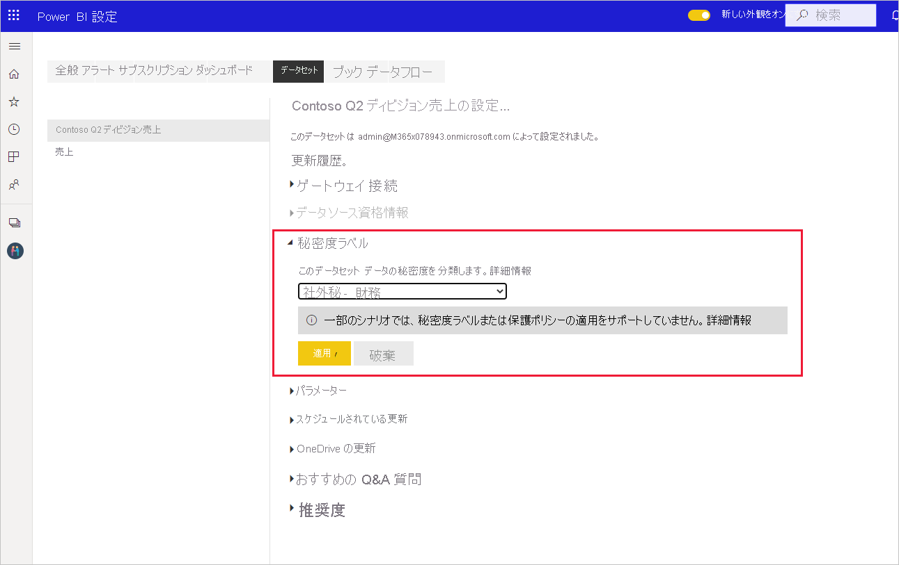

# Power BI で秘密度ラベルを適用する方法

Microsoft Information Protection のレポート、ダッシュボード、データセット、データフローの秘密度ラベルでは、無許可のデータ アクセスや漏洩から秘密コンテンツを保護できます。 秘密度ラベルを使用してデータに正しくラベルを付けると、承認されたユーザーのみがデータにアクセスできるようになります。 この記事では、秘密度ラベルをコンテンツに適用する方法について説明します。

Power BI で秘密度ラベルを適用できるようにするには:
* ユーザーは、Power BI Pro ライセンスと、ラベルを付けるコンテンツに対する編集アクセス許可を持っている必要があります。
* ユーザーは、秘密度ラベルを適用するためのアクセス許可を持つセキュリティ グループに属している必要があります。詳しくは、[Power BI 内で秘密度ラベルを有効にする方法](./service-security-enable-data-sensitivity-labels.md)に関する記事を参照してください。
* すべての[ライセンスとその他の要件](./service-security-enable-data-sensitivity-labels.md#licensing-and-requirements)を満たしている必要があります。

秘密度ラベルの詳細については、「[Power BI における秘密度ラベル](service-security-sensitivity-label-overview.md)」を参照してください。

## 秘密度ラベルを適用する

テナントでデータ保護が有効になっていると、ダッシュボード、レポート、データセット、データフローのリスト ビューの秘密度列に秘密度ラベルが表示されます。

**レポートまたはダッシュボードの秘密度ラベルを適用または変更するには**
1. **[その他のオプション (…)]** をクリックします。
1. **[設定]** を選択します。
1. 横にある設定ウィンドウで適切な秘密度ラベルを選択します。
1. 設定を保存します。

次の画像は、レポートでの手順を図示したものです。

**データセットまたはデータフローの秘密度ラベルを適用または変更するには**

1. **[その他のオプション (…)]** をクリックします。
1. **[設定]** を選択します。
1. 横にある設定ウィンドウで適切な秘密度ラベルを選択します。
1. 設定を適用します。

次の 2 つの画像は、データセットでの手順を図示したものです。

**[その他のオプション (…)]** を選択し、 **[設定]** を選択します。

設定ページで、秘密度ラベル セクションを開き、目的の秘密度ラベルを選択し、 **[適用]** をクリックします。

## 秘密度ラベルの削除
レポート、ダッシュボード、データセット、またはデータフローから秘密度ラベルを削除する場合は、[ラベルの適用で使用するのと同じ手順](#applying-sensitivity-labels)に従いますが、データの秘密度を分類するように求められたら、 **(なし)** を選択してください。 

## 考慮事項と制限事項

Power BI における秘密度ラベルの制限一覧については、「[Power BI における秘密度ラベル](service-security-sensitivity-label-overview.md#limitations)」を参照してください。

## 次の手順

この記事では、Power BI で秘密度ラベルを適用する方法を説明しました。 次の記事では、Power BI におけるデータ保護の詳細について説明しています。 

* [Power BI の秘密度ラベルの概要](./service-security-sensitivity-label-overview.md)
* [Power BI で秘密度ラベルを有効にする](./service-security-enable-data-sensitivity-labels.md)
* [Power BI 内で Microsoft Cloud App Security の制御を使用する](./service-security-using-microsoft-cloud-app-security-controls.md)