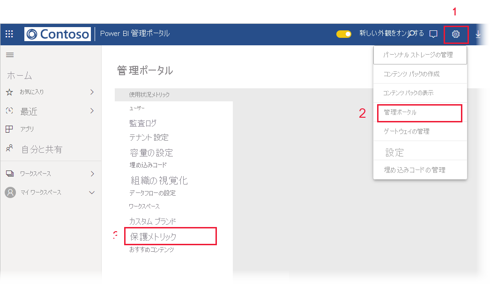

# データ保護メトリック レポート (プレビュー)

## データ保護メトリック レポートとは
データ保護メトリック レポートは、[Power BI 管理者](../service-admin-role.md)が、テナントでのデータ秘密度ラベルの使用と導入を監視および追跡するために使用できる、専用のレポートです。

 
レポート機能:
* 過去 7 日間、30 日間、または 90 日間の、テナントにおける 1 日の秘密度ラベルの使用状況を示す 100% 積み上げ縦棒グラフ。 このグラフにより、時間の経過に伴うさまざまなラベルの種類の相対的な使用状況を簡単に追跡できます。
* テナントにおけるダッシュボード、レポート、データセット、およびデータフローの秘密度ラベルの使用状況の現在の状態を示すドーナツ グラフ。
* Cloud App Security ポータルへのリンク。ここから Power BI アラート、危険な状態のユーザー、アクティビティ ログ、およびその他の情報が入手できます。 詳細については、「[Power BI で Microsoft Cloud App Security の制御を使用する (プレビュー)](./service-security-using-microsoft-cloud-app-security-controls.md)」を参照してください。

レポートは 24 時間ごとに更新されます。

## データ保護メトリック レポートを表示する

レポートを開いて表示するには、[Power BI 管理者の役割](../service-admin-role.md)が必要です。
レポートを表示するには、 **[設定]、[管理ポータル]** の順にアクセスし、 **[保護メトリック (プレビュー)]** を選択します。

 
 
データ保護メトリック レポートを初めて開くときには、読み込みに数秒かかることがあります。 ご使用のプライベート環境の [マイ ワークスペース] の下に、**データ保護メトリック (自動的に生成)** というタイトルのレポートとデータセットが作成されます。 これはフル機能のレポートではないため、ここでは表示しないでください。 代わりに、前述のように、管理ポータルでレポートを表示します。

> [!CAUTION]
> レポートまたはデータセットは決して変更しないでください。時々、新しいバージョンのレポートがロールアウトされ、新しいバージョンに更新すると、元のレポートに加えた変更が上書きされるからです。

## レポートの更新

データ保護メトリック レポートの強化されたバージョンは、定期的にリリースされます。 レポートを開いたときに新しいバージョンが使用可能な場合は、新しいバージョンを開くかどうかを確認するメッセージが表示されます。 [はい] を選択すると、新しいバージョンのレポートが読み込まれ、古いバージョンが上書きされます。 古いレポートやデータセットに行った変更はすべて失われます。 新しいバージョンを開かないように選択することもできますが、その場合は、新しいバージョンの機能強化による恩恵を受けられなくなります。 
## 注意事項と考慮事項
* データ保護メトリック レポートが正常に生成されるようにするには、テナントで[情報保護](./service-security-enable-data-sensitivity-labels.md)が有効になっていて、[秘密度ラベルが適用されている](../designer/service-security-apply-data-sensitivity-labels.md)必要があります。 
* Cloud App Security 情報にアクセスするには、組織に適切な [Cloud App Security ライセンス](https://docs.microsoft.com/power-bi/admin/service-security-using-microsoft-cloud-app-security-controls#microsoft-cloud-app-security-licensing)が必要です。
* データ保護メトリック レポートから Power BI 管理者以外のユーザーと情報を共有する場合、このレポートには組織に関する機密情報が含まれていることに注意してください。
* データ保護メトリック レポートは特殊なレポートであり、[自分と共有]、[最近使用]、[お気に入り] の一覧には表示されません。
* データ保護メトリック レポートは、[外部ユーザー (Azure Active Directory B2B ゲスト ユーザー) は使用できません](../service-admin-azure-ad-b2b.md)。
## 次のステップ
* [Power BI におけるデータ保護 (プレビュー)](./service-security-data-protection-overview.md)
* [Power BI で Microsoft Cloud App Security の制御を使用する (プレビュー)](./service-security-using-microsoft-cloud-app-security-controls.md)
* [Power BI サービス管理者の役割について](../service-admin-role.md)
* [Power BI 内でデータの秘密度ラベルを有効にする](./service-security-enable-data-sensitivity-labels.md)