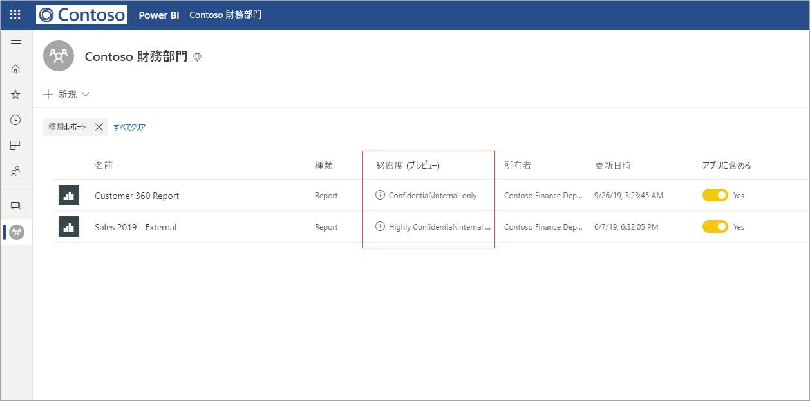
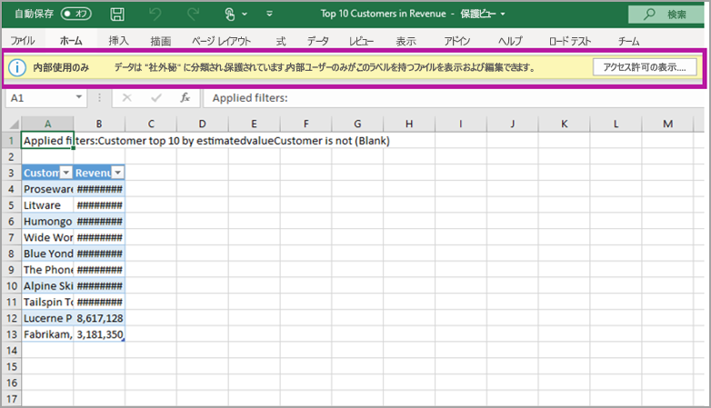

# Power BI におけるデータ保護 (プレビュー)

革新的な企業には、自社の機密データを処理および保護する方法に関してビジネス上の厳格な規制と要件があります。 Power BI を Microsoft Information Protection および Microsoft Cloud App Security と統合することにより、Power BI 内で機密データを詳細に管理し、可視性を向上させることができます。 

Power BI のデータ保護を使用すると、次のことが可能です。

* Microsoft の秘密度ラベルを使用して Power BI サービス (ダッシュボード、レポート、データセット、データフロー) のコンテンツの分類およびラベル付けを行う。Office 365 内でファイルの分類と保護に使用する分類と同じものを使用します。 

* コンテンツの秘密度ラベルと保護を適用することで、Power BI サービスからファイルにデータをエクスポートしたときに、暗号化や透かしなどの保護設定を適用する (Excel、PowerPoint、PDF)。 

  たとえば、ユーザーは Power BI のレポートに社外秘ラベルを適用できます。 そうすると、データを Excel ファイルにエクスポートしたときに、Power BI によってファイルに社外秘ラベルが適用されます。 このラベルにより、コンテンツを暗号化し、社外秘の透かしを適用することができます。

* Microsoft Cloud App Security を使用して、Power BI 内のアクティビティの監視、セキュリティの問題の調査、Microsoft Cloud App Security のアプリの条件付きアクセス制御を利用した Power BI 内のコンテンツの保護を行う。 

## Power BI における秘密度ラベル

秘密度ラベルは、[Microsoft 365 セキュリティ センター](https://security.microsoft.com/)または [Microsoft 365 コンプライアンス センター](https://compliance.microsoft.com/)内で作成および管理します。

これらのセンターのどちらかで秘密度ラベルにアクセスするには、 **[分類] > [秘密度ラベル]** に移動します。 これらの秘密度ラベルは、Azure Information Protection、Office アプリ、Office 365 サービスなど、複数の Microsoft サービスで使用できます。

> [!IMPORTANT]
> Azure Information Protection のユーザーが Power BI 内で秘密度ラベルを使用するには、ラベルを前述のサービスのいずれかに移行する必要があります。 また、秘密度ラベルはパブリック クラウド内でのみサポートされており、ソブリン クラウドなどのクラウド内のテナントではサポートされていません。
>
> [Microsoft Information Protection への秘密度ラベルの移行](https://docs.microsoft.com/azure/information-protection/configure-policy-migrate-labels)の詳細を確認してください。

## 秘密度ラベルのしくみ

Power BI のダッシュボード、レポート、データセット、またはデータフローに秘密度ラベルを適用すると、そのリソースに "*タグ*" を適用する場合と同じように、次の利点が得られます。
* **カスタマイズ可能** - 個人用、公開、一般、社外秘、極秘など、組織内にあるさまざまなレベルの機密コンテンツのカテゴリを作成できます。
* **クリア テキスト** - ラベルはクリア テキストであるため、ユーザーは秘密度ラベルのガイドラインに従ってコンテンツの取り扱い方を簡単に理解できます。
* **永続的** - 秘密度ラベルをコンテンツに適用した後に、サポートされている次のファイルの種類にそのコンテンツをエクスポートすると、コンテンツにそのラベルが付いて行きます。Excel、PowerPoint、PDF。 

  つまり、秘密度ラベルは、その保護設定を含めて、コンテンツに付いて行き、ポリシーを適用して徹底するための基盤となります。 

## 秘密度ラベルの例 

Power BI における秘密度ラベルのしくみは、簡単に説明すると次の例のようになります。

1. Power BI サービスでは、**極秘 - 内部のみ**という秘密度ラベルがレポートに適用されています。

   

2. このレポートから Excel ファイルにデータをエクスポートすると、エクスポートした Excel ファイルに秘密度ラベルと保護が適用されます。

   

Microsoft Office アプリケーションの場合、秘密度ラベルは、上の画像のように、メールやドキュメントに対するタグとして表示されます。

また、コンテンツには、使用したり共有したりする場合に、そのコンテンツに保持され、付いて回る (ステッカーのような) 分類を割り当てることもできます。 この分類を使用して、使用状況レポートを生成し、実際の機密コンテンツのアクティビティ データを確認できます。 この情報を基に、後からいつでも保護設定を適用できます。

## Power BI 内で秘密度ラベルを使用する

Power BI 内で秘密度ラベルを有効にする前に、まず次の前提条件を満たす必要があります。 

* 秘密度ラベルが [Microsoft 365 セキュリティ センター](https://security.microsoft.com/)または [Microsoft 365 コンプライアンス センター](https://compliance.microsoft.com/)内で確実に定義されている。 
* Power BI 内で[秘密度ラベルが有効になっている](service-security-enable-data-sensitivity-labels.md) (プレビュー)。
* ユーザーが適切なライセンスを確実に持っている。
  * Power BI 内でラベルを適用または表示するには、Azure Information Protection Premium P1 または Premium P2 ライセンスを持っている必要があります。 Microsoft Azure Information Protection は、スタンドアロンとして、またはいずれかの Microsoft ライセンス スイートを介して購入できます。 詳細については、「[Azure Information Protection の価格](https://azure.microsoft.com/pricing/details/information-protection/)」を参照してください。
  * Power BI リソースにラベルを適用するには、ユーザーは前述のいずれかの Azure Information Protection ライセンスに加えて、Power BI Pro ライセンスも持っている必要があります。 

## Microsoft Cloud App Security を使用してコンテンツを保護する

Microsoft Cloud App Security を使用して、Power BI のコンテンツを意図しない漏洩や違反から保護することができます。 Microsoft Cloud App Security を設定して構成すると、セキュリティ管理者は、ユーザーのアクセスとアクティビティの監視、リアルタイムのリスク分析の実行、ラベル固有の制御の設定を行うことができます。

たとえば、組織では Microsoft Cloud App Security を使用して、ユーザーが Power BI から管理されていないデバイスに機密データをダウンロードできないようにするポリシーを構成できます。 このような構成により、Microsoft Cloud App Security を使用して、情報漏洩につながるユーザー アクションをすべてリアルタイムで防止する一方で、ユーザーは生産性を維持し、どこからでも Power BI に接続できます。 

### 要件

秘密度ラベルで Microsoft Cloud App Security を使用する前に、次の前提条件を満たす必要があります。 

* Cloud App Security と Azure Information Protection が[テナントに対して有効になっている](https://docs.microsoft.com/cloud-app-security/azip-integration)。
* アプリが [Microsoft Cloud App Security に接続されている](https://docs.microsoft.com/cloud-app-security/enable-instant-visibility-protection-and-governance-actions-for-your-apps)。

## 考慮事項と制限事項

次の一覧に、Power BI における秘密度ラベルの制限事項をいくつか示します。

* Power BI 内で Microsoft Information Protection の秘密度ラベルを適用および表示するには、Azure Information Protection Premium P1 または Premium P2 ライセンスが必要です。 Microsoft Azure Information Protection は、スタンドアロンとして、またはいずれかの Microsoft ライセンス スイートを介して購入できます。 詳細については、「[Azure Information Protection の価格](https://azure.microsoft.com/pricing/details/information-protection/)」を参照してください。
* 秘密度ラベルは、ダッシュボード、レポート、データセット、およびデータフローにのみ適用できます。
* エクスポートされたファイルに対するラベルおよび保護制御の適用は、Excel、PowerPoint、および PDF ファイルに対してのみサポートされています。 データの .CSV ファイルへのエクスポート、メールの受信登録、ビジュアルの埋め込み、印刷を行う場合は、ラベルと保護は適用されません。
* Power BI からファイルをエクスポートしたユーザーには、秘密度ラベルの設定に従って、そのファイルにアクセスして編集するためのアクセス許可が与えられます。 データをエクスポートしたユーザーに、そのファイルに対する所有者のアクセス許可を与えられません。 
* 現在、秘密度ラベルは[ページ分割されたレポート]( https://docs.microsoft.com/power-bi/paginated-reports-report-builder-power-bi)とブックでは使用できません。
* Power BI 資産の秘密度ラベルは、ワークスペースの一覧と系列ビューでのみ表示されます。現在、お気に入り、自分と共有、最近使用、アプリ ビューでは表示されません。 ただし、Power BI 資産に適用されているラベルは、表示されない場合でも、Excel、PowerPoint、および PDF ファイルにエクスポートされたデータに常に保持されることに注意してください。
* [Microsoft 365 セキュリティ センター](https://security.microsoft.com/)または [Microsoft 365 コンプライアンス センター](https://compliance.microsoft.com/)内で構成されている秘密度ラベルの "*ファイル暗号化設定*" は Power BI "*からエクスポートされた*" ファイルにのみ適用されます。Power BI "*内*" で適用されることはありません。
* Power BI 内で適用されているラベルでは、[HYOK 保護](https://docs.microsoft.com/azure/information-protection/configure-adrms-restrictions)はサポートされていません。
* Office アプリ内でラベルを表示および適用するには、[ライセンス要件](https://docs.microsoft.com/microsoft-365/compliance/get-started-with-sensitivity-labels#subscription-and-licensing-requirements-for-sensitivity-labels)があります。
* 秘密度ラベルは、グローバル (パブリック) クラウド内のテナントに対してのみサポートされています。 秘密度ラベルは、他のクラウド内のテナントではサポートされません。
* データの秘密度ラベルは、テンプレート アプリではサポートされていません。 テンプレート アプリの作成者によって設定された秘密度ラベルは、アプリが抽出されてインストールされると削除されます。また、アプリ コンシューマーによってインストールされたテンプレート アプリの成果物に追加された秘密度ラベルは、アプリが更新されると失われます (リセットされて、なくなります)。
* Power BI では、**転送不可**と**アド ホック**保護の種類の秘密度ラベルがサポートされていません。

## 次の手順

この記事では、Power BI におけるデータ保護の概要について説明しました。 次の記事では、Power BI におけるデータ保護の詳細について説明しています。 

* [Power BI 内でデータの秘密度ラベルを有効にする](service-security-enable-data-sensitivity-labels.md)
* [Power BI 内でデータの秘密度ラベルを適用する](../designer/service-security-apply-data-sensitivity-labels.md)
* [Power BI 内で Microsoft Cloud App Security の制御を使用する](service-security-using-microsoft-cloud-app-security-controls.md)
* [データ保護メトリック レポート](service-security-data-protection-metrics-report.md)