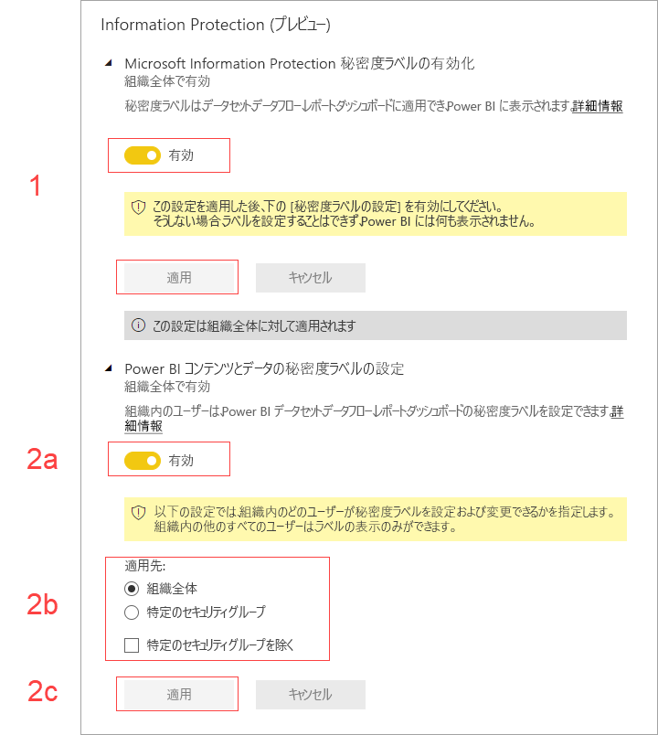

# Power BI 内でデータの秘密度ラベルを有効にする (プレビュー)

Power BI 内で [Microsoft Information Protection のデータの秘密度ラベル](https://docs.microsoft.com/microsoft-365/compliance/sensitivity-labels)を有効にすると、次が適用されます。

* 組織内の特定のユーザーおよびセキュリティ グループは、Power BI のダッシュボード、レポート、データセット、データフロー (以降は "[資産](../collaborate-share/service-security-apply-data-sensitivity-labels.md)" と呼びます) を分類して*秘密度ラベルを適用*することができます。
* 組織のすべてのメンバーは、それらのラベルを表示できます。

データの秘密度ラベルは、Power BI の作成者とコンシューマーにデータの機密性を認識させ、その分類の意味や、その分類におけるデータの取り扱い方に関する情報を提供することによって、データ保護を促進します。

データの秘密度ラベルが適用されているデータを Power BI から Excel、PowerPoint、または PDF ファイルにエクスポートすると、そのデータの機密ラベルが付いて行きます。 そのため、ラベル付けされたデータへのアクセス許可を持っていないユーザーは、Power BI "*以外*" (Excel、PowerPoint、または PDF アプリ) でファイルを開くことができません。

データの秘密度ラベルを有効にするには、Azure Information Protection ライセンスが必要です。 詳細については、「[ライセンス](#licensing)」を参照してください。

## データの秘密度ラベルを有効にする

Power BI 内で Microsoft Information Protection のデータの秘密度ラベルを使用できるようにするには、Power BI 管理者ポータルにアクセスし、[テナント設定] ペインを開き、[Information Protection] セクションを探します。

![[Information Protection] セクションを探す](media/service-security-enable-data-sensitivity-labels/enable-data-sensitivity-labels-01.png)

**[Information Protection]** セクションで、次の手順を実行します。
1.  **[Microsoft Information Protection 秘密度ラベルの有効化]** トグルを有効にし、 **[適用]** を押します。 この手順では、秘密度ラベルが組織全体に表示されるようになる "*だけ*" です。ラベルは適用されません。 Power BI 内でこれらのラベルを適用できるユーザーを定義するには、手順 2. を完了する必要があります。
2.  Power BI 資産の秘密度ラベルを適用および変更できるユーザーを定義します。 この手順には、次の 3 つのアクションが含まれます。
    1.  **[Power BI コンテンツとデータの秘密度ラベルの設定]** トグルを有効にします。
    2.  関連するセキュリティ グループを選択します。 既定では、組織内のすべてのユーザーが秘密度ラベルを適用できます。 ただし、特定のユーザーまたはセキュリティ グループに対してのみ秘密度ラベルの設定を有効にすることができます。 組織全体または特定のセキュリティ グループのどちらかを選択すると、ユーザーまたはセキュリティ グループの特定のサブセットを除外できます。
    * 組織全体に対して秘密度ラベルが有効になっている場合、通常、例外はセキュリティ グループです。
    * 特定のユーザーまたはセキュリティ グループに対してのみ秘密度ラベルが有効になっている場合、通常、例外は特定のユーザーです。  
    この方法を使用すると、特定のユーザーが Power BI 内で秘密度ラベルを適用するためのアクセス許可を持つグループに属している場合でも、適用できないようにすることが可能です。
    
    3. **[適用]** を押します。

> [!IMPORTANT]
> 資産に対する "*作成*" および "*編集*" アクセス許可を持ち、このセクション内で設定した関連するセキュリティ グループに属している Power BI Pro ユーザーのみが秘密度ラベルを設定および編集できるようになります。 このグループに属していないユーザーは、ラベルを設定および編集することはできません。 

## 考慮事項と制限事項

Power BI では、Microsoft Information Protection 秘密度ラベルを使用します。 そのため、機密ラベルを有効にしようとしてエラー メッセージが表示された場合は、次のいずれかが原因として考えられます。

* Azure Information Protection [ライセンス](#licensing)を持っていない。
* 秘密度ラベルが Power BI でサポートされている Microsoft Information Protection バージョンに移行されていない。 [秘密度ラベルの移行](https://docs.microsoft.com/azure/information-protection/configure-policy-migrate-labels)の詳細を確認してください。
* 組織内で Microsoft Information Protection 秘密度ラベルが定義されていない。 さらに、使用できるようにするには、ラベルが公開済みのポリシーに含まれている必要があります。 [秘密度ラベルの詳細を確認する](https://docs.microsoft.com/Office365/SecurityCompliance/sensitivity-labels)か、[Microsoft セキュリティとコンプライアンス センター](https://sip.protection.office.com/sensitivity?flight=EnableMIPLabels)にアクセスして、組織でラベルを定義してポリシーを公開する方法をご覧ください。

## ライセンス

* Power BI 内で Microsoft Information Protection ラベルを表示または適用するには、Azure Information Protection Premium P1 または Premium P2 ライセンスを持っている必要があります。 Microsoft Azure Information Protection は、スタンドアロンとして、またはいずれかの Microsoft ライセンス スイートを介して購入できます。 詳細については、「[Azure Information Protection の価格](https://azure.microsoft.com/pricing/details/information-protection/)」を参照してください。
* Power BI 資産にラベルを適用する必要があるユーザーには、Power BI Pro ライセンスが必要です。

## 次のステップ

この記事では、Power BI 内でデータの秘密度ラベルを有効にする方法を説明しました。 次の記事では、Power BI におけるデータ保護の詳細について説明しています。 

* [Power BI におけるデータ保護の概要](service-security-data-protection-overview.md)
* [Power BI 内でデータの秘密度ラベルを適用する](../collaborate-share/service-security-apply-data-sensitivity-labels.md)
* [Power BI 内で Microsoft Cloud App Security の制御を使用する](service-security-using-microsoft-cloud-app-security-controls.md)
* [データ保護メトリック レポート](service-security-data-protection-metrics-report.md)