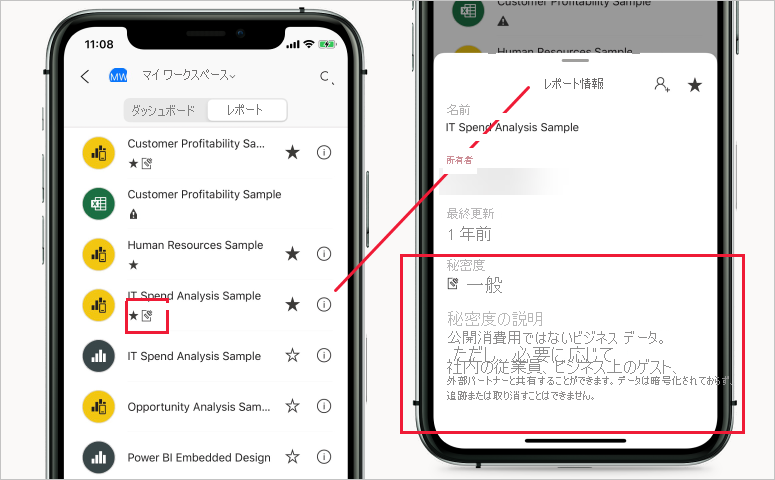

# Power BI における秘密度ラベル

この記事では、Power BI の Microsoft Information Protection 秘密度ラベルの機能について説明します。

ライセンス要件や前提条件など、テナントで秘密度ラベルを有効にする方法については、「[Power BI 内でデータの秘密度ラベルを有効にする](service-security-enable-data-sensitivity-labels.md)」を参照してください。

秘密度ラベルを Power BI レポート、ダッシュボード、データセット、およびデータフローに適用する方法については、「[Power BI で秘密度ラベルを適用する方法](./service-security-apply-data-sensitivity-labels.md)」を参照してください。

## はじめに

Microsoft Information Protection 秘密度ラベルを使用すると、生産性や共同作業の能力を損なうことなく Power BI で重要なコンテンツを分類できます。

秘密度ラベルは、データセット、レポート、ダッシュボード、およびデータフローにのみ適用できます。 Excel、Power Point、または PDF ファイルへのエクスポート、または他のサポートされているエクスポート シナリオ ([Excel で分析] や Excel でのライブ接続ピボットテーブルなど) を介して、ラベル付けしたデータが Power BI を離れた場合、Power BI によって、エクスポートされたファイルにラベルが自動的に適用され、ラベルのファイル暗号化設定に従って保護されます。 このように、機密データがどこにあっても保護された状態が維持されます。

レポート、ダッシュボード、データセット、およびデータフローに対する秘密度ラベルは、Power BI サービスの多くの場所から表示できます。 レポートとダッシュボードの秘密度ラベルは、Power BI iOS および Android モバイル アプリと埋め込みビジュアルにも表示されます。

Power BI 管理者は Power BI 管理ポータルの[保護メトリック レポート](service-security-data-protection-metrics-report.md)を使用すると、Power BI テナントの機密データを完全に把握できます。 さらに、Power BI 監査ログには、ラベルの適用、削除、変更などのアクティビティに関する秘密度ラベル情報と、レポートやダッシュボードの表示などのアクティビティに関する秘密度ラベル情報が含まれているため、Power BI およびセキュリティ管理者は、監視、調査、およびセキュリティ アラートの目的で、機密性の高いデータの使用状況を把握できます。

## 重要な考慮事項

秘密度ラベルは、Power BI 内のコンテンツへのアクセスには影響**しません**。Power BI 内のコンテンツへのアクセスは、Power BI のアクセス許可によってのみ管理されます。 ラベルが表示されている間、関連する暗号化設定 ([Microsoft 365 セキュリティ センター](https://security.microsoft.com/)または [Microsoft 365 コンプライアンス センター](https://compliance.microsoft.com/)で構成します) は適用されません。 これらは、Excel、Power Point、または PDF ファイルへのエクスポート、またはサポートされている他のエクスポートパスのいずれかを介して Power BI を離れるデータにのみ適用されます。

サポートされていないエクスポート パスでは、秘密度ラベルとファイルの暗号化は**適用されません**。 Power BI 管理者は、サポートされていないエクスポート パスからのエクスポートをブロックすることができます。

>[!NOTE]
> レポートへのアクセスが許可されているユーザーには、[行レベル セキュリティ (RLS)](./service-admin-rls.md) によってアクセスが制限されない限り、基になるデータセット全体へのアクセスが許可されます。 レポート作成者は、秘密度ラベルを使用してレポートを分類し、およびラベルを付けることができます。 秘密度ラベルに保護設定が含まれている場合、Power BI では、Excel、PowerPoint、または PDF ファイルにレポート データをエクスポートするときに、これらの保護設定が適用されます。 承認されたユーザーのみが保護されたファイルを開くことができます。

## サポートされているエクスポート パス
Power BI を離れるデータに秘密度ラベルとそれに関連する保護を適用することは、現在、次のエクスポート パスについてサポートされています。
* Excel、PowerPoint、および PDF ファイルへのエクスポート。
* Power BI サービスの [Excel で分析]。これにより、Power BI データセットへのライブ接続を使用して Excel ファイルのダウンロードがトリガーされます。
* M365 E3 以降を使用しているユーザーの場合は、Power BI データセットへのライブ接続を使用した Excel のピボットテーブル。 

## Power BI での秘密度ラベルの動作

Power BI のダッシュボード、レポート、データセット、またはデータフローに秘密度ラベルを適用すると、そのリソースにタグを適用する場合と同じように、次の利点が得られます。
* **カスタマイズ可能** - 個人用、公開、一般、社外秘、極秘など、組織内にあるさまざまなレベルの機密コンテンツのカテゴリを作成できます。
* **クリア テキスト** - ラベルはクリア テキストであるため、ユーザーは秘密度ラベルのガイドラインに従ってコンテンツの取り扱い方を簡単に理解できます。
* **永続的** - 秘密度ラベルがコンテンツに適用されると、そのコンテンツが Excel、PowerPoint、および PDF ファイルにエクスポートされてもラベルが付属し、ポリシーを適用して徹底するための基盤となります。

Power BI の秘密度ラベルのしくみを簡単に説明した例を次に示します。 次の図は、Power BI サービスのレポートに秘密度ラベルを適用する方法、レポートのデータを Excel ファイルにエクスポートする方法、最後にエクスポートされたファイルで秘密度ラベルとその保護がどのように保持されるかを示しています。

コンテンツに適用する秘密度ラベルは、Power BI 全体で使用および共有される場合、コンテンツと共に保持され、ローミングされます。 このラベルを使用して、使用状況レポートを生成し、実際の機密コンテンツのアクティビティ データを確認できます。

## 新しいコンテンツの作成時の秘密度ラベルの継承

Power BI サービスで新しいレポートとダッシュボードが作成されると、以前に親データセットまたはレポートに適用されていた秘密度ラベルが自動的に継承されます。 たとえば、秘密度ラベルが "極秘" であるデータセットに基づいて作成された新しいレポートにも、"極秘" ラベルが自動的に付けられます。

次の図は、データセットに基づいて構築された新しいレポートに、そのデータセットの秘密度ラベルが自動的に適用される方法を示しています。

>[!NOTE]
>何らかの理由で秘密度ラベルを新しいレポートまたはダッシュボードに適用できない場合、Power BI では新しい項目の作成はブロック**されません**。

## エクスポートされたデータの秘密度ラベルと保護

データが Power BI から Excel、PowerPoint、または PDF ファイルにエクスポートされると、Power BI によってエクスポートされたファイルに秘密度ラベルが自動的に適用され、ラベルのファイル暗号化設定に従って保護されます。 このように、機密データがどこにあっても保護された状態が維持されます。

Power BI からファイルをエクスポートするユーザーには、秘密度ラベルの設定に従ってそのファイルにアクセスして編集するアクセス許可が付与されます。ファイルの所有者アクセス許可は付与されません。

秘密度ラベルと保護は、データが .csv、.pbix ファイル、またはその他のエクスポート パスにエクスポートされるときは適用されません。

エクスポート後のファイルに秘密度ラベルと保護を適用するとき、ファイルにコンテンツのマーキングが追加されることはありません。 ただし、コンテンツのマーキングを適用するようにラベルが構成されている場合は、ファイルを Office デスクトップ アプリで開いたとき、Azure Information Protection 統合ラベル付けクライアントによって自動的にマーキングが適用されます。 デスクトップ、モバイル、または Web アプリに対して組み込みのラベル付けを使用する場合、コンテンツのマーキングが自動的に適用されることはありません。 「[Office アプリがコンテンツのマーキングと暗号化を適用するとき](/microsoft-365/compliance/sensitivity-labels-office-apps#when-office-apps-apply-content-marking-and-encryption)」を参照してください。

データがファイルにエクスポートされるときにラベルを適用できない場合は、エクスポートに失敗します。 ラベルを適用できなかったためにエクスポートに失敗したかどうかを確認するには、タイトル バーの中央にあるレポートまたはダッシュボードの名前をクリックし、情報ドロップダウンが開いたら、"秘密度ラベルを読み込めません" と表示されているかどうかを確認します。 これは、一時的なシステムの問題の結果、または適用されたラベルが公開されていないか、セキュリティ管理者によって削除された場合に発生する可能性があります。

## [Excel で分析] の秘密度ラベル継承

Power BI データセットにライブ接続しながら Excel でピボットテーブルを作成するとき (この作業は [[Excel で分析]](../collaborate-share/service-analyze-in-excel.md) または [[Excel]](https://support.microsoft.com/office/create-a-pivottable-from-power-bi-datasets-31444a04-9c38-4dd7-9a45-22848c666884?ui=en-US&rs=en-US&ad=US) を利用し、Power BI から可能です)、関連付けられている保護と共に、データセットの秘密度ラベルが継承され、お使いの Excel ファイルに適用されます。 データセット上のラベルが後に変更され、制限が厳しくなった場合、データ更新時、リンクされている Excel ファイルで適用されているラベルが自動的に更新されます。

 
手動で設定された Excel の機密ラベルがデータセットの秘密度ラベルによって自動的に上書きされることはありません。 バナーから、データセットに秘密度ラベルがあることが通知され、それを適用することが推奨されます。

>[!NOTE]
>データセットの秘密度ラベルの制限が Excel ファイルの秘密度ラベルより制限が緩い場合、ラベルは継承されず、更新もされません。 Excel ファイルで制限の緩い秘密度ラベルが継承されることは決してありません。

## 埋め込みレポートとダッシュボードでの秘密度ラベルの永続化

Power BI レポート、ダッシュボード、およびビジュアルは、Microsoft Teams や SharePoint などのビジネス アプリケーション、または組織の Web サイトに埋め込むことができます。 秘密度ラベルが適用されているビジュアル、レポート、またはダッシュボードを埋め込むと、秘密度ラベルが埋め込みビューに表示され、データが Excel にエクスポートされるときにラベルとその保護が維持されます。

次の埋め込みシナリオがサポートされています。
* [組織向けの埋め込み](../developer/embedded/embed-sample-for-your-organization.md)
* Microsoft 365 アプリ (例: [Teams](../collaborate-share/service-embed-report-microsoft-teams.md) や [SharePoint](../collaborate-share/service-embed-report-spo.md))
* [セキュリティで保護された URL の埋め込み](../collaborate-share/service-embed-secure.md) (Power BI サービスからの埋め込み) 

## Power BI モバイル アプリの秘密度ラベル

秘密度ラベルは、Power BI モバイル アプリのレポートとダッシュボードで表示できます。 レポートまたはダッシュボードの名前の近くにあるアイコンは、秘密度ラベルがあることを示します。また、ラベルの種類とその説明は、レポートまたはダッシュボードの情報ボックスに表示されます。

## サポートされているクラウド
秘密度ラベルはグローバル (パブリック) クラウド内のテナントでのみサポートされており、国内クラウドなどのクラウド内のテナントではサポートされていません。

## ライセンスと要件

「[ライセンスと要件](service-security-enable-data-sensitivity-labels.md#licensing-and-requirements)」を参照してください。

## 秘密度ラベルの作成と管理

秘密度ラベルは、[Microsoft 365 セキュリティ センター](https://security.microsoft.com/)または [Microsoft 365 コンプライアンス センター](https://compliance.microsoft.com/)内で作成および管理します。

これらのセンターのどちらかで秘密度ラベルにアクセスするには、 **[分類] > [秘密度ラベル]** に移動します。 これらの秘密度ラベルは、Azure Information Protection、Office アプリ、Office 365 サービスなど、複数の Microsoft サービスで使用できます。

>[!Important]
> 組織で Azure Information Protection の秘密度ラベルが使用されている場合、Power BI でラベルを使用するには、それらを前述のサービスのいずれかに[移行](/azure/information-protection/configure-policy-migrate-labels)する必要があります。

## 制限事項

次の一覧に、Power BI における秘密度ラベルの制限事項をいくつか示します。

* 秘密度ラベルは、ダッシュボード、レポート、データセット、およびデータフローにのみ適用できます。 現在のところ、[ページ分割されたレポート](../paginated-reports/report-builder-power-bi.md)とブックでは使用できません。
* Power BI 資産の秘密度ラベルは、ワークスペースの一覧、系列、お気に入り、最近使用、アプリ ビューでのみ表示されます。現在、ラベルは "自分と共有" では表示されません。 ただし、Power BI 資産に適用されているラベルは、表示されない場合でも、Excel、PowerPoint、および PDF ファイルにエクスポートされたデータに常に保持されることに注意してください。
* データの秘密度ラベルは、テンプレート アプリではサポートされていません。 テンプレート アプリの作成者によって設定された秘密度ラベルは、アプリが抽出されてインストールされると削除されます。また、アプリ コンシューマーによってインストールされたテンプレート アプリの成果物に追加された秘密度ラベルは、アプリが更新されると失われます (リセットされて、なくなります)。
* Power BI では、[転送不可](/microsoft-365/compliance/encryption-sensitivity-labels#let-users-assign-permissions)、[ユーザー定義](/microsoft-365/compliance/encryption-sensitivity-labels#let-users-assign-permissions)、[HYOK](/azure/information-protection/configure-adrms-restrictions) 保護の種類の秘密度ラベルはサポートされていません。 転送不可とユーザー定義の保護の種類では、[Microsoft 365 セキュリティ センター](https://security.microsoft.com/)または [Microsoft 365 コンプライアンス センター](https://compliance.microsoft.com/)で定義されているラベルが参照されます。
* Power BI 内で親ラベルを適用することをユーザーに許可することはお勧めしません (ラベルにサブラベルがある場合にのみ、ラベルは親ラベルと見なされます)。 親ラベルをコンテンツに適用する場合、そのコンテンツからファイル (Excel、PowerPoint、PDF) にデータをエクスポートすると失敗します。 「[サブラベル (ラベルのグループ化)](/microsoft-365/compliance/sensitivity-labels#sublabels-grouping-labels)」を参照してください。

## 次の手順

この記事では、Power BI におけるデータ保護の概要について説明しました。 次の記事では、Power BI におけるデータ保護の詳細について説明しています。 

* [Power BI で秘密度ラベルを有効にする](service-security-enable-data-sensitivity-labels.md)
* [Power BI で秘密度ラベルを適用する方法](service-security-apply-data-sensitivity-labels.md)
* [Power BI 内で Microsoft Cloud App Security の制御を使用する](service-security-using-microsoft-cloud-app-security-controls.md)
* [保護メトリック レポート](service-security-data-protection-metrics-report.md)