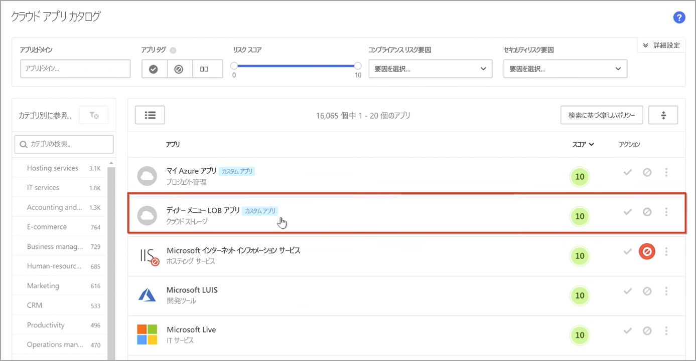
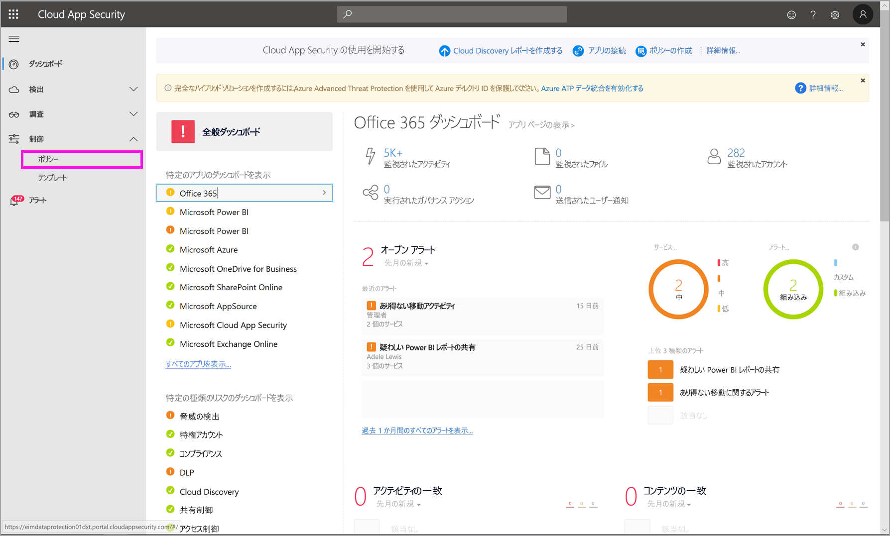
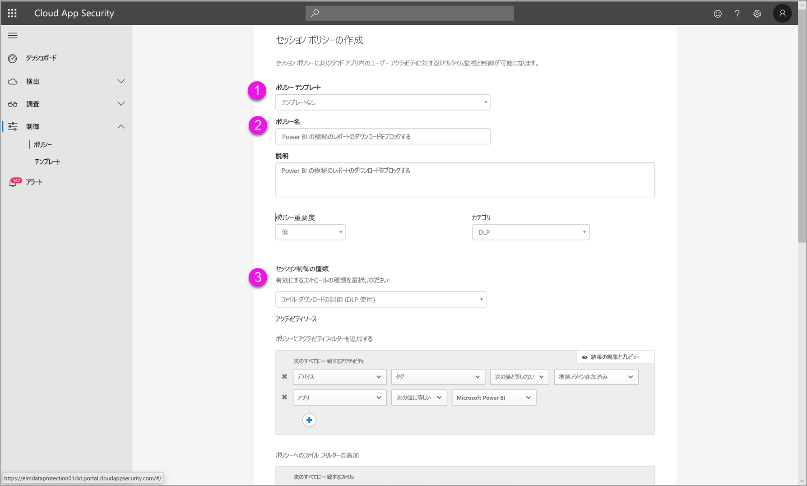
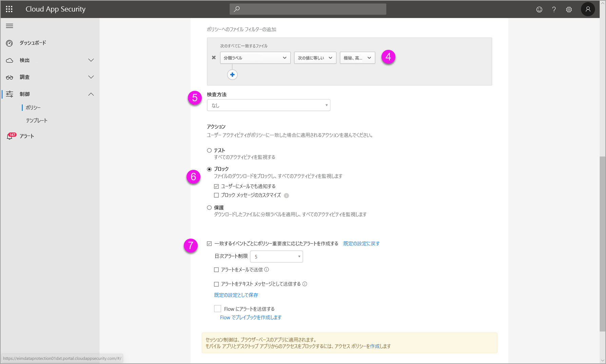
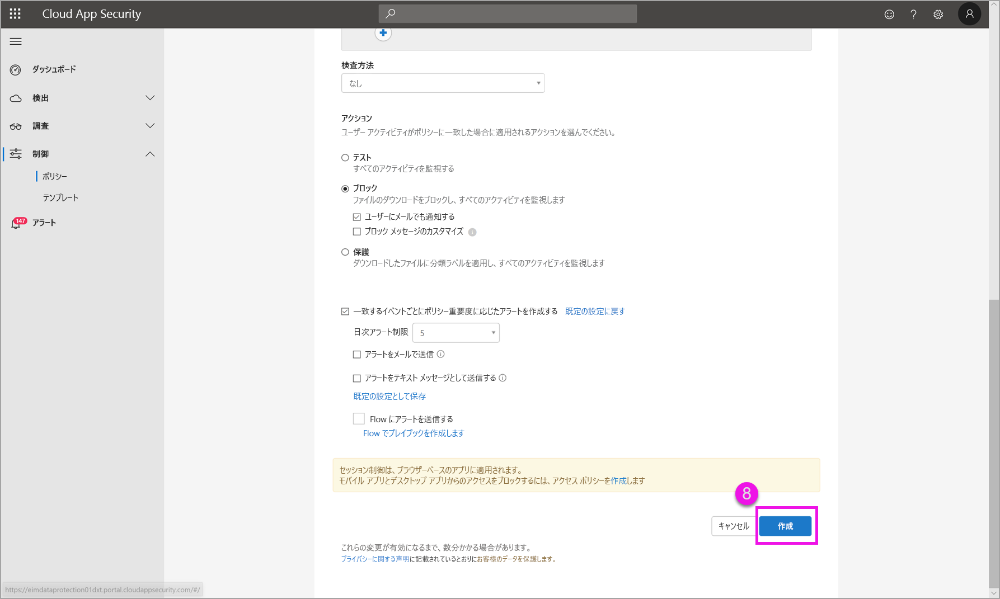

# Power BI で Microsoft Cloud App Security の制御を使用する (プレビュー)

Power BI で Microsoft Cloud App Security を使用すると、Power BI のレポート、データ、およびサービスを意図しない漏えいや違反から保護することができます。 Cloud App Security では、Azure Active Directory (Azure AD) のリアルタイム セッション制御を使用して、組織のデータに対して条件付きアクセス ポリシーを作成すると、Power BI 分析を確実にセキュリティで保護することができます。 これらのポリシーを設定すると、管理者は、ユーザーのアクセスとアクティビティの監視、リアルタイムのリスク分析の実行、ラベル固有の制御の設定を行うことができます。 

Microsoft Cloud App Security は、Power BI だけでなく、あらゆる種類のアプリとサービスに対して構成できます。 Cloud App Security は、アプリとデバイスを保護する Microsoft サービスで、独自のダッシュボードを使用して管理されます。 Power BI のデータと分析に対する Cloud App Security 保護を活用するには、Power BI と連携するように Cloud App Security を構成する必要があります。 Cloud App Security の動作の概要、ダッシュボード、アプリのリスク スコアなど、詳細については、[Microsoft Cloud App Security](https://docs.microsoft.com/cloud-app-security/) のドキュメントを参照してください。

## Power BI で Microsoft Cloud App Security を使用する

Power BI で Microsoft Cloud App Security を使用するには、関連する Microsoft セキュリティ サービスを使用および構成する必要があります。その中には、Power BI の外部で設定されるものもあります。

### Microsoft Cloud App Security ライセンス

テナント内に Microsoft Cloud App Security を含めるには、次のいずれかのライセンスが必要です。
* MCAS:EMS E5 および M365 E5 スイートの一部である、サポートされるすべてのアプリに対して OCAS 機能が提供されます。
* CAS-D:MCAS 検出のみが提供されます。
* OCAS:Office E5 スイートの一部である Office 365 に対してのみ MCAS 機能が提供されます。
* 任意:Microsoft Cloud App Security の主要な機能を活用するための AAD P1 と AIP P1。

以降のセクションでは、Power BI で Microsoft Cloud App Security を使用する手順について説明します。

### Azure Active Directory でセッション ポリシーを設定する (必須)
セッション制御を設定するために必要な手順は、Azure AD ポータルと Microsoft Cloud App Security ポータルで完了します。 Azure AD ポータルでは、Power BI 用の条件付きアクセス ポリシーを作成し、Microsoft Cloud App Security サービスを介して Power BI で使用されるセッションをルーティングします。 

Microsoft Cloud App Security は、リバース プロキシ アーキテクチャを使用して動作し、Power BI ユーザー アクティビティをリアルタイムで監視するために Azure AD 条件付きアクセスと統合されています。 プロセスを理解するのに役立つ手順を以下に示します。また、各手順のリンク先の内容には、段階を踏んだ詳細な指示があります。 また、プロセス全体について説明している [Cloud App Security の記事](https://docs.microsoft.com/cloud-app-security/proxy-deployment-aad)を読むこともできます。

1.  [Azure AD 条件付きアクセスのテスト ポリシーを作成する](https://docs.microsoft.com/cloud-app-security/proxy-deployment-aad#add-azure-ad)
2.  [ポリシーのスコープに含まれるユーザーを使用して各アプリにサインインする](https://docs.microsoft.com/cloud-app-security/proxy-deployment-aad#sign-in-scoped)
3.  [アプリがアクセスとセッション制御を使用するように構成されていることを確認する](https://docs.microsoft.com/cloud-app-security/proxy-deployment-aad#portal)
4.  [デプロイをテストする](https://docs.microsoft.com/cloud-app-security/proxy-deployment-aad#step-4-test-the-deployment)

セッション ポリシーを設定するプロセスについては、「[セッション ポリシー](https://docs.microsoft.com/cloud-app-security/session-policy-aad)」の記事で詳しく説明されています。 

### 異常検出ポリシーを設定して PBI アクティビティを監視する (推奨)
個別にスコープを指定できる Power BI の異常検出ポリシーを、ポリシーに含めたり除外したりするユーザーおよびグループのみに適用するように定義することができます。 [詳細情報](https://docs.microsoft.com/cloud-app-security/anomaly-detection-policy#scope-anomaly-detection-policies)

Cloud App Security には、Power BI 専用の 2 つの組み込み検出もあります。 [詳細については、このドキュメントで後述するセクションをご覧ください](#built-in-microsoft-cloud-app-security-detections-for-power-bi)。

### Microsoft Information Protection 秘密度ラベルを使用する (推奨)

秘密度ラベルを使用すると、機密性の高いコンテンツを分類して保護することができるため、組織内のユーザーは組織外のパートナーと共同作業を行いながら、機密性の高いコンテンツやデータを慎重に認識できます。 

Power BI の秘密度ラベルを使用するプロセスについて詳しく説明されている、[Power BI の秘密度ラベル](../designer/service-security-apply-data-sensitivity-labels.md)に関する記事を参照してください。 [秘密度ラベルに基づいた Power BI ポリシーの例](#example)については、以下を参照してください。

## Power BI の組み込みの Microsoft Cloud App Security 検出

Microsoft Cloud App Security 検出を使用すると、管理者は監視対象のアプリの特定のアクティビティを監視することができます。 Power BI には、現在、次の 2 つの専用の組み込み Cloud App Security 検出があります。 

* **疑わしい共有** – ユーザーが (組織の外部の) 不明な電子メールと機密性の高いレポートを共有した場合に検出されます。 機密性の高いレポートとは、秘密度ラベルが **[INTERNAL-ONLY]\(内部のみ\)** 以上に設定されているレポートです。 

* **レポートの大量共有** – ユーザーが複数の異なるレポートを 1 つのセッションで共有した場合に検出されます。

これらの検出の設定は、Cloud App Security ポータルで構成されます。 [詳細情報](https://docs.microsoft.com/cloud-app-security/anomaly-detection-policy#unusual-activities-by-user) 

## Microsoft Cloud App Security での Power BI 管理者ロール

Power BI で Microsoft Cloud App Security を使用すると、Power BI 管理者に新しいロールが作成されます。 [Cloud App Security ポータル](https://portal.cloudappsecurity.com/)に Power BI 管理者としてログインすると、Power BI 関連のデータ、アラート、危険にさらされているユーザー、アクティビティ ログ、およびその他の情報へのアクセスが制限されます。

## 考慮事項と制限事項 
Power BI での Cloud App Security の使用は、ユーザー セッションとそれらのアクティビティを監視する検出を使用して、組織のコンテンツとデータをセキュリティで保護するために設計されています。 Power BI で Cloud App Security を使用する場合には、注意すべきいくつかの制限事項があります。

* Microsoft Cloud App Security は、Excel、PowerPoint、PDF ファイルでのみ操作できます。
* Power BI のセッション ポリシーで秘密度ラベル機能を使用する場合は、Azure Information Protection Premium P1 または Premium P2 のライセンスを持っている必要があります。 Microsoft Azure Information Protection は、スタンドアロンとして、またはいずれかの Microsoft ライセンス スイートを介して購入できます。 詳細については、「[Azure Information Protection の価格](https://azure.microsoft.com/pricing/details/information-protection/)」を参照してください。 また、ご使用の Power BI 資産に秘密度ラベルが適用されている必要があります。

> [!CAUTION]
> * Microsoft Cloud App Security の*コンテンツ検査*ポリシーは、現在、Excel ファイル ポリシーを適用すると Power BI で使用できないため、このポリシーを Power BI に設定しないでください。
> * セッション ポリシーの "アクション" 部分では、項目にラベルが存在しない場合にのみ、"保護" 機能が機能します。 ラベルが既に存在する場合、"保護" アクションは適用されません。Power BI の項目に既に適用されている既存のラベルをオーバーライドすることはできません。

## 例

次の例は、Power BI で Microsoft Cloud App Security を使用して新しいセッション ポリシーを作成する方法を示しています。

まず、新しいセッション ポリシーを作成します。 **Cloud App Security** ポータルの左側のメニューから **[ポリシー]** を選択します。

表示されるウィンドウで、 **[ポリシーの作成]** ドロップダウンを選択します。

![[ポリシーの作成] の選択](media/service-security-using-microsoft-cloud-app-security-controls/cloud-app-security-controls-03.png)

ドロップダウンのオプションの一覧から、 **[セッション ポリシー]** を選択します。

![[セッション ポリシー] の選択](media/service-security-using-microsoft-cloud-app-security-controls/cloud-app-security-controls-04.png)

表示されるウィンドウで、セッション ポリシーを作成します。 番号付きの手順は、次の画像の設定を示しています。

  1. **[ポリシー テンプレート]** ドロップダウンで、 *[テンプレートなし]* を選択します。
  2. **[ポリシー名]** ボックスで、セッション ポリシーに関連する名前を指定します。
  3. **[セッション制御の種類]** で、 *[ファイル ダウンロードの制御 (DLP 使用)]* を選択します。

      **[アクティビティ ソース]** セクションで、関連するブロック ポリシーを選択します。 アンマネージド デバイスと非準拠デバイスをブロックすることをお勧めします。 セッションが Power BI のときにダウンロードをブロックすることを選択します。

        

        下にスクロールすると、他のオプションが表示されます。 次の図は、これらのオプションと追加の例を示しています。 

  4. " *[機密性ラベル]* " を " *[highly confidential]\(極秘\)* " または組織に最適なものに設定します。
  5. **[検査方法]** を *[なし]* に変更します。
  6. ご自分のニーズに合った **[ブロック]** オプションを選択します。
  7. このようなアクションに対するアラートを作成していることを確認します。

        

        

  8. 最後に、 **[作成]** ボタンを選択して、セッション ポリシーを作成します。

        

> [!CAUTION]
> Power BI Excel ファイルに**コンテンツ検査**ポリシーは作成しないでください。 これは、この*プレビュー* リリースの既知の制限です。

## 次の手順
この記事では、Microsoft Cloud App Security で Power BI に対してデータとコンテンツの保護をどのように提供できるかについて説明しました。 次の記事にも関心をもたれるかもしれません。これらの記事では、Power BI のデータ保護と、それを有効にする Azure サービスのサポート コンテンツについて説明しています。

* [Power BI におけるデータ保護の概要](service-security-data-protection-overview.md)
* [Power BI でデータの秘密度ラベルを有効にする](service-security-enable-data-sensitivity-labels.md)
* [Power BI でデータの秘密度ラベルを適用する](../designer/service-security-apply-data-sensitivity-labels.md)

次の Azure およびセキュリティについての記事にも関心をもたれるかもしれません。

* [Microsoft Cloud App Security Conditional Access App Control でアプリを保護する](https://docs.microsoft.com/cloud-app-security/proxy-intro-aad)
* [おすすめアプリへの Conditional Access App Control の展開](https://docs.microsoft.com/cloud-app-security/proxy-deployment-aad)
* [セッション ポリシー](https://docs.microsoft.com/cloud-app-security/session-policy-aad)
* [秘密度ラベルの概要](https://docs.microsoft.com/microsoft-365/compliance/sensitivity-labels)