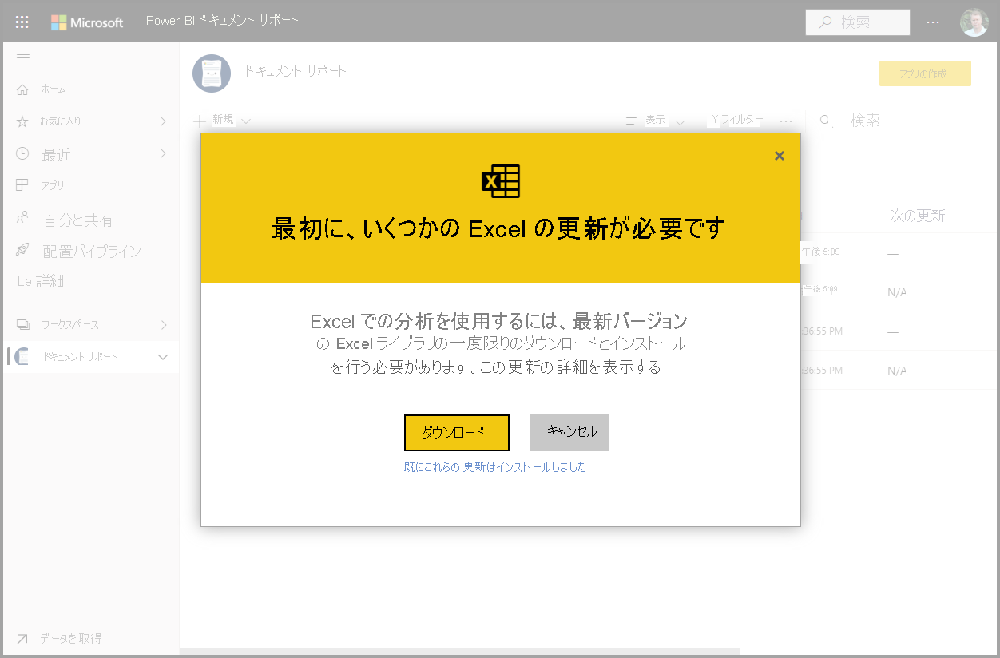
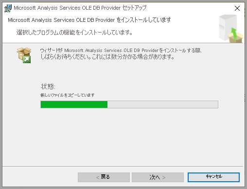
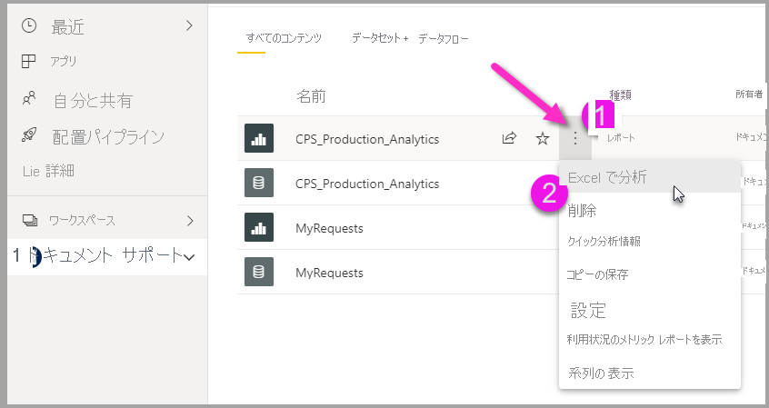

# [Excel で分析]
**[Excel で分析]** を使用すると、Power BI データセットを Excel に取り込み、ピボットテーブル、グラフ、スライサー、およびその他の Excel 機能を使用してデータセットを表示および操作できます。 **[Excel で分析]** を使用するには、まず Power BI から機能をダウンロードしてインストールし、Excel で使用する 1 つ以上のデータセットを選択する必要があります。 

![[Excel で分析]](media/service-analyze-in-excel/analyze-excel-00a.png)

この記事では、[Excel で分析] をインストールして使用する方法を示し、その制限事項について説明した後、次の手順をいくつか提供します。 ここでは次の内容について学習します。

* [[Excel で分析] をインストールする](#install-analyze-in-excel)
* [Power BI データに接続する](#connect-to-power-bi-data)
* [Excel を使用してデータを分析する](#use-excel-to-analyze-the-data)
* [ブックの保存と共有](#saving-and-sharing-your-new-workbook)
* [必要条件](#requirements)

それではさっそくインストール プロセスを開始しましょう。

## [Excel で分析] をインストールする

Power BI サービスで提供されるリンクから **[Excel で分析]** をインストールする必要があります。 Power BI によってお使いのコンピューター上にある Excel のバージョンが検出され、適切なバージョン (32 ビットまたは 64 ビット) が自動的にダウンロードされます。 Power BI サービスがブラウザーで実行されます。 次のリンクを使用して Power BI にサインインできます。

* [Power BI へのサインイン](https://app.powerbi.com)

サインインして Power BI サービスがブラウザーで実行されたら、右上隅にある **[その他のオプション]** 項目 ([...]) を選択してから、 **[ダウンロード] > [Excel で分析の更新プログラム]** の順に選択します。 このメニュー項目は、[Excel で分析] の更新プログラムの新規インストールに適用されます。

![Power BI ホームから [Excel で分析] をダウンロードする](media/service-analyze-in-excel/analyze-excel-02.png)

または、Power BI サービス内で分析するデータセットに移動し、データセット、レポート、またはその他の Power BI 項目に対する **[その他のオプション]** 項目を選択できます。 次の画像に示すように、表示されたメニューから **[Excel で分析]** オプションを選択します。

![[Excel で分析]](media/service-analyze-in-excel/analyze-excel-01.png)

どちらの方法でも、Power BI によって [Excel で分析] がインストール済みであるかどうかが検出され、インストールしていない場合はダウンロードするように求められます。 

[ダウンロード] を選択すると、Power BI によってインストール済みの Excel のバージョンが検出され、適切なバージョンの [Excel で分析] インストーラーがダウンロードされます。 ブラウザーの下部、またはお使いのブラウザーでダウンロードの進行状況が表示される場所に、ダウンロード状態が表示されます。 

ダウンロードが完了したら、インストーラー (.msi) を実行して [Excel で分析] をインストールします。 インストール プロセスの名前は [Excel で分析] とは異なります。名前は、次の画像に示すように **[Microsoft Analysis Services OLE DB プロバイダー]** になるか、または似たような名前になります。

完了したら、Power BI サービス (またはデータセットなどの他の Power BI データ要素) でレポートを選択し、Excel で分析する準備が整います。

## Power BI データに接続する

Power BI サービスで、Excel で分析するデータセットまたはレポートに移動し、次の操作を行います。

1. **[その他のオプション]** メニューを選択します。

1. 表示されるメニュー項目から **[Excel で分析]** を選択します。

    次の画像はレポートの選択を示しています。

    
    
    >[!NOTE]
    >[レポート] メニューから [Excel で分析] を選択すると、Excel に取り込まれるのは、レポートの基になるデータセットです。

    そうすると、Power BI サービスによって、 **[Excel で分析]** で使用するために設計 (および構造化) されたデータセットのファイルが作成され、ブラウザーでのダウンロード プロセスが開始されます。
    
    

    ファイル名は、派生元のデータセット (またはレポート、またはその他のデータ ソース) と一致します。 したがって、レポートが "*四半期ごとのレポート*" という名前だった場合、ダウンロードされたファイルは "**四半期ごとのレポート.xlsx**" になります。

3. Excel ファイルを開きます。

    >[!NOTE]
    >ファイルを初めて開くとき、[保護ビュー](https://support.microsoft.com/en-gb/office/what-is-protected-view-d6f09ac7-e6b9-4495-8e43-2bbcdbcb6653?ui=en-us&rs=en-gb&ad=gb)と[信頼済みドキュメント](https://support.microsoft.com/en-us/office/trusted-documents-cf872bd8-47ec-4c02-baa5-1fdba1a11b53)の設定に応じて、**編集を有効にする**こと、さらに**コンテンツを有効にする**ことが必要な場合があります。
    >
    >
    >
    >

## Excel を使用してデータを分析する

編集とコンテンツを有効にすると、Excel に Power BI データセットから空の**ピボットテーブル**と**フィールド**の一覧が表示され、分析する準備が整います。

Excel ファイルには、Power BI 内のユーザーのデータセットに接続する MSOLAP 接続が含まれています。 データの分析または処理操作を行うと、Excel は Power BI のデータセットをクエリし、結果を Excel に返します データセットが DirectQuery を使用してライブ データ ソースに接続している場合、Power BI はデータ ソースをクエリし、結果を Excel に返します

これで Power BI のデータへの接続が確立されたので、Excel でローカルのデータセットに対して作業する場合と同じように、ピボットテーブルやグラフを作成したり、データセットを分析したりできます。

**[Excel で分析]** は、次のデータ ソースに接続するデータセットとレポートに対して特に役立ちます。

* "*Analysis Services 表形式*" または "*多次元*" のデータベース
* Power BI Desktop ファイル、または Data Analysis Expressions (DAX) を使用して作成されたモデル メジャーを持つデータ モデルを含む Excel ブック。

> [!IMPORTANT]
> **[Excel で分析]** を使用すると、すべての詳細レベルのデータが、データセットへのアクセス許可を持つすべてのユーザーに公開されます。

[Excel で分析] の使用を開始する際はいくつかの点を考慮する必要があり、調整を行うために 1、2 個の追加手順が必要になる場合があります。 以下のセクションで、これらの可能性について説明します。 

### Power BI へのサインイン
ブラウザーで Power BI にサインインしていても、Excel で新しい Excel ファイルを初めて開くときには、Power BI アカウントを使用して Power BI にサインインするよう求められる場合があります。 これにより、Excel から Power BI への接続を認証します。

### 複数の Power BI アカウントを持つユーザー
一部のユーザーは複数の Power BI アカウントを持っています。 そのような場合は、1 つのアカウントを使用して Power BI にサインインしている可能性がありますが、他のアカウントから [Excel で分析] で使用されているデータセットにアクセスすることができます。 このような場合、[Excel で分析] ブックで使用されているデータセットにアクセスしようとすると、**Forbidden** エラーやサインインの失敗が生じることがあります。

このような場合は、[Excel で分析] によってアクセスされているデータセットへのアクセス権限を持つ Power BI アカウントを使用して、もう一度サインインする機会が提供されます。 また、Excel の上部のリボンで自分の名前を選択して、現在サインインしているアカウントを特定することもできます。 サインアウトし、もう一方のアカウントでもう一度サインインします。

## 新しいブックの保存と共有

他のブックと同様に、Power BI データセットを使用して作成した Excel ブックを **[保存]** できます。 ただし、Power BI に発行またはインポートできるのは、テーブルにデータがあるか、データ モデルを持つブックのみであるため、ブックをもう一度 Power BI に発行またはインポートすることはできません。 新しいブックは、単に Power BI 内のデータセットに接続されているだけなので、Power BI に発行またはインポートすると堂々巡りになってしまいます。

ブックを保存すると、組織内の他の Power BI ユーザーと共有できます。 

ブックを共有したユーザーがそれを開くと、ブックを最後に保存したときの状態でピボットテーブルとデータが表示されますが、これはデータの最新バージョンではない可能性があります。 最新のデータを入手するには、ユーザーは **[データ]** リボンの **[更新]** をクリックする必要があります。 また、ブックは Power BI のデータセットに接続しているため、ブックの更新を試みるユーザーは、この方法を使用して初めて更新を試みたときに、Power BI にサインインして Excel 更新プログラムをインストールする必要があります。

ユーザーはデータセットを更新する必要がある一方で、Excel Online では外部接続の更新がサポートされていないため、ユーザー自身のコンピューター上のデスクトップ版 Excel を使用してブックを開くことをお勧めします。

> [!NOTE]
> Power BI テナントの管理者は、*Power BI 管理ポータル*を使って、Analysis Services (AS) データベースに格納されているオンプレミスのデータセットでの **[Excel で分析]** の使用を無効にできます。 このようにすると、 **[Excel で分析]** は AS データベースに対しては無効になりますが、他のデータセットについては引き続き使用できます。

## Excel から Power BI データセットにアクセスするその他の方法
特定の Office SKU を持つユーザーは、Excel の **[データの取得]** 機能を使用して、Excel 内から Power BI データセットに接続することもできます。 使用する SKU でこの機能がサポートされていない場合、 **[データの取得]** メニュー オプションは表示されません。

次の画像に示すように、 **[データ]** リボン メニューから、 **[データの取得] > [Power BI データセットから]** を選択します。

![[データの取得] メニューの使用](media/service-analyze-in-excel/analyze-excel-10.png)

表示されるペインでは、アクセスできるデータセットを参照したり、データセットが認定または昇格されているかどうかを確認したり、それらのデータセットにデータ保護ラベルが適用されているかどうかを確認したりできます。 

このように Excel にデータを取り込む方法の詳細については、「[Power BI データセットからピボットテーブルを作成する](https://support.office.com/article/31444a04-9c38-4dd7-9a45-22848c666884)」をご覧ください。

また、Excel の**データ型**ギャラリーで、**おすすめのテーブル**にアクセスすることもできます。 おすすめのテーブルとそれらにアクセスする方法の詳細については、「[Excel で Power BI のおすすめのテーブルにアクセスする (プレビュー)](service-excel-featured-tables.md)」をご覧ください。

## 必要条件
**[Excel で分析]** を使用するには、次のいくつかの要件があります。

* **[Excel で分析]** は、Microsoft Excel 2010 SP1 以降でサポートされています。

* Excel のピボット テーブルは、数値フィールドのドラッグ アンド ドロップでの集計をサポートしていません。 Power BI でのデータセットには、*メジャーを事前定義する必要があります*。 メジャーの作成方法については[こちら](../transform-model/desktop-measures.md)をご覧ください。
* 一部の組織では、グループ ポリシーの規則により、必要な **[Excel で分析]** 更新プログラムを Excel にインストールできないことがあります。 更新プログラムをインストールできない場合は、管理者に問い合わせてください。
* **[Excel で分析]** では、Power BI Premium にデータセットがあるか、またはユーザーが Power BI Pro ライセンスを持っている必要があります。 Power BI ライセンスの種類間での機能の違いについては、「[Power BI 料金](https://powerbi.microsoft.com/pricing/)」の「_Power BI 機能の比較_」セクションを参照してください。
* 基になるデータセットに対するアクセス許可が与えられている場合、ユーザーは [Excel で分析] を使用してデータセットに接続できます。  データセットが含まれるワークスペースで Member ロールを与える、データセットが使用されるレポートやダッシュボードを共有する、データセットが含まれるワークスペースかアプリでデータセットの Build アクセス許可を与えるなど、ユーザーにはいくつかの方法でこのアクセス許可を与えることができます。 データセットの Build アクセス許可については[こちら](../connect-data/service-datasets-build-permissions.md)をご覧ください。
* ゲスト ユーザーは、別のテナントから送信された (別のテナントに由来する) データセットに対して、 **[Excel で分析]** を使用することはできません。 
* **[Excel で分析]** は Power BI サービスの機能であり、Power BI Report Server と Power BI Embedded では使用できません。 
* **[Excel で分析]** は、Microsoft Windows を実行しているコンピューターでのみサポートされます。

**[Excel で分析]** 機能をアンインストールする必要がある場合は、Windows コンピューターの **[プログラムの追加と削除]** システム設定を使用して実行できます。

## トラブルシューティング
”Excel で分析” の使用中に、予期しない結果が出る場合や、機能が期待どおりに動作しない場合があります。 [このページでは、[Excel で分析] の使用中に発生する一般的な問題の解決方法を説明します](desktop-troubleshooting-analyze-in-excel.md)。

## 次のステップ

次の記事にも興味をもたれるかもしれません。

* [Power BI Desktop でレポート間のドリルスルーを使用する](../create-reports/desktop-cross-report-drill-through.md)
* [Power BI Desktop でスライサーを使用する](../visuals/power-bi-visualization-slicers.md)
* [Excel で分析のトラブルシューティング](desktop-troubleshooting-analyze-in-excel.md)
* [Excel で Power BI のおすすめのテーブルにアクセスする (プレビュー)](service-excel-featured-tables.md)。

