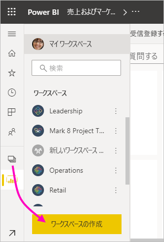
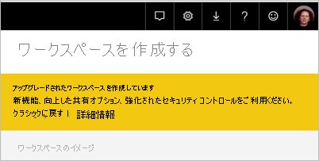
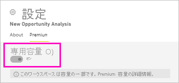
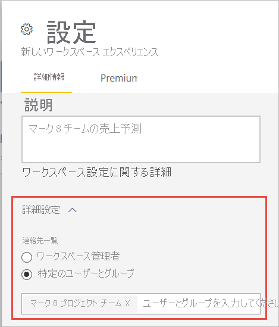
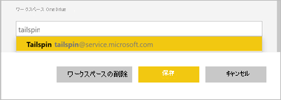
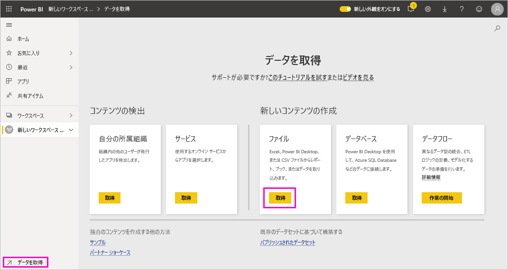
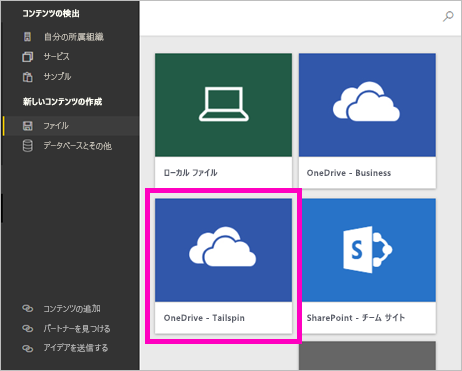
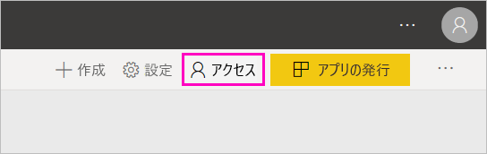
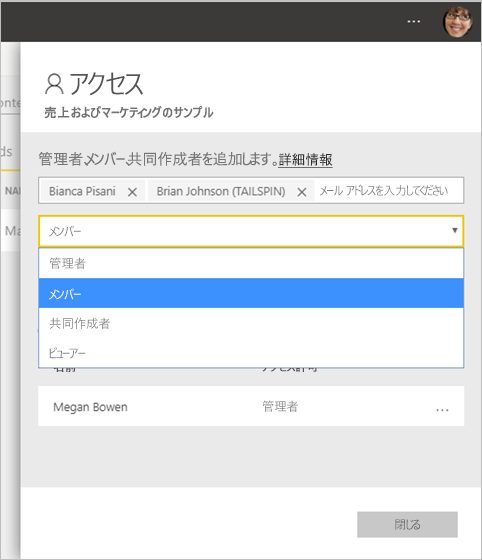

# Power BI で新しいワークスペースを作成する

この記事では "*クラシック*" ワークスペースではなく、"*新しいワークスペース*" のいずれかを作成する方法について説明します。 どちらの種類のワークスペースも、同僚と共同作業を行う場所です。 そこで、ダッシュボード、レポート、およびページ分割されたレポートのコレクションを作成します。 必要に応じて、そのコレクションを "*アプリ*" にバンドルし、より広範な対象ユーザーに配布することもできます。

新しいワークスペースと古いものとの違いを以下に示します。 新しいワークスペースでは、次の作業を行うことができます。

- ユーザー グループと個人にワークスペース ロールを割り当てる。
- Microsoft 365 グループを作成せずに、Power BI でワークスペースを作成する。
- より柔軟なアクセス許可の管理を行うために、より細分化されたワークスペース ロールを使用する。

:::image type="content" source="media/service-create-the-new-workspaces/power-bi-workspace-sales-marketing.png" alt-text="売上およびマーケティングのサンプル ワークスペース":::

詳細については、[新しいワークスペース](service-new-workspaces.md)に関する記事を参照してください。

クラシック ワークスペースを移行する場合、 詳細については、「[Power BI でクラシック ワークスペースを新しいワークスペースにアップグレードする](service-upgrade-workspaces.md)」を参照してください。

> [!NOTE]
> ワークスペースでコンテンツを参照する Power BI Pro ユーザーに対して行レベル セキュリティ (RLS) を適用するには、ユーザーにビューアー ロールを割り当てます。

## 新しいワークスペースのいずれかを作成する

1. 最初に、ワークスペースを作成します。 **[ワークスペース]**  >  **[ワークスペースの作成]** を選択します。
   
     

2. **[クラシックに戻す]** を選択しない限り、アップグレードされたワークスペースが自動的に作成されます。
   
     
     
     **[クラシックに戻す]** を選択した場合は、Microsoft 365 グループに基づいて[クラシック ワークスペースを作成](service-create-workspaces.md)します。

2. ワークスペースに一意の名前を付けます。 名前が使用できない場合は、一意の名前になるように編集します。
   
     ワークスペースから作成するアプリには、そのワークスペースと同じ名前とアイコンが設定されます。
   
1. ワークスペースに対しては次のオプション項目を設定できます。

    **ワークスペースのイメージ**をアップロードします。 .png または .jpg 形式のファイルを使用できます。 ファイル サイズは 45 KB 未満にする必要があります。
    
    [**連絡先リスト**を追加します](#create-a-contact-list)。 既定では、ワークスペース管理者が連絡先になります。 
    
    Microsoft 365 グループ ファイルの保存場所を使用するために、[**ワークスペース OneDrive** を指定](#set-a-workspace-onedrive)します。 

    **専用の容量**にワークスペースを割り当てるには、 **[Premium]** タブで **[専用の容量]** を選択します。
     
    

1. **[保存]** を選択します。

    Power BI でワークスペースが作成され、開きます。 自分が所属するワークスペースの一覧が表示されます。 

## 連絡先リストを作成する

ワークスペースで発生している問題に関する通知を受け取るユーザーを指定できます。 既定では、ワークスペース管理者として指定された任意のユーザーまたはグループに通知されますが、"*連絡先リスト*" に他のユーザーを追加することができます。 連絡先リストのユーザーまたはグループはユーザー インターフェイス (UI) に一覧表示され、ユーザーがワークスペースに関連するヘルプを取得するのに役立ちます。

1. 新しい **[連絡先リスト]** の設定にアクセスするには、次の 2 つの方法があります。

    最初に作成するときに **[ワークスペースの作成]** ウィンドウで。

    ナビ ペインで、 **[ワークスペース]** の横にある矢印を選択し、ワークスペース名の横にある **[その他のオプション]** (...) を選択して、 **[ワークスペースの設定]** を選択します。 **[設定]** ウィンドウが開きます。

    

2. **[詳細設定]**  >  **[連絡先リスト]** で、既定の **[ワークスペース管理者]** のままにするか、または **[特定のユーザーやグループ]** の独自のリストを追加します。 

    

3. **[保存]** を選択します。

## ワークスペース OneDrive を設定する

ワークスペース OneDrive 機能を使用すると、SharePoint ドキュメント ライブラリ ファイル ストレージをワークスペース ユーザーが使用できる Microsoft 365 グループを構成できます。 最初に Power BI の外部にグループを作成します。 

Microsoft 365 グループ メンバーシップを使用してワークスペースにアクセスできるように構成されたユーザーまたはグループのアクセス許可は、Power BI では同期されません。 ベスト プラクティスは、ファイル ストレージをこの Microsoft 365 グループ設定で構成するのと同じ Microsoft 365 グループに、[ワークスペースへのアクセス権](#give-access-to-your-workspace)を付与することです。 次に、Microsoft 365 グループのメンバーシップを管理して、ワークスペースへのアクセスを管理します。 

1. 新しい**ワークスペース OneDrive** の設定には、次の 2 つの方法のいずれかでアクセスします。

    最初に作成するときに **[ワークスペースの作成]** ウィンドウで。

    ナビ ペインで、 **[ワークスペース]** の横にある矢印を選択し、ワークスペース名の横にある **[その他のオプション]** (...) を選択して、 **[ワークスペースの設定]** を選択します。 **[設定]** ウィンドウが開きます。

    

2. **[詳細設定]**  >  **[ワークスペース OneDrive]** で、前に作成した Microsoft 365 グループの名前を入力します。 URL ではなく、名前のみを入力してください。 Power BI によって、グループの OneDrive が自動的に取得されます。

    

3. **[保存]** を選択します。

### ワークスペースの OneDrive の場所にアクセスする

OneDrive の場所を構成した後、Power BI サービスの他のデータ ソースにアクセスするのと同じ方法で、そこにアクセスできます。

1. ナビ ペインで、 **[データの取得]** を選択して、 **[ファイル]** ボックスで **[取得]** を選択します。

    

1.  **[OneDrive – Business]** エントリは、独自の OneDrive for Businessです。 2 番目の OneDrive は、追加したものです。

    

### 新しいワークスペースでアプリに接続する

新しいワークスペース エクスペリエンスでは、コンテンツ パックではなく、"*アプリ*" を作成して使用します。 アプリは、サードパーティ サービスおよび組織データに接続するダッシュボード、レポート、およびデータセットのコレクションです。 アプリを使用すると、Microsoft Dynamics CRM、Salesforce、Google Analytics などのサービスからデータを簡単に取得できます。

新しいワークスペース エクスペリエンスでは、組織のコンテンツ パックを作成したり、利用したりすることはできません。 内部チームに、現在使用しているコンテンツ パックのアプリを提供するよう依頼してください。 

## ワークスペースへのアクセスを許可する

ワークスペースの管理者ロールを持つすべてのユーザーは、他のユーザーにワークスペースへのアクセス権を付与することができます。

1. 管理者であるため、ワークスペースのコンテンツ一覧ページには **[アクセス]** が表示されます。

    

1. セキュリティ グループ、配布リスト、Microsoft 365 グループ、または個人を、これらのワークスペースに管理者、メンバー、共同作成者、またはビューアーとして追加します。 さまざまなロールの説明については、「[新しいワークスペースのロール](service-new-workspaces.md#roles-in-the-new-workspaces)」を参照してください。

    

9. **[追加]**  >  **[閉じる]** の順に選択します。

## アプリを配布する

組織内の多くの対象ユーザーに公式コンテンツを配布する場合は、ワークスペースから "*アプリ*" を発行できます。  コンテンツが用意できたら、発行するダッシュボードやレポートを選択し、それをアプリとして発行します。 各ワークスペースから 1 つのアプリを作成できます。

新しいワークスペースからアプリを発行する方法については、[こちら](service-create-distribute-apps.md)を参照してください。

## セキュリティの設定

ワークスペース管理者は、 **[共同作成者にこのワークスペースのアプリの更新を許可する]** 設定を使用して、共同作成者ロールのユーザーにワークスペース用のアプリを更新する機能を委任できます。 既定では、ワークスペース用のアプリの発行と更新を実行できるのは、ワークスペースの管理者とメンバーだけです。 

有効にすると、共同作成者は次のことができます。
* 名前、アイコン、説明、サポート サイト、色などのアプリのメタデータを更新する
* アプリに含まれる項目を追加または削除する (レポートやデータセットの追加など)
* アプリが開いたときのアプリのナビゲーションや既定の項目を変更する

ただし、共同作成者は次のことを行うことはできません。
* アプリを初めて発行する
* アプリへのアクセス権を所有するユーザーを変更する

## 次の手順
* [Power BI での新しいワークスペース エクスペリエンスの作業の整理](service-new-workspaces.md)に関する記事を参考してください
* [クラシック ワークスペースを作成する](service-create-workspaces.md)
* [Power BI で新しいワークスペースからアプリを発行する](service-create-distribute-apps.md)
* わからないことがある場合は、 [Power BI コミュニティで質問してみてください](https://community.powerbi.com/)。
