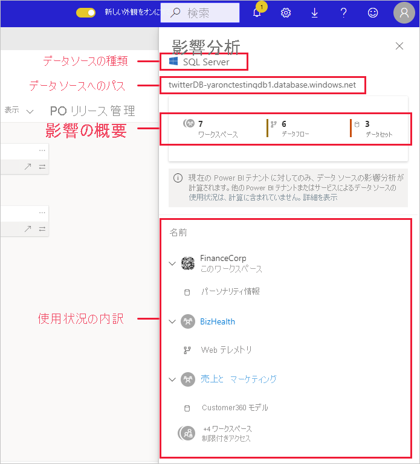
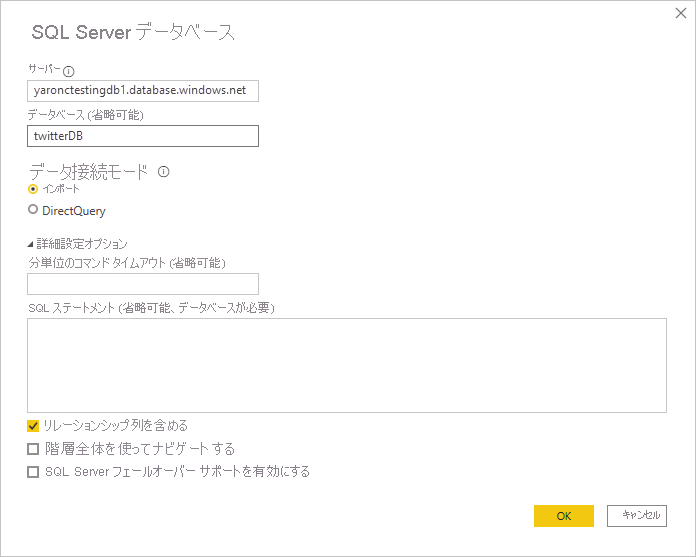

# データ ソースの影響分析

データ ソースの影響分析は、ご自分のデータ ソースが組織全体でどこに使用されているかを確認するのに役立ちます。 これは、データ ソースが一時的または永続的にオフラインになっている場合や、影響を受けている人を把握する必要がある場合に便利です。 データ ソースを使用しているワークスペース、データフロー、およびデータセットの数が示され、影響を受けるデータフローとデータセットが配置されているワークスペースに簡単に移動して、さらに調査することができます。

データ ソースの影響分析は、たとえば、多くの異なるユーザーが同じデータ ソースの上に類似のモデルを構築する場合など、テナント内のデータの重複を特定するのにも役立ちます。 データ ソースの影響分析では、このような冗長データセットとデータフローの検出を支援することで、"単一の正しい情報源" を持つという目標をサポートします。

## データ ソースの影響分析を実行する

データソ ースの影響分析を実行するには:

1. 関心のあるデータ ソースが含まれているワークスペースにアクセスし、[系列ビュー](service-data-lineage.md)を開きます。
1. データ ソースのカードを見つけて、[影響分析] アイコンをクリックします。

    ![[影響分析] ボタンが表示されているデータ ソース カードのスクリーンショット。](media/service-data-source-impact-analysis/data-source-impact-analysis-button.png)
 
影響分析作業パネルが開きます。

 
* **データ ソースの種類**:データ ソースの種類が示されます。
* **データ ソースへのパス**:Power BI Desktop で定義されているデータ ソースへのパス。 たとえば、上の図では、SQL Server データベースのデータ ソースへのパスは、Power BI Desktop で定義されている接続文字列 "twitterDB-yaronctestingdb1.database.windows.net" です (次を参照)。 これはデータベース名 "twitterDB" とサーバー名 "yaronctestingdb1.database.windows.net" で構成されています。

    
 
* **影響の概要**:影響を受ける可能性のあるワークスペース、データフロー、およびデータセットの数が表示されます。 この数には、アクセスできないワークスペースが含まれています。
* **使用状況の内訳**:影響を受けるデータフローとデータセットの名前がワークスペースごとに表示されます。 特定のワークスペースへの影響をさらに詳しく調べるには、ワークスペース名をクリックしてワークスペースを開きます。 影響を受けるワークスペースに移動したら、[データセットの影響分析](service-dataset-impact-analysis.md) を使用して、接続されているレポートとダッシュボードの使用状況の詳細を確認します。

## 連絡先に通知

データ ソースに変更を加えた場合、または変更を検討している場合は、関連するユーザーに連絡し、それについて通知することができます。 連絡先に通知すると、影響を受けるすべてのワークスペースの[連絡先一覧](service-create-the-new-workspaces.md#create-a-contact-list)にメールが送信されます (従来のワークスペースの場合は、ワークスペースの管理者にメールが送信されます)。 メールには送信元の名前が表示されるので、連絡先でそれを確認し、新しいメール スレッドで返信することができます。 

1. 影響分析作業ウィンドウの **[Notify contacts]\(連絡先に通知\)** をクリックします。 [Notify contacts]\(連絡先に通知\) ダイアログが表示されます。

   ![データソースの [連絡先に通知] ダイアログのスクリーンショット。](media/service-data-source-impact-analysis/notify-contacts-dialog.png)

1. テキスト ボックスに、変更に関する詳細を入力します。
1. メッセージの準備ができたら、 **[送信]** をクリックします。

## プライバシー

影響分析の作業ペインには、アクセスできるワークスペース、データセット、およびデータフローの実際の名前だけが表示されます。 アクセスできない項目は、制限付きアクセスとして一覧表示されます。 これは、一部の項目名に個人情報が含まれている可能性があるためです。
影響の概要の数には、影響を受けるすべてのデータフローとデータセットが含まれ、アクセスできないワークスペースに存在するものも含まれます。

## 制限事項

データ ソースの影響分析は、ページ分割されたレポートではまだサポートされていないため、データ ソースがテナント内のこれらの種類のレポートに直接影響を与えているかどうかはわかりません。

## 次の手順

* [データセットの影響分析](service-dataset-impact-analysis.md)
* [Data lineage (データ系列)](service-data-lineage.md)