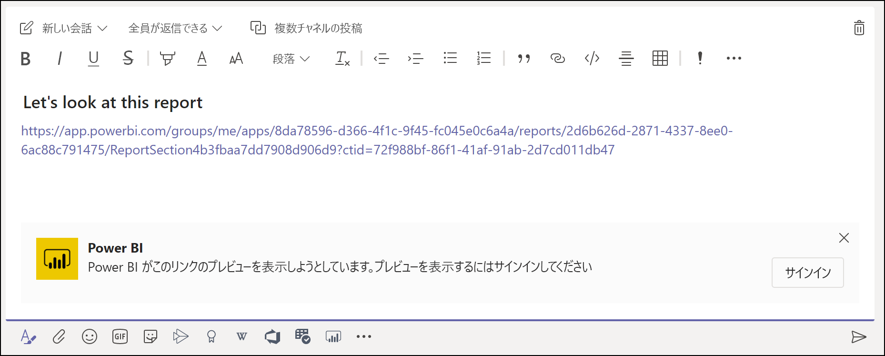
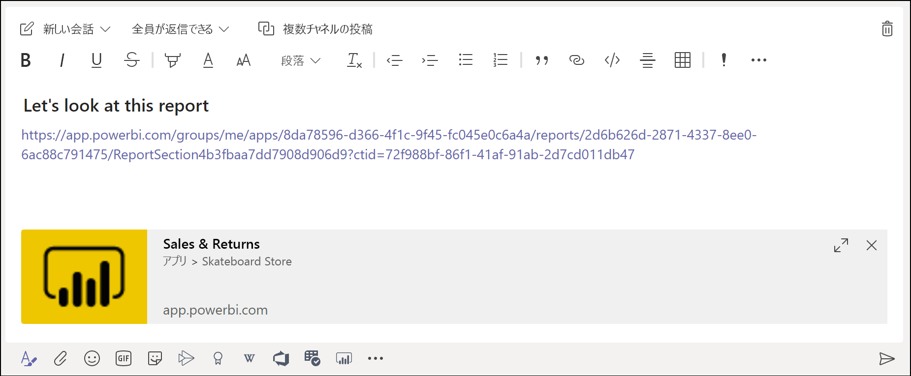
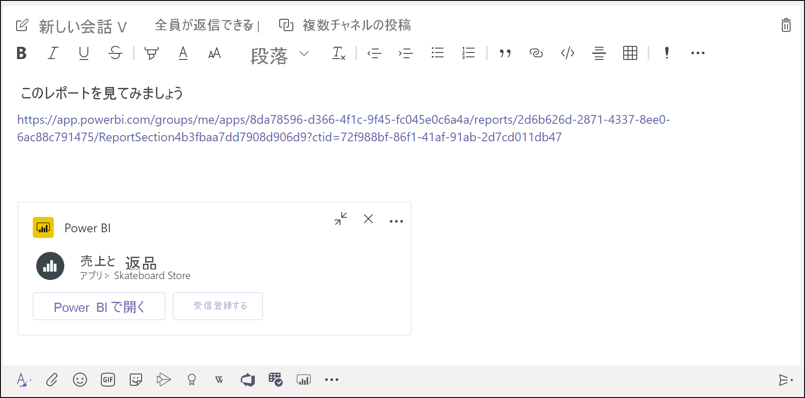
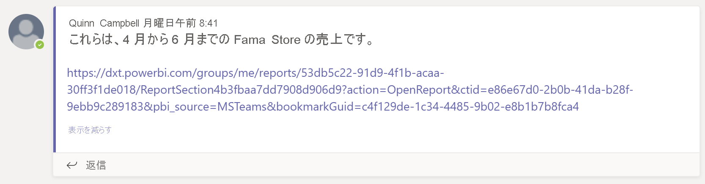

# Microsoft Teams と Power BI で共同作業する

Microsoft Teams の **[Power BI]** タブを使用すると、対話形式のレポートを Microsoft Teams のチャネルまたはチャットに簡単に埋め込むことができます。 Microsoft Teams の **[Power BI]** タブを使用すると、チームが使用するデータを検索したり、チームのチャネル内のデータについて話し合うことができます。 お客様のレポート、ダッシュボード、およびアプリへのリンクを Microsoft Teams のメッセージ ボックスに貼り付けると、リンクに関する情報がリンクのプレビューに表示されます。 Power BI でレポートやダッシュボードを表示しているときに会話をすばやく開始するには、 **[Teams で共有]** ボタンを使用します。

## 要件

Microsoft Teams の **[Power BI]** タブが機能するには、次のことを確認します。

- お客様のユーザーが Power BI Pro ライセンスを所有している。または、Power BI ライセンスのある [Power BI Premium 容量 (EM または P SKU)](../admin/service-premium-what-is.md) にレポートが含まれている。
- Microsoft Teams に **[Power BI]** タブがある。
- ユーザーが Power BI サービスにサインインし、レポートを使用できるように自分の Power BI ライセンスをアクティブ化している。
- Microsoft Teams で **[Power BI]** タブを使用してレポートを追加するには、レポートがホストされているワークスペースで、少なくともビューアー ロールを持っている必要があります。 さまざまなロールの詳細については、「[新しいワークスペースのロール](service-new-workspaces.md#roles-in-the-new-workspaces)」をご覧ください。
- Microsoft Teams の **[Power BI]** タブでレポートを表示するには、ユーザーがそのレポートを表示するためのアクセス許可を持っている必要があります。
- ユーザーは、チャネルとチャットにアクセスできる Microsoft Teams ユーザーである必要があります。

リンク プレビューが機能するには、次のことを確認します。

- Microsoft Teams の **[Power BI]** タブを使用するための要件をユーザーが満たしている。
- ユーザーが Power BI にサインインしている。

**[Teams で共有]** ボタンが機能するには、次のことを確認します。

- Microsoft Teams の **[Power BI]** タブを使用するための要件をユーザーが満たしている。
- ユーザーが Power BI にサインインしている。
- Power BI の管理者によって、**Teams で共有**テナント設定が無効にされていない。

## レポートを埋め込む

Microsoft Teams チャンネルまたはチャットにご利用のレポートを埋め込むには、以下の手順に従ってください。

1. Microsoft Teams でチャネルまたはチャットを開き、 **[+]** アイコンを選択します。

    

1. **[Power BI]** タブを選択します。

    ![[Power BI] が選択された Microsoft Teams のタブ リスト](media/service-embed-report-microsoft-teams/service-embed-report-microsoft-teams-tab.png)

1. 提供されているオプションを使用して、ワークスペースまたは Power BI アプリからレポートを選択します。

    ![Microsoft Teams の設定の [Power BI] タブ](media/service-embed-report-microsoft-teams/service-embed-report-microsoft-teams-tab-settings.png)

1. タブ名は、レポート名と一致するように自動的に更新されますが、変更することもできます。

1. **[保存]** を選択します。

## [Power BI] タブを埋め込む場合にサポートされているレポート

**[Power BI]** タブでは、次の種類のレポートを埋め込むことができます。

- 対話型レポートとページ分割されたレポート。
- **[マイ ワークスペース]** 、新しいワークスペース エクスペリエンス、およびクラシック ワークスペースのレポート。
- Power BI アプリのレポート。

## リンク プレビューを取得する

Power BI サービスのコンテンツのリンク プレビューを取得するには、次の手順に従ってください。

1. Power BI サービス内のレポート、ダッシュボード、またはアプリへのリンクをコピーします。 たとえば、ブラウザーのアドレス バーからリンクをコピーします。

1. そのリンクを Microsoft Teams のメッセージ ボックスに貼り付けます。 プロンプトが表示されたら、リンク プレビュー サービスにサインインします。 リンク プレビューが読み込まれるまで数秒待つことが必要になる場合があります。

    

1. サインインに成功すると、基本的なリンク プレビューが表示されます。

    

1. **[展開]** アイコンを選択して、リッチ プレビュー カードを表示します。

    

1. リッチ リンク プレビュー カードに、リンク ボタンと、関連するアクション ボタンが表示されます。

    

1. メッセージを送信します。

## Power BI サービスの [Teams で共有] ボタン

Power BI サービスでレポートまたはダッシュボードを表示するときは、次の手順に従って Microsoft Teams のチャネルとチャットへのリンクを共有します。

1. アクション バーまたは特定の視覚化のコンテキスト メニューにある、 **[Teams で共有]** ボタンを使用します。

   * アクション バーの **[Teams で共有]** ボタン:

       ![アクション バーの [Teams で共有] ボタン](media/service-embed-report-microsoft-teams/service-teams-share-to-teams-action-bar-button.png)
    
   * 視覚化のコンテキスト メニューの **[Teams で共有]** ボタン:
    
      ![視覚化のコンテキスト メニューの [Teams で共有] ボタン](media/service-embed-report-microsoft-teams/service-teams-share-to-teams-visual-context-menu.png)

1. **[Microsoft Teams で共有]** ダイアログ ボックスで、リンクの送信先のチャネルまたはユーザーを選択します。 必要に応じて、メッセージを入力できます。 先に Microsoft Teams へのサインインを求められる場合があります。

    ![情報とメッセージが表示された [Microsoft Teams で共有] ダイアログ ボックス](media/service-embed-report-microsoft-teams/service-teams-share-to-teams-dialog.png)

1. **[共有]** を選択して、リンクを送信します。
    
1. リンクが既存の会話に追加されるか、新しいチャットが開始されます。

    

1. リンクを選択し、Power BI サービスで項目を開きます。

1. 特定の視覚化のコンテキスト メニューを使用した場合、レポートが開くとその視覚化が強調表示されます。

    
    

## レポートへのアクセスを許可する

Microsoft Teams にレポートを埋め込んだり、項目へのリンクを送信しても、レポートを表示するためのアクセス許可が自動的にユーザーに与えられることはありません。 [Power BI でユーザーにレポートの表示を許可する](service-share-dashboards.md)必要があります。 チーム用に Microsoft 365 グループを使用すると、作業を容易にすることができます。

> [!IMPORTANT]
> Power BI サービスでレポートを表示できるユーザーを確認し、一覧に含まれないユーザーにアクセスを許可します。

チーム内のすべてのユーザーがレポートに確実にアクセスできるようにする方法の 1 つは、1 つのワークスペースにレポートを配置し、チームの Microsoft 365 グループにアクセス権を付与することです。

## リンク プレビュー

リンク プレビューは、Power BI の次の項目に対して提供されます。
- レポート
- ダッシュボード
- Apps

リンク プレビュー サービスでは、ユーザーのサインインが必要です。 サインアウトするには、メッセージ ボックスの下部にある **[Power BI]** アイコンを選択します。 その後、 **[サインアウト]** を選択します。

## 会話の開始

Power BI レポート タブを Microsoft Teams に追加すると、レポートに関するタブの会話が Teams によって自動的に作成されます。

- 右上隅にある **[[会話] タブを表示します]** アイコンを選択します。

    ![[[会話] タブを表示します] アイコン](media/service-embed-report-microsoft-teams/power-bi-teams-conversation-icon.png)

    最初のコメントは、レポートへのリンクです。 その Microsoft Teams チャネル内のすべてのユーザーが、会話でレポートを表示して話し合うことができます。

    
    
## [Teams で共有] テナント設定

Power BI 管理ポータルの **[Teams で共有]** テナント設定を使用すると、 **[Teams で共有]** ボタンが表示されないようにすることができます。 無効に設定すると、ユーザーが Power BI サービスでレポートやダッシュボードを表示したとき、アクション バーまたはショート カットメニューの **[Teams で共有]** ボタンは表示されません。

![Power BI 管理ポータルでの [Teams で共有] テナント設定](media/service-embed-report-microsoft-teams/service-teams-share-to-teams-tenant-setting.png)

## 既知の問題と制限事項

- Power BI では、Microsoft Teams と同じローカライズされた言語はサポートされていません。 そのため、埋め込みのレポートが適切にローカライズされていない可能性があります。
- Power BI ダッシュボードを Microsoft Teams の **[Power BI]** タブに埋め込むことはできません。
- Power BI のライセンスまたはレポートへのアクセス許可を持たないユーザーには、"コンテンツは利用できません" というメッセージが表示されます。
- Internet Explorer 10 を使用している場合、問題が発生する可能性があります。 <!--You can look at the [browsers support for Power BI](../consumer/end-user-browsers.md) and for [Microsoft 365](https://products.office.com/office-system-requirements#Browsers-section). -->
- [URL フィルター](service-url-filters.md)は、Microsoft Teams の **[Power BI]** タブではサポートされていません。
- 国内のクラウドでは、この新しい **[Power BI]** タブは使用できません。 Power BI アプリの新しいワークスペース エクスペリエンスやレポートがサポートされていない古いバージョンを使用できる可能性があります。
- タブを保存したら、タブの設定からタブ名を変更することはできません。 変更するには、 **[名前変更]** オプションを使用します。
- リンク プレビュー サービスでは、シングル サインオンはサポートされていません。
- リンク プレビューは、チャットまたはプライベート チャネルでは機能しません。
- ブラウザーで厳格なプライバシー設定を使用している場合は、 **[Teams で共有]** ボタンが機能しないことがあります。 **[問題が発生した場合新しいウィンドウで開いてみてください]** オプションを、ダイアログ ボックスが正しく開かない場合は使用してください。
- **[Teams で共有]** には、リンク プレビューは含まれていません。
- リンクプ レビューと **[Teams で共有]** では、項目を表示するためのアクセス許可がユーザーに付与されません。 アクセス許可は個別に管理する必要があります。
- レポートの作成者が視覚化の **[その他]** オプションを *[オフ]* に設定している場合、視覚化のコンテキスト メニューの **[Teams で共有]** ボタンは使用できません。

## 次の手順

- [同僚や他のユーザーとダッシュボードやレポートを共有する](service-share-dashboards.md)
- [Power BI でのアプリの作成および配布](service-create-distribute-apps.md)
- [Power BI Premium とは何ですか?](../admin/service-premium-what-is.md)

他にわからないことがある場合は、 [Power BI コミュニティで質問してみてください](https://community.powerbi.com/)。
