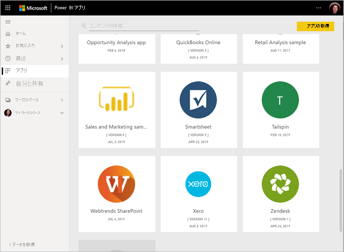
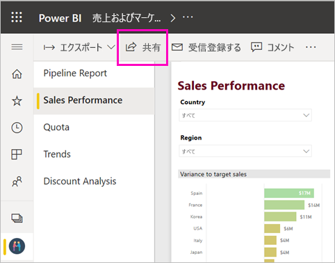

# Power BI で共同作業し、共有する方法

ダッシュボードとレポートを作成しました。 ダッシュボードやレポートで同僚と共同作業することがあります。 また、より広範囲に配布する準備ができている場合があります。 共同作業と共有に最適な方法は何でしょうか。 この記事では、選択肢を比較します。

*Power BI サービスでのアプリ*

**共同作業**

- 同僚と "*ワークスペース*" で共同作業し、役立つレポートやダッシュボードを作成します。
- *Microsoft Teams* で共同作業します。

**ダッシュボードとレポートの配布または共有**

- マイ ワークスペースまたは別のワークスペースから "*ダッシュボードまたはレポートを共有*" します。
- Power BI "*モバイル アプリ*" から注釈を付けて共有します。
- ワークスペースのダッシュボードとレポートを "*アプリ*" にバンドルし、より大きいグループや組織全体に配布します。
- "*セキュリティで保護されたポータル*" または "*パブリック Web サイト*" にレポートを埋め込みます。
- レポートを印刷します。
- Microsoft AppSource を介して外部の Power BI ユーザーに配布することができる*テンプレート アプリ*を作成します。
 
**データの共有**

- 同僚が自分のレポートの基礎として自分のワークスペース内で使用できる "*共有データセット*" を作成します。
- 共通データソースを共有する方法として "*データフロー*" を作成します。

どのオプションでも、コンテンツを共有するには [Power BI Pro のライセンス](../fundamentals/service-features-license-type.md)が必要です。あるいは、コンテンツを [Premium 容量](../admin/service-premium-what-is.md)に格納する必要があります。 ライセンスの要件は、コンテンツを表示する同僚については、選んだオプションに応じて異なります。 次のセクションでは、詳細を説明します。 

## ワークスペースで共同作業する

チームで協力して作業する場合、簡単に共同作業できるように同じドキュメントにアクセスする必要があります。 チームは、Power BI ワークスペースでダッシュボード、レポート、データセット、ブックの所有権と管理を共有します。 Power BI ユーザーは、組織の構造に基づいてワークスペースを編成する場合や、特定のプロジェクト用に作成する場合があります。 さらに組織によっては、複数のワークスペースを使用して、組織で使用するレポートやダッシュボードの異なるバージョンを保存する場合もあります。 

ワークスペースには、同僚に付与するアクセス許可を指定するロールも用意されています。 これらのロールを使用して、ワークスペースの管理、コンテンツの編集または配布、またはコンテンツの表示のみを行うことができるユーザーを決定します。 詳細については、「[新しいワークスペースのロール](service-new-workspaces.md#roles-in-the-new-workspaces)」を参照してください。

ワークスペースにはコンテンツの共同所有機能があるため、共同作業の点でマイ ワークスペースよりも優れています。 チームの管理者とチーム全体が更新を加え、他のユーザーにアクセス権を付与する操作も簡単です。 マイ ワークスペースは、1 人のユーザーが 1 回限りのコンテンツや個人用のコンテンツに使用する場合に適しています。

たとえば、同僚と共有する必要がある完成したダッシュボードがあるとします。 同僚にダッシュボードへのアクセス権を付与するために最適な方法は何でしょうか。 さまざまな要因でその答えは変わります。 

- 同僚がダッシュボードを最新の状態に保つ必要がある場合、またはワークスペース内のすべてのコンテンツにアクセスする必要がある場合は、その同僚をメンバーまたは共同作成者としてワークスペースに追加します。 
- ワークスペース内のコンテンツを表示することのみが必要な同僚の場合は、ビューアーとして追加します。
- ワークスペース内のすべてのコンテンツではなく、そのダッシュボードを表示することのみが必要な同僚の場合は、その相手とダッシュボードを直接共有する方法があります。
- ダッシュボードが一連のダッシュボードとレポートの一部であり、多くの同僚に配布する必要がある場合は、"*アプリ*" の公開が最適な選択肢の可能性があります。

[新しいワークスペースを作成する](service-create-the-new-workspaces.md)方法を参照してください。 

## Microsoft Teams で共同作業する

Power BI レポートと Power BI によってページ分割されたレポートを Microsoft Teams に埋め込むことで、組織内のデータ ドリブン コラボレーションを強化します。 Power BI サービスには、レポートの **[Share in Teams]\(Teams で共有\)** ボタンがあります。 個々のレポートごとに個別の Power BI タブを追加し、各タブにレポートの名前またはその他の名前を付けることができます。 

Power BI レポート タブを Microsoft Teams に追加すると、レポートに関するタブの会話が Teams によって自動的に作成されます。 その Microsoft Teams チャネル内のすべてのユーザーが、会話でレポートを表示して話し合うことができます。 

:::image type="content" source="media/service-how-to-collaborate-distribute-dashboards-reports/power-bi-teams-conversation-tab.png" alt-text="Microsoft Teams の [会話] タブ":::

[Power BI を使用した Microsoft Teams での共同作業](service-collaborate-microsoft-teams.md)の詳細を参照してください。

## ダッシュボードとレポートを共有する

たとえば、Power BI Desktop でレポートを完成させ、他の人にそのレポートへのアクセスを許可するとします。 それらを行う 1 つの方法として、Power BI サービスでそれを "*共有*" することがあります。 マイ ワークスペースまたは別のワークスペースに発行します。 それに合わせてダッシュボードを作成すれば、準備は完了です。

コンテンツを共有するには、Power BI Pro ライセンスが必要です。 共有相手も同様です。または、コンテンツを [Premium 容量](../admin/service-premium-what-is.md)のワークスペースに配置する必要があります。 ダッシュボードまたはレポートを共有すると、共有相手は、ダッシュボードを表示し、対話操作を行うことができます。 アクセス許可を付与すると、その相手は、編集、コピー、同僚との共有を行うことができるようになります。 自分のダッシュボードやレポートに表示されるものと同じデータが相手に表示されます。 [行レベルのセキュリティ (RLS)](../admin/service-admin-rls.md) が適用されていない限り、相手は基となるデータセットのすべてのデータにアクセスできます。

組織外のユーザーと共有することもできます。 組織外のユーザーは、ダッシュボードまたはレポートを表示し、対話操作を行うことはできますが、共有することはできません。 

Power BI サービスから[ダッシュボードとレポートを共有する](service-share-dashboards.md)方法を参照してください。 また、リンクへのフィルターの追加と[レポートのフィルター処理されたビューの共有](service-share-reports.md)について参照してください。

## Power BI モバイル アプリから注釈を付けて共有する

iOS および Android デバイス用 Power BI モバイル アプリでは、タイル、レポート、またはビジュアルに注釈を付けて、電子メール経由で他のユーザーと共有できます。

あなたは、タイル、レポート、または視覚化のスナップショットを共有しています。 受信者には、メールを送信したときとまったく同じ状態の内容が表示されます。 メールにはダッシュボードまたはレポートへのリンクも含まれています。 受信者に Power BI Pro ライセンスがある、またはコンテンツが [Premium 容量](../admin/service-premium-what-is.md)に格納されていて、既にオブジェクトが共有されている場合、その受信者は、コンテンツを開くことができます。 同じメール ドメインの同僚だけでなく、すべてのユーザーにタイルのスナップショットを送信できます。

iOS および Android モバイル アプリからの、[タイル、レポート、および視覚化の共有および注釈付け](../consumer/mobile/mobile-annotate-and-share-a-tile-from-the-mobile-apps.md)の詳細を参照してください。

[Windows 10 デバイス用 Power BI アプリ](../consumer/mobile/mobile-windows-10-phone-app-get-started.md)から、タイルのスナップショットを共有することもできますが、注釈を付けることはできません。

## アプリで分析情報を配布する

組織で多くの対象ユーザーにダッシュボードを配布するとします。 チームは*ワークスペース*を作成し、そのワークスペースに、ダッシュボード、レポート、およびデータセットを作成して、調整しました。 次に、目的のダッシュボードとレポートを選択し、それらを "*アプリ*" としてグループまたは組織全体に発行します。

アプリは Power BI サービス ([https://app.powerbi.com](https://app.powerbi.com)) で簡単に検索してインストールすることができます。 アプリへの直接リンクをビジネス ユーザーに送信したり、ユーザーが AppSource でアプリを検索しりすることができます。 Power BI 管理者からアクセス許可が与えられている場合は、同僚の Power BI アカウントにアプリを自動的にインストールすることができます。 [アプリを発行する](service-create-distribute-apps.md)方法を参照してください。

インストールしたアプリは、ブラウザーまたはモバイル デバイスで表示できます。

ユーザーがアプリを表示するには、ユーザーに Power BI Pro ライセンスが付与されているか、アプリを Power BI Premium 容量に格納する必要があります。 詳しくは、[Power BI Premium](../admin/service-premium-what-is.md) に関するページをご覧ください。

組織外の人向けにアプリを発行することもできます。 それらのユーザーは、アプリのコンテンツを表示し、やりとりすることはできますが、他のユーザーと共有することはできません。 これで、*テンプレート アプリ*を作成して、Power BI の顧客に配布できます。

## セキュリティで保護されたポータルまたはパブリック Web サイトにレポートを埋め込む

### セキュリティで保護されたポータルに埋め込む

ユーザーに表示するポータルまたは Web サイトに Power BI レポートを埋め込むことができます。  
Power BI サービスの **[SharePoint Online に埋め込む]** および **[埋め込み]** オプションを使用すると、内部ユーザー向けに安全にレポートを埋め込むことができます。 どちらのオプションを選択しても、ユーザーがコンテンツを表示する前にすべてのアクセス許可とデータのセキュリティが Power BI により適用されます。 レポートを表示するユーザーには、適切なライセンスが必要です。  

- **[SharePoint Online に埋め込む]** は、SharePoint Online の Power BI Web パーツで動作します。 レポートの埋め込み方法を制御できるシングル サインオン エクスペリエンスが提供されます。 詳細については、[SharePoint Online への埋め込み](service-embed-report-spo.md)に関するページを参照してください。
- **[埋め込み]** オプションは、URL または iFrame を使用したコンテンツの埋め込みをサポートするすべてのポータルまたは Web サイトで動作します。 詳細については、[埋め込み](service-embed-secure.md)オプションに関するページを参照してください。

### パブリック Web サイトに公開する

**[Web に公開]** では、ブログ記事、Web サイト、ソーシャル メディア、その他オンライン通信に視覚化を埋め込むことで、Power BI レポートをインターネット全体に公開することができます。 インターネット上のすべてのユーザーがレポートを表示できるため、公開した内容を閲覧できるユーザーは制御できません。 ユーザーに Power BI ライセンスは必要ありません。 Web に公開できるのは、自分で編集可能なレポートだけです。 他のユーザーから共有されているレポート、またはアプリ内にあるレポートは、Web に公開できません。 [Web に公開する](service-publish-to-web.md)方法を参照してください。

>[!Warning]
>内部の共有ではなく、一般向けにコンテンツを共有する場合にのみ、[[Web に公開]](service-publish-to-web.md) を使用してください。

## PDF または他の静的ファイルとして印刷または保存する

Power BI サービスから、次の項目の印刷、PDF として保存、または他の静的ファイル形式として保存を行うことができます。

- ダッシュボード全体
- ダッシュボード タイル
- レポート ページ
- ページ分割されたレポート
- Power BI サービスの視覚化。 

Power BI レポートは、一度に 1 ページずつ印刷できます。 一度でレポート全体を印刷することはできません。 [レポートまたはダッシュボードを静的ファイルとして印刷または保存する](../consumer/end-user-print.md)方法を参照してください。

一方、ページ分割されたレポートは印刷されるように設計されています。 詳細については、[Power BI レポートとページ分割されたレポートの比較](../paginated-reports/paginated-reports-report-builder-power-bi.md#compare-power-bi-reports-and-paginated-reports)に関するページを参照してください。 

## テンプレート アプリを作成して配布する

*テンプレート アプリ*は、特に Microsoft AppSource で、一般に配布するように設計されています。 アプリを作成し、ほとんどまたはまったくコーディングせずに Power BI の顧客すべてに展開することができます。 顧客は自分のデータに接続して自分のアカウントをインスタンス化します。 詳細については、[Power BI テンプレート アプリ](../connect-data/service-template-apps-overview.md)に関する記事を参照してください。

## データセットを共有する

レポート内に、高品質で適切に設計されたデータ モデルを作成するスキルが人より高いユーザーがいる場合があります。 あなたが、その人かもしれません。 適切に設計された同じデータ モデルを組織全体で使用できれば便利です。 *共有データセット*がその役目を果たします。 全員が使用すべきデータ モデルでレポートを作成したら、そのレポートを Power BI サービスに保存して、適切なユーザーに使用権限を付与することができます。 それにより、ユーザーはそのデータセットに基づいてレポートを作成できます。 これで、誰もが同じデータに基づいてレポートを作成し、同じ "真実に基づく結果" を見ることができます。

詳細については、[共有データセットの作成と使用](../connect-data/service-datasets-across-workspaces.md)に関する記事を参照してください。

## データフローを作成する

"*データフロー*" は、さまざまなソースのデータを統合し、モデリング用に準備するためのセルフサービスの方法です。 アナリストは、ビッグ データを取り込み、変換し、統合し、強化するためにデータフローを作成します。 データフローの作成と管理は、Power BI サービスのワークスペースで行います。 [データフローを使用したセルフサービスのデータ準備](../transform-model/service-dataflows-overview.md)方法を参照してください。

## 考慮事項と制限事項

- Power BI Report Server からレポートを共有することはできません。 そうではなく、[自分や他のユーザーに対してサブスクリプション](/sql/reporting-services/working-with-subscriptions-web-portal)を作成することができます。

## 次の手順

- [同僚や他のユーザーとダッシュボードを共有する](service-share-dashboards.md)
- [Power BI でのアプリの作成および発行](service-create-distribute-apps.md)
- [セキュリティで保護されたポータルまたは Web サイトにレポートを埋め込む](service-embed-secure.md)

ご意見およびご提案がある場合は、 [Power BI コミュニティ サイト](https://community.powerbi.com/)をご利用ください。

他にわからないことがある場合は、 [Power BI コミュニティを利用してください](https://community.powerbi.com/)。
