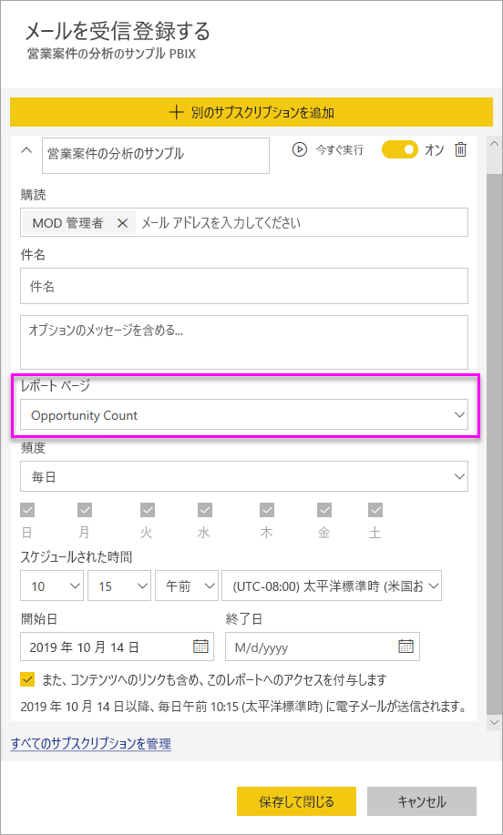

# Power BI サービスのレポートとダッシュボードを自分および他のユーザーがサブスクライブする

最も重要なレポート ページ、ダッシュボード、およびページ分割されたレポートを自分と同僚がサブスクライブすることができます。 Power BI 電子メール サブスクリプションでは、次のことができます。

- メールを受信する頻度 (毎日、毎週、毎時間、毎月、または最初のデータ更新後に 1 日 1 回) を決めます。
- 毎日、毎週、毎時間、または毎月を選択した場合は、電子メールを受信する時刻を選択します。
- Power BI レポートまたはダッシュボードごとに 24 個の異なるサブスクリプションを設定します。  ページ分割されたレポート用に設定できるサブスクリプションの数に制限はありません。
- レポートの画像と共にメールを送信し、サービス内のレポートにリンクします。  Power BI アプリがインストールされたモバイル デバイスでこのリンクを選ぶと、Power BI Web サイトでレポートまたはダッシュボードが開くのではなく、Power BI アプリが起動します。
- ページ分割されたレポートにサブスクライブする場合は、フル レポートの添付ファイルを含めます。
- Power BI コンテンツが Premium 容量でホストされている場合は、テナントの外部のユーザーに電子メールを送信します。  管理者は、Power BI 管理センターで既存の外部共有コントロール設定を利用して、外部ユーザーに電子メール サブスクリプションを送信できるユーザーに対してアクセスを制御できます。

 

## 要件

サブスクリプションの**作成**は以下が実行できます。

- Power BI Pro ライセンスを持つユーザー 
- また、Premium ワークスペースまたはアプリのコンテンツを閲覧するユーザーも、Power BI Pro ライセンスがなくても、そこに配置されているコンテンツをサブスクライブできます。 

ご自分のサブスクリプションを作成する場合は、コンテンツ (ダッシュボードまたはレポート) に対する編集アクセス許可は必要ありませんが、他のユーザー用に作成する場合は、編集アクセス許可が必要です。

## ダッシュボード、レポート ページ、またはページ分割されたレポートをサブスクライブする

ダッシュボード、レポート、またはページ分割されたレポートのいずれをサブスクライブする場合でも、そのプロセスは似ています。 同じボタンで、Power BI サービスのダッシュボードとレポートをサブスクライブすることができます。

ページ分割されたレポートのサブスクライブの場合、若干異なります。 詳細については、「[Subscribe yourself and others to a paginated report in the Power BI service](../consumer/paginated-reports-subscriptions.md)」(Power BI サービスのページ分割されたレポートを自分および他のユーザーがサブスクライブする) を参照してください。
 
.

1. ダッシュボードまたはレポートを開きます。
2. 上部のメニュー バーで **[受信登録する]** または封筒アイコン ![[受信登録する] アイコン](media/service-report-subscribe/power-bi-icon-envelope.png) を選択します。
   
    

1. 黄色のスライダーを使うと、サブスクリプションのオン/オフを切り替えることができます。 スライダーを **[オフ]** にしても、サブスクリプションは削除されません。 サブスクリプションを削除するには、ごみ箱アイコンを選択します。

2. メールは既に **[受信登録する]** ボックスにあります。 同じドメインの他のメール アドレスをサブスクリプションに追加することもできます。 レポートまたはダッシュボードが [Premium 容量](https://docs.microsoft.com/power-bi/service-premium-what-is)でホストされている場合は、使用しているドメイン内にあるかどうかにかかわらず、他の個別のメール アドレスとグループのエイリアスをサブスクライブすることができます。 レポートまたはダッシュボードが Premium 容量でホストされていない場合は、他の個別のものをサブスクライブすることはできますが、Power BI Pro のライセンスも必要になります。 詳細については、「[考慮事項とトラブルシューティング](#considerations-and-troubleshooting)」を参照してください。

3. メールの **[件名]** と **[メッセージ]** の詳細を入力します。

4. サブスクリプションの **[頻度]** を選択します。 **[毎日]** 、 **[毎時間]** 、 **[毎週]** 、 **[毎月]** 、または **[データ更新後 (毎日)]** です。 特定の日にのみ、サブスクリプション メールを受信するには、 **[毎時間]** または **[毎週]** を選択し、受信する曜日を選びます。 たとえば、平日にのみサブスクリプション メールを受信する場合は、 **[毎週]** を選択し、 **[土]** と **[日]** のボックスをオフにします。 **[毎月]** を選択した場合は、サブスクリプション メールを受信する日付を入力します。

5. **[毎日]** 、 **[毎時間]** 、 **[毎月]** 、 **[毎週]** を選択する場合は、サブスクリプションの **[スケジュールされた時間]** を選ぶこともできます。 毎時 0 分、15 分、30 分、または 45 分に実行するようにします。 午前 (AM) または午後/夜間 (PM) を選択します。 タイム ゾーンも指定できます。 **[毎時間]** を選択する場合、サブスクリプションを開始する **[スケジュールされた時間]** を選択すると、その後、1 時間ごとに実行されます。

6. 既定では、サブスクリプションの開始日は、作成日となります。 終了日を選ぶこともできます。 終了日を設定しない場合は、自動的に終了日が開始日から 1 年後となります。 サブスクリプションが終了する前に、(9999 年までの) 将来の任意の日付に変更することができます。 サブスクリプションは、終了日に達すると、再度有効にするまで停止します。 スケジュールされた終了日の前に、延長するかどうかを確認する通知を受信します。

    下のスクリーンショットでは、レポートをサブスクライブすると、実際にはレポート _ページ_をサブスクライブしていることがわかります。 レポートの複数のページをサブスクライブするには、 **[別のサブスクリプションを追加]** を選択し、別のページを選択します。
     
      

1. (省略可能) Power BI のコンテンツへのリンクを含めるかどうか、およびサブスクライブするコンテンツへのアクセスをユーザーに許可するかどうかを選択します。  リンクを含めることを選択する場合は、最適なエクスペリエンスを得るために、すべてのユーザーが確実にレポートにアクセスできるようにします。
2. **[保存して閉じる]** を選択します。 サブスクライブしているユーザーは、選択された頻度と時刻で、ダッシュボードまたはレポート ページのメールとスナップショットを受信します。 いずれの場合も、レポートまたはダッシュボードごとに最大 24 個のサブスクリプションを作成でき、サブスクリプションごとに一意の受信者、時刻、および頻度を指定できます。 ダッシュボードまたはレポートの **[データ更新後]** に設定されたすべてのサブスクリプションでは、最初のスケジュールされた更新後にのみ、引き続きメールが送信されます。

    > [!NOTE]
    > 保存して閉じた後にサブスクリプションを編集した場合、以前に選択した内容に関係なく、サブスクライブしているコンテンツへのアクセス権をユーザーに付与するための選択が有効になります。
    >

    > [!TIP]
    > サブスクリプションからすぐに、またはオンデマンドで随時、メールを送信したいですか。 送信したいダッシュボードまたはレポートのサブスクリプションの **[今すぐ実行]** を選択してください。 その特定のサブスクリプションに対するすべてのユーザーにメールが送信されていることを示す通知が表示されます。 このアクションを行っても、レポートまたはダッシュ ボードごとに設けられている 1 日あたり 24 回のスケジュールされたサブスクリプション実行の制限にはカウントされません。 これにより基になるデータセットのデータ更新がトリガーされることはありません。
    >

## サブスクリプションを管理する

サブスクリプションを管理できるのは、それを作成したユーザーのみです。 サブスクリプションの管理画面には、2 とおりの方法でアクセスできます。 最初の方法では、 **[メールを受信登録する]** ダイアログから **[すべてのサブスクリプションを管理]** を選択します (上記の手順 4 を参照)。 2 つ目の方法では、上部のメニュー バーから Power BI 歯車アイコン  を選択し、 **[設定]** を選択します。

![[設定] の選択](media/service-report-subscribe/power-bi-subscribe-settings.png)

表示されるサブスクリプションは、現在どのワークスペースがアクティブになっているかによって変わります。 すべてのワークスペースのすべてのサブスクリプションを一度に表示するには、 **[マイ ワークスペース]** がアクティブになっていることを確認します。 ワークスペースの概要については、[Power BI のワークスペース](service-create-workspaces.md)に関するページを参照してください。

サブスクリプションは、次のいずれかの場合に終了します。

- Pro ライセンスの有効期限が切れる。
- 所有者がダッシュボードまたはレポートを削除する。
- サブスクリプションの作成に使用したユーザー アカウントが削除される。

Power BI 管理者は、Power BI 監査ログを使用して、サブスクリプションに関する詳細を表示できます。 詳細情報は次のとおりです。

- Created By
- [作成日付]
- 登録済みコンテンツ
- Recipients
- 頻度
- 変更者/
- 更新日

## 考慮事項とトラブルシューティング

### 全般

- 他の BI 製品と同様に、お客様がサブスクリプションを設定した時間が、サブスクリプションの処理が開始されるときになります。  レポートの処理が完了すると、サブスクリプションはキューに登録され、電子メールの受信者に送信されます。  私たちは、すべてのサブスクリプションをできるだけ迅速に処理および配信することを目指しています。 しかし、需要のピーク時には、Power BI から一度に送信できるサブスクリプションの数が原因でより長い遅延が発生する場合があります。 ほとんどのお客様は、レポートの処理および送信に 15 分を超える遅延が発生することはないはずです。 使用頻度の高い特定の時間およびテナントでは、最大で 30 分かかることがあります。  サブスクリプションがスケジュール設定された時間から、60 分を超える配信の遅延が発生することは考えられません。  それほど長い遅延が発生した場合は、最初に、お使いの電子メール プロバイダーでアドレス `no-reply-powerbi@microsoft.com` がホワイトリストに登録されていることを確認してください。  登録されている場合は、Power BI サポートにお問い合わせください。
- 現時点では、自分以外のユーザーがサブスクライブしているときに、ライブ接続データセットを使用したレポートおよびダッシュボードのメール サブスクリプションがサポートされていません (ページ分割されたレポートを除く)。 セキュリティ コンテキストを使用して、他のユーザーをページ分割されたレポートにサブスクライブできます。 ページ分割されたレポートのサブスクライブの詳細については、[こちら](../consumer/paginated-reports-subscriptions.md)を参照してください。
- Power BI では、2 か月より長くアクセスされていないダッシュボードおよびレポートに関連付けられているデータセットの更新を自動的に一時停止します。 しかし、ダッシュボードまたはレポートにサブスクリプションを追加した場合は、アクセスがなくても一時停止されません。
- サブスクリプション メールが送られてこない場合は、ユーザー プリンシパル名 (UPN) でメールを受信できることを確認してください。
- ダッシュボードまたはレポートが Premium 容量にある場合は、一度に同僚の 1 件の電子メール アドレスをサブスクライブする代わりに、サブスクリプションのグループのメール エイリアスを使用できます。 このエイリアスは現在の Active Directory に基づいています。
- コンテンツが Premium 容量に含まれていない場合、Power BI Pro のユーザーのみが電子メール サブスクリプションを受信できます。 
- 現在、サブスクリプションではブックマークがサポートされていません。
- 既存のサブスクリプションを編集するとき、レポートまたはダッシュボードへのアクセスを可能にするオプションは、常に有効として表示されます。  このオプションをオフにしてサブスクリプションを保存すると、その状態が保存されます。 ただし、レポートの編集に再度進むと、既定ではオンになります。

### ダッシュボード

- ダッシュボードに含まれるピン留めされたタイルが 25 個より多い場合、またはピン留めされたライブ レポート ページが 4 個より多い場合は、ユーザーに送信されたサブスクリプション電子メールで完全にレンダリングされない可能性があります。 これらのタイル数を超えたダッシュボードのサブスクリプションはブロックされません。 ただし、問題が発生した場合はサポート対象外と見なされます。 サポートされている範囲内となるよう適宜修正することを検討してください。
- まれに、電子メール サブスクリプションが受信者に配信されるのに 15 分以上かかる場合があります。 これが発生した場合、データ更新と電子メール サブスクリプションを別のタイミングで実行し、確実にタイムリーに配信されるようにすることをお勧めします。 問題が解決しない場合は、Power BI サポートにお問い合わせください。
- ダッシュボード メールのサブスクリプションについては、行レベルのセキュリティ (RLS) が適用されているタイルがある場合、そのタイルは表示されません。
- ダッシュボードのサブスクリプションについては、特定の種類のタイルはまだサポートされていません。 ストリーミング タイル、ビデオ タイル、カスタム Web コンテンツ タイルなどです。
- 同僚とテナントの外部でダッシュボードを共有する場合、ダッシュボードが Premium ワークスペースまたはアプリに置かれて*いない限り*、その同僚のサブスクリプションも作成できません。 そのため、たとえば、`aaron@contoso.com` は `anyone@fabrikam.com` と共有はできますが、`anyone@fabrikam.com` をサブスクライブできず、共有コンテンツもサブスクライブできません。

### レポート

- レポート メールのサブスクリプションについては、データセットで RLS が使用されている場合、自分用のサブスクリプションを作成することができます。 行レベルのセキュリティ (RLS) を適用しているレポートに対して他のユーザーをサブスクライブすることはできません (ページ分割されたレポートを除く)。 セキュリティ コンテキストを使用して、他のユーザーをページ分割されたレポートにサブスクライブできます。 ページ分割されたレポートのサブスクライブの詳細については、[こちら](../consumer/paginated-reports-subscriptions.md)を参照してください。
- レポート ページのサブスクリプションは、レポート ページの名前に関連付けられています。 レポート ページにサブスクライブしてから、名前を変更する場合は、サブスクリプションを再作成する必要があります。
- 所属組織が Azure Active Directory 内の特定の設定を構成することで、Power BI でメール サブスクリプションを使用するための機能が制限される場合があります。 これらの制限には、リソースにアクセスするときの多要素認証や IP 範囲の制限が含まれますが、その限りではありません。
- メール サブスクリプションでは、ほとんどの[カスタム ビジュアル](../developer/power-bi-custom-visuals.md)がサポートされていません。 例外は[認定](../developer/power-bi-custom-visuals-certified.md)されているカスタム ビジュアルです。
- メール サブスクリプションでは、この時点では、R を利用したカスタム ビジュアルはサポートされていません。
- メール サブスクリプションは、レポートの既定のフィルターとスライサーの状態で送信されます。 サブスクライブした後に既定値を変更しても、メールには反映されません。 ページ分割されたレポートではこの機能がサポートされており、サブスクリプションごとに特定のパラメーター値を設定できます。

## 次の手順

- [Power BI サービスのページ分割されたレポートを自分および他のユーザーがサブスクライブする](../consumer/paginated-reports-subscriptions.md)
- 他にわからないことがある場合は、 [Power BI コミュニティで質問してみてください](https://community.powerbi.com/)。    
- [ブログの投稿をお読みください](https://powerbi.microsoft.com/blog/introducing-dashboard-email-subscriptions-a-360-degree-view-of-your-business-in-your-inbox-every-day/)
