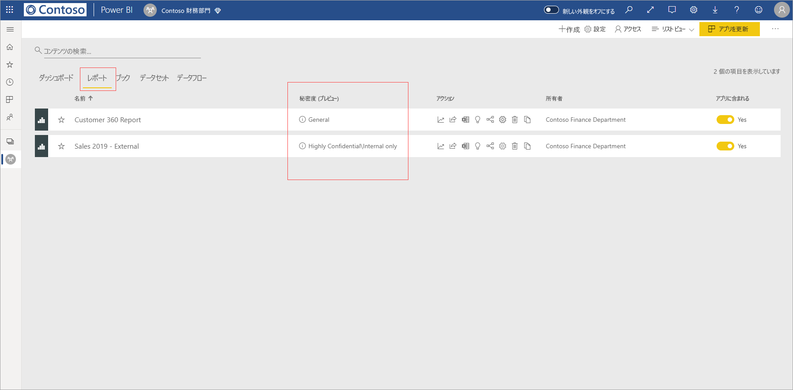
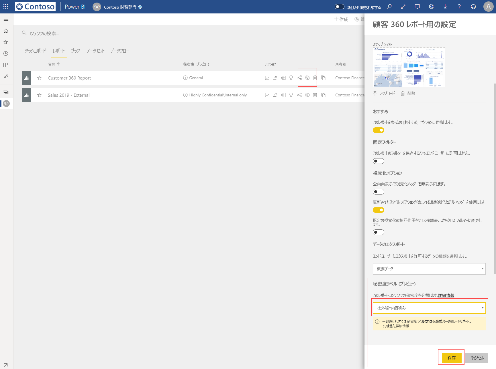
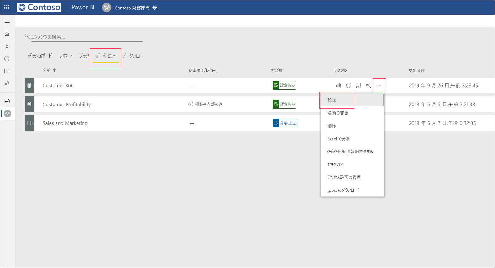

# Power BI 内でデータの秘密度ラベルを適用する

Microsoft Information Protection のレポート、ダッシュボード、データセット、データフローの秘密度ラベルでは、無許可のデータ アクセスや漏洩から秘密コンテンツを保護できます。 データ秘密度ラベルを使用してデータに正しくラベルを付けると、承認されたユーザーのみがデータにアクセスできるようになります。 この記事では、秘密度ラベルをコンテンツに適用する方法について説明します。

Power BI で秘密度ラベルを適用できるようにするには:
* ユーザーは、Power BI Pro ライセンスと、ラベルを付けるコンテンツに対する編集アクセス許可を持っている必要があります。
* ユーザーは、データ秘密度ラベルを適用するためのアクセス許可を持つセキュリティ グループに属している必要があります。詳しくは、「[Power BI 内でデータの秘密度ラベルを有効にする](../admin/service-security-enable-data-sensitivity-labels.md#enable-data-sensitivity-labels)」をご覧ください。
* [前提条件](../admin/service-security-data-protection-overview.md#requirements-for-using-sensitivity-labels-in-power-bi)と[ライセンス要件](../admin/service-security-data-protection-overview.md#licensing)がすべて満たされている必要があります。

Power BI のデータ秘密度ラベルの詳細については、「[Power BI におけるデータ保護の概要](../admin/service-security-data-protection-overview.md)」を参照してください。

## 秘密度ラベルを適用する

テナントでデータ保護が有効になっていると、ダッシュボード、レポート、データセット、データフローのリスト ビューの秘密度列に秘密度ラベルが表示されます。

**レポートまたはダッシュボードの秘密度ラベルを適用または変更するには**
1. **[その他のオプション (…)]** をクリックします。
1. **[設定]** を選択します。
1. 横にある設定ウィンドウで適切な秘密度ラベルを選択します。
1. 設定を保存します。

次の画像は、レポートでの手順を図示したものです。

**データセットまたはデータフローの秘密度ラベルを適用または変更するには**

1. **[その他のオプション (…)]** をクリックします。
1. **[設定]** を選択します。
1. 横にある設定ウィンドウで適切な秘密度ラベルを選択します。
1. 設定を適用します。

次の 2 つの画像は、データセットでの手順を図示したものです。

**[その他のオプション (…)]** を選択し、 **[設定]** を選択します。

設定ページで、秘密度ラベル セクションを開き、目的の秘密度ラベルを選択し、 **[適用]** をクリックします。

## 秘密度ラベルの削除
レポート、ダッシュボード、データセット、またはデータフローから秘密度ラベルを削除する場合は、[ラベルの適用で使用するのと同じ手順](#applying-sensitivity-labels)に従いますが、データの秘密度を分類するように求められたら、 **(なし)** を選択してください。 

## エクスポートされたファイルでのデータ保護

秘密度ラベルに関連付けられているデータ保護は、Excel、PowerPoint、PDF のファイルにエクスポートされるときにのみ、データに適用されます。 Excel で分析、.csv へのエクスポート、データセットのダウンロード (.pbix)、Power BI サービスのライブ接続、その他のあらゆるエクスポート形式には対応していません。 データ エクスポート オプションは Power BI テナント管理者の[エクスポート設定](../service-admin-portal.md#export-and-sharing-settings)によって制御されます。

Excel、PowerPoint、PDF のファイルに秘密度ラベルが設定されている[レポートからデータをエクスポートする](https://docs.microsoft.com/power-bi/consumer/end-user-export)と、生成後のファイルで秘密度ラベルが継承されます。 秘密度ラベルはファイルに表示され、ファイルへのアクセスは、十分なアクセス許可を持つユーザーに制限されます。

## 考慮事項と制限事項

次の一覧に、Power BI における秘密度ラベルの制限事項をいくつか示します。

**[全般]**
* 秘密度ラベルは、ダッシュボード、レポート、データセット、およびデータフローにのみ適用できます。 現在のところ、[ページ分割されたレポート](../paginated-reports/report-builder-power-bi.md)とブックでは使用できません。
* Power BI 資産の秘密度ラベルは、ワークスペースの一覧、系列ビュー、最近使用、アプリ ビューでのみ表示されます。現在のところ、"自分と共有" には表示されません。 ただし、Power BI 資産に適用されているラベルは、表示されない場合でも、Excel、PowerPoint、および PDF ファイルにエクスポートされたデータに常に保持されることに注意してください。
* 秘密度ラベルは、グローバル (パブリック) クラウド内のテナントに対してのみサポートされています。 秘密度ラベルは、他のクラウド内のテナントではサポートされません。
* データの秘密度ラベルは、テンプレート アプリではサポートされていません。 テンプレート アプリの作成者によって設定された秘密度ラベルは、アプリが抽出されてインストールされると削除されます。また、アプリ コンシューマーによってインストールされたテンプレート アプリの成果物に追加された秘密度ラベルは、アプリが更新されると失われます (リセットされて、なくなります)。
* Power BI では、[転送不可](https://docs.microsoft.com/microsoft-365/compliance/encryption-sensitivity-labels?view=o365-worldwide#let-users-assign-permissions)、[ユーザー定義](https://docs.microsoft.com/microsoft-365/compliance/encryption-sensitivity-labels?view=o365-worldwide#let-users-assign-permissions)、[HYOK](https://docs.microsoft.com/azure/information-protection/configure-adrms-restrictions) 保護の種類の秘密度ラベルがサポートされていません。 保護の種類である転送不可とユーザー定義は、[Microsoft 365 セキュリティ センター](https://security.microsoft.com/)または [Microsoft 365 コンプライアンス センター](https://compliance.microsoft.com/)で定義されているラベルを参照します。

**エクスポート**
* ラベルと保護の制御は、データが Excel、PowerPoint、PDF のファイルにエクスポートされるときにのみ適用されます。 ラベルと保護は、データが .csv ファイル、.pbix ファイル、Excel で分析、その他のエクスポート パスにエクスポートされるときは適用されません。
* エクスポート後のファイルに秘密度ラベルと保護を適用するとき、ファイルにコンテンツのマーキングが追加されることはありません。 ただし、コンテンツのマーキングを適用するようにラベルが構成されている場合、ファイルを Office デスクトップ アプリで開いたとき、Azure Information Protection 統合ラベル付けクライアントによって自動的に適用されます。 デスクトップ、モバイル、Web 向けアプリに組み込みのラベル付けを使用するとき、コンテンツのマーキングが自動的に適用されることはありません。 「[Office アプリがコンテンツのマーキングと暗号化を適用するとき](https://docs.microsoft.com/microsoft-365/compliance/sensitivity-labels-office-apps?view=o365-worldwide#when-office-apps-apply-content-marking-and-encryption)」を参照してください。
* Power BI からファイルをエクスポートしたユーザーには、秘密度ラベルの設定に従って、そのファイルにアクセスして編集するためのアクセス許可が与えられます。 データをエクスポートしたユーザーに、そのファイルに対する所有者のアクセス許可を与えられません。
* データがファイルにエクスポートされるとき、ラベルを適用できない場合、エクスポートに失敗します。 ラベルが適用できず、エクスポートに失敗したかどうかを確認するには、タイトル バーの中央にあるレポートまたはダッシュボードの名前をクリックし、情報ドロップダウンが開いたら、"秘密度ラベルを読み込めません" と表示されているか確認します。 適用後のラベルが公開されていないか、セキュリティ管理者によって削除されたか、システムに一時的な問題が発生した場合にこれが起こります。

## 次の手順

この記事では、Power BI 内でデータの秘密度ラベルを適用する方法を説明しました。 次の記事では、Power BI におけるデータ保護の詳細について説明しています。 

* [Power BI におけるデータ保護の概要](../admin/service-security-data-protection-overview.md)
* [Power BI 内でデータの秘密度ラベルを有効にする](../admin/service-security-enable-data-sensitivity-labels.md)
* [Power BI 内で Microsoft Cloud App Security の制御を使用する](../admin/service-security-using-microsoft-cloud-app-security-controls.md)