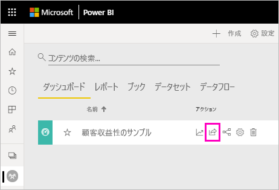
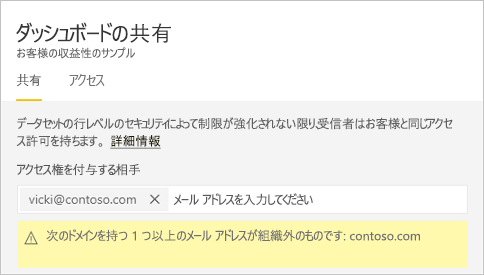
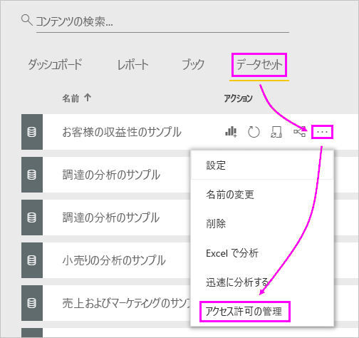
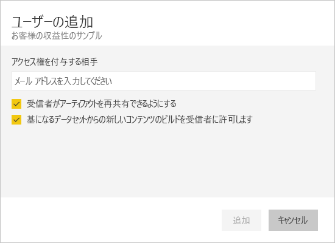

# 同僚や他のユーザーと Power BI ダッシュボードやレポートを共有する
"*共有*" は、自分のダッシュボードおよびレポートに他のユーザーがアクセスできるようにするのによい方法です。 Power BI では、[複数の異なる方法でダッシュボードでの共同作業を行ったり、ダッシュボードやレポートを配布](service-how-to-collaborate-distribute-dashboards-reports.md)したりできます。

共有を行うには、コンテンツの共有先が組織内でも組織外でも、共有元に [Power BI Pro ライセンス](../fundamentals/service-features-license-type.md)が必要です。 コンテンツが [Premium 容量](../admin/service-premium-what-is.md)にない限り、受信者には Power BI Pro ライセンスも必要です。 

Power BI サービスのほとんどの場所からダッシュボードとレポートを共有できます:所有者が許可している場合に、[お気に入り]、[最近使った項目]、[マイ ワークスペース]、および [自分と共有] ワークスペースで [[管理者]、[メンバー]、または [共同作成者] のロール](service-new-workspaces.md#roles-in-the-new-workspaces)をお持ちの場合は、他のワークスペースからも共有できます。 

ダッシュボードやレポートを共有する場合、共有した相手はそれを表示して操作することはできますが、編集することはできません。 共有先のユーザーには自分のダッシュボードおよびレポートに表示されるものと同じデータが表示され、基になるデータセットに行レベルのセキュリティ (RLS) が適用されていない限り、基になるデータセット全体にアクセスできます。  共有元のユーザーが許可した場合、共有先のユーザーも同僚と共有できます。 組織外のユーザーは、ダッシュボードやレポートを表示して操作することはできますが、他のユーザーと共有することはできません。 

Power BI Desktop から直接 "*共有*" することはできません。 Power BI サービスに、[Power BI Desktop からレポートを発行](../create-reports/desktop-upload-desktop-files.md)します。 しかし、[Power BI モバイル アプリからダッシュボードを共有](../consumer/mobile/mobile-share-dashboard-from-the-mobile-apps.md)できます。  

## ビデオ:ダッシュボードの共有
Amanda が社内および社外の同僚とダッシュボードを共有する様子をご覧ください。 その後、ビデオで説明されている手順に従って、ご自分でやってみてください。

<iframe width="560" height="315" src="https://www.youtube.com/embed/0tUwn8DHo3s?list=PL1N57mwBHtN0JFoKSR0n-tBkUJHeMP2cP" frameborder="0" allowfullscreen></iframe>

## ダッシュボードまたはレポートを共有する

1. ダッシュボードかレポートの一覧、または開いているダッシュボードかレポート内で、 **[共有]**  を選択します。

2. 上部のボックスに、個々のユーザーの完全なメール アドレス、配布グループ、またはセキュリティ グループを入力します。 動的配布リストと共有することはできません。 
   
   アドレスが組織外のユーザーとも共有できますが、警告が表示されます。 詳細については、この記事の[組織外の共有](#share-a-dashboard-or-report-outside-your-organization)に関するセクションを参照してください。
   
    
 
   >[!NOTE]
   >入力ボックスでは、最大 100 の個別のユーザーまたはグループがサポートされます。 より多くのユーザーと共有する方法については、この記事の [100 人を超えるユーザーとの共有](#share-with-more-than-100-separate-users)に関するセクションを参照してください。

3. 必要な場合はメッセージを追加します。 これはオプションです。
4. 同僚が他のユーザーとコンテンツを共有できるようにするには、 **[受信者がダッシュボードを共有できるようにする] または [受信者がレポートを共有できるようにする]** をオンにします。
   
   他のユーザーに共有を許可することを "*再共有*" と呼びます。 共有を許可すると、そのユーザーは Power BI サービスやモバイル アプリから再共有したり、組織内の他のユーザーにメール招待状を転送したりできます。 招待状は 1 か月後に期限が切れます。 組織外のユーザーは、再共有を行えません。 コンテンツの所有者として、再共有を無効にしたり、再共有を個別に取り消したりできます。 この記事の「[共有を停止または変更する](#stop-or-change-sharing)」を参照してください。

5. **[基になるデータセットからの新しいコンテンツのビルドをユーザーに許可します]** を選択すると、このダッシュボードのデータセットに基づいて、他のワークスペースに独自のレポートを作成できます。 詳細については、[さまざまなワークスペースからのデータセットに基づくレポートの作成](../connect-data/service-datasets-discover-across-workspaces.md)に関するセクションを参照してください。

1. **[共有]** を選択します。
   
   ![[共有] ボタンを選ぶ](media/service-share-dashboards/power-bi-share-dialog-share.png)  
   
   Power BI によって、共有コンテンツへのリンクを含むメール招待状が、グループではなく個人に送信されます。 **[成功]** 通知が表示されます。 
   
   組織内の受信者がリンクをクリックすると、Power BI はダッシュボードまたはレポートをそのユーザーの **[自分と共有]** リスト ページに追加します。 ユーザーが自分の名前を選択すると、そのユーザーと自分とで共有されているすべてのコンテンツが表示されます。 
   
   ![[自分と共有] リスト ページ](media/service-share-dashboards/power-bi-shared-with-me-new-look.png)
   
   組織外の受信者がリンクをクリックすると、ダッシュボードまたはレポートが表示されますが、通常の Power BI ポータルではありません。 詳細については、この記事の[組織外のユーザーとの共有](#share-a-dashboard-or-report-outside-your-organization)に関するセクションをご覧ください。

## ダッシュボードまたはレポートへのアクセス権があるユーザーを確認する
場合によっては、自分が共有している相手や、その相手が再共有しているユーザーを確認する必要があります。

1. ダッシュボードかレポートの一覧、またはダッシュボードかレポート自体で、 **[共有]**  を選びます。 
2. **[ダッシュボードの共有]** または **[レポートの共有]** ダイアログ ボックスで、 **[アクセス]** を選びます。
   
    ![[ダッシュボードの共有] ダイアログ ボックスの [アクセス] タブ](media/service-share-dashboards/power-bi-share-dialog-access.png)

    組織外のユーザーは、 **[ゲスト]** として一覧に含められます。

    このビューでは、この記事に説明するように[共有アクセス許可を停止または変更](#stop-or-change-sharing)することができます。 

## 組織外でダッシュボードまたはレポートを共有する
組織外のユーザーと共有する場合、共有されたダッシュボードまたはレポートへのリンクを含む電子メールが、共有相手に届きます。 共有相手は、Power BI にサインインして、共有されている内容を確認する必要があります。 共有相手は、Power BI Pro ライセンスを持っていない場合、リンクをクリックしたときにライセンスにサインアップできます。

共有相手がサインインすると、共有されたダッシュボードまたはレポートが、通常の Power BI ポータルではなく、共有相手の独自のブラウザー ウィンドウに表示されます。 後でこのダッシュボードまたはレポートにアクセスするには、リンクをブックマークする必要があります。

共有相手は、このダッシュボードまたはレポートのコンテンツを編集できません。 共有相手はグラフを操作して、フィルターやスライサーを変更できますが、その変更を保存することはできません。 

共有されたダッシュボードまたはレポートを表示するのは、直接の共有相手だけです。 たとえば、Vicki@contoso.com にメールを送信した場合、ダッシュボードを見ることができるのは Vicki だけです。 Vicki がリンクを転送したとしても、だれもダッシュボードを表示できません。 Vicki は、同じメール アドレスを使用してそれにアクセスする必要があります。Vicki が他のメール アドレスでサインインしても、ダッシュボードにアクセスすることはできません。

オンプレミスの Analysis Services の表形式モデルでロール レベルまたは行レベルのセキュリティが実装されている場合、組織外のユーザーにデータは何も表示されません。

配布グループではなく、セキュリティ グループを使用して、外部の電子メール アドレスを持つユーザーを含むグループと共有します。 配布グループの外部の電子メールを持っているユーザーは、Azure Active Directory (Azure AD) B2B ゲスト ユーザーでない限り、共有するコンテンツを表示することはできません。 [Azure AD B2B ゲスト ユーザー](../admin/service-admin-azure-ad-b2b.md)の詳細をご確認ください。

Power BI モバイル アプリから組織外のユーザーにリンクを送信した場合、そのリンクをクリックすると、ダッシュボードは Power BI モバイル アプリではなくブラウザーで開きます。

### 外部ユーザーにコンテンツの編集を許可する

Power BI 管理者は、組織内のコンテンツを編集および管理することを外部のゲスト ユーザーに許可することができます。 その場合、外部ユーザーには使用のみのエクスペリエンスは提供されません。 組織内のコンテンツを外部ユーザーは編集および管理できます。 詳細については、[Azure AD B2B で外部ゲスト ユーザーに Power BI コンテンツを配布する](../admin/service-admin-azure-ad-b2b.md)に関するページをご覧ください。

## 共有を停止または変更する
再共有をオンおよびオフにできるのは、ダッシュボードまたはレポートの所有者のみです。

### 共有の招待をまだ送信していない場合
* 招待を送信する前に、招待の下部にある **[受信者がダッシュボードを共有できるようにする] または [受信者がレポートを共有できるようにする]** チェック ボックスをオフにします。

### ダッシュボードまたはレポートを既に共有している場合
1. ダッシュボードかレポートの一覧、またはダッシュボードかレポート自体で、 **[共有]**  を選びます。 
2. **[ダッシュボードの共有]** または **[レポートの共有]** ダイアログ ボックスで、 **[アクセス]** を選びます。
   
    ![[ダッシュボードの共有] ダイアログ ボックスの [アクセス] タブ](media/service-share-dashboards/power-bi-share-dialog-access.png)
3. **[読み取りと共有し直し]** の横にある省略記号 **[...]** をクリックして、以下を選択します。
   
   ![[読み取りと共有し直し] の省略記号](media/service-share-dashboards/power-bi-change-access.png)
   
   * そのユーザーが他のユーザーと共有できないようにするには、 **[読み取り]** を選びます。
   * そのユーザーが共有されたコンテンツをまったく表示できないようにするには、 **[アクセスの削除]** を選びます。

4. **[アクセス許可の削除]** ダイアログ ボックスで、レポートやデータセットなど、関連するコンテンツへのアクセスも削除するかどうかを決定します。 警告アイコン ![[Power BI 警告アイコン]](media/service-share-dashboards/power-bi-warning-icon.png) が付いている項目を削除する場合は、関連するコンテンツも削除することをお勧めします。 そうしないと、正しく表示されません。

    

## 制限事項と考慮事項
ダッシュボードとレポートの共有について留意すべき事項:

* 同僚とダッシュボードを共有すると、基になるデータセットも共有されます。 [行レベル セキュリティ (RLS)](../admin/service-admin-rls.md) によってアクセスが制限されていない限り、同僚はデータセット全体にアクセスできます。 レポートの作成者は、列を非表示にする、視覚化上のアクションを制限するなど、レポートを表示したり、操作したりするときのユーザー エクスペリエンスをカスタマイズする機能を使用できます。 このようなカスタマイズされたユーザー エクスペリエンスによって、ユーザーがアクセスできるデータセットのデータが制限されることはありません。 個人の資格情報によってアクセスできるデータが決定されるように、データセットの[行レベルセキュリティ (RLS)](../admin/service-admin-rls.md) を使用します。
* ダッシュボードのすべての共有相手は、[読み取りビュー](../consumer/end-user-reading-view.md#reading-view)で表示し、関連するレポートを操作できます。 一般に、同僚はレポートを作成したり、既存のレポートへの変更を保存したりすることはできません。 ただし、 **[基になるデータセットからの新しいコンテンツのビルドをユーザーに許可します]** を選択すると、このダッシュボードまたはレポートのデータセットに基づいて、他のワークスペースに独自のレポートを作成できます。
* データセットを表示またはダウンロードすることはできませんが、Excel で分析機能を使ってデータセットに直接アクセスすることはできます。 管理者は、グループ内の全員に対して、Excel で分析を使う機能を制限できます。 ただし、これはそのグループ内の全員に対して、およびそのグループが属しているすべてのワークスペースに対して制限されます。
* [データの更新](../connect-data/refresh-data.md)はだれでも手動で行えます。
* メール用に Microsoft 365 を使用している場合は、配布グループに関連付けられたメール アドレスを入力することにより、配布グループのメンバーと共有できます。
* メール ドメインを共有している同僚と、ドメインが異なっていても同じテナント内に登録されている同僚は、他のユーザーとダッシュボードを共有できます。 たとえば、ドメイン contoso.com と contoso2.com が同じテナント内に登録されていて、ご自分の電子メール アドレスが konrads@contoso.com であるとします。 ravali@contoso.com と gustav@contoso2.com は両方とも、共有するためのアクセス許可が付与されていれば、ダッシュボードを共有できます。
* 同僚が既に特定のダッシュボードまたはレポートにアクセスできる場合は、ダッシュボードまたはレポートを使用しているときに URL をコピーすることで、直接リンクを送信できます。 たとえば、`https://powerbi.com/dashboards/g12466b5-a452-4e55-8634-xxxxxxxxxxxx` です。
* 同様に、同僚が特定のダッシュボードに既にアクセスできる場合は、[基になるレポートへの直接リンクを送信する](service-share-reports.md)ことができます。 

### 100 を超える個別のユーザーと共有する

最大で、1 回の共有アクションで 100 のユーザーまたはグループと共有できます。 ただし、項目へのアクセス権は、500 を超えるユーザーに付与できます。 いくつかの推奨事項を次に示します。

- 複数回共有するには、ユーザーを個別に指定します。
- すべてのユーザーを含むユーザー グループと共有します。 
- ワークスペースでレポートまたはダッシュボードを作成し、次にワークスペースからアプリを作成します。 アプリは他の多くのユーザーと共有できます。 詳細については、[Power BI でのアプリの発行](service-create-distribute-apps.md)に関するページをご覧ください。

## 共有のトラブルシューティング

### ダッシュボードの受信者に、タイルまたは「アクセス許可が必要」のメッセージにロック アイコンが表示される

共有相手がレポートを表示しようとしたときに、ダッシュボードにロックされたタイルが表示されたり、"アクセス許可が必要です" というメッセージが表示されたりすることがあります。

その場合は、基になるデータセットへのアクセス許可を共有相手に付与する必要があります。

1. コンテンツ リストの **[データセット]** タブに移動します。

1. データセットの横にある省略記号 ( **...** ) を選択してから、 **[アクセス許可の管理]** を選びます。

    

1. **[ユーザーの追加]** を選びます。

    ![[ユーザーの追加] を選択](media/service-share-dashboards/power-bi-share-dataset-add-user.png)

1. 個々のユーザーの完全なメール アドレス、配布グループ、またはセキュリティ グループを入力します。 動的配布リストと共有することはできません。

    

1. **[追加]** を選択します。

### ダッシュボードまたはレポートを共有できない

ダッシュボードまたはレポートを共有するには、基になるコンテンツ (つまり、関連するすべてのレポートやデータセット) を再共有するためのアクセス許可が必要です。 共有できないというメッセージが表示された場合は、レポートの作成者に、それらのレポートおよびデータセットを再共有するアクセス許可を依頼してください。

## 次の手順

* [ダッシュボードとレポートを共有する方法](service-how-to-collaborate-distribute-dashboards-reports.md)
* [フィルター処理された Power BI レポートの共有](service-share-reports.md)
* わからないことがある場合は、 [Power BI コミュニティを利用してください](https://community.powerbi.com/)。
