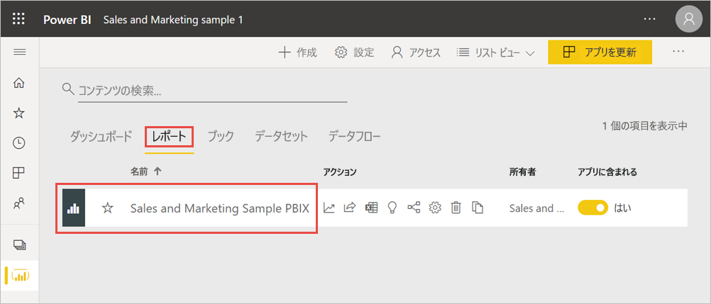
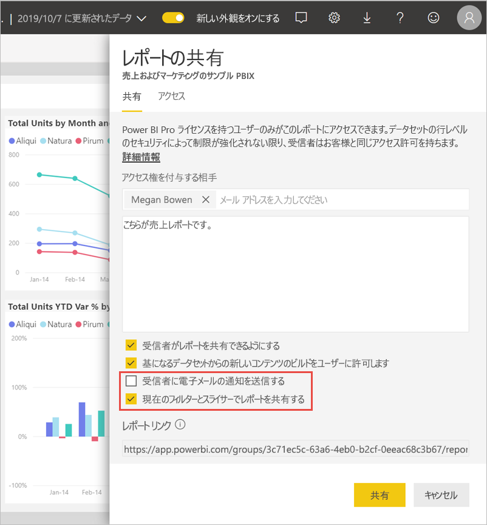
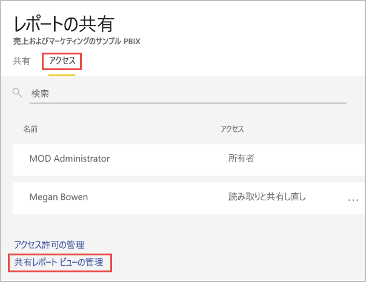

# Power BI レポートのフィルター処理と共有
"*共有*" は、自分のダッシュボードおよびレポートに他のユーザーがアクセスできるようにするのによい方法です。 フィルター処理されたバージョンのレポートを共有したい場合は、どうすればよいでしょうか。 特定の都市または営業担当者または年のデータのみをレポートに表示したい場合があります。 この記事では、レポートをフィルター処理し、フィルター処理されたバージョンのレポートを共有する方法について説明します。 フィルター処理されたレポートを共有するには、[レポートの URL にクエリ パラメーターを追加する](service-url-filters.md)方法もあります。 いずれの場合でも、受信者が最初にレポートを開くときにレポートがフィルター処理されます。 レポートのフィルター選択は、クリアすることができます。

Power BI では、[レポートの共同作業や配布を行う他の方法](service-how-to-collaborate-distribute-dashboards-reports.md)も用意されています。 共有する際、共有元と共有先の双方に [Power BI Pro ライセンス](../fundamentals/service-features-license-type.md)が必要です。または、コンテンツを [Premium 容量](../admin/service-premium-what-is.md)に格納する必要があります。 

## サンプル データに沿ってフォローする

この記事では、マーケティングと売上のサンプル テンプレート アプリを使用します。 試してみたいですか。 

1. [マーケティングと売上サンプル テンプレート アプリ](https://appsource.microsoft.com/product/power-bi/microsoft-retail-analysis-sample.salesandmarketingsample?tab=Overview)をインストールします。
2. アプリを選択し、 **[アプリを探索]** を選択します。

   

3. 鉛筆アイコンを選択して、アプリと共にインストールしたワークスペースを開きます。

    

4. ワークスペースのコンテンツ一覧で **[レポート]** を選択し、**売上およびマーケティングのサンプル PBIX** のレポートを選択します。

    

    これで、先に進むことができます。

## レポートにフィルターを設定する

[編集ビュー](../consumer/end-user-reading-view.md)でレポートを開き、フィルターを適用します。

この例では、マーケティングと売上サンプル テンプレート アプリの YTD Category ページをフィルター処理して、**Region** が **Central** と等しい値のみを表示しています。 
 
![[レポート フィルター] ウィンドウ](media/service-share-reports/power-bi-share-report-filter.png)

レポートを保存します。

## フィルター処理されたレポートを共有する

1. **[共有]** を選択します。

   ![[共有] を選択します。](media/service-share-reports/power-bi-share.png)

2. **[受信者に電子メールの通知を送信する]** をオフにして、代わりにフィルター処理されたリンクを送信できるようにします。また、 **[現在のフィルターとスライサーでレポートを共有する]** を選択し、 **[共有]** を選択します。

    

4. **[共有]** をもう一度選択します。

   ![[共有] を選択します。](media/service-share-reports/power-bi-share.png)

5. **[アクセス]** タブを選択し、 **[共有レポート ビューの管理]** を選択します。

    

6. 目的の URL を右クリックし、 **[リンクのコピー]** を選択します。

    

7. このリンクを共有すると、受信者にはフィルター処理されたレポートが表示されます。 

## 制限事項と考慮事項
レポートの共有について留意すべき事項:

* アクセス許可を管理する、レポートまたはダッシュボードを共有する、またはアプリを発行するという方法でデータセットを共有すると、[行レベルのセキュリティ (RLS)](../admin/service-admin-rls.md) によってアクセスが制限されない限り、データセット全体へのアクセスが付与されます。 レポートの作成者は、列を非表示にする、ビジュアル上のアクションを制限するなど、レポートを表示したり、操作したりするときのユーザー エクスペリエンスをカスタマイズする機能を使用できます。 そのようなカスタマイズされたユーザー エクスペリエンスによって、データ ユーザーがデータセットでアクセスできる対象が制限されることはありません。 個人の資格情報によってアクセスできるデータが決定されるよう、データセットの[行レベルセキュリティ (RLS)](../admin/service-admin-rls.md) を使用します。

## 次の手順
* [Power BI で作業を共有する方法](service-how-to-collaborate-distribute-dashboards-reports.md)
* [ダッシュボードの共有](service-share-dashboards.md)
* 他にわからないことがある場合は、 [Power BI コミュニティを利用してください](https://community.powerbi.com/)。
* ご意見およびご提案がある場合は、 [Power BI コミュニティ サイト](https://community.powerbi.com/)をご利用ください。
