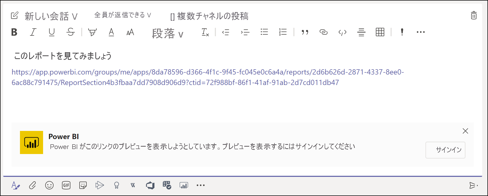
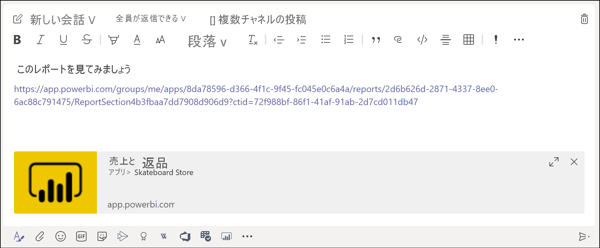
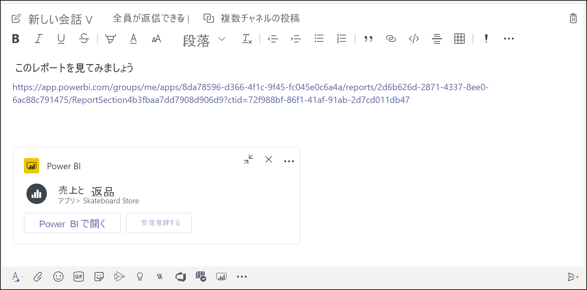

# Microsoft Teams で Power BI リンク プレビューを入手する

お客様のレポート、ダッシュボード、およびアプリへのリンクを Microsoft Teams のメッセージ ボックスに貼り付けると、リンクに関する情報がリンクのプレビューに表示されます。 リンク プレビューは、Power BI の次の項目に対して提供されます。

- Reports
- ダッシュボード
- アプリケーション

リンク プレビュー サービスでは、ユーザーのサインインが必要です。 サインアウトするには、メッセージ ボックスの下部にある **[Power BI]** アイコンを選択します。 その後、 **[サインアウト]** を選択します。

Power BI と Microsoft Teams がどのように連携するかの背景と満たす必要がある要件については、「[Microsoft Teams での Power BI を使用した共同作業](service-collaborate-microsoft-teams.md)」を参照してください。

## リンク プレビューを取得する

Power BI サービスのコンテンツのリンク プレビューを取得するには、次の手順に従ってください。

1. Power BI サービス内のレポート、ダッシュボード、またはアプリへのリンクをコピーします。 たとえば、ブラウザーのアドレス バーからリンクをコピーします。

1. そのリンクを Microsoft Teams のメッセージ ボックスに貼り付けます。 プロンプトが表示されたら、リンク プレビュー サービスにサインインします。 リンク プレビューが読み込まれるまで数秒待つことが必要になる場合があります。

    

1. サインインに成功すると、基本的なリンク プレビューが表示されます。

    

1. **[展開]** アイコンを選択して、リッチ プレビュー カードを表示します。

    ![[展開] アイコンのスクリーンショット。](media/service-teams-link-preview/service-teams-link-preview-expand-icon.png)

1. リッチ リンク プレビュー カードに、リンク ボタンと、関連するアクション ボタンが表示されます。

    

1. メッセージを送信します。

## 既知の問題と制限事項

- リンク プレビュー サービスでは、シングル サインオンはサポートされていません。
- リンク プレビューは、チャットまたはプライベート チャネルでは機能しません。
- その他の問題については、Microsoft Teams での共同作業に関する記事の「[既知の問題と制限事項](service-collaborate-microsoft-teams.md#known-issues-and-limitations)」セクションを参照してください。

## 次の手順

- [Microsoft Teams と Power BI で共同作業する](service-collaborate-microsoft-teams.md)

他にわからないことがある場合は、 [Power BI コミュニティで質問してみてください](https://community.powerbi.com/)。
