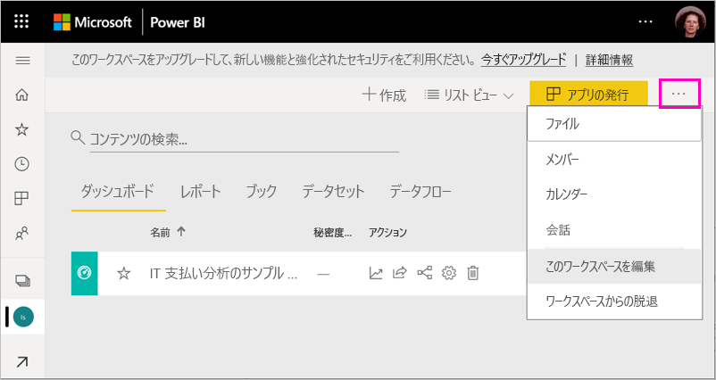
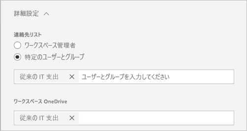

# Power BI でクラシック ワークスペースを新しいワークスペースにアップグレードする

この記事では、クラシック ワークスペースを新しいワークスペース エクスペリエンスにアップグレードする方法、つまり "*移行する*" 方法について説明します。 任意のクラシック ワークスペースをアップグレードすることができます。 新しいワークスペースにはより詳細なワークスペース ロールがあるため、コンテンツへのアクセスをより適切に管理できます。 また、ワークスペースが元の Microsoft 365 グループに緩く接続されているため、アップグレードされたワークスペースをより柔軟に管理することもできます。 詳細については、[新しいワークスペース エクスペリエンス](service-new-workspaces.md)に関する記事を参照してください。

>[!NOTE]
>ワークスペース アップグレードはパブリック プレビューとして利用できます。 

ただし、ワークスペースには、注意と計画が必要な変更が存在する場合があります。 たとえば、コンテンツ パックは、新しいワークスペース エクスペリエンスではサポートされていません。 この記事で後述する「[アップグレードに関する考慮事項と制限事項](#upgrade-considerations-and-limitations)」セクションを参照してください。

## アップグレード前に計画する必要のある事柄

アップグレード "*後*" に、いくつか作業を行う必要があります。 アップグレードする "*前*" に、それらを計画することをお勧めします。
- アクセスの一覧を確認し、[アップグレード後のアクセス許可](#permissions-after-upgrade)を理解します。
- [連絡先一覧](#modify-the-contact-list)を確認し、希望どおりに設定されていることを確認します。
- [新しいワークスペース エクスペリエンス](service-new-workspaces.md)をまだ確認していない場合は確認します。

## クラシック ワークスペースをアップグレードする

ワークスペース管理者はワークスペースをアップグレードできます。 クラシック ワークスペースの場合、ワークスペース管理者は、基になる Microsoft 365 グループの所有者である必要があります。 ワークスペースをアップグレードするには、次の手順を実行します。

1. ワークスペース コンテンツ リストで **[その他のオプション]** ( **...** ) > **[このワークスペースを編集]** を選択します。

    

1. **[詳細]** を展開し、 **[今すぐアップグレード]** を選択します。

    

1. ダイアログ ボックスの情報を確認します。 コンテンツ パックをワークスペースに発行した場合、またはインストールした場合は、警告が表示されます。 準備ができたら、 **[このワークスペースをアップグレードする準備ができました]** をオンにし、 **[アップグレード]** を選択します。

    

2. アップグレード中は、"**アップグレードしています**" というメッセージが表示されます。 通常、ワークスペースのアップグレードにかかる時間は 1 分未満です。

1. アップグレードが完了すると、 **[成功]** ダイアログ ボックスが表示されます。 自分の新しいワークスペース エクスペリエンスが、同じ名前と内容で表示されます。 新しいワークスペースとクラシック ワークスペースの違いについて理解できるように、「[Power BI の新しいワークスペースで作業を整理する](service-new-workspaces.md)」を読むことをお勧めします。

### 他のワークスペース ユーザーへの影響

ワークスペース内の項目をアクティブに表示または編集しているユーザーがあまりいない営業時間外にアップグレードすることをお勧めします。

ワークスペースをアクティブに使用しているユーザーには、ブラウザーを更新するように求められます。 レポートを編集しているユーザーには、更新前に保存するオプションが表示されます。

## アップグレードに関する考慮事項と制限事項

- アップグレード後、クラシック ワークスペースの内容が新しいワークスペースに表示されます。 これは、 **[自分と共有]** にも表示されます。
- ワークスペースの URL と ID、それに含まれるコンテンツ、およびワークスペースから発行されたアプリは変更されません。 ワークスペースにインストールされているコンテンツ パックのコンテンツは、個別に処理されます。 詳細については、この記事の「[アップグレード中のコンテンツ パック](#content-packs-during-upgrade)」を参照してください。
- コンテンツ パックは、新しいワークスペース エクスペリエンスではサポートされていません。 アップグレード中の処理方法については、「[発行済みコンテンツ パック](#published-content-packs)」または「[インストールされたコンテンツ パック](#installed-content-packs)」のセクションを参照してください。 アップグレードする前に、ワークスペースにインストールまたは発行されているコンテンツ パックを削除することをお勧めします。
- クラシック ワークスペースの Microsoft 365 グループは、Power BI のワークスペースのアップグレードの影響を受けません。 Microsoft 365 で管理されているすべての Teams、SharePoint サイト、メールボックス、またはその他のリソースは変更されません。 これらは、Power BI ワークスペースをアップグレードした後も残ります。 Microsoft 365 グループは、引き続き以前と同じように存在します。
- アップグレード後のワークスペースのセキュリティ保護方法には変更点があります。 詳細については、[アップグレード後のワークスペースのアクセス許可](#permissions-after-upgrade)に関するセクションを参照してください。
- 必要な場合に備えて、**クラシック ワークスペースに戻る**オプションが用意されています。 ただし、アップグレード前にワークスペースの一部の側面が完全に復元されるわけではありません。 新しいワークスペース エクスペリエンスでのみ動作する機能を使用する場合は、元に戻すことはできません。 戻るオプションは、アップグレードから 30 日間使用できます。

## アップグレード後のアクセス許可

アップグレード後のアクセス許可を確認するには、ワークスペース コンテンツ リストの上部にあるメニュー バーの **[アクセス]** を選択します。

![メニュー バーの [アクセス]](media/service-upgrade-workspaces/power-bi-workspace-access-menu-bar.png)

各 Microsoft 365 グループの所有者は、アップグレードされたワークスペースの管理者ロールに個別に追加されます。 Microsoft 365 グループ自体はワークスペース ロールに追加されます。 追加されるロールは、クラシック ワークスペースが "*読み取り専用*" か "*読み取り/書き込み*" かによって変わります。

- ワークスペースが **[メンバーは Power BI コンテンツを編集できます]** に設定されている場合は、アップグレード後、Microsoft 365 グループは**メンバー** ロールでワークスペース アクセス リストに追加されます。
- ワークスペースが **[メンバーは Power BI コンテンツの表示のみができます]** に設定されている場合は、アップグレード後、Microsoft 365 グループは**ビューアー** ロールでワークスペース アクセス リストに追加されます。

Microsoft 365 グループにはワークスペースでロールが与えられているため、アップグレード後に Microsoft 365 グループに追加されたすべてのユーザーには、ワークスペースでそのロールが割り当てられます。 ただし、アップグレード後に Microsoft 365 グループに新しい所有者を追加した場合は、ワークスペースの管理者ロールは割り当てられません。

### アップグレード前と後のロールの相違点

ワークスペース ロールは、クラシック ワークスペースと新しいワークスペースで異なります。 新しいワークスペース エクスペリエンスを使用すると、Microsoft 365 グループ、セキュリティ グループ、または配布リストにワークスペースのロールを与えることができます。

- **メンバー**は、個々の項目を共有し、メンバー、共同作成者、またはビューアー ロールを使用してワークスペース全体にアクセス権を付与することができます。
- **ビューアー**はコンテンツの表示のみ可能であり、ビルド アクセス許可が付与されていなければ、基になるデータをエクスポートしたり、Excel でワークスペース データセットを分析したりすることはできません。

共有またはアプリのアクセス許可を介してワークスペース内の項目にアクセス権を持つユーザーは、引き続きそれらの項目にアクセスできます。 ワークスペースへのアクセス権を持つユーザーは、そのワークスペースから発行されたアプリにアクセスできます。 こうしたユーザーは、アプリのアクセス リストに表示されません。

新しい共同作成者ロールを使用するかどうかを評価することをお勧めします。 アップグレード後、[アクセス] ペインで共同作成者ロールを持つように Microsoft 365 グループを変更できます。

アップグレード後、個々のユーザーにロールを割り当てることでアクセスを管理する代わりに、ワークスペース管理者向けのセキュリティまたは Microsoft 365 グループまたは配布リストの作成を検討することをお勧めします。

詳細については、「[新しいワークスペースのロール](service-new-workspaces.md#roles-in-the-new-workspaces)」を参照してください。

## アップグレード後のライセンス

管理者、メンバー、または共同作成者のワークスペース ロールのユーザーは、ワークスペースにアクセスするには Power BI Pro ライセンスが必要です。

ワークスペースが共有容量内にある場合は、ビューアー ワークスペース ロールのユーザーにも、ワークスペースにアクセスできる Power BI Pro ライセンスが必要です。 ただし、ワークスペースが Premium 容量内にある場合は、ビューアー ロールのユーザーには、ワークスペースにアクセスできる Pro ライセンスは必要ありません。

## その他の新しいワークスペース機能

新しいワークスペースのエクスペリエンスには、クラシック ワークスペースにはない機能があります。 相違点の 1 つは、ワークスペースの管理者または所有者とは異なる連絡先一覧を設定できることです。 類似点の 1 つは、Microsoft 365 グループの SharePoint ドキュメント ライブラリにまだ接続されていることです。

### 連絡先一覧を変更する

1. ワークスペースの設定にアクセスするには、ワークスペースのコンテンツの一覧の上部にあるメニュー バーの **[設定]** を選択します。

    ![メニュー バーでの [設定] の選択が表示されているスクリーンショット。](media/service-upgrade-workspaces/power-bi-new-workspace-settings.png)

2. **[詳細]** では、ワークスペースの **[連絡先一覧]** は、ワークスペースのアップグレード元である Microsoft 365 グループになるように構成されます。 連絡先一覧にユーザーまたはグループを追加したり、ワークスペース管理者に切り替えたりすることができます。

    

### ワークスペースの OneDrive 

アップグレード後、ワークスペースの **[OneDrive]** は、Microsoft 365 グループの SharePoint ドキュメント ライブラリに接続されます。 このドキュメント ライブラリは、 **[データの取得] > [ファイル]** エクスペリエンスの **[OneDrive]** オプションとして表示されます。 Microsoft 365 グループに属していないすべてのワークスペース ユーザーが、そのドキュメント ライブラリに対するアクセス許可を持っているとは限りません。

## アップグレード中のコンテンツ パック

新しいワークスペース エクスペリエンスでは、コンテンツ パックがサポートされていません。 代わりに、アプリと共有データセットを使用して、ワークスペースにコンテンツを配布します。 アップグレードする前に、発行済みまたはインストール済みのコンテンツ パックをワークスペースから削除することをお勧めします。 ただし、アップグレード時に発行済みまたはインストール済みコンテンツ パックがある場合、この記事で後述するように、アップグレード プロセスではコンテンツの保持が試行されます。  コンテンツ パックや、コンテンツとコンテンツ パックの関連付けをアップグレード後に復元する方法はありません。

### 発行済みコンテンツ パック

ワークスペースから発行されたコンテンツ パックは、アップグレード中に削除されます。 クラシック ワークスペースに戻す場合でも、アップグレード後に発行または更新することはできません。 他のユーザーが自分のワークスペースにコンテンツ パックをインストールしている場合、アップグレード後は、そのワークスペースにコンテンツ パックのコンテンツのコピーが表示されます。 詳細については、「**インストールされたコンテンツ パック**」セクションを参照してください。

### インストールされたコンテンツ パック

ワークスペースをアップグレードするか、コンテンツ パックの発行元のワークスペースをアップグレードすると、インストール済みコンテンツ パックに重要な変更が加えられます。 アップグレード後、ワークスペースにはコンテンツ パックのコンテンツのコピーが含まれます。 元のワークスペースの元のデータセットに接続されます。

ただし、重要な変更点があります。

- コンテンツ パックが更新された場合、コンテンツは更新されなくなります。
- URL と項目識別子は変更されるため、他のユーザーと共有したブックマークまたはリンクは更新する必要があります。
- ワークスペースから元のコンテンツ パックに対するユーザーのカスタマイズはすべて失われます。 カスタマイズには、サブスクリプション、アラート、個人用ブックマーク、永続的なフィルター、お気に入りが含まれます。
- 新しいユーザーには、コンテンツ パックに含まれていたデータセットへのアクセス権がない可能性があります。 ワークスペース ユーザーがデータにアクセスできるようにするには、データセット所有者と連携する必要があります。

## クラシック ワークスペースに戻る

アップグレード エクスペリエンスの一部として、アップグレードから 30 日間、クラシックワークスペースに戻ることができるオプションがあります。 この機能を使うと、ワークスペース コンテンツと元の Microsoft 365 グループとの関連付けが復元されます。 組織が新しいワークスペース エクスペリエンスを使用して大きな問題が発生した場合に利用できます。 ただし、制限事項があります。 まずこの記事の「[クラシックに切り替える場合の考慮事項](#considerations-for-switching-back-to-classic)」を参照してください。

戻すには、アップグレード前にそのワークスペースが関連付けられていた Microsoft 365 グループの所有者である必要があります。 次の手順に従います。

1. ワークスペース コンテンツ リストで **[その他のオプション]** ( **...** ) > **[ワークスペースの設定]** を選択します。

    ![[その他のオプション (…)]、[ワークスペースの設定] の選択が表示されているスクリーンショット。](media/service-upgrade-workspaces/power-bi-workspace-settings-more-options.png)

1. **[詳細]** を展開し、 **[クラシックに切り替える]** を選択します。 このオプションを利用できない場合は、この記事の「[クラシックに切り替える場合の考慮事項](#considerations-for-switching-back-to-classic)」を参照してください。

    

1. 準備ができたら、 **[クラシックに戻す準備ができました]** チェック ボックスをオンにし、 **[クラシックに切り替える]** を選択し ます。 このダイアログ ボックスには、警告またはブロッカーが表示されることがあります。 このような問題が発生した場合は、この記事の[切り替える場合の考慮事項](#considerations-for-switching-back-to-classic)を参照してください。

    

1. 切り替えが完了すると、確認のダイアログ ボックスが表示されます。

    

### クラシックに切り替える場合の考慮事項

ワークスペースに関する次のいずれかの文に該当する場合、切り替えることはできません。

- Microsoft 365 グループは削除されました。
- アップグレードから 30 日を超える日数が経過しています。
- ワークスペース内のデータセットは、他のワークスペースのレポートまたはダッシュボードによって使用されています。 どのような場合にこうなるでしょうか。 たとえば、アップグレード前にワークスペースからコンテンツ パックを発行し、誰かが別のワークスペースにコンテンツ パックをインストールしたとします。 アップグレードの直後に、データセットはそのコンテンツ パックのレポートとダッシュボードによって使用されます。
- ワークスペースは、アプリケーションのライフサイクル管理パイプラインの一部です。
- ワークスペースは、テンプレート アプリに使用されています。
- ワークスペースには、大規模なモデル機能が使用されています。
- ワークスペースには、新しい使用状況メトリック機能が使用されています。

クラシック ワークスペースに切り替えても、元のワークスペースの正確なコピーは復元されません。 次のような変更が発生します。

- ワークスペースのアクセス許可は、アップグレードされたワークスペースがもともと接続されていた Microsoft 365 グループによって設定されます。
  - Microsoft 365 グループのすべての管理者は、クラシック ワークスペースの管理者になります。
  - Microsoft 365 グループのすべてのメンバーは、クラシック ワークスペースのメンバーになります。 クラシック ワークスペースが **[メンバーは Power BI コンテンツの表示のみができます]** に設定されている場合、その設定は復元されます。
  - アップグレードの完了後にワークスペースに追加されたすべてのユーザーまたはユーザー グループ (Microsoft 365 グループ以外) は、ワークスペースへのアクセス権を失います。 アクセス権を付与するには、Microsoft 365 グループに追加してください。 Microsoft 365 グループでは、メンバーシップにセキュリティ グループまたは配布グループを入れ子にすることはできないことに注意してください。
  - ワークスペースのアプリへのアクセス権を付与されたユーザーは、引き続きアプリにアクセスできます。
  - 共有を介してワークスペース内の項目へのアクセス権を付与されたユーザーは、引き続きそれらにアクセスできます。
- アップグレード前にクラシック ワークスペースから発行されたコンテンツ パックは復元されません。
- アップグレード前にクラシックワークスペースにインストールされたコンテンツ パックは復元されません。
- アップグレード後にワークスペース内のユーザーによって作成されたサブスクリプションは削除されます。 アップグレード前に存在していたサブスクリプションは引き続き正常に動作します。
- データ アラートは保存されません。 これらは削除されます。
- アップグレード後にワークスペースの名前を変更した場合、ワークスペースの名前は Microsoft 365 グループの名前と一致するように復元されます。
- 更新などの進行中の操作は、ワークスペースのアップグレードの影響を受けません。

## テナントの新しいワークスペースへの移行を管理する 

組織によっては、多数またはすべてのワークスペースを新しいワークスペース エクスペリエンスに移行することを望んでいます。 ワークスペース アップグレード ツールは、ワークスペース管理者がアップグレードできるようにすることに重点を置いています。 このようなプロセスを管理する組織では、次の手順を実行できます。

1. Power BI 管理ポータルのワークスペース一覧とそれに対応する API によって、Power BI のすべてのワークスペースの一覧が得られます。 クラシック ワークスペースは、一覧に "グループ" という種類で表示されます。
2. 個々のグループ所有者、または Microsoft 365 の管理者と連携して、ワークスペースをアップグレードさせます。 ワークスペースをアップグレードする場合は、グループの所有者である必要があります。

ワークスペースのアップグレード機能には、一括アップグレードまたはプログラムによるアップグレード用のツールが用意されていません。 また、組織に作成された新しい Microsoft 365 グループは、Power BI に引き続き表示されます。
   
   
## 既知の問題

アップグレード後に発生可能性がある、次のような既知の問題がいくつかあります。
- "モデルを読み込めませんでした" という警告ダイアログが表示されることがあります。 このメッセージは誤表示であり、無視してかまいません。 
- アップグレード後、一部のワークスペース名がアップグレード前と変わります。 この場合、ワークスペース名は以前のワークスペース名に戻ったか、空になります。 この問題は、ワークスペースの名前を希望の名前に変更することで解決します。
- コンテンツ パックがインストールされたワークスペースに、アップグレード前には表示されていなかったダッシュボードが追加されていることがあります。 この場合、コンテンツ パックが最近更新されていない可能性があります。 そのようなダッシュボードは安全に削除できます。

## 次の手順

* [新しいワークスペース エクスペリエンスで作業を整理する](service-new-workspaces.md)
* [新しいワークスペースを作成する](service-create-the-new-workspaces.md)
* [従来のワークスペースを作成する](service-create-workspaces.md)
* わからないことがある場合は、 [Power BI コミュニティで質問してみてください](https://community.powerbi.com/)。
