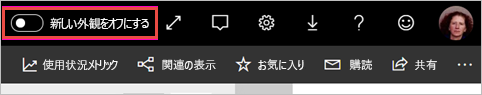
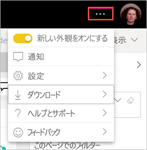

# ワークスペースの "新しい外観" を選択する (プレビュー)

ワークスペースには、Power BI サービスの[新しい外観](../consumer/service-new-look.md)と一致する新しい外観があります。 Power BI サービス (app.powerbi.com) を使用するユーザーなら、だれでも選択できます。 黒のヘッダー バーで **[新しい外観]** をオンにすると、レポートとワークスペースに対して新しい外観を選択できます。 クラシック ワークスペースと新しいワークスペースの両方ともすべて、新しい外観を活用できます。

**Power BI Desktop** の新しい外観に関する情報をお探しですか?  「[Power BI Desktop で更新されたリボンを使用する](../create-reports/desktop-ribbon.md)」を参照してください。

## 新しい外観の機能

:::image type="content" source="media/service-workspaces-new-look/power-bi-workspace-new-look-numbered.png" alt-text="ワークスペースの新しい外観と説明用のコールアウト番号":::

|数値  |使い方 |
|---------|---------|
|    | **データの取得**: ワークスペースにコンテンツを簡単に追加できます。 データへの接続、ファイルを開く操作、レポートやダッシュボードの作成などを実行するには、 **[+ 新規]** を選択します。  |
|   | **ビューの切り替え**: データフロー、データセット、レポート、ダッシュボードの間の接続と、それらから他のデータ ソースへの接続を表示するには、 **[リスト]** ビューと **[系列]** ビューを切り替えます。 |
|  | **ワークスペース内の検索**: 新しい検索ボックスで、ワークスペース内のすべてのコンテンツを検索します。  |
|   | **リストとタブ**: ワークスペース内のすべてのコンテンツが、SharePoint のように、ダッシュボード、レポート、データセットなどの単純なリストに入っています。 空かもしれない**ダッシュボード** タブでワークスペースを開いたり、コンテンツの場所を心配したりする必要がなくなります。 新しいタブの順序は次のとおりです。  **[すべて]** : ワークスペース内のすべてのコンテンツ (ダッシュボード、レポート、ブック、ページ分割されたレポート、データセット、データフロー) を表示します。  **Content**: ワークスペース内で使用するために作成されたすべてのコンテンツ (ダッシュボード、レポート、ブック、ページ分割されたレポート) を収集します。  **データセット + データフロー**: データ管理を簡単にするために、ワークスペース内のすべてのデータセットとデータフローを収集します。 |
|  | **フィルター**: 成果物が何百もあるワークスペースでは、[フィルター] ウィンドウでコンテンツをフィルター処理できます。 フィルターが適用されると、コンテンツ リストの上部にフィルターが表示されます。 |

**クイック アクション**: リスト内のコンテンツにマウス ポインターを合わせると、その項目に対して最も一般的な操作が表示されます。また、 **[その他のオプション]** (...) メニューで利用できるその他のアクションも表示されます。

:::image type="content" source="media/service-workspaces-new-look/power-bi-workspace-new-look-quick-actions.png" alt-text="新しいワークスペースでのクイック アクション":::

## 新しい外観を選択する

Power BI サービスのすべてのユーザーは、新しい外観を選択できます。 **[新しい外観をオフにする]** を **[新しい外観をオンにする]** にスライドさせるだけです。

以前の外観に戻す必要がある場合は、![[新しい外観をオンにする]](media/service-workspaces-new-look/power-bi-new-look-toggle-on.png) をスライドして**オフ**に戻すだけです。 表示されない場合は、右上隅にある省略記号メニューを選択します。

## 次の手順

- [Power BI Desktop で更新されたリボンを使用する](../create-reports/desktop-ribbon.md)
- [Power BI サービスの "新しい外観"](../consumer/service-new-look.md)
- わからないことがある場合は、 [Power BI コミュニティを利用してください](https://community.powerbi.com/)。
