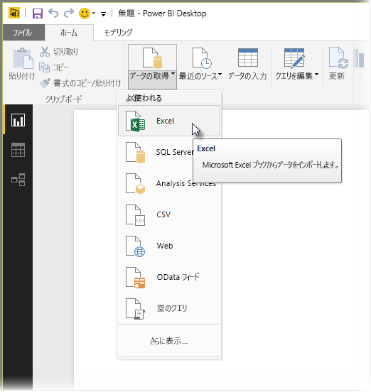

# Power BI Desktop で Excel ブックに接続する
Power BI Desktop から Excel ブックには簡単に接続できます。この記事ではその手順を説明します。

Power BI Desktop の **[ホーム]** リボンで、 **[データの取得]、[Excel]** の順に選択します。

表示される **[開く]** ダイアログでブックを選択します。
![[開く] ダイアログのスクリーンショット。](media/desktop-connect-excel/connect_to_excel_2.png)

**[ナビゲーター]** ウィンドウにブックの他のデータ要素のテーブルが表示されます。 左側のウィンドウでテーブルを選択すると、右側のウィンドウにデータのプレビューが表示されます。

![[ナビゲーター] ウィンドウのスクリーンショット。](media/desktop-connect-excel/connect_to_excel_3.png)

[読み込み] ボタンを選択してデータをインポートできます。または、Power BI Desktop に取り込む前に **[クエリ エディター]** を使ってデータを編集したい場合は、 **[編集]** ボタンを選択します。

データを読み込むと、Power BI Desktop の **[読み込み]** ウィンドウにデータの読み込みに関連するアクティビティが表示されます。  

![[読み込み] ウィンドウのスクリーンショット。](media/desktop-connect-excel/connect_to_excel_4.png)

終了すると、Power BI Desktop の右側の **[フィールド]** ウィンドウに、Excel ブックからインポートされたテーブルとフィールドが表示されます。

![[フィールド] ウィンドウのスクリーンショット。](media/desktop-connect-excel/connect_to_excel_5.png)

これで完了です。

Power BI Desktop で Excel ブックからインポートしたデータを使用して、表示やレポートを作成したり、他の Excel ブック、データベース、他のデータ ソースなどの他のデータに接続してインポートしたりできます。

## 次の手順
Power BI Desktop を使用して接続できるデータの種類は他にもあります。 データ ソースの詳細については、次のリソースを参照してください。

* [Power BI Desktop とは何ですか?](../fundamentals/desktop-what-is-desktop.md)
* [Power BI Desktop のデータ ソース](desktop-data-sources.md)
* [Power BI Desktop でのデータの整形と結合](desktop-shape-and-combine-data.md)
* [Power BI Desktop で CSV ファイルに接続する](desktop-connect-csv.md)   
* [Power BI Desktop にデータを直接入力する](desktop-enter-data-directly-into-desktop.md)   
