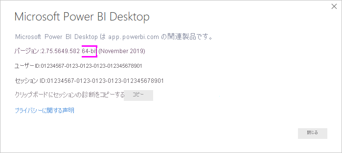
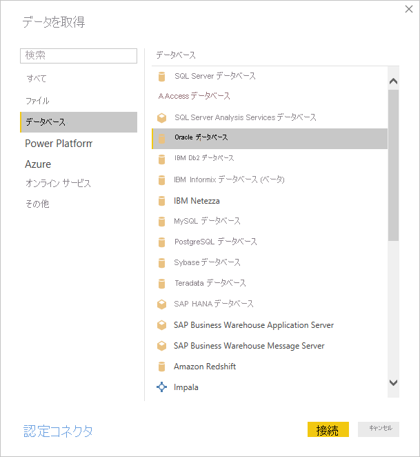
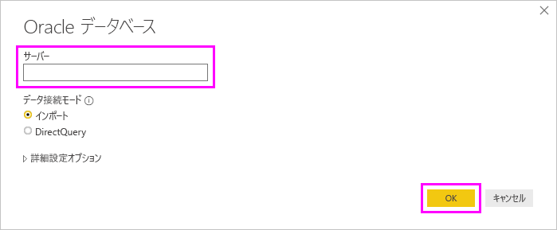

# Oracle データベースへの接続
Power BI Desktop を使用して Oracle データベースに接続するには、Power BI Desktop を実行しているコンピューター上に適切な Oracle クライアント ソフトウェアをインストールする必要があります。 使用する Oracle クライアント ソフトウェアは、インストールした Power BI Desktop のバージョンによって異なります。32 ビットまたは 64 ビット。

サポートされている Oracle のバージョン: 
- Oracle 9 以降
- Oracle クライアント ソフトウェア 8.1.7 以降

> [!NOTE]
> Power BI Desktop、オンプレミス データ ゲートウェイ、または Power BI Report Server 用に Oracle データベースを構成する場合は、[Oracle の接続の種類](https://docs.microsoft.com/sql/reporting-services/report-data/oracle-connection-type-ssrs?view=sql-server-ver15)に関する記事の情報を参照してください。 

## インストールされている Power BI Desktop バージョンの特定
どのバージョンの Power BI Desktop がインストールされているかを特定するには、 **[ファイル]**  >  **[ヘルプ]**  >  **[バージョン情報]** の順に選択し、次に **[バージョン]** 行を確認します。 次の図の場合、Power BI Desktop の 64 ビット バージョンがインストールされています。

## Oracle クライアントのインストール
- Power BI Desktop の 32 ビット バージョンの場合、[32 ビット Oracle クライアントをダウンロードし、インストールします](https://www.oracle.com/technetwork/topics/dotnet/utilsoft-086879.html)。

- Power BI Desktop の 64 ビット バージョンの場合、[64 ビット Oracle クライアントをダウンロードし、インストールします](https://www.oracle.com/database/technologies/odac-downloads.html)。

> [!NOTE]
> Oracle クライアントのセットアップ中に、セットアップ ウィザードの該当するチェック ボックスをオンにすることで、*コンピューター全体のレベルで ODP.NET および/または Oracle Providers for ASP.NET の構成*を有効にする必要があります。 Oracle クライアント ウィザードの一部のバージョンでは、既定でチェックボックスがオンになっていますが、他のバージョンではそうなっていません。 Power BI が Oracle データベースに接続できるように、チェックボックスがオンになっていることを確認してください。

## Oracle データベースへの接続
一致する Oracle クライアント ドライバーをインストールした後、Oracle データベースに接続できます。 接続するには、次の手順を実行します。

1. **[ホーム]** タブで **[データを取得]** を選択します。 

2. 表示される **[データを取得]** ウィンドウで、 **[その他]** (必要に応じて) を選択し、 **[データベース]**  >  **[Oracle Database]** を選択し、 **[接続]** を選択します。
   
   
2. 表示される **[Oracle Database]** ダイアログで**サーバー**の名前を指定し、 **[OK]** を選択します。 SID が必要な場合、次の形式を使用して指定できます: "*サーバー名/SID*"。*SID* はデータベースの一意名です。 "*サーバー名/SID*" の形式で正しく動作しない場合は、"*サーバー名/サービス名*" を使用します。"*サービス名*" は接続に使用した別名です。

   

   > [!TIP]
   > この手順で接続に問題がある場合は、 **[サーバー]** フィールドで次の形式を使ってみてください。 *(DESCRIPTION=(ADDRESS=(PROTOCOL=TCP)(HOST=host_name)(PORT=port_num))(CONNECT_DATA=(SERVICE_NAME=service_name)))*
   
3. ネイティブ データベース クエリを使用してデータをインポートする場合、 **[Oracle Database]** ダイアログで **[詳細オプション]** セクションを展開すると表示される、 **[SQL ステートメント]** ボックスにクエリを入力します。
   
   ![[詳細オプション] の展開](media/desktop-connect-oracle-database/connect-oracle-database_4.png)
4. **[Oracle Database]** ダイアログに Oracle データベース情報 (SID やネイティブ データベース クエリなどの省略可能な情報を含む) を入力した後、 **[OK]** を選択して接続します。
5. Oracle データベースがデータベース ユーザー資格情報を必要とする場合、ダイアログで指示が表示されたら資格情報を入力します。

## トラブルシューティング

Microsoft Store から Power BI Desktop をダウンロードした場合、Oracle ドライバーの問題により Oracle データベースに接続できない可能性があります。 この問題が発生した場合は、次のエラー メッセージが返されます: "*オブジェクト参照が設定されていません*"。 この問題に対処するには、次のいずれかの手順を行ってください。

* Microsoft Store ではなく、[ダウンロード センター](https://www.microsoft.com/download/details.aspx?id=58494)から Power BI Desktop をダウンロードします。

* Microsoft Store から取得したバージョンを使用する場合は、ご利用のローカル コンピューター上で、_12.X.X\client_X_ から _12.X.X\client_X\bin_ に oraons.dll をコピーします。_X_ はバージョンまたはディレクトリ番号を表します。

Oracle データベースへの接続時に Power BI Gateway に "*オブジェクト参照が設定されていません*" というエラー メッセージが表示される場合は、「[データ ソースの管理 - Oracle](service-gateway-onprem-manage-oracle.md)」に記載されている手順に従ってください。

Power BI Report Server を使用している場合は、[Oracle の接続の種類](https://docs.microsoft.com/sql/reporting-services/report-data/oracle-connection-type-ssrs?view=sql-server-ver15)に関する記事のガイダンスを参照してください。
