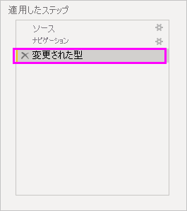
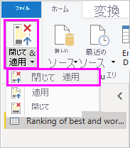
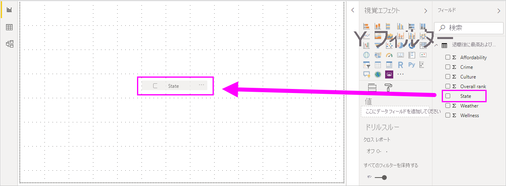
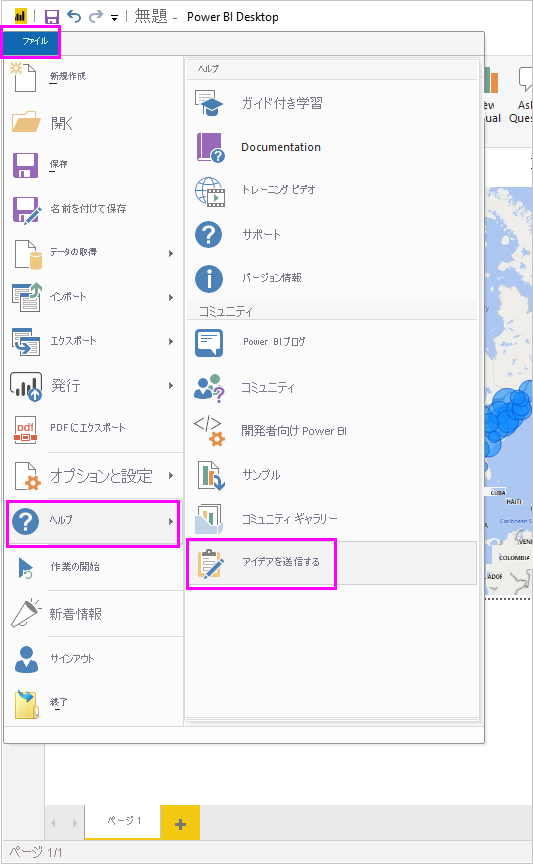

# Power BI Desktop のデータ ソースへの接続

Power BI Desktop を使用すれば、拡大し続けるデータの世界に簡単につながることができます。 Power BI Desktop をお持ちでない場合は、[ダウンロード](https://go.microsoft.com/fwlink/?LinkID=521662)してインストールできます。

Power BI Desktop では、 *あらゆる種類* のデータ ソースを使用できます。 次の図では、 **[データを取得]**  >  **[その他]**  >  **[Web]** を選択することによってデータに接続する方法を示します。

## データへの接続方法の例

この例では、 **Web** データ ソースに接続します。

自分が退職することを想像してみてください。 あなたは、陽当たりが良く、税額があまり高くなくて、医療が充実した場所への転居を考えています。 あるいは、データ アナリストとして、顧客のサポートにそのような情報を必要としているかもしれません。 あなたはデータ アナリストで、たとえばレインコート製造業者のクライアントが雨の "*多い*" 場所で販売できるよう、顧客のためにそのような情報を必要としています。

いずれの場合も、これらのトピックやその他のトピックに関する興味深いデータを含んだ Web リソースを見つけます。

[https://www.bankrate.com/finance/retirement/best-places-retire-how-state-ranks.aspx](https://www.bankrate.com/finance/retirement/best-places-retire-how-state-ranks.aspx)

**[データを取得]**  >  **[その他]**  >  **[Web]** を選択します。 **[Web から]** で、アドレスを入力します。

**[OK]** をクリックすると、Power BI Desktop の*クエリ*機能が動作します。 Power BI Desktop は Web リソースにアクセスし、 **[ナビゲーター]** ウィンドウにその Web ページで検出した結果が返されます。 この場合は、テーブルと Document 全体が検出されました。 テーブルに興味があるので、一覧からテーブルを選択します。 **[ナビゲーター]** ウィンドウにプレビューが表示されます。

この時点で、ウィンドウの下部にある **[データの変換]** を選択して、テーブルを読み込む前にクエリを編集することも、テーブルを単に読み込むこともできます。

**[データの変換]** を選択して、テーブルを読み込み、Power Query エディターを起動します。 **[クエリの設定]** ペインが表示されます。 表示されない場合は、リボンから **[表示]** を選択し、 **[クエリの設定]** を選択して、 **[クエリの設定]** ペインを表示します。 表示は次のようになります。

これらのスコアはすべて数値ではなくテキストになっています。ですが、必要なのは数値です。 問題はありません。 列ヘッダーを右クリックし、 **[型の変更]**  >  **[整数]** を選択して変更します。 複数の列を選ぶには、まず 1 つの列を選んでから、Shift キーを押したまま追加の隣接する列を選びます。その後、列ヘッダーを右クリックして選んだ列をすべて変更します。 隣接していない列を選択するには、Ctrl キーを使用します。

**[クエリの設定]** の **[適用したステップ]** に、行ったすべての変更が反映されます。 データをさらに変更すると、Power Query エディターにより、それらの変更が **[適用したステップ]** セクションに記録されます。必要に応じて、その調整、再アクセス、再配置、削除を行うことができます。

読み込んだ後でテーブルをさらに変更することもできますが、今のところはこれで十分です。 終わったら、 **[ホーム]** リボンの **[閉じて適用]** を選択し、Power BI Desktop により変更が適用され、Power Query エディターが閉じられます。

データ モデルが読み込まれている状態で、Power BI Desktop の **レポート** ビューのキャンバスにフィールドをドラッグすると、ビジュアルを作成することができます。

もちろん、このモデルはデータ接続が 1 つだけのシンプルなものです。 Power BI Desktop のほとんどのレポートには、充実したデータ モデルが生成されるリレーションシップを含む、ニーズに合わせて整形された、さまざまなデータ ソースへの接続があります。

## 次のステップ
Power BI Desktop を使用すると、さまざまなことを行えます。 そのような機能について詳しくは、次のリソースをご覧ください。

* [Power BI Desktop とは何ですか?](../fundamentals/desktop-what-is-desktop.md)
* [Power BI Desktop でのクエリ エディターの使用について](../transform-model/desktop-query-overview.md)
* [Power BI Desktop のデータ ソース](desktop-data-sources.md)
* [Power BI Desktop でのデータの整形と結合](desktop-shape-and-combine-data.md)
* [Power BI Desktop で一般的なクエリ タスクを実行する](../transform-model/desktop-common-query-tasks.md)   

弊社に対するフィードバックを歓迎いたします。 それは素晴らしいことです。 Power BI Desktop の **[アイデアを送信する]** を使うか、[Community Feedback](https://community.powerbi.com/t5/Community-Feedback/bd-p/community-feedback) にアクセスしてください。 皆さまからのご意見をお待ちしています。

