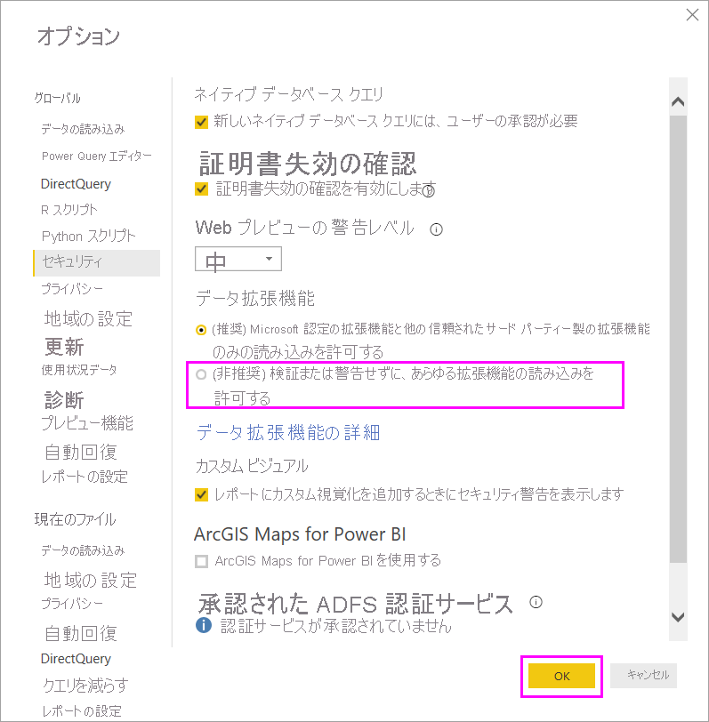

# Power BI でのコネクタの機能拡張

Power BI では、既存のコネクタと ODBC、OData、OLE DB、Web、CSV、XML や JSON などの一般的なデータ ソースを使用してデータに接続できます。 または、開発者が*カスタム コネクタ*と呼ばれるカスタム データ拡張機能を使用して、新しいデータ ソースを有効にできます。 一部のカスタム コネクタは、Microsoft の*認定コネクタ*として認定され配布されています。

ご自分またはサードパーティが開発した認定されていないコネクタを使用する場合、検証または警告なしで拡張機能が読み込まれるように、Power BI Desktop のセキュリティ設定を調整する必要があります。 このコードは、資格情報の HTTP を介した送信を含むそれらの処理が可能で、プライバシー レベルを無視するため、このセキュリティ設定はお使いのカスタム コネクタを絶対的に信頼しているときのみ使用する必要があります。

開発者が証明書を使用してコネクタに署名して、ユーザーがご自分のセキュリティ設定を変更せずに必要な情報を提供できるようにすることもできます。 詳細については、「[信頼されたサードパーティ製コネクタ](desktop-trusted-third-party-connectors.md)」を参照してください。

## カスタム コネクタ

認定されていないカスタム コネクタは、小規模なビジネスに不可欠な API から Microsoft がコネクタをリリースしていない大規模な業界固有のサービスまで多岐に渡ります。 多くのコネクタは、ベンダーが配布しています。 特定のデータ コネクタが必要な場合は、ベンダーにお問い合わせください。 

認定されていないカスタム コネクタを使用する場合、コネクタの *.pq*、 *.pqx*、 *.m*、または *.mez* ファイルを、 *\[ドキュメント]\\Power BI Desktop\\Custom Connectors* フォルダーに入れます。 フォルダーが存在しない場合は作成します。

データ拡張機能のセキュリティ設定を、次のように調整します。

Power BI Desktop で、 **[ファイル]**  >  **[オプションと設定]**  >  **[オプション]**  >  **[セキュリティ]** の順に選択します。

**[データ拡張機能]** から **[(非推奨) 検証または警告せずに、あらゆる拡張機能の読み込みを許可する]** を選択します。 **[OK]** を選択して、Power BI Desktop を再起動します。 

Power BI Desktop のデータ拡張機能の既定のセキュリティ設定は、 **[(推奨) Microsoft 認定の拡張機能と他の信頼されたサード パーティー製の拡張機能のみの読み込みを許可する]** です。 この設定では、認定されていないカスタム コネクタがお使いのシステムにある場合、Power BI Desktop の起動時に **[認定されていないコネクタ]** ダイアログ ボックスが表示され、安全に読み込むことができないコネクタを一覧表示します。

![[認定されていないコネクタ] ダイアログ ボックス](media/desktop-connector-extensibility/data-extension-security-2.png)

このエラーを解決するには、ご自分の **[データ拡張機能]** セキュリティ設定を変更するか、ご自分の *[カスタム コネクタ]* フォルダーから認定されていないコネクタを削除します。

## 認定コネクタ

*認定済み*とされているデータ拡張機能のサブセットは限られています。 Microsoft はこれらのコネクタを配布しますが、パフォーマンスや機能の継続性については責任を負いません。 そのコネクタを作成したサードパーティの開発者が、そのメンテナンスとサポートを担当します。 

認定されているサードパーティ製のコネクタは、Power BI Desktop では汎用および共通のコネクタと共に、 **[データの取得]** ダイアログボックスに一覧表示されます。 それらの認定コネクタの使用には、セキュリティ設定を調整する必要はありません。

カスタム コネクタの認定を希望する場合は、dataconnectors@microsoft.com に連絡するようにご自分のベンダーにご依頼ください。
