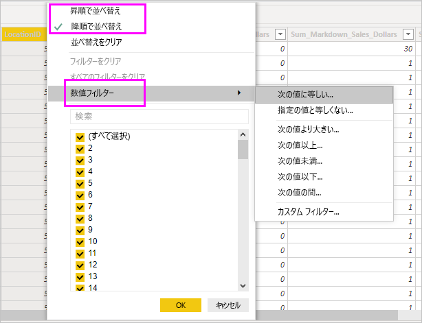

# Power BI Desktop でデータ ビューを使用する

"*データ ビュー*" は、*Power BI Desktop* モデル内のデータを検査、調査、理解するのに役立ちます。 "*Power Query エディター*" でテーブル、列、データを表示する方法とは異なります。 データ ビューには、モデルに読み込まれた "*後の*" データが表示されます。

> [!NOTE]
> データ ビューでは、データがモデルに読み込まれた後にデータが表示されるため、すべてのデータソースが DirectQuery に基づいている場合、[データ ビュー] アイコンは表示されません。 

データをモデル化しているときに、レポート キャンバスにビジュアルを作成することなく、実際のテーブルまたは列の内容を確認したい場合があります。 行レベルまで確認することができます。 この機能は、メジャーと計算列を作成している場合や、データ型またはデータのカテゴリを識別する必要がある場合に特に便利です。

それでは、データ ビューの要素のいくつかを詳しく見てみましょう。

1. **[データ ビュー] アイコン**。 このアイコンを選択すると、データ ビューに移動します。

2. **データ グリッド**。 この領域には選んだテーブルとその中のすべての列と行が表示されます。 "*レポート*" ビューに表示されない列はグレー表示されます。列を右クリックしてオプションを表示できます。

3. **[モデリング] リボン**。 リレーションシップの管理、計算の作成、列のデータ型、書式設定、データ カテゴリの変更を行うことができます。

4. **[数式] バー**。 メジャーと計算列の DAX 式を入力します。

5. **検索**。 モデル内のテーブルまたは列を検索します。

6. **[フィールド] 一覧**。 データ グリッドに表示するテーブルまたは列を選びます。

## データ ビューのフィルター処理

データ ビューでは、データをフィルター処理したり、並べ替えたりすることもできます。 各列には、並べ替え方向を示すアイコンが表示されます (適用された場合)。

個々の値にフィルターを適用したり、列のデータに基づいて高度なフィルター処理を適用したりできます。

> [!NOTE]
> 現在のユーザー インターフェイスとは異なるカルチャで Power BI モデルが作成されている場合、テキスト フィールド以外のあらゆるものに関して、データ ビュー ユーザー インターフェイスの検索ボックスが表示されません。 たとえば、これは米国英語で作成されたモデルをスペイン語で表示する場合に適用されます。

## 次の手順

Power BI Desktop では、あらゆる種類の操作を実行できます。 そのような機能について詳しくは、次のリソースをご覧ください。

* [Power BI Desktop とは何ですか?](../fundamentals/desktop-what-is-desktop.md)
* [Power BI Desktop でのクエリの概要](../transform-model/desktop-query-overview.md)
* [Power BI Desktop でのデータ型](desktop-data-types.md)
* [Power BI Desktop でのデータの整形と結合](desktop-shape-and-combine-data.md)
* [Power BI Desktop での一般的なクエリ タスク](../transform-model/desktop-common-query-tasks.md)
