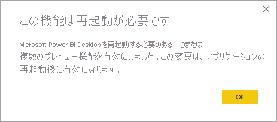

# <a name="using-enhanced-dataset-metadata-preview"></a>拡張データセット メタデータの使用 (プレビュー)

Power BI Desktop によってレポートが作成されると、対応する PBIX ファイルと PBIT ファイルにデータセット メタデータも作成されます。 以前は、メタデータは Power BI Desktop に固有の形式で格納されていました。 Base-64 でエンコードされた M 式とデータ ソースが使用され、そのメタデータの格納方法に関する制限事項が適用されていました。

**拡張データセット メタデータ**機能のリリースにより、これらの制限事項の多くはなくなります。 **拡張データセット メタデータ**機能が有効になっていると、Power BI Desktop によって作成されたメタデータでは、[表形式オブジェクト モデル](https://docs.microsoft.com/bi-reference/tom/introduction-to-the-tabular-object-model-tom-in-analysis-services-amo)に基づいて、Analysis Services 表形式モデルに使用されるものと同様の形式が使用されます。


**拡張データセット メタデータ**機能は、将来の Power BI 機能がそのメタデータに基づいて構築されるため、戦略的かつ基本的な機能です。 拡張データセット メタデータを活用するための追加機能としては、Power BI データセットを管理するための [XMLA 読み取り/書き込み](https://docs.microsoft.com/power-platform-release-plan/2019wave2/business-intelligence/xmla-readwrite)や、次世代機能を活用するための Power BI への Analysis Services ワークロードの移行などがあります。


## <a name="enable-enhanced-dataset-metadata"></a>拡張データセット メタデータを有効にする

**拡張データセット メタデータ**機能は、現在プレビューの段階です。 拡張データセット メタデータを有効にするには、次の図に示すように、Power BI Desktop で **[ファイル]、[オプションと設定]、[オプション]、[プレビュー機能]** の順に選択し、 **[Store datasets using enhanced metadata format]\(拡張メタデータ形式を使用してデータセットを格納する\)** チェックボックスをオンにします。 


Power BI Desktop を再起動するように求められます。



プレビュー機能を有効にすると、Power BI Desktop によって、以前のメタデータ形式を使用する PBIX ファイルと PBIT ファイルのアップグレードが試行されます。 

> [!IMPORTANT]
> **拡張データセット メタデータ**機能を有効にすると、レポートへのアップグレードを元に戻すことができなくなります。 **拡張データセット メタデータ**を有効にすると、Power BI Desktop で読み込まれた、または作成された Power BI レポートは、拡張データセット メタデータ形式に不可逆的に変換されます。

## <a name="report-backup-files"></a>レポートのバックアップ ファイル

**拡張データセット メタデータ**機能を使用するようにレポートを更新する操作は、元に戻せません。 ただし、更新中に、レポートのバージョンを元の (更新前の) 形式で保存するために、レポートのバックアップ ファイルが作成されます。 このバックアップ ファイルは 30 日後に削除されます。 

レポートのバックアップ ファイルを見つけるには、次の手順を実行します。

1. 次の場所に移動します: ```C:\Users\<user>\AppData\Local\Microsoft\Power BI Desktop\TempSaves\Backup```。 Microsoft Store バージョンの Power BI Desktop を使用している場合は、次の場所を使用します: ```C:\Users\<user>\Microsoft\Power BI Desktop Store App\TempSaves\Backups``` 

2. そこで、元のファイルの名前とタイム スタンプを持つレポートのコピーを見つけます。

3. そのファイルを保持するために、任意の場所にコピーします。

4. その元のファイルを開くか使用することを選択する場合は、Power BI Desktop で**拡張メタデータ形式**のプレビュー機能が無効になっていることを確認してください。 

バックアップ ファイルはレポートのアップグレード時に作成されるため、アップグレード後に加えられた変更は含まれていません。 **拡張メタデータ形式**機能が有効になっているときに作成された新しいレポートには、バックアップ ファイルがありません。


## <a name="considerations-and-limitations"></a>考慮事項と制限事項

プレビュー バージョンでは、プレビュー機能が有効になっている場合、次の制限事項が適用されます。

### <a name="unsupported-features-and-connectors"></a>サポートされていない機能とコネクタ
アップグレードされていない既存の PBIX ファイルまたは PBIT ファイルを開いたときに、データセットに次の機能またはコネクタが含まれている場合、アップグレードは失敗します。 このような障害が発生した場合、ユーザー エクスペリエンスへの直接的な影響はなく、Power BI Desktop では引き続き以前のメタデータ形式が使用されます。

* すべてのカスタム コネクタ
* Python スクリプト
* カスタム コネクタ
* Azure DevOps Server
* BI コネクタ
* Denodo
* Dremio
* Exasol
* Indexima
* IRIS
* Jethro ODBC
* Kyligence Enterprise
* Mark Logic ODBC
* Qubole Presto
* Team Desk
* 列名に "\\n" などの特定の文字の組み合わせを含む M 式
* **拡張データセット メタデータ**機能が有効になっているデータセットを使用する場合は、Power BI サービスでシングル サイン オン (SSO) データ ソースを設定することはできません

これらの一覧表示されたコネクタを使用しているレポートは、新しい形式にアップグレードされません。 既にアップグレードされているレポート、またはこの新しい機能の有効化後に作成されたレポートでは、一覧表示されたサポートされていない機能またはコネクタの追加がサポートされません。 

動的データソースを使用するクエリはサポートされていません。 動的データソースを持つレポートは新しい形式にアップグレードされません。また、既にアップグレードされているレポートや、この機能を有効にして新しく作成されたレポートでは、動的データソースの追加はサポートされません。 パラメーター、関数入力、または volatile 関数に応じてソースが変更される場合、クエリには動的データソースがあります。 

アップストリームのステップまたは分岐でエラーが発生したクエリはサポートされません。 

また、**拡張データセット メタデータ**を使用するために既に正常にアップグレードされている PBIX ファイルと PBIT ファイルでは、現在のバージョンで上記の機能またはコネクタを使用することは*できません*。


### <a name="lineage-view"></a>系列ビュー
現在、新しいメタデータ形式を使用するデータセットでは、データフローへのリンクが、Power BI サービスの系列ビューに表示されません。

## <a name="next-steps"></a>次の手順

Power BI Desktop では、あらゆる種類の操作を実行できます。 そのような機能について詳しくは、次のリソースをご覧ください。

* [Power BI Desktop とは何ですか?](../fundamentals/desktop-what-is-desktop.md)
* [Power BI Desktop の新機能](../fundamentals/desktop-latest-update.md)
* [Power BI Desktop でのクエリの概要](../transform-model/desktop-query-overview.md)
* [Power BI Desktop でのデータ型](desktop-data-types.md)
* [Power BI Desktop でのデータの整形と結合](desktop-shape-and-combine-data.md)
* [Power BI Desktop での一般的なクエリ タスク](../transform-model/desktop-common-query-tasks.md)
