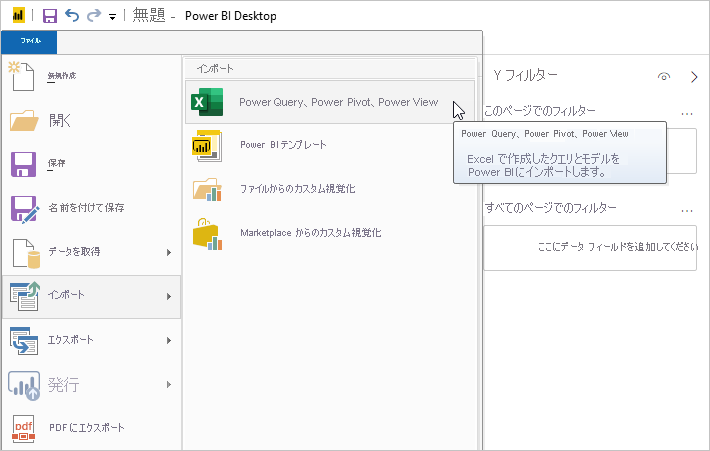
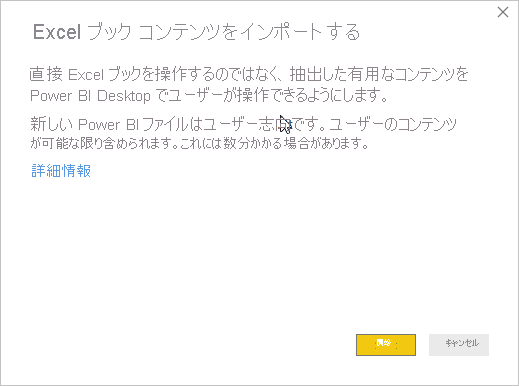

# Power BI Desktop に Excel ブックをインポートする
Power BI Desktop を使用すると、Power Query のクエリ、Power Pivot のモデル、Power View のワークシートが格納されている Excel ブックを Power BI Desktop に簡単にインポートできます。 Power BI Desktop では、Excel ブックに基づいて自動的にレポートが作成され、データが可視化されます。 インポート後も引き続き、作成されたレポートを Power BI Desktop で改良したり、能率化したりできます。その際、既存の機能や毎月の Power BI Desktop 更新でリリースされる新しい機能をご利用いただけます。

## Excel ブックのインポート方法
1. Excel ブックを Power BI Desktop にインポートするには、 **[ファイル]** 、 **[インポート]** 、 **[Power Query、Power Pivot、Power View]** の順に選択します。

   

2. **[開く]** ウィンドウから、インポートする Excel ブックを選択します。 

   現在のところ、ブック内のオブジェクトのサイズや数に制限はありませんが、ブックが大きくなればなるほど、Power BI Desktop で分析とインポートに要する時間がそれだけ増加します。

   > [!NOTE]
   > OneDrive for Business の共有フォルダーまたは Microsoft 365 グループ フォルダーから Excel ファイルを読み込むかインポートするには、Excel ファイルの URL を使用し、それを Power BI Desktop の Web データ ソースに入力します。 OneDrive for Business URL を適切にフォーマットするには、いくつかの手順に従う必要があります。詳細と一連の適切な手順については、「[Power BI Desktop で OneDrive for Business リンクを使用する](desktop-use-onedrive-business-links.md)」を参照してください。
   > 
   > 

3. インポート ダイアログ ボックスが表示されたら、 **[開始]** を選択します。

   

   Power BI Desktop では、ブックが分析され、それが Power BI Desktop ファイル (.pbix) に変換されます。 このアクションは 1 回限りのイベントです。次の手順でいったん Power BI Desktop ファイルを作成すると、Power BI Desktop ファイルは元の Excel ブックに依存しなくなり、元のブックに影響を与えることなく、変更、保存、共有できるようになります。

   インポートが完了すると、概要ページが表示され、変換された項目についての説明と、インポートできなかった項目があればそれの一覧が表示されます。

   ![[インポートの概要] ページ](media/desktop-import-excel-workbooks/importexceltopbi_3.png)

4. **[閉じる]** を選びます。 

   Power BI Desktop により Excel ブックがインポートされ、ブックの内容に基づいてレポートが読み込まれます。

   

ブックのインポート後、レポートで作業を続行できます。 Power BI Desktop に含まれているいずれかの機能を利用し、データを新たに可視化したり、データを追加したり、新しいレポート ページを作成したりすることができます。

## インポートされるブック要素
Power BI Desktop は、Excel で一般的に *オブジェクト*と呼ばれる次の要素をインポートできます。

| Excel ブック内のオブジェクト | Power BI Desktop ファイルの最終結果 |
| --- | --- |
| Power Query のクエリ |Excel からの Power Query のすべてのクエリは、Power BI Desktop のクエリに変換されます。 Excel ブックでクエリ グループが定義されている場合、Power BI Desktop で同じ編成が複製されます。 Excel の **[データのインポート]** ダイアログ ボックスで **[接続の作成のみ]** が設定されていない限り、すべてのクエリが読み込まれます。 読み込み動作は、Power BI Desktop の Power Query エディターの **[ホーム]** タブから **[プロパティ]** を選択することでカスタマイズできます。 |
| Power Pivot の外部データ接続 |Power Pivot の外部データ接続はすべて、Power BI Desktop でクエリに変換されます。 |
| リンク テーブルまたは現在のブックのテーブル |Excel のワークシート テーブルがデータ モデルにリンクされているか、クエリにリンクされている場合 ( *[ソース テーブル]* または M の *Excel.CurrentWorkbook()* 関数を使用)、次のオプションが提示されます。 <ol><li><b>Power BI Desktop ファイルにテーブルをインポートします</b>。 このテーブルはデータの 1 回限りのスナップショットであり、その後、Power BI Desktop のテーブルでデータは読み取り専用となります。 このオプションを使用して作成されたテーブルは、100 万文字 (すべての列のヘッダーとセルを合計したもの) のサイズ制限があります。</li><li><b>元のブックへの接続を保持します</b>。 別の方法として、元の Excel ブックへの接続を保持することができます。Power BI Desktop の Excel ブックに対して作成された他のクエリと同様に、Power BI Desktop はこのテーブルの最新のコンテンツを更新のたびに取得します。</li></ul> |
| データ モデルの計算列、メジャー、KPI、データのカテゴリ、リレーションシップ |これらのデータ モデル オブジェクトは、Power BI Desktop で同等のオブジェクトに変換されます。 イメージなど、Power BI Desktop で利用できない特定のデータのカテゴリがあることにご注意ください。 そのような場合、問題の列のデータ カテゴリ情報がリセットされます。 |
| Power View ワークシート |Excel の Power View ワークシートごとに新しいレポート ページが作成されます。 これらのレポート ページの名前と順序は、元の Excel ブックと一致します。 |

## ブックのインポートの制限
Power BI Desktop には、ブックをインポートする際にいくつかの制限があります。

* **SQL Server Analysis Services 表形式モデルへの外部接続:** Excel 2013 では、SQL Server Analysis Services 表形式モデルへの接続を作成し、データをインポートせずにこれらのモデルの上に Power View レポートを作成できます。 現在のところ、Excel ブックを Power BI Desktop にインポートするとき、この種類の接続を利用できません。 回避策としては、Power BI Desktop でこれらの外部接続を再作成する必要があります。
* **階層:** 現在は、Power BI Desktop でこの種類のデータ モデル オブジェクトはサポートされていません。 そのため、Power BI Desktop に Excel ブックをインポートするとき、階層は省かれます。
* **バイナリ データ列:** 現在は、Power BI Desktop でこの種類のデータ モデル列はサポートされていません。 バイナリ データ列は、Power BI Desktop で結果的に生成されるテーブルから削除されます。
* **サポートされていない Power View の要素:** テーマや特定の種類の視覚化 (再生軸のある散布図やドリルダウン動作など) など、Power View のいくつかの機能は Power BI Desktop で利用できません。 これらの視覚化はサポートされていないため、Power BI Desktop レポートの該当する場所に *サポートされていない視覚化* というメッセージが表示され、必要に応じてこれを削除したり、再構成したりできます。
* **Power Query の** ***[ソース テーブル]***、**または M の** ***Excel.CurrentWorkbook*** **を使用した名前付き範囲:** 現在のところ、この名前付き範囲のデータを Power BI Desktop にインポートすることはできませんが、更新プログラムとして予定されています。 現時点では、これらの名前付き範囲は、外部の Excel ブックへの接続として Power BI Desktop に読み込まれます。
* **PowerPivot から SSRS:** 現在のところ、PowerPivot てでは、SQL Server Reporting Services (SSRS) に外部接続できません。そのデータ ソースが現在、Power BI Desktop で利用できないためです。

