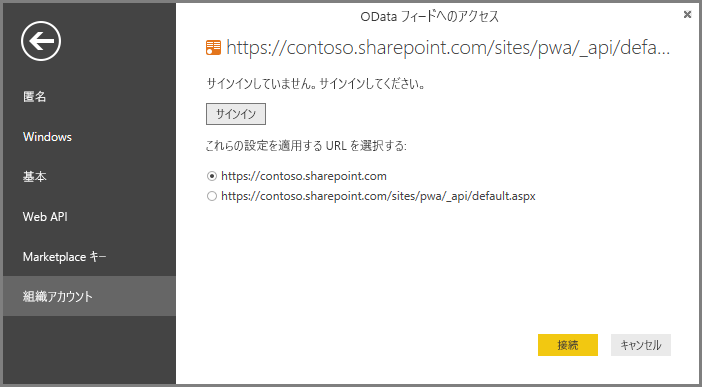

# Power BI Desktop 経由で Project Online データに接続する
Power BI Desktop を経由して Project Online のデータに接続することができます。

## 手順 1:Power BI Desktop をダウンロードする
1. [Power BI Desktop をダウンロード](https://go.microsoft.com/fwlink/?LinkID=521662)し、インストーラーを実行して **Power BI Desktop** をコンピューターにインストールします。

## 手順 2:OData を使用して Project Online に接続する
1. **Power BI Desktop** を開きます。
2. *[ようこそ]* 画面で、 **[データの取得]** を選択します。
3. **[OData フィード]** を選択し、 **[接続]** を選択します。
4. [URL] ボックスに OData フィードのアドレスを入力して、[OK] をクリックします。
   
   Project Web App サイトのアドレスが *https://\<tenantname\>.sharepoint.com/sites/pwa* である場合、OData フィードに入力するアドレスは *https://\<tenantname\>.sharepoint.com/sites/pwa/\_api/Projectdata* になります。
   
   この例では、次のコードを使用します。

    `https://contoso.sharepoint.com/sites/pwa/default.aspx`

5. Power BI Desktop により、職場または学校のアカウントを使用して認証するように求められます。 組織アカウントを選択し、資格情報を入力します。
   
   

OData フィードへの接続に使用するアカウントは、少なくとも Project Web App サイトにアクセスするためのポートフォリオ閲覧者権限を有する必要があります。 

ここから、接続してクエリを作成するテーブルを選択できます。  作業の開始方法について  次のブログの投稿では、Project Online のデータからバーンダウン グラフを作成する方法を示します。  ブログの投稿では、Power Query を使用して Project Online に接続する方法について言及していますが、これは Power BI Desktop にも適用されます。

[Power Pivot と Power Query を使用してプロジェクトのバーンダウン グラフを作成する](https://blogs.office.com/2014/03/24/creating-burndown-charts-for-project-using-power-pivot-and-power-query/)

