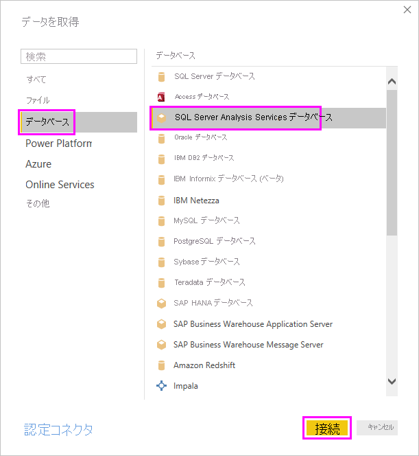
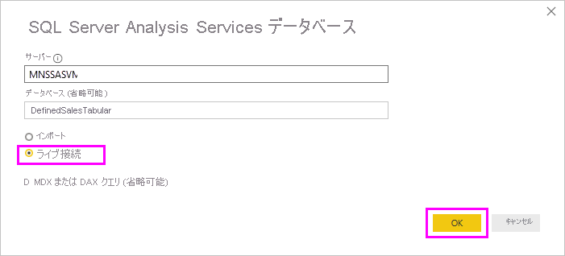
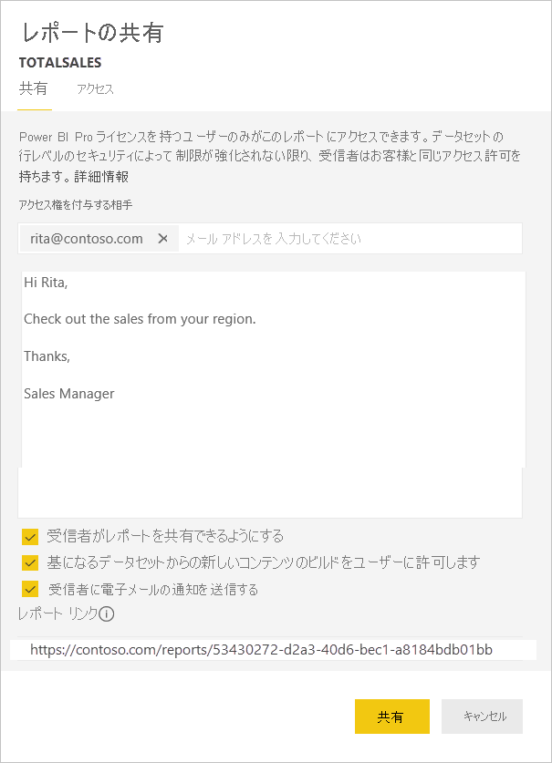

# <a name="implement-row-level-security-in-an-analysis-services-tabular-model"></a>Analysis Services 表形式モデルに行レベル セキュリティを実装する

このチュートリアルでは、サンプル データセットを使って以下の手順に従い、"*Analysis Services 表形式モデル*" で[**行レベルのセキュリティ**](../admin/service-admin-rls.md)を実装し、それを Power BI レポートで使用する方法を示します。

* [AdventureworksDW2012](https://github.com/Microsoft/sql-server-samples/releases/tag/adventureworks) データベースに新しいセキュリティ テーブルを作成する
* 必要なファクト テーブルとディメンション テーブルを持つ表形式モデルを作成する
* ユーザー ロールとアクセス許可を定義する
* モデルを *Analysis Services 表形式* インスタンスにデプロイする
* レポートにアクセスするユーザーに合ったデータを表示する Power BI Desktop レポートをビルドする
* レポートを *Power BI サービス*にデプロイする
* レポートに基づいて新しいダッシュボードを作成する
* 同僚とダッシュボードを共有する

このチュートリアルでは [AdventureworksDW2012 データベース](https://github.com/Microsoft/sql-server-samples/releases/tag/adventureworks)が必要です。

## <a name="task-1-create-the-user-security-table-and-define-data-relationship"></a>タスク 1:ユーザーのセキュリティ テーブルを作成し、データのリレーションシップを定義する

"*SQL Server Analysis Services (SSAS) 表形式*" モデルを使用して、行レベルの動的なセキュリティを定義する方法を説明する多くの記事を見つけることができます。 サンプルでは、[行フィルターを使用した動的なセキュリティの実装](/analysis-services/tutorial-tabular-1200/supplemental-lesson-implement-dynamic-security-by-using-row-filters)に関するページを使用します。

ここに示す手順では、AdventureworksDW2012 リレーショナル データベースを使用する必要があります。

1. AdventureworksDW2012 では、以下に示すように `DimUserSecurity` テーブルを作成します。 [SQL Server Management Studio (SSMS)](/sql/ssms/download-sql-server-management-studio-ssms) を使用して、テーブルを作成することができます。

   

1. テーブルを作成して保存したら、次に示すように、`DimUserSecurity` テーブルの `SalesTerritoryID` 列と `DimSalesTerritory` テーブルの `SalesTerritoryKey` 列の間に関係を構築する必要があります。

   SSMS で、 **[DimUserSecurity]** を右クリックし、 **[設計]** を選択します。 その後、 **[テーブル デザイナー]** 、 **[リレーションシップ]** の順に選択します。完了したら、テーブルを保存します。

   

1. ユーザーをテーブルに追加します。 **[DimUserSecurity]** を右クリックし、 **[上位 200 行の編集]** を選択します。 ユーザーを追加すると、`DimUserSecurity` テーブルは、次の例のようになります。

   

   これらのユーザーは以降のタスクで表示されます。

1. 次に、`DimSalesTerritory` テーブルで "*内部結合*" を行います。このテーブルには、ユーザーに関連付けられている地域の詳細が示されます。 ここでは、SQL コードで内部結合を行います。図は、その後、テーブルがどのように表示されるかを示しています。

    ```sql
    select b.SalesTerritoryCountry, b.SalesTerritoryRegion, a.EmployeeID, a.FirstName, a.LastName, a.UserName from [dbo].[DimUserSecurity] as a join [dbo].[DimSalesTerritory] as b on a.[SalesTerritoryID] = b.[SalesTerritoryKey]
    ```

   手順 2 でリレーションシップを作成したことにより、結合されたテーブルには、販売地域ごとの担当者が示されます。 たとえば、*Rita Santos* は "*オーストラリア*" の担当であることがわかります。

## <a name="task-2-create-the-tabular-model-with-facts-and-dimension-tables"></a>タスク 2:ファクト テーブルとディメンション テーブルを持つ表形式モデルを作成する

リレーショナル データ ウェアハウスが準備できたら、表形式モデルを定義する必要があります。 モデルの作成には、[SQL Server Data Tools](/sql/ssdt/sql-server-data-tools) (SSDT) を使用することができます。 詳細については、「[新しいテーブル モデル プロジェクトの作成](/sql/analysis-services/lesson-1-create-a-new-tabular-model-project)」を参照してください。

1. 次に示すように、モデルに必要なすべてのテーブルをインポートします。

    

1. 必要なテーブルをインポートしたら、読み取りアクセス許可を持つ *SalesTerritoryUsers* というロールを定義する必要があります。 SQL Server Data Tools で **[モデル]** メニューを選択してから、 **[ロール]** を選びます。 **[ロール マネージャー]** で、 **[新規]** を選択します。

1. **[ロール マネージャー]** の **[メンバー]** で、[タスク 1](#task-1-create-the-user-security-table-and-define-data-relationship) で `DimUserSecurity` テーブルに定義したユーザーを追加します。

    ![[ロール マネージャー] でユーザーを追加する](media/desktop-tutorial-row-level-security-onprem-ssas-tabular/rolemanager.png)

1. 次に、下図に示すように、 **[行フィルター]** タブで、`DimSalesTerritory` テーブルと `DimUserSecurity` テーブルの両方に適した関数を追加します。

    

1. `LOOKUPVALUE` 関数は、Windows ユーザー名が、`USERNAME` 関数で返された名前と一致する列の値を返します。 これで、`LOOKUPVALUE` で返された値が、同じテーブルまたは関連テーブルの値と一致する列にクエリを制限することができます。 **[DAX フィルター]** 列に、次の数式を入力します。

    ```dax
        =DimSalesTerritory[SalesTerritoryKey]=LOOKUPVALUE(DimUserSecurity[SalesTerritoryID], DimUserSecurity[UserName], USERNAME(), DimUserSecurity[SalesTerritoryID], DimSalesTerritory[SalesTerritoryKey])
    ```

    この数式の `LOOKUPVALUE` は、`DimUserSecurity[UserName]` が現在ログオンしている Windows ユーザー名と同じで、`DimUserSecurity[SalesTerritoryID]` が `DimSalesTerritory[SalesTerritoryKey]` と同じである `DimUserSecurity[SalesTerritoryID]` 列のすべての値を返します。

    > [!IMPORTANT]
    > 行レベルのセキュリティを使用している場合、DAX 関数 [USERELATIONSHIP](/dax/userelationship-function-dax) はサポートされません。

   `SalesTerritoryKey`の `LOOKUPVALUE` で返される一連の販売地域を使用して、`DimSalesTerritory`に表示される行を制限します。 `SalesTerritoryKey` の値が、`LOOKUPVALUE` 関数で返される ID に含まれる行のみが表示されます。

1. `DimUserSecurity` テーブルでは、 **[DAX フィルター]** 列に、次の数式を追加します。

    ```dax
        =FALSE()
    ```

    この数式は、すべての列が `false` に解決することを指定します。これは、`DimUserSecurity` テーブルの列に対してクエリを実行できないことを意味します。

この時点で、モデルを処理してデプロイする必要があります。 詳細については、[デプロイ](/sql/analysis-services/lesson-13-deploy)に関するページを参照してください。

## <a name="task-3-add-data-sources-within-your-on-premises-data-gateway"></a>タスク 3:オンプレミス データ ゲートウェイ内のデータ ソースを追加する

表形式モデルがデプロイされ、使用できるようになったら、Analysis Services 表形式サーバーへのデータ ソース接続を追加する必要があります。

1. Power BI サービスからオンプレミスの分析サービスにアクセスできるようにするには、使用している環境に[オンプレミス データ ゲートウェイ](service-gateway-onprem.md)がインストールされ、構成されている必要があります。

1. ゲートウェイを正しく構成したら、*Analysis Services* 表形式インスタンス用のデータ ソース接続を作成する必要があります。 詳細については、「[データ ソースの管理 - Analysis Services](service-gateway-enterprise-manage-ssas.md)」を参照してください。

   

この手順が完了すると、ゲートウェイは構成され、オンプレミスの Analysis Services データ ソースと対話することができます。

## <a name="task-4-create-report-based-on-analysis-services-tabular-model-using-power-bi-desktop"></a>タスク 4:Power BI Desktop を使用して Analysis Services 表形式モデルに基づくレポートを作成する

1. Power BI Desktop を起動して、 **[データの取得]** 、 **[データベース]** の順に選択します。

1. データ ソース リストから、 **[SQL Server Analysis Services データベース]** を選択して、 **[接続]** を選びます。

   

1. Analysis Services 表形式インスタンスの詳細を入力して、 **[ライブ接続]** を選択します。 **[OK]** を選択します。
  
   

   Power BI では、動的セキュリティはライブ接続でのみ機能します。

1. Analysis Services インスタンスにデプロイされたモデルがあることがわかります。 該当するモデルを選択してから、 **[OK]** を選びます。

   これで、Power BI Desktop で、 **[フィールド]** ウィンドウのキャンバスの右側に使用可能なフィールドがすべて表示されます。

1. **[フィールド]** ウィンドウで、**FactInternetSales** テーブルから **SalesAmount** メジャーを選択し、**SalesTerritory** テーブルから **SalesTerritoryRegion** ディメンションを選択します。

1. このレポートをシンプルなものにしておくために、この時点では列を追加しません。 データをよりわかりやすくするために、視覚化を**ドーナツ グラフ**に変更します。

   

1. レポートの準備ができたら、Power BI ポータルに直接発行できます。 Power BI Desktop の **[ホーム]** リボンで、 **[発行]** を選択します。

## <a name="task-5-create-and-share-a-dashboard"></a>タスク 5:ダッシュボードを作成して共有する

レポートを作成し、それを **Power BI** サービスに発行しました。 これで、前の手順で作成された例を使用して、モデル セキュリティ シナリオを示すことができます。

ロールが "*販売マネージャー*" であるユーザー Grace は、あらゆる販売地域からのデータを表示できます。 Grace はこのレポートを作成して、Power BI サービスに発行します。 このレポートの作成は前のタスクで完了しています。

Grace がレポートを発行したら、次の手順では、そのレポートに基づいて、Power BI サービスで *TabularDynamicSec* という名前のダッシュボードを作成します。 次の図で、Grace がすべての販売地域に対応するデータを表示できることがわかります。

   

次に、Grace は、オーストラリア地域の販売担当である Rita という同僚とダッシュボードを共有します。

   

Rita が Power BI サービスにログインして、Grace が作成した共有ダッシュボードを表示すると、オーストラリア地域の販売のみが表示されます。

おめでとうございます。 Power BI サービスには、オンプレミスの Analysis Services 表形式モデルで定義された動的な行レベルのセキュリティが表示されます。 Power BI は `EffectiveUserName` プロパティを使用して、現在の Power BI ユーザーの資格情報をオンプレミス データ ソースに送信し、クエリを実行します。

## <a name="task-6-understand-what-happens-behind-the-scenes"></a>タスク 6:バックグラウンドでの動作を理解する

このタスクでは、[SQL Server プロファイラー](/sql/tools/sql-server-profiler/sql-server-profiler)を使い慣れていることを前提とします。これは、オンプレミスの SSAS 表形式インスタンスで SQL Server プロファイラー トレースをキャプチャする必要があるためです。

ユーザー (Rita) が Power BI サービスのダッシュボードにアクセスすると、すぐにセッションが初期化されます。 **salesterritoryusers** 役割は、 **<EffectiveUserName>rita@contoso.com</EffectiveUserName>** などの有効なユーザー名ですぐに有効になることがわかります。

       <PropertyList><Catalog>DefinedSalesTabular</Catalog><Timeout>600</Timeout><Content>SchemaData</Content><Format>Tabular</Format><AxisFormat>TupleFormat</AxisFormat><BeginRange>-1</BeginRange><EndRange>-1</EndRange><ShowHiddenCubes>false</ShowHiddenCubes><VisualMode>0</VisualMode><DbpropMsmdFlattened2>true</DbpropMsmdFlattened2><SspropInitAppName>PowerBI</SspropInitAppName><SecuredCellValue>0</SecuredCellValue><ImpactAnalysis>false</ImpactAnalysis><SQLQueryMode>Calculated</SQLQueryMode><ClientProcessID>6408</ClientProcessID><Cube>Model</Cube><ReturnCellProperties>true</ReturnCellProperties><CommitTimeout>0</CommitTimeout><ForceCommitTimeout>0</ForceCommitTimeout><ExecutionMode>Execute</ExecutionMode><RealTimeOlap>false</RealTimeOlap><MdxMissingMemberMode>Default</MdxMissingMemberMode><DisablePrefetchFacts>false</DisablePrefetchFacts><UpdateIsolationLevel>2</UpdateIsolationLevel><DbpropMsmdOptimizeResponse>0</DbpropMsmdOptimizeResponse><ResponseEncoding>Default</ResponseEncoding><DirectQueryMode>Default</DirectQueryMode><DbpropMsmdActivityID>4ea2a372-dd2f-4edd-a8ca-1b909b4165b5</DbpropMsmdActivityID><DbpropMsmdRequestID>2313cf77-b881-015d-e6da-eda9846d42db</DbpropMsmdRequestID><LocaleIdentifier>1033</LocaleIdentifier><EffectiveUserName>rita@contoso.com</EffectiveUserName></PropertyList>

有効なユーザー名要求に基づいて、Analysis Services では、ローカルの Active Directory のクエリを実行した後、要求を実際の `contoso\rita` 資格情報に変換します。 Analysis Services で資格情報が取得されると、Analysis Services によって、ユーザーが表示とアクセスのアクセス許可を持っているデータが返されます。

ダッシュボードで他のアクティビティが発生すると、SQL プロファイラーで、Analysis Services 表形式モデルに DAX クエリとして戻される特定のクエリが表示されます。 たとえば、Rita がダッシュボードから基になるレポートに移動すると、次のクエリが発生します。

   

また、レポートのデータを取り込むために以下のような DAX クエリが実行されることがわかります。
   
   ```dax
   EVALUATE
     ROW(
       "SumEmployeeKey", CALCULATE(SUM(Employee[EmployeeKey]))
     )
   
   <PropertyList xmlns="urn:schemas-microsoft-com:xml-analysis">``
             <Catalog>DefinedSalesTabular</Catalog>
             <Cube>Model</Cube>
             <SspropInitAppName>PowerBI</SspropInitAppName>
             <EffectiveUserName>rita@contoso.com</EffectiveUserName>
             <LocaleIdentifier>1033</LocaleIdentifier>
             <ClientProcessID>6408</ClientProcessID>
             <Format>Tabular</Format>
             <Content>SchemaData</Content>
             <Timeout>600</Timeout>
             <DbpropMsmdRequestID>8510d758-f07b-a025-8fb3-a0540189ff79</DbpropMsmdRequestID>
             <DbPropMsmdActivityID>f2dbe8a3-ef51-4d70-a879-5f02a502b2c3</DbPropMsmdActivityID>
             <ReturnCellProperties>true</ReturnCellProperties>
             <DbpropMsmdFlattened2>true</DbpropMsmdFlattened2>
             <DbpropMsmdActivityID>f2dbe8a3-ef51-4d70-a879-5f02a502b2c3</DbpropMsmdActivityID>
           </PropertyList>
   ```

## <a name="considerations"></a>考慮事項

* Power BI でオンプレミスの行レベル セキュリティを使用できるのは、ライブ接続の場合のみです。

* モデルの処理後にデータに加えられる変更は、ユーザーが Power BI サービスからライブ接続を使用してレポートにアクセスするとただちに使用できるようになります。
