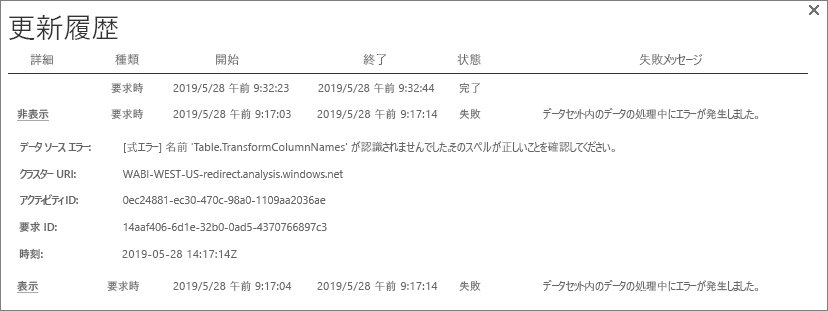
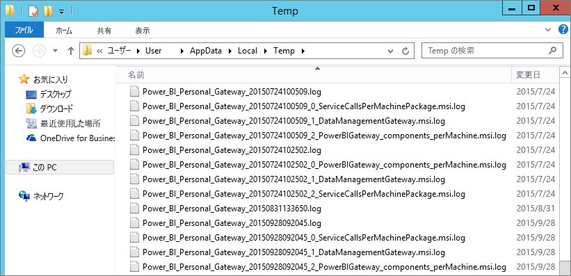

# Power BI ゲートウェイ (個人用モード) のトラブルシューティング

[!INCLUDE [gateway-rewrite](../includes/gateway-rewrite.md)]

以下のセクションでは、Power BI オンプレミス データ ゲートウェイ (個人用モード) を使用する場合に発生する可能性のある一般的な問題について説明します。

## 最新バージョンに更新する

個人用のゲートウェイの現在のバージョンは、オンプレミス データ ゲートウェイ (個人用モード) です。 そのバージョンを使用する場合は、現在インストールしているバージョンを更新してください。

多くの問題は、ゲートウェイのバージョンが期限切れになると発生します。 常に最新のバージョンを使用することは一般に適切な方法です。 ゲートウェイを 1 か月以上更新していない場合は、最新バージョンのゲートウェイのインストールを検討してください。 その後、問題を再現できるかどうかを確認します。

## インストール
**ゲートウェイ (個人用モード) は 64 ビット バージョンで動作する:** コンピューターが 32 ビット バージョンの場合、ゲートウェイ (個人用モード) をインストールすることはできません。 オペレーティング システムは、64 ビット バージョンである必要があります。 64 ビット バージョンの Windows をインストールするか、64 ビット コンピューターにゲートウェイ (個人用モード) をインストールします。

**コンピューターのローカル管理者であるにもかかわらず、ゲートウェイ (個人用モード) をサービスとしてインストールできない:** ユーザーはコンピューターのローカル管理者グループに存在するものの、グループ ポリシーでそのユーザー名でのサービスとしてのサインインが許可されていない場合、インストールが失敗する可能性があります。 グループ ポリシーで、ユーザーがサービスとしてサインインすることが許可されていることを確認してください。 この問題の修正に取り組んでいます。 詳細については、「[サービスとしてログオンする権利をアカウントに追加する](https://technet.microsoft.com/library/cc739424.aspx)」を参照してください。

**操作がタイムアウトしました:** ゲートウェイ (個人用モード) をインストールしているコンピューター (物理マシンまたは VM) に単一のコア プロセッサがある場合、このメッセージは一般的なものです。 すべてのアプリケーションを閉じ、不要なプロセスすべてをオフにして、もう一度インストールしてみてください。

**ゲートウェイ (個人用モード) と同じコンピューターに Data Management Gateway または Analysis Services Connector をインストールできない:** Analysis Services Connector または Data Management Gateway が既にインストールされている場合は、まず、コネクタまたはゲートウェイをアンインストールする必要があります。 その後、ゲートウェイ (個人用モード) をインストールしてみてください。

> [!NOTE]
> インストール中に問題が発生した場合は、セットアップ ログに問題の解決に役立つ情報が記録されている可能性があります。 詳細については、「[セットアップ ログ](#SetupLogs)」を参照してください。
> 
> 

 **プロキシの構成:** ご利用の環境でプロキシを使用する必要がある場合は、ゲートウェイ (個人用モード) の構成で問題が発生することがあります。 プロキシの構成方法の詳細については、「[オンプレミス データ ゲートウェイのプロキシ設定を構成する](/data-integration/gateway/service-gateway-proxy)」を参照してください。

## 更新のスケジュール設定
**エラー:The credential stored in the cloud is missing. (クラウドに格納されている資格情報がありません。)**

スケジュールされた更新があり、ゲートウェイ (個人用モード) をアンインストールしてから再インストールした場合、\<データセット\> の設定でこのエラーが表示されることがあります。 ゲートウェイ (個人用モード) をアンインストールすると、更新用に構成されたデータセットのデータ ソース資格情報が Power BI サービスから削除されます。

**解決方法:** Power BI で、データセットの [設定の更新] に移動します。 **[データ ソースの管理]** で、エラーが発生したデータ ソースに対して、 **[資格情報の編集]** を選択します。 その後、データ ソースにもう一度サインインします。

**エラー:データセットに提供されている資格情報が無効です。続行するには、[更新] または [データ ソースの設定] ダイアログ ボックスで資格情報を更新してください。**

**解決方法:** 資格情報についてのメッセージが表示される場合、次の原因が考えられます。

* データ ソースへのサインインに使用したユーザー名とパスワードが最新ではありません。 Power BI で、対象データ セットの [設定の更新] に移動します。 **[データ ソースの管理]** で、 **[資格情報の編集]** を選択してデータ ソースの資格情報を更新します。
* 単一のクエリでのクラウド ソースとオンプレミス ソースの間のマッシュアップでは、いずれかのソースで認証に OAuth が使用されている場合、ゲートウェイ (個人用モード) での更新に失敗します。 この問題の例として、CRM Online とローカル SQL Server インスタンスの間のマッシュアップが挙げられます。 CRM Online には OAuth が必要なので、マッシュアップに失敗します。
  
  このエラーは既知の問題であり、調査中です。 この問題を回避するには、クラウド ソースとオンプレミス ソースに対して個別のクエリを用意します。 次に、クエリのマージまたは追加を使用してそれらを結合します。

**エラー:Unsupported data source. (サポートされていないデータ ソースです。)**

**解決方法:** **[更新のスケジュール設定]** の設定でサポートされていないデータ ソースであることを示すメッセージが表示される場合、次のことを意味する可能性があります。 

* 現在、このデータ ソースは Power BI での更新がサポートされていません。 
* Excel ブックにワークシート データのみが含まれ、データ モデルが含まれていません。 現在 Power BI で更新がサポートされているのは、アップロードされた Excel ブックにデータ モデルが含まれている場合だけです。 Excel で Power Query を使用してデータをインポートする場合は、 **[読み込み]** オプションを選択してデータ モデルにデータを読み込みます。 このオプションにより、確実にデータがデータ モデルにインポートされます。 

**エラー: [データを結合できません] &lt;query part&gt;/&lt;…&gt;/&lt;…&gt; が、同時に使用できないプライバシー レベルの複数のデータ ソースにアクセスしています。このデータの組み合わせを再構築してください。**

**解決方法:** このエラーは、プライバシー レベルの制限と、使用しているデータ ソースの種類が原因で発生します。

**エラー:データ ソース エラー:値 "\[Table\]" を型 Table に変換できません。**

**解決方法:** このエラーは、プライバシー レベルの制限と、使用しているデータ ソースの種類が原因で発生します。

**エラー:この行に十分な領域がありません。**

**解決方法:** これは、1 つのサイズが 4 MB を超える行がある場合に発生します。 データ ソースからその行を見つけ、それをフィルター処理してみるか、その行のサイズを小さくしてみてください。

## データ ソース
**データ プロバイダーがない:** ゲートウェイ (個人用モード) は、64 ビット バージョンでのみ動作します。 ゲートウェイ (個人用モード) がインストールされているのと同じコンピューターに、64 ビット バージョンのデータ プロバイダーをインストールする必要があります。 たとえば、データセット内のデータ ソースが Microsoft Access の場合は、ゲートウェイ (個人用モード) をインストールしたのと同じコンピューターに 64 ビットの ACE プロバイダーをインストールする必要があります。 

>[!NOTE]
>32 ビット バージョンの Excel がある場合は、同じコンピューターに 64 ビット バージョンの ACE プロバイダーをインストールすることはできません。

**Access データベースで Windows 認証がサポートされない:** Power BI では、現在、Access データベースの匿名認証のみがサポートされています。

**エラー:データ ソースの資格情報を入力するときにサインイン エラーが発生する:** データ ソースの Windows 資格情報を入力すると、このようなエラーが発生する場合: 

  

ゲートウェイ (個人用モード) がまだ古いバージョンである可能性があります。 

**解決方法:** 詳細については、[最新バージョンの Power BI ゲートウェイ (個人用モード) のインストール](https://powerbi.microsoft.com/gateway/)に関するページを参照してください。

**エラー:ACE OLEDB を使用してデータ ソースに対して Windows 認証を選択するときに、サインイン エラーが発生する:** ACE OLEDB プロバイダーを使用してデータ ソースに対してデータ ソースの資格情報を入力すると、次のエラーが表示されます。

現在、Power BI では ACE OLEDB プロバイダーを使用したデータ ソースに対する Windows 認証はサポートされていません。

**解決方法:** このエラーを回避するには、 **[匿名認証]** を選択します。 従来の ACE OLEDB プロバイダーでは、匿名の資格情報と Windows 資格情報は同じです。

## タイルの更新
ダッシュボード タイルの更新時にエラーが表示される場合は、「[タイルのエラーのトラブルシューティング](refresh-troubleshooting-tile-errors.md)」を参照してください。

## トラブルシューティングするためのツール
### 更新履歴
**[更新履歴]** を使用すると、サポート要求を作成する必要がある場合に、どのようなエラーが発生したかを確認し、役立つデータを見つけることができます。 スケジュールされた更新とオンデマンドの更新の両方を表示できます。 **[更新履歴]** を表示する方法を次に示します。

1. Power BI のナビ ペインの **[データセット]** で、データセットを選択します。 メニューを開き、 **[更新のスケジュール設定]** を選択します。

   ![[更新のスケジュール設定] を選択する](media/service-admin-troubleshooting-power-bi-personal-gateway/scheduled-refresh.png)
1. **[設定]** で、 **[更新履歴]** を選択します。 

   ![[更新履歴] を選択する](media/service-admin-troubleshooting-power-bi-personal-gateway/scheduled-refresh-2.png)
   
   

### イベント ログ
一部のイベント ログでは情報を提供されることがあります。 最初の 2 つのイベントである **Data Management Gateway** と **PowerBIGateway**は、コンピューター上の管理者に対して表示されます。 管理者ではないユーザーがデータ ゲートウェイ (個人用モード) を使用している場合は、 **[アプリケーション]** ログ内にログ エントリが表示されます。

**Data Management Gateway** と **PowerBIGateway** ログは、 **アプリケーションとサービス ログ**の下に表示されます。

### Fiddler のトレース
[Fiddler](https://www.telerik.com/fiddler) は、HTTP トラフィックを監視する Telerik 提供の無償ツールです。 クライアント マシンからの Power BI サービスとの通信を確認できます。 この通信には、エラーやその他の関連情報が示される場合があります。

### セットアップ ログ
ゲートウェイ (個人用モード) のインストールに失敗した場合は、セットアップ ログを表示するためのリンクが示されます。 セットアップ ログには、エラーの詳細が示されることがあります。 これらのログは、MSI ログとも呼ばれる Windows インストールのログです。 これらのログは非常に複雑で、読み解くのが困難です。 通常は下部にエラーが示されますが、エラーの原因を特定するのは簡単ではありません。 別のログのエラーの結果である可能性があります。 また、ログの上の部分に含まれるエラーの結果である可能性もあります。

また、Temp フォルダー (%temp%) に移動して、*Power\_BI\_* で始まるファイルを検索することもできます。

> [!NOTE]
> %temp% に移動すると、Temp のサブフォルダーに移動する場合があります。*Power\_BI\_* ファイルは、Temp ディレクトリのルートにあります。 1 レベルまたは 2 レベル上に移動する必要がある場合があります。
> 
> 

## 次の手順
- [オンプレミス データ ゲートウェイのプロキシ設定を構成する](/data-integration/gateway/service-gateway-proxy)- [データの更新](refresh-data.md)  
- [Power BI ゲートウェイ - 個人用](service-gateway-personal-mode.md)  
- [タイルのエラーのトラブルシューティング](refresh-troubleshooting-tile-errors.md)  
- [オンプレミス データ ゲートウェイのトラブルシューティング](service-gateway-onprem-tshoot.md) 
 
他にわからないことがある場合は、 [Power BI コミュニティ](https://community.powerbi.com/)で質問してみてください。
