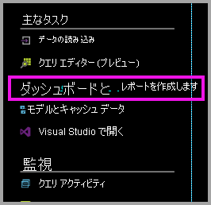
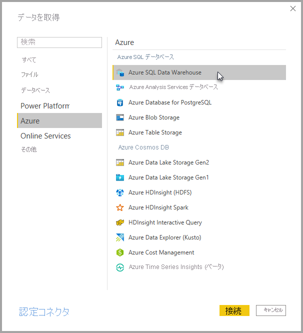
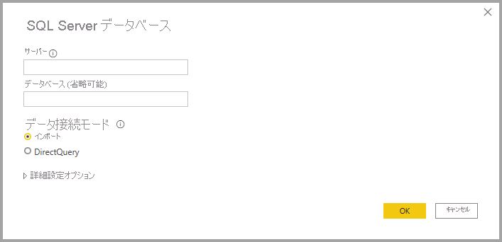
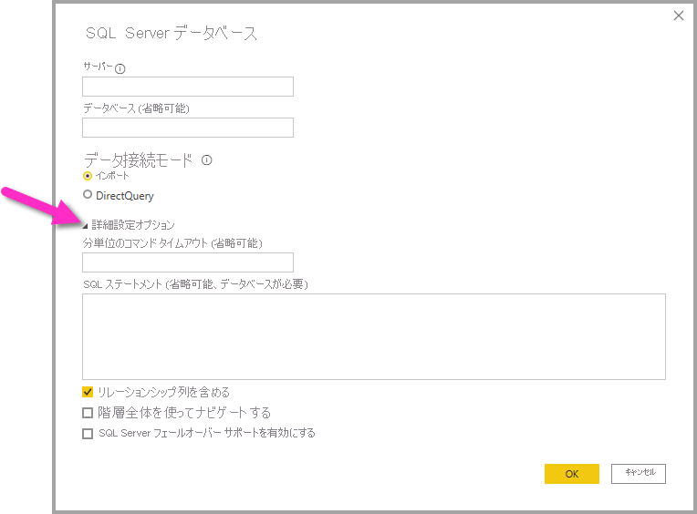

# Azure SQL Data Warehouse と DirectQuery

Azure SQL Data Warehouse と DirectQuery を使用すると、Azure SQL Data Warehouse に既に含まれているデータとメトリックに基づいて動的なレポートを作成できます。 DirectQuery を使用すると、データを探索するときにクエリが Azure SQL Data Warehouse に送り返されます。 リアルタイム クエリを SQL Data Warehouse のスケールと組み合わせることで、ユーザーはテラバイトのデータに対し、分単位で動的なレポートを作成することができます。 さらに、 **[ダッシュボードとレポートを作成します]** リンクを使用すると、ユーザーは SQL Data Warehouse を使用して Power BI レポートを作成できます。

SQL Data Warehouse コネクタを使用する場合:

* 接続するときに、完全修飾のサーバー名を指定します (詳細については後述します)。
* サーバーのファイアウォール ルールが「Azure サービスに対するアクセスを許可」するように構成されていることを確認してください。
* 列の選択、フィルターの追加など、どの操作によってもクエリが直接データ ウェアハウスに対して行われます。
* タイルは、約 15 分ごとに更新するように設定されているため、更新をスケジュール設定する必要はありません。  更新は、接続するときに [詳細] 設定で調整できます。
* DirectQuery データセットの Q&A は使用できません。
* スキーマ変更は自動選択されません。

これらの制限および注意事項については、エクスペリエンスの向上に伴い変更される可能性があります。 接続するための手順の詳細を以下に示します。

## Power BI でダッシュボードおよびレポートを作成する

> [!Important]
> Azure SQL Data Warehouse への接続性を改善しました。 Azure SQL Data Warehouse データ ソースに接続するための操作性を向上させるには、Power BI Desktop を使用します。 モデルとレポートをビルドしたら、Power BI サービスに発行できます。 Power BI サービスにおいてこれまで利用可能であった、Azure SQL Data Warehouse 用の直接コネクタは、利用できなくなりました。

ご利用の SQL Data Warehouse と Power BI の間を移動する最も簡単な方法は、Power BI Desktop でレポートを作成することことです。 Azure portal 内の **[ダッシュボードとレポートを作成します]** ボタンを使用できます。

1. まず、Power BI Desktop をダウンロードしてインストールします。 ダウンロードとインストールの詳細については、記事「[Power BI Desktop の取得](../fundamentals/desktop-get-the-desktop.md)」を参照するか、次の手順に直接進んでください。

2. また、 **[ダッシュボードとレポートを作成します]** リンクをクリックして Power BI Desktop をダウンロードすることもできます。

    

## Power BI Desktop 経由で接続する

Power BI Desktop 内の **[データの取得]** ボタンを使用すれば、SQL Data Warehouse に接続できます。 

1. **[ホーム]** メニューから **[データの取得]** ボタンを選択します。  

    ![[データの取得] ボタン](media/service-azure-sql-data-warehouse-with-direct-connect/create-reports-02.png)

2. **[詳細]** を選択して、使用可能なすべてのデータソースを表示します。 表示されたウィンドウの左側のペインから **[Azure]** を選択し、右側のペインに表示された使用可能なコネクタの一覧から **[Azure SQL Data Warehouse]** を選択します。

    

3. 表示されたウィンドウで、使用するサーバーを入力し、必要に応じて接続先のデータベースを指定します。 また、次のデータ接続モードを選択することもできます: インポートまたは DirectQuery。 ご利用の Azure SQL Data Warehouse 内の情報にリアルタイムでアクセスするには、DirectQuery を使用します。

    

4. Azure SQL Data Warehouse 接続用の詳細オプションを表示するには、 **[詳細オプション]** の横にある下向き矢印を選択して、接続に関するその他のオプションを表示します。

    

次のセクションでは、接続用のパラメーター値を検索する方法について説明します。 

## パラメーターの値の見つけ方

完全修飾サーバー名とデータベース名は、Azure portal に表示されています。 この時点では、SQL Data Warehouse は Azure portal にのみ表示されることに注意してください。

> [!NOTE]
> Power BI テナントが Azure SQL Data Warehouse と同じリージョン内にある場合、送信料は発生しません。 Power BI テナントが置かれている場所を確認するには、[こちらの手順](https://docs.microsoft.com/power-bi/service-admin-where-is-my-tenant-located)を使用してください。

[!INCLUDE [direct-query-sso](../includes/direct-query-sso.md)]

## 次の手順

* [Power BI での DirectQuery の使用について](desktop-directquery-about.md)
* [Power BI とは?](../fundamentals/power-bi-overview.md)  
* [Power BI のデータの取得](service-get-data.md)  
* [Azure SQL Data Warehouse](/azure/sql-data-warehouse/sql-data-warehouse-overview-what-is/)

他にわからないことがある場合は、 [Power BI コミュニティを利用してください](https://community.powerbi.com/)。
