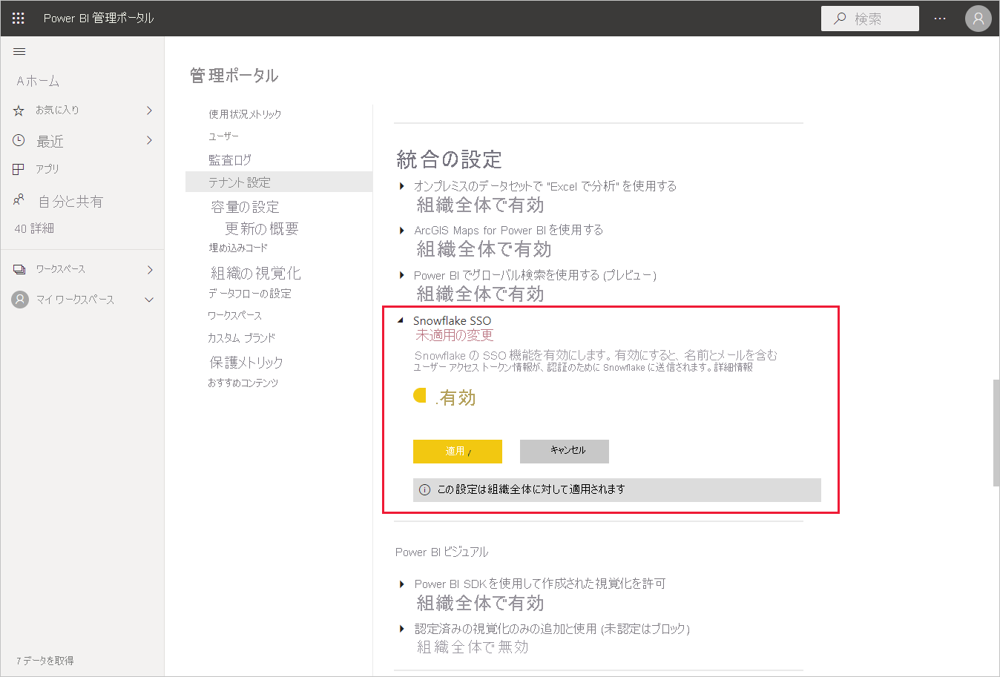
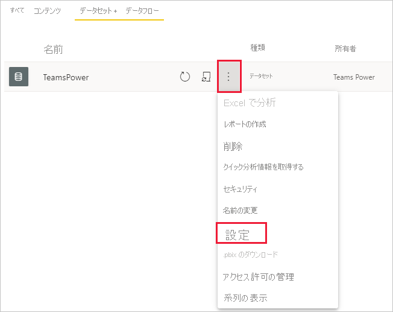
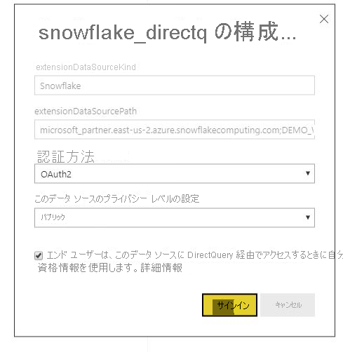

# Power BI サービスで Snowflake に接続する

## 概要

Power BI サービスでの Snowflake との接続は、他のコネクタとはただ 1 点で異なります。 Snowflake には Azure Active Directory (AAD) 用の追加機能があり、SSO を選択できます。 統合の一部には、Snowflake、Power BI、Azure にわたって異なる管理者ロールが必要です。 また、SSO を使用せずに AAD 認証を有効にすることもできます。 基本認証は、サービス内の他のコネクタと同様に機能します。

AAD 統合を構成し、必要に応じて SSO を有効にするには、この記事の手順に従います。

* Snowflake 管理者の場合は、Snowflake ドキュメント内の[「Power BI SSO から Snowflake へ」 - 「入門」](https://docs.snowflake.com/en/user-guide/oauth-powerbi.html)の記事をご覧ください。
* Power BI 管理者の場合は、[「Power BI サービス構成」 - 「管理ポータル」](service-connect-snowflake.md#admin-portal)を参照して、SSO を有効にする方法を確認してください。
* Power BI データセットの作成者である場合は、[「Power BI サービス構成」 - 「AAD を使用したデータセットの構成」](service-connect-snowflake.md#configuring-a-dataset-with-aad)を参照して、SSO を有効にする方法を確認してください。

## Power BI サービス構成

### 管理ポータル

SSO を有効にするには、グローバル管理者が Power BI 管理ポータルで設定を有効にする必要があります。 この設定により、組織全体の認証のために AAD 資格情報を Snowflake に送信することが承認されます。 次の手順に従って、SSO を有効にします。

1. グローバル管理者の資格情報を使用して [Power BI にサインイン](https://app.powerbi.com)します。
1. ページのヘッダー メニューから **[設定]** を選択し、 **[管理ポータル]** を選択します。
1. **[テナント設定]** を選択し、スクロールして **[統合の設定]** を見つけます。

   

4. **[Snowflake SSO]** を展開し、設定を **[有効]** に切り替えた後、 **[適用]** を選択します。

AAD トークンを Snowflake サーバーに送信することに同意するためには、この手順が必要です。 設定を有効にした後、反映されるまでに最大で 1 時間かかることがあります。

SSO が有効になったら、SSO でレポートを使用できるようになります。

### AAD を使用したデータセットの構成

Snowflake コネクタに基づくレポートが Power BI サービスに発行されたら、データセットの作成者は、SSO が使用されるように適切なワークスペースの設定を更新する必要があります。

Power BI の動作上の理由により、SSO は、オンプレミス データ ゲートウェイを介して実行されているデータソースがない場合にのみ機能します。 制限事項を次に示します。

* ご自身のデータ モデルで Snowflake ソースのみを使用している場合は、オンプレミス データ ゲートウェイを使用しないように選択すると、SSO を使用できます。
* Snowflake ソースと別のソースを使用している場合は、オンプレミス データ ゲートウェイを使用しているソースがなければ、SSO を使用できます。
* オンプレミス データ ゲートウェイを介して Snowflake ソースを使用している場合、AAD 資格情報は現在サポートされていません。 Power BI の IP 範囲全体ではなく、ゲートウェイがインストールされている単一の IP から VNet にアクセスしようとしている場合は、この考慮事項が関係する可能性があります。
* Snowflake ソースとゲートウェイを必要とする別のソースを使用している場合は、オンプレミス データ ゲートウェイでも Snowflake を使用する必要があります。 この場合、SSO を使用することはできません。

オンプレミス データ ゲートウェイの使用方法の詳細については、「[オンプレミス データ ゲートウェイとは](service-gateway-onprem.md)」をご覧ください。

ゲートウェイを使用していない場合は、準備完了です。 オンプレミス データ ゲートウェイで Snowflake 資格情報を構成しているものの、そのデータ ソースをご自身のモデルのみで使用している場合は、[データセットの設定] ページの切り替えをクリックして、そのデータ モデルに対してゲートウェイを無効にすることができます。

データセットに対して SSO を有効にするには、次の手順に従います。

1. データセットの作成者の資格情報を使用して [Power BI にサインインします](https://app.powerbi.com)。
1. 適切なワークスペースを選択し、データセット名の横にあるその他のオプション メニューから **[設定]** を選択します。
  
1. **[データ ソースの資格情報]** を選択してサインインします。 データセットからは、基本資格情報または OAuth2 (AAD) 資格情報で Snowflake にサインインできます。 AAD を使用する場合は、次の手順で SSO を有効にすることができます。
1. **[エンド ユーザーは、このデータ ソースに DirectQuery 経由でアクセスするときに自分の OAuth2 の資格情報を使用します。]** オプションを選択します。 この設定により、AAD SSO が有効になります。 最初のユーザーがサインインに基本認証を使用するか OAuth2 (AAD) を使用するかにかかわらず、SSO 用に送信されるのは AAD の資格情報です。

    

これらの手順が完了すると、ユーザーは自動的に各自の AAD 認証を使用して、その Snowflake データセットのデータに接続するようになります。

SSO を有効にしないことを選択した場合、レポートを更新するユーザーは、他のほとんどの Power BI レポートと同様に、サインインしたユーザーの資格情報を使用することになります。

### トラブルシューティング

統合に関する問題が発生した場合は、Snowflake の[トラブルシューティング ガイド](https://docs.snowflake.com/en/user-guide/oauth-powerbi.html#troubleshooting)を参照してください。

## 次の手順

* [Power BI サービスのデータ ソース](service-get-data.md)
* [Power BI Desktop から Power BI サービスのデータセットに接続する](desktop-report-lifecycle-datasets.md)
* [Snowflake コンピューティング ウェアハウスに接続する](desktop-connect-snowflake.md)