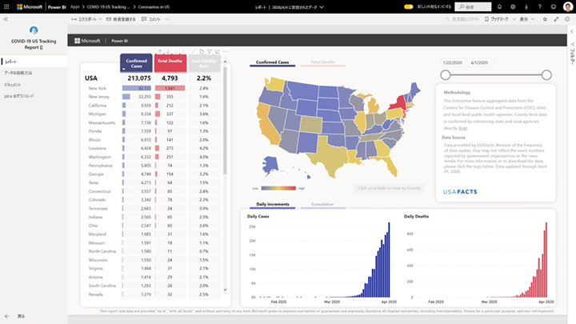
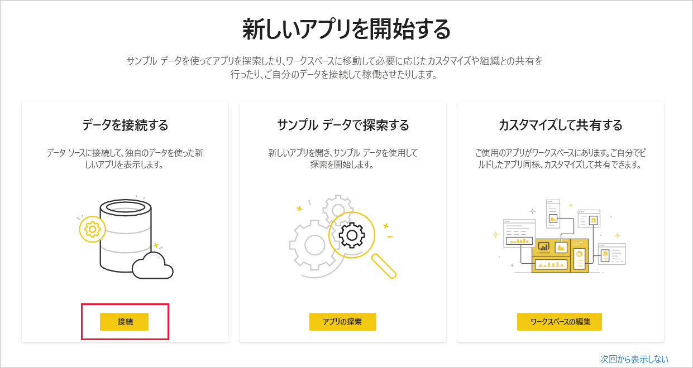
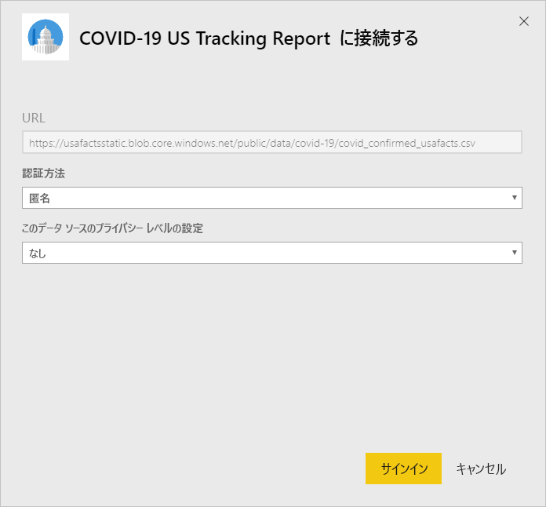
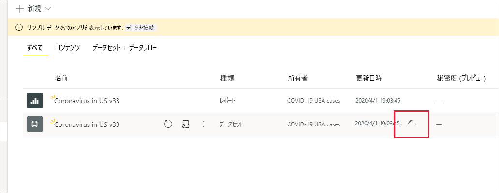

# COVID-19 US トラッキング レポートに接続する
この記事では、COVID-19 トラッキング レポート用のテンプレート アプリをインストールする方法と、データ ソースに接続する方法について説明します。

データに関する免責事項や情報など、レポート自体の詳細については、「[米国の州政府および地方自治体向けの COVID-19 の追跡サンプル](../create-reports/sample-covid-19-us.md)」を参照してください。

テンプレート アプリをインストールし、データ ソースに接続した後、必要に応じてレポートをカスタマイズできます。 その後、組織内の同僚にアプリとして配布することができます。

## アプリをインストールする

1. アプリにアクセスするには、次のリンクをクリックします: [COVID-19 US トラッキング レポート テンプレート アプリ](https://appsource.microsoft.com/en-us/product/power-bi/pbi-contentpacks.covid19ms)

1. アプリの [AppSource] ページが表示されたら、[ **[今すぐ入手する]** ](https://appsource.microsoft.com/en-us/product/power-bi/pbi-contentpacks.covid19ms) をクリックします。

    

1. メッセージが表示されたら、 **[インストール]** をクリックします。 アプリがインストールされると、[アプリ] ページに表示されます。

   ![[アプリ] ページの COVID-19 US トラッキング レポート](media/service-connect-to-covid-19-tracking/service-covid-19-us-tracking-report-apps-page-icon.png)

## データ ソースに接続する

1. [アプリ] ページのアイコンをクリックして、アプリを開きます。

1. 表示されたスプラッシュ スクリーンで、 **[接続]** を選択します。

   

1. 2 つのサインイン ダイアログが順に表示されます。 両方で、プライバシー レベルを [パブリック] に設定します。

   

   レポートはデータ ソースに接続され、最新のデータが設定されます。 この間は、利用状況モニターが作動します。

   

## レポート更新のスケジュールを設定する

データ更新が完了すると、アプリに関連付けられているワークスペースが表示されます。 レポート データを最新の状態に保つために、[更新スケジュールを設定](../connect-data/refresh-scheduled-refresh.md)します。

## カスタマイズと共有

詳細については、「[アプリをカスタマイズして共有する](../connect-data/service-template-apps-install-distribute.md#customize-and-share-the-app)」を参照してください。 アプリを公開または配布する前に、必ず、[レポートの免責事項](../create-reports/sample-covid-19-us.md#disclaimers)を確認してください。

## 次の手順
* [米国の州政府および地方自治体向けの COVID-19 の追跡サンプル](../create-reports/sample-covid-19-us.md)
* わからないことがある場合は、 [Power BI コミュニティで質問してみてください](https://community.powerbi.com/)。
* [Power BI テンプレート アプリとは](../connect-data/service-template-apps-overview.md)
* [組織でテンプレート アプリをインストールして配布する](../connect-data/service-template-apps-install-distribute.md)
