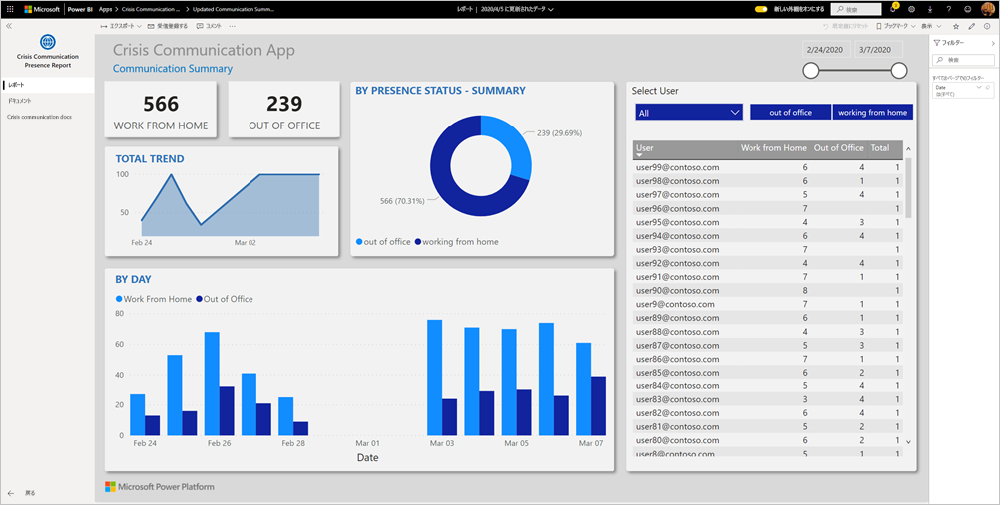
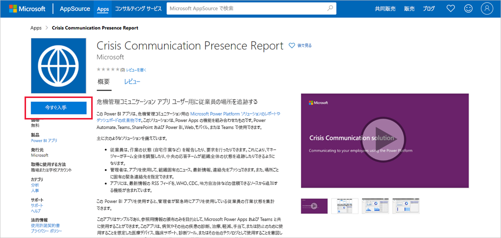
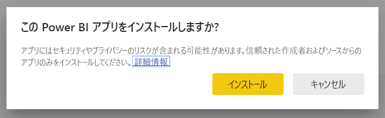
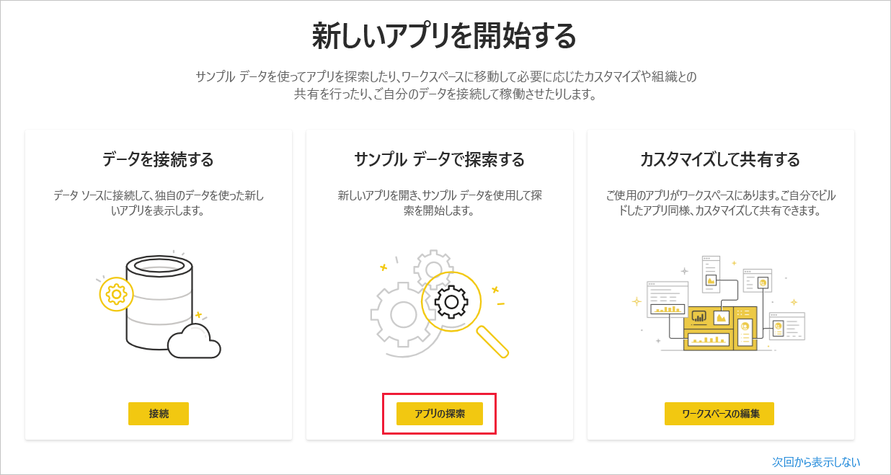
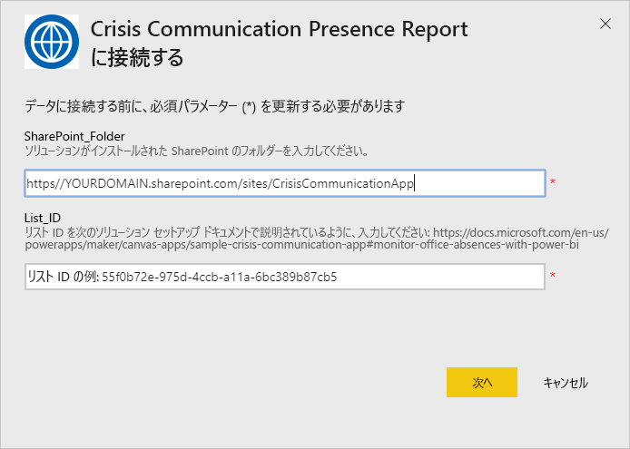
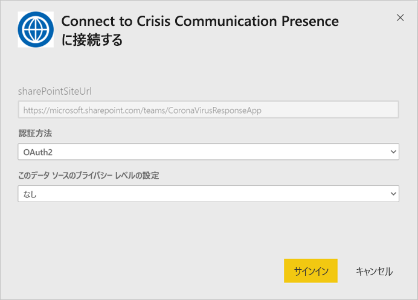
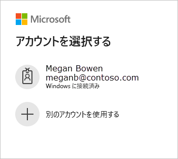
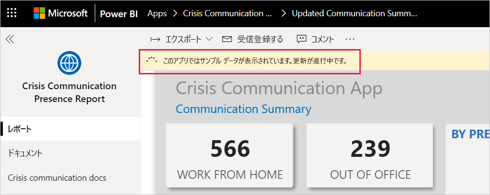
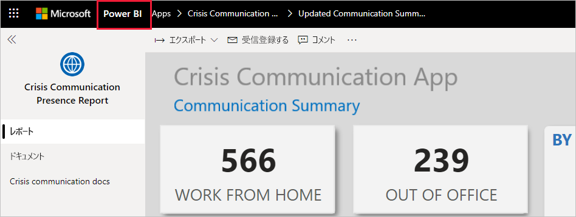

# 危機管理コミュニケーション プレゼンス レポートに接続する

この Power BI アプリは、危機管理コミュニケーション用の Microsoft Power Platform ソリューションのレポートやダッシュボードの成果物です。 危機管理コミュニケーション アプリ ユーザー用の worker の場所を追跡します。 このソリューションは、Power Apps、Power Automate、Teams、SharePoint および Power BI の機能を組み合わせたものです。 Web、モバイル、または Teams で使用できます。

ダッシュボードでは、非常事態担当マネージャーに対して、タイムリーに適切な意思決定を行うのに役立つヘルス システム全体の集計データが表示されます。

この記事では、アプリをインストールする方法と、データ ソースに接続する方法について説明します。 危機管理コミュニケーション アプリの詳細については、「[Power Apps での危機通信のサンプル テンプレートのセットアップと学習](https://docs.microsoft.com/powerapps/maker/canvas-apps/sample-crisis-communication-app)」を参照してください

テンプレート アプリをインストールし、データ ソースに接続した後、必要に応じてレポートをカスタマイズできます。 その後、組織内の同僚にアプリとして配布することができます。

## 前提条件

このテンプレート アプリをインストールする前に、まず、[危機管理コミュニケーションのサンプル](https://docs.microsoft.com/powerapps/maker/canvas-apps/sample-crisis-communication-app)をインストールして設定する必要があります。 このソリューションをインストールすると、アプリにデータを設定するために必要なデータソース参照が作成されます。

危機管理コミュニケーション サンプルをインストールする場合は、["CI_Employee Status" の SharePoint リスト フォルダーのパスとリスト ID](https://docs.microsoft.com/powerapps/maker/canvas-apps/sample-crisis-communication-app#monitor-office-absences-with-power-bi) をメモしておいてください。

## アプリをインストールする

1. アプリにアクセスするには、次のリンクをクリックします: [危機管理コミュニケーション プレゼンス レポート テンプレート アプリ](https://appsource.microsoft.com/en-us/product/power-bi/pbi-contentpacks.crisiscomms)

1. アプリの [AppSource] ページで、[ **[今すぐ入手する]** ](https://appsource.microsoft.com/en-us/product/power-bi/pbi-contentpacks.crisiscomms) を選択します。

    

1. **[One more thing]\(最後に\)** の情報を読み、 **[続行]** を選択します。

    ![危機管理コミュニケーション プレゼンス レポート アプリ、[One more thing]\(最後に\)](media/service-connect-to-crisis-communication-presence-report/service-crisis-communication-presence-report-1-more-thing.png)

1. **[インストール]** を選択します。 

    

    アプリがインストールされると、[アプリ] ページに表示されます。

   ![[アプリ] ページの危機管理コミュニケーション プレゼンス レポート アプリ](media/service-connect-to-crisis-communication-presence-report/service-crisis-communication-presence-report-app-apps-page-icon.png)

## データ ソースに接続する

1. [アプリ] ページでアイコンを選択して、アプリを開きます。

1. スプラッシュ スクリーンで、 **[探索]** を選択します。

   

   アプリが開き、サンプル データが表示されます。

1. ページの上部にあるバナーの **[データを接続]** リンクを選択します。

   ![危機管理コミュニケーション プレゼンス レポート アプリの [データを接続] リンク](media/service-connect-to-crisis-communication-presence-report/service-crisis-communication-presence-report-app-connect-data.png)

1. ダイアログ ボックスで、次のようにします。
   1. SharePoint_Folder フィールドに、["CI_Employee Status" SharePoint リスト パス](https://docs.microsoft.com/powerapps/maker/canvas-apps/sample-crisis-communication-app#monitor-office-absences-with-power-bi)を入力します。
   1. List_ID フィールドに、リスト設定から取得したリスト ID を入力します。 完了したら、 **[次へ]** をクリックします。

   

1. 次に表示されるダイアログで、認証方法を **[OAuth2]** に設定します。 プライバシー レベルの設定については、何もする必要はありません。

   **[サインイン]** をクリックします。

   

1. Microsoft サインイン画面で、Power BI にサインインします。

   

   サインインした後、レポートがデータ ソースに接続され、最新のデータが設定されます。 この間は、利用状況モニターが作動します。

   

## レポート更新のスケジュールを設定する

データ更新が完了したら、レポート データを最新の状態に保つために、[更新スケジュールを設定](../refresh-scheduled-refresh.md)します。

1. 上部のヘッダー バーで、 **[Power BI]** を選択します。

   

1. 左側のナビゲーション ペインの **[ワークスペース]** の下で、病院の緊急時対応の意思決定支援ダッシュボード ワークスペースを見つけ、「[スケジュールされた更新の構成](../refresh-scheduled-refresh.md)」記事に記載されている手順に従います。

## カスタマイズと共有

詳細については、「[アプリをカスタマイズして共有する](../service-template-apps-install-distribute.md#customize-and-share-the-app)」を参照してください。 アプリを公開または配布する前に、必ず、[レポートの免責事項](../create-reports/sample-covid-19-us.md#disclaimers)を確認してください。

## 次の手順
* [Power Apps での危機通信のサンプル テンプレートのセットアップと学習](https://docs.microsoft.com/powerapps/maker/canvas-apps/sample-crisis-communication-app)
* わからないことがある場合は、 [Power BI コミュニティで質問してみてください](https://community.powerbi.com/)。
* [Power BI テンプレート アプリとは](../service-template-apps-overview.md)
* [組織でテンプレート アプリをインストールして配布する](../service-template-apps-install-distribute.md)
