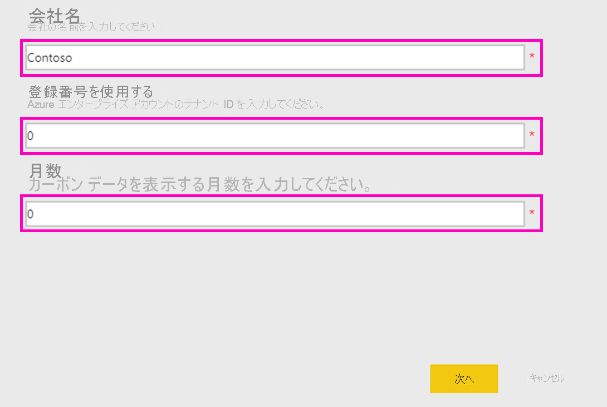
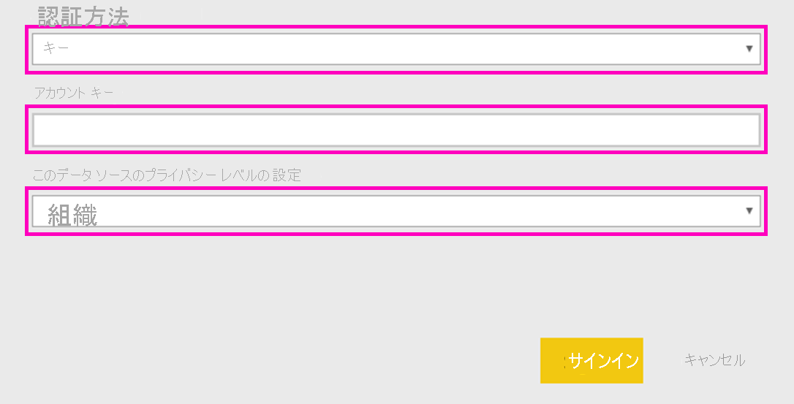

# Microsoft Sustainability Calculator を接続する
使用している IT インフラストラクチャの二酸化炭素排出量に関する分析情報を取得して、より持続可能なコンピューティングを実現するための意思決定を行います

Microsoft Sustainability Calculator では、Azure サービスに関連する二酸化炭素排出データに関する新しい分析情報を提供します。 組織内で持続可能性に関するレポートと推進を担当するユーザーは、このツールを使用することで、各 Azure サブスクリプションの二酸化炭素排出量を定量化できるだけでなく、Azure とオンプレミス データセンターでワークロードを実行した場合の二酸化炭素の推定排出削減量を比較することもできます。 このデータは、スコープ 3 排出量の温室効果ガス レポートに使用できます。 Microsoft Sustainability Calculator にアクセスするには、テナント ID とアクセス キーが必要です。これは通常、組織の Azure 管理者から入手できます。

このアプリを使用するには、Azure Enterprise Portal の情報が必要です。 企業のシステム管理者に問い合わせることで、この情報を取得することができます。 アプリをインストールする前に、以下の手順を確認し、必要な情報を入手してください。 

このコネクタ バージョンでサポートされるのは、[https://ea.azure.com](https://ea.azure.com/) からのエンタープライズ登録のみです。 現在、中国での登録はサポートされていません。

## 接続する方法
[!INCLUDE [powerbi-service-apps-get-more-apps](../includes/powerbi-service-apps-get-more-apps.md)]

1. **[Microsoft Sustainability Calculator]** \> **[今すぐ入手する]** の順に選択します。
1. **[この Power BI アプリをインストールしますか?]** で、 **[インストール]** を選択します。
1. **[アプリ]** ペインで、 **[Microsoft Sustainability Calculator]** タイルを選択します。
1. **[新しいアプリを開始する]** で **[接続]** を選択します。

    

1. **会社名、ユーザー登録番号**、および**月数**を入力し、[サインイン] を選択します。 [これらのパラメーターの見つけ方](#finding-parameters)について詳しくは、後述します。

    

1. **[認証方法]** では **[キー]** を選択し、 **[プライバシー レベル]** には **[組織]** を選択します。
1. **[キー]** には**アクセス キー**を入力し、[サインイン] を選択します。

    

1. インポート処理が自動的に開始します。 完了すると、**ナビゲーション ペイン**に、新しいダッシュボード、レポート、モデルが表示されます。 インポートされたデータを表示するレポートを選択します。

## パラメーターの見つけ方

会社の**登録 ID** と**アクセス キー**を見つけるには、Azure 管理者と協力して必要な情報を取得します。 管理者が以下の操作を実行します。

1. [Azure Enterprise Portal](https://ea.azure.com) にログインし、左側のリボンで **[管理]** をクリックして、以下に示すように**登録番号**を取得します
2. [Azure Enterprise Portal](https://ea.azure.com) で、次に示すように **[レポート]** 、[API アクセス キー] の順にクリックして、プライマリ登録アカウント キーを取得します

## アプリの使用

任意の時点でパラメーターを更新するには、 **[データセット]** 設定に移動し、アプリ ワークスペースに関連付けられているパラメーターにアクセスして、テナント ID、会社名、データの月数を更新します。 パラメーターを適用した後、 **[更新]** をクリックして、新しいパラメーターが適用されたデータを再度読み込みます。