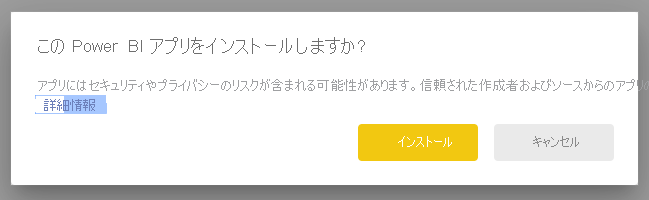
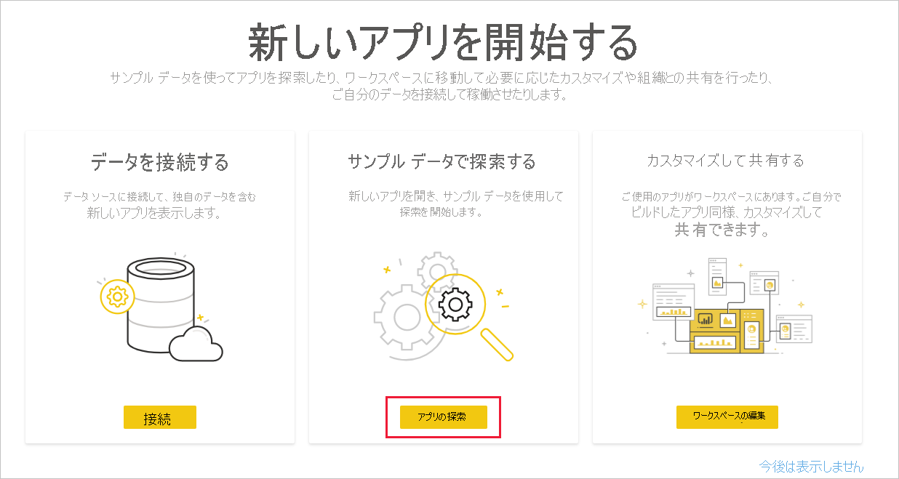
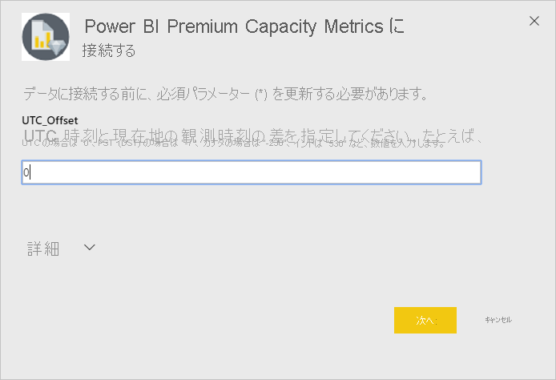
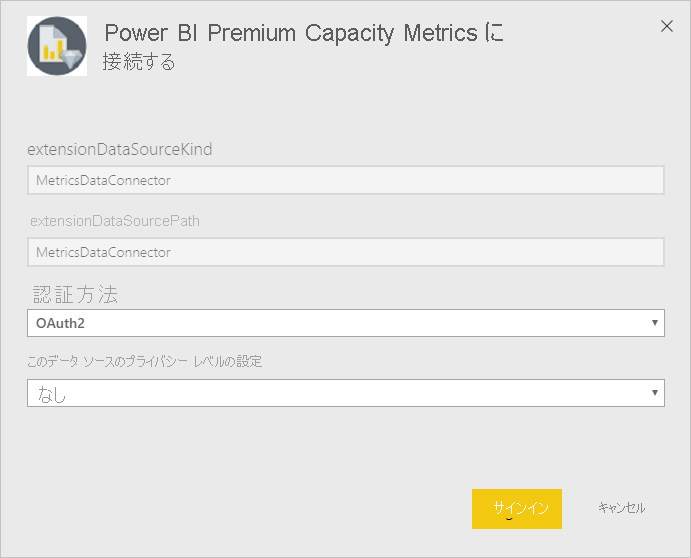
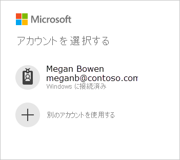
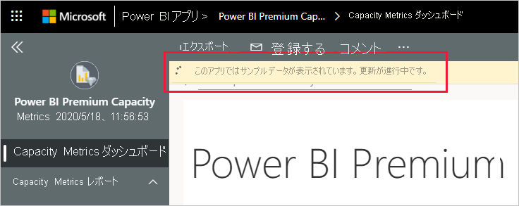
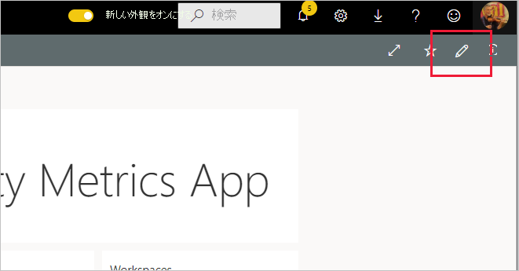

# Power BI Premium Capacity Metrics に接続する
Premium 容量リソースを最適に利用するにはどうすればよいかを十分な情報に基づいて判断するには、ご利用の容量を監視することが不可欠です。 Power BI Premium Capacity Metrics アプリからは、ご利用の容量のパフォーマンスに関する非常に詳細な情報が提供されます。

この記事では、アプリをインストールしてデータ ソースに接続する方法について説明します。 レポートの内容とその使用方法については、「[アプリで Premium 容量を監視する](../service-admin-premium-monitor-capacity.md)」と [Premium Capacity Metrics アプリに関するブログ記事](https://powerbi.microsoft.com/blog/premium-capacity-metrics-app-new-health-center-with-kpis-to-explore-relevant-metrics-and-steps-to-mitigate-issues/)を参照してください。

アプリをインストールしてデータ ソースに接続した後は、必要に応じてレポートをカスタマイズできます。 その後、それを組織内の同僚に配布することができます。

> [!NOTE]
> テンプレート アプリをインストールするには[アクセス許可](./service-template-apps-install-distribute.md#prerequisites)が必要です。 十分なアクセス許可がないことがわかった場合は、テナント管理者にお問い合わせください。

## アプリをインストールする

1. アプリにアクセスするには、次のリンクをクリックします: [Power BI Premium Capacity Metrics テンプレート アプリ](https://app.powerbi.com/groups/me/getapps/services/pbi_pcmm.capacity-metrics-dxt)

1. アプリの [AppSource] ページで、[ **[今すぐ入手する]** ](https://app.powerbi.com/groups/me/getapps/services/pbi_pcmm.capacity-metrics-dxt) を選択します。

    

1. **[インストール]** を選択します。 

    

    > [!NOTE]
    > 以前にアプリをインストールしていた場合は、[そのインストールを上書きする](./service-template-apps-install-distribute.md#update-a-template-app)か、新しいワークスペースにインストールするかを確認するメッセージが表示されます。

    アプリがインストールされると、[アプリ] ページに表示されます。

   ![[アプリ] ページの Power BI Premium Capacity Metrics アプリ](media/service-connect-to-pbi-premium-capacity-metrics/service-pbi-premium-capacity-metrics-app-apps-page-icon.png)

## データ ソースに接続する

1. [アプリ] ページでアイコンを選択して、アプリを開きます。

1. スプラッシュ スクリーンで、 **[探索]** を選択します。

   

   アプリが開き、サンプル データが表示されます。

1. ページの上部にあるバナーの **[データを接続]** リンクを選択します。

   ![Power BI Premium Capacity Metrics アプリの [データを接続] リンク](media/service-connect-to-pbi-premium-capacity-metrics/service-pbi-premium-capacity-metrics-app-connect-data.png)

1. 表示されるダイアログ ボックスで、UTC オフセットを設定します。つまり、協定世界時とご自分の場所の時刻との差 (時間単位) です。 そして、 **[Next]** (次へ) をクリックします。
  
   

1. 次に表示されるダイアログでは、何もする必要はありません。 単に **[サインイン]** を選択してください。

   

1. Microsoft サインイン画面で、Power BI にサインインします。

   

   サインインした後、レポートがデータ ソースに接続され、最新のデータが設定されます。 この間は、利用状況モニターが作動します。

   

   レポート データは 1 日に 1 回自動的に更新されます (サインイン プロセス中にこれを無効にしていない限り)。 また、[独自の更新スケジュールを設定](./refresh-scheduled-refresh.md)し、必要に応じてレポート データを最新の状態に保つこともできます。

## カスタマイズと共有

アプリのカスタマイズを開始するには、右上隅にある鉛筆アイコンをクリックします。

 

詳細については、「[アプリをカスタマイズして共有する](./service-template-apps-install-distribute.md#customize-and-share-the-app)」を参照してください。

## 次の手順
* [アプリで Premium 容量を監視する](../admin/service-admin-premium-monitor-capacity.md)
* [Premium Capacity Metrics アプリに関するブログ記事](https://powerbi.microsoft.com/blog/premium-capacity-metrics-app-new-health-center-with-kpis-to-explore-relevant-metrics-and-steps-to-mitigate-issues/)
* [Power BI テンプレート アプリとは](./service-template-apps-overview.md)
* [組織でテンプレート アプリをインストールして配布する](./service-template-apps-install-distribute.md)
* わからないことがある場合は、 [Power BI コミュニティで質問してみてください](https://community.powerbi.com/)。