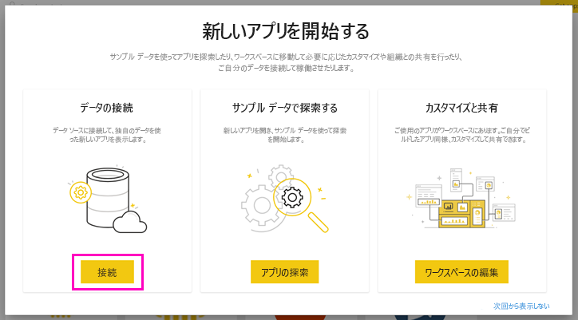

# Power BI で QuickBooks Online に接続する
Power BI から QuickBooks Online データに接続すると、すぐに Power BI ダッシュボードと Power BI レポートにより、ビジネス キャッシュ フロー、収益性、顧客などに関する情報を得られます。 ダッシュボードとレポートはそのまま使用することもできますし、カスタマイズして最も関心のある情報を強調表示することもできます。 データは、1 日 1 回自動的に更新されます。

Power BI 用の [QuickBooks Online テンプレート アプリ](https://dxt.powerbi.com/getdata/services/quickbooks-online)に接続します。

>[!NOTE]
>QuickBooks Online のデータを Power BI をインポートするには、QuickBooks Online アカウントの管理者であるとともに、管理者アカウントの資格情報でサインインする必要があります。 QuickBooks Desktop ソフトウェアでは、このコネクタは使用できません。 

## 接続する方法

[!INCLUDE [powerbi-service-apps-get-more-apps](../includes/powerbi-service-apps-get-more-apps.md)]

3. **[QuickBooks Online]** を選択し、 **[取得]** を選択します。
   
   

4. **[この Power BI アプリをインストールしますか?]** で、 **[インストール]** を選択します。

    

4. **[アプリ]** ペインで、 **[QuickBooks]** タイルを選択します。

   

6. **[新しいアプリを開始する]** で **[接続]** を選択します。

    

4. 認証の方式として **[oAuth2]** を選択してから、 **[サインイン]** を選びます。 
5. プロンプトが表示されたら、QuickBooks Online 資格情報を入力し、QuickBooks Online 認証プロセスに従います。 ブラウザーで既に QuickBooks Online にサインインした場合には、資格情報を求めるプロンプトが表示されないことがあります。
   >[!NOTE]
   >QuickBooks Online アカウントの管理者資格情報が必要です。
6. 次の画面で Power BI に接続する会社を選択します。
   
   

7. 次の画面で **[承認]** を選択し、インポート プロセスを開始します。 このプロセスは、会社のデータ サイズによっては数分かかることがあります。 
   
   
   
8. Power BI にデータがインポートされると、QuickBooks アプリのコンテンツ リスト (新しいダッシュ ボード、レポート、データセット) が表示されます。
9. QuickBooks ダッシュボードを選択して、探索プロセスを開始します。 Power BI によってこのダッシュボードが自動的に作成され、インポートされたデータが表示されます。

    

**実行できる操作**

* ダッシュボード上部にある [Q&A ボックスで質問](../consumer/end-user-q-and-a.md)してみてください。
* ダッシュボードで[タイルを変更](../create-reports/service-dashboard-edit-tile.md)できます。
* [タイルを選択](../consumer/end-user-tiles.md)して基になるレポートを開くことができます。
* データセットは毎日更新するようにスケジュール設定されますが、更新のスケジュールは変更でき、また **[今すぐ更新]** を使えばいつでも必要なときに更新できます。

## トラブルシューティング
**「問題が発生しました。」**

**[承認]** を選択した後に、次のメッセージが表示されることがあります。

「 問題が発生しました。」 このウィンドウを閉じて、もう一度やり直してください。

アプリケーションが、この会社の別のユーザーによって既にサブスクライブされています。 [管理者電子メール] に連絡し、このサブスクリプションを変更してください。」

このエラーは、社内の別の管理者が Power BI を使用して社内データに既に接続していることを意味します。 該当する管理者に、ダッシュ ボードを共有するように依頼してください。 現時点では、特定の QuickBooks Online の会社データセットを Power BI に接続できるのは、1 人の管理者ユーザーだけです。 Power BI によってダッシュボードが作成された後、管理者は同じ Power BI テナントの同僚とそのダッシュボードを共有できます。

**"This app is not set up to allow connections from your country" (このアプリは、お客様の国からの接続が許可されていません)**

現在、Power BI がサポートしているのはQuickBooks Online の米国版のみです。 

## 次の手順
[Power BI とは?](../fundamentals/power-bi-overview.md)

[Power BI サービスのデザイナー向けの基本的な概念](../fundamentals/service-basic-concepts.md)
