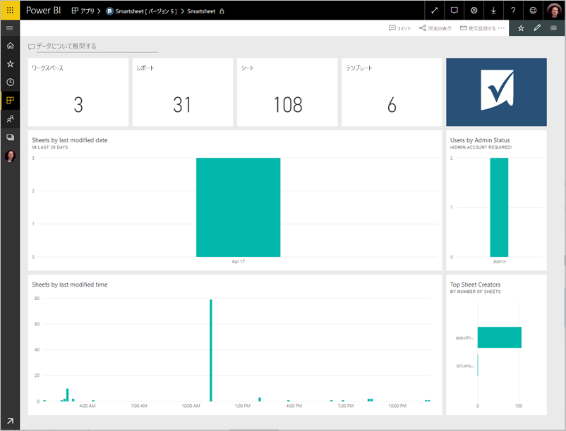

# Power BI で Smartsheet に接続する
この記事では、Power BI テンプレート アプリを使用して Smartsheet アカウントからデータをプルする手順について説明します。 Smartsheet は、コラボレーションとファイル共有に簡単なプラットフォームを提供しています。 Power BI 用 Smartsheet テンプレート アプリは、Smartsheet アカウントの概要を示すダッシュボード、レポート、データセットを提供します。 また、[Power BI Desktop](desktop-connect-to-data.md) を使用して、ご使用のアカウントでそれぞれのシートに直接接続することもできます。 

テンプレート アプリをインストールした後は、ダッシュボードとレポートを変更できます。 その後、組織内の同僚にアプリとして配布することができます。

Power BI 用 [Smartsheet テンプレート アプリ](https://app.powerbi.com/groups/me/getapps/services/pbi-contentpacks.pbiapps-smartsheet)に接続します。

>[!NOTE]
>Smartsheet 管理者アカウントには追加のアクセス権があるため、Power BI テンプレート アプリの接続および読み込みで優先されます。

## 接続する方法

[!INCLUDE [powerbi-service-apps-get-more-apps](../includes/powerbi-service-apps-get-more-apps.md)]

3. **[Smartsheet]** \> **[今すぐ入手]** の順に選択します。
4. **[この Power BI アプリをインストールしますか?]** で、 **[インストール]** を選択します。
4. **[アプリ]** ペインで、 **[Smartsheet]** タイルを選択します。

    

6. **[新しいアプリを開始する]** で **[接続]** を選択します。

    

4. [認証方法] として **[oAuth2]\>、[サインイン]** の順に選びます。
   
   プロンプトが表示されたら、Smartsheet 資格情報を入力し、認証プロセスに従います。
   
   
   
   

5. Power BI でデータをインポートしたら、Smartsheet ダッシュボードが開きます。
   
   

## アプリを変更して配布する

Smartsheet テンプレート アプリをインストールできました。 これは、Smartsheet ワークスペースも作成されたことを意味します。 ワークスペースでは、レポートとダッシュボードを変更して、それを組織内の同僚に "*アプリ*" として配布することができます。 

1. 新しい Smartsheet ワークスペースのすべてのコンテンツを表示するには、ナビゲーション ペインで **[ワークスペース]**  >  **[Smartsheet]** の順に選択します。 

    

    このビューは、ワークスペースのコンテンツ リストです。 右上隅に、 **[アプリを更新]** が表示されます。 同僚にアプリを配布する準備ができたら、そこが出発地点になります。 

    

2. ワークスペース内の他の要素を表示するには、 **[レポート]** および **[データセット]** を選択します。

    同僚に[アプリを配布する](../collaborate-share/service-create-distribute-apps.md)方法に関する記事を参照してください。

## 含まれるもの
Power BI 用 Smartsheet テンプレート アプリには、所有しているワークスペース、レポート、およびシートの数、それらが変更された日時など、Smartsheet アカウントの概要が含まれています。また、管理者ユーザーは、上位のシート作成者など、システムのユーザーに関する情報も表示することができます。  

使用しているアカウントのそれぞれのシートに直接接続するために、[Power BI Desktop](desktop-connect-to-data.md) の Smartsheet コネクタを使用することができます。  

## 次の手順

* [Power BI で新しいワークスペースを作成する](../collaborate-share/service-create-the-new-workspaces.md)
* [Power BI にアプリをインストールし、使用する](../consumer/end-user-apps.md)
* [外部サービス用の Power BI アプリに接続する](service-connect-to-services.md)
* わからないことがある場合は、 [Power BI コミュニティで質問してみてください](https://community.powerbi.com/)。