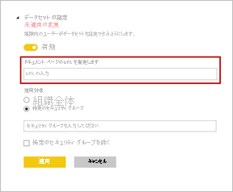

# データセットを認定する - Power BI

重要な情報の信頼できるソースであるデータセットを、組織で "*認定*" することができます。 このようなデータセットはレポート デザイナーがレポートの作成を開始し、信頼性の高いデータを検索するときに特に役立ちます。 認定は、特に価値のあるデータセットのみを厳選して認定するプロセスです。 Power BI 管理者には、新しい設定が付与されます。これにより、データセットを認定するユーザーを厳密に制御します。 管理者は、認定プロセスにより、組織全体で使用するために設計された、信頼できる正式なデータセットを確保できます。

データセットの所有者の場合、ユーザーは昇格したデータセットの認定を要求できます。 **認定**テナントの設定で定義された選択ユーザーのグループが、認定するデータセットを決定します。 データセットを認定した担当者の名前が、データセット検出エクスペリエンス中にツールヒントに表示されます。 **[認定済み]** ラベルの上にカーソルを置くと、それが表示されます。 詳細については、「[データセットとデータフローの認定を設定する](../admin/service-admin-setup-certification.md)」を参照してください。

Power BI には、データセットを "*承認する*" 方法が 2 つあります。 証明書に加え、もう 1 つの方法として、"*昇格*" があります。 データセットの所有者またはワークスペースのメンバーの場合、広範囲の使用が可能になったデータセットを昇格することができます。 詳細については、「[Promote your dataset](service-datasets-promote.md)」(データセットを昇格する) を参照してください。 

## データセットの認定

Power BI 管理者は、 **[承認]** 設定ページで、**詳細情報**のリンクの URL を提供することができます。  認定プロセスについてのドキュメントとリンクさせることができます。 **詳細情報**のリンクの宛先が提供されない場合は、既定でこの記事が示されます。

データセットを認定できるユーザーに指定されることは、明らかに大きな責任です。 データセットの作成者からデータセットの認定についての問い合わせがある場合、その時点から審査プロセスが始まります。 データセットが認定に値することがわかったら、ここからが最後の手順です。

1. データセットの所有者は、データセットが配置されているワークスペースへのメンバーのアクセス許可を付与する必要があります。
1. 管理者からデータセットを認定するユーザーに指名された場合、そのデータセットの **[設定]** の **[承認]** セクションに **[認定済み]** オプションが表示されます。 **[認定済み]** を選びます。
1. **[適用]** を選びます。

管理者が[ワークスペース間でのデータセットの使用を制御する](service-datasets-admin-across-workspaces.md)方法の詳細をご確認ください。

## 次の手順

* [データセットとデータフローの認定を設定する](../admin/service-admin-setup-certification.md)
* [ワークスペースをまたいでデータセットを使用する](service-datasets-across-workspaces.md)
* わからないことがある場合は、 [Power BI コミュニティで質問してみてください](https://community.powerbi.com/)。
